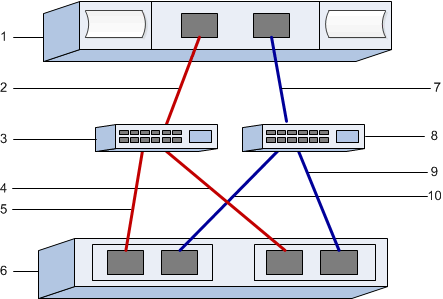

= Notieren Sie Ihre iSER-over-InfiniBand-Konfiguration unter E-Series – Linux
:allow-uri-read: 
:icons: font
:imagesdir: ../media/

[role="lead"]
Sie können eine PDF-Datei auf dieser Seite erstellen und drucken und dann mithilfe des folgenden Arbeitsblatts iSER über InfiniBand-Speicherkonfigurationsinformationen aufzeichnen. Sie benötigen diese Informationen für Bereitstellungsaufgaben.

== Host-IDs

NOTE: Der Software-Initiator IQN wird während der Aufgabe bestimmt, xref:iser-ib-configure-network-attached-hosts-task.adoc[Konfigurieren Sie das Netzwerk für Storage-verbundene Hosts].

Suchen und Dokumentieren der Initiator-IQN von jedem Host aus. Bei Software-Initiatoren befindet sich der IQN in der Regel in der Datei /etc/iscsi/initiatorname.iscsi.

|===
| Nummer Der Legende | Host-Port-Verbindungen | Software-Initiator-IQN 

 a| 
1
 a| 
Host (Initiator) 1
 a| 

 a| 
k. A.
 a| 
 a| 

 a| 
k. A.
 a| 
 a| 

 a| 
k. A.
 a| 
 a| 

 a| 
k. A.
 a| 
 a| 

|===

== Empfohlene Konfiguration

Empfohlene Konfigurationen bestehen aus zwei Host-Ports (Initiator) und vier Ziel-Ports.

== Ziel-IQN

Dokumentieren Sie die Ziel-IQN für das Speicher-Array. Sie werden diese Informationen in verwenden xref:iser-ib-configure-network-attached-hosts-task.adoc[Konfigurieren Sie das Netzwerk für Storage-verbundene Hosts].

Suchen Sie den Speicher-Array-IQN-Namen mit SANtricity: *Speicherarray* > *iSER* > *Einstellungen verwalten*. Diese Informationen können erforderlich sein, wenn Sie iSER-Sitzungen aus Betriebssystemen erstellen, die die Ermittlung von Send Targets nicht unterstützen.

|===
| Nummer Der Legende | Array-Name | Ziel-IQN 

 a| 
6
 a| 
Array-Controller (Ziel)
 a| 

|===

== Netzwerkkonfiguration

Dokumentation der Netzwerkkonfiguration, die für die Hosts und den Storage auf der InfiniBand Fabric verwendet werden soll Diese Anweisungen setzen voraus, dass zwei Subnetze für volle Redundanz verwendet werden.

Ihr Netzwerkadministrator kann die folgenden Informationen bereitstellen. Sie verwenden diese Informationen im Thema, xref:iser-ib-configure-network-attached-hosts-task.adoc[Konfigurieren Sie das Netzwerk für Storage-verbundene Hosts].

=== Subnetz A

Definieren Sie das zu verwendenden Subnetz.

|===
| Netzwerkadresse | Netzmaske 

 a| 
 a| 

|===
Dokumentieren Sie die IQNs, die von den Array-Ports und jedem Host-Port verwendet werden sollen.

|===
| Nummer Der Legende | Port-Verbindungen für Array-Controller (Ziel | IQN 

 a| 
3
 a| 
Switch
 a| 
_Nicht zutreffend_

 a| 
5
 a| 
Controller A, Port 1
 a| 

 a| 
4
 a| 
Controller B, Port 1
 a| 

 a| 
2
 a| 
Host 1, Port 1
 a| 

 a| 
 a| 
(Optional) Host 2, Port 1
 a| 

|===

=== Subnetz B

Definieren Sie das zu verwendenden Subnetz.

|===
| Netzwerkadresse | Netzmaske 

 a| 
 a| 

|===
Dokumentieren Sie die IQNs, die von den Array-Ports und jedem Host-Port verwendet werden sollen.

|===
| Nummer Der Legende | Port-Verbindungen für Array-Controller (Ziel | IQN 

 a| 
8
 a| 
Switch
 a| 
_Nicht zutreffend_

 a| 
10
 a| 
Controller A, Port 2
 a| 

 a| 
9
 a| 
Controller B, Port 2
 a| 

 a| 
7
 a| 
Host 1, Port 2
 a| 

 a| 
 a| 
(Optional) Host 2, Port 2
 a| 

|===

== Zuordnung des Hostnamens

NOTE: Der Name des Zuordners wird während des Workflows erstellt.

|===

 a| 
Zuordnung des Hostnamens
 a| 

 a| 
Host-OS-Typ
 a| 

|===