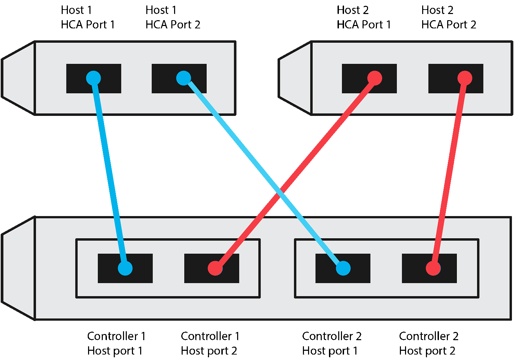

= Nehmen Sie Ihre NVMe-over-IB-Konfiguration auf
:allow-uri-read: 
:icons: font
:imagesdir: ../media/

[role="lead"]
Sie können eine PDF-Datei auf dieser Seite erstellen und drucken und anschließend die Konfigurationsinformationen für NVMe over InfiniBand-Speicher mithilfe des folgenden Arbeitsblatts erfassen. Sie benötigen diese Informationen für Bereitstellungsaufgaben.

== Host-IDs

NOTE: Der Software-Initiator NQN wird während der Aufgabe bestimmt.

Suchen und Dokumentieren des Initiator-NQN von jedem Host aus. Das NQN befindet sich in der Regel in der Datei /etc/nvme/hostnqn.

|===
| Nummer Der Legende | Host-Port-Verbindungen | Host-NQN 

 a| 
1
 a| 
Host (Initiator) 1
 a| 

 a| 
k. A.
 a| 
 a| 

 a| 
k. A.
 a| 
 a| 

 a| 
k. A.
 a| 
 a| 

 a| 
k. A.
 a| 
 a| 

|===

== Empfohlene Konfiguration

In einer Topologie mit direkter Verbindung sind ein oder mehrere Hosts direkt mit dem Subsystem verbunden. In SANtricity OS 11.50 Release unterstützen wir, wie unten dargestellt, eine einzelne Verbindung von jedem Host zu einem Subsystem-Controller. In dieser Konfiguration sollte sich ein HCA-Port (Host Channel Adapter) von jedem Host im selben Subnetz befinden wie der E-Series-Controller-Port, mit dem er verbunden ist, aber in einem anderen Subnetz als dem anderen HCA-Port.

== Ziel-NQN

Dokumentieren Sie das Ziel-NQN für das Speicher-Array. Sie werden diese Informationen in verwenden xref:nvme-ib-configure-storage-connections-task.adoc[Konfigurieren Sie NVMe over InfiniBand-Verbindungen für das Storage-Array].

Suchen Sie den NQN-Namen des Speicherarrays mit SANtricity: *Speicherarray* > *NVMe over Infiniband* > *Einstellungen verwalten*. Diese Informationen sind möglicherweise erforderlich, wenn Sie NVMe-over-InfiniBand-Sitzungen aus Betriebssystemen erstellen, die keine Ermittlung von Send-Targets unterstützen.

|===
| Nummer Der Legende | Array-Name | Ziel-IQN 

 a| 
6
 a| 
Array-Controller (Ziel)
 a| 

|===

== Netzwerkkonfiguration

Dokumentation der Netzwerkkonfiguration, die für die Hosts und den Storage auf der InfiniBand Fabric verwendet werden soll Diese Anweisungen setzen voraus, dass zwei Subnetze für volle Redundanz verwendet werden.

Ihr Netzwerkadministrator kann die folgenden Informationen bereitstellen. Sie verwenden diese Informationen im Thema, xref:nvme-ib-configure-storage-connections-task.adoc[Konfigurieren Sie NVMe over InfiniBand-Verbindungen für das Storage-Array].

=== Subnetz A

Definieren Sie das zu verwendenden Subnetz.

|===
| Netzwerkadresse | Netzmaske 

 a| 
 a| 

|===
Dokumentieren Sie die NQNs, die von den Array-Ports und jedem Host-Port verwendet werden sollen.

|===
| Nummer Der Legende | Port-Verbindungen für Array-Controller (Ziel | NQN 

 a| 
3
 a| 
Switch
 a| 
_Nicht zutreffend_

 a| 
5
 a| 
Controller A, Port 1
 a| 

 a| 
4
 a| 
Controller B, Port 1
 a| 

 a| 
2
 a| 
Host 1, Port 1
 a| 

 a| 
 a| 
(Optional) Host 2, Port 1
 a| 

|===

=== Subnetz B

Definieren Sie das zu verwendenden Subnetz.

|===
| Netzwerkadresse | Netzmaske 

 a| 
 a| 

|===
Dokumentieren Sie die IQNs, die von den Array-Ports und jedem Host-Port verwendet werden sollen.

|===
| Nummer Der Legende | Port-Verbindungen für Array-Controller (Ziel | NQN 

 a| 
8
 a| 
Switch
 a| 
_Nicht zutreffend_

 a| 
10
 a| 
Controller A, Port 2
 a| 

 a| 
9
 a| 
Controller B, Port 2
 a| 

 a| 
7
 a| 
Host 1, Port 2
 a| 

 a| 
 a| 
(Optional) Host 2, Port 2
 a| 

|===

== Zuordnung des Hostnamens

NOTE: Der Name des Zuordners wird während des Workflows erstellt.

|===

 a| 
Zuordnung des Hostnamens
 a| 

 a| 
Host-OS-Typ
 a| 

|===