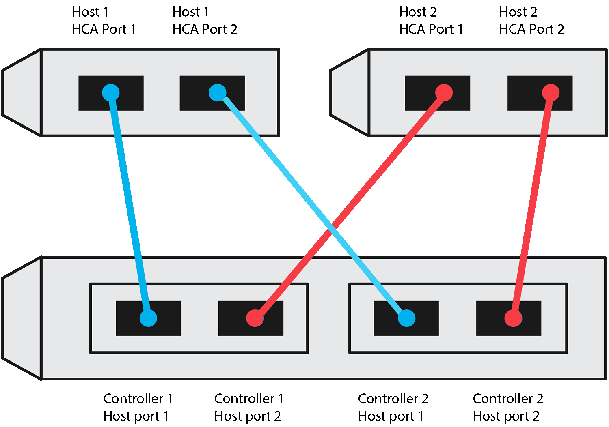
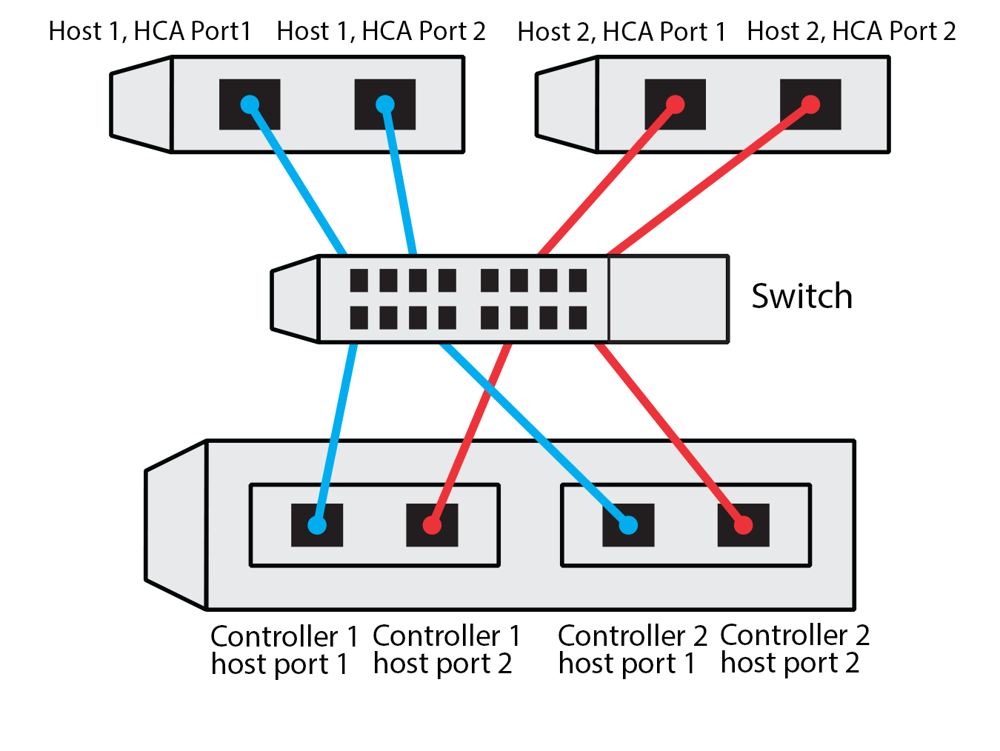

= Dokumentation Ihrer NVMe over TCP Konfiguration in E-Series - Linux
:allow-uri-read: 
:icons: font
:imagesdir: ../media/

[role="lead"]
Sie können diese Seite als PDF erstellen und ausdrucken und anschließend das folgende Arbeitsblatt verwenden, um die Konfigurationsinformationen für NVMe over TCP-Speicher zu erfassen. Sie benötigen diese Informationen, um Bereitstellungsaufgaben durchzuführen.

[[direct-connect-topology]]
== Topologie mit direkter Verbindung

In einer Direktverbindungstopologie sind ein oder mehrere Hosts direkt mit dem Subsystem verbunden. In SANtricity OS 11.50 wird eine einzelne Verbindung von jedem Host zu einem Subsystem-Controller unterstützt, wie unten dargestellt. In dieser Konfiguration sollte ein Port der Netzwerkkarte jedes Hosts sich im selben Subnetz wie der E-Series Controller Port befinden, mit dem er verbunden ist, jedoch in einem anderen Subnetz als der andere Port der Netzwerkkarte.

Eine Beispielkonfiguration, die die Anforderungen erfüllt, besteht aus vier Netznetzen wie folgt:

* Subnetz 1: Host 1 NIC Port 1 und Controller 1 Host Port 1
* Subnetz 2: Host 1 NIC Port 2 und Controller 2 Host Port 1
* Subnetz 3: Host 2 NIC Port 1 und Controller 1 Host Port 2
* Subnetz 4: Host 2 NIC Port 2 und Controller 2 Host Port 2

[[switch-connect-topology]]
== Switch Connect-Topologie

In einer Fabric-Topologie werden ein oder mehrere Switches verwendet. Siehe https://mysupport.netapp.com/matrix["NetApp Interoperabilitäts-Matrix-Tool"^] Für eine Liste der unterstützten Switches.

[[host-identifiers]]
== Host-IDs

Suchen und Dokumentieren des Initiator-NQN von jedem Host aus.

|===
| Host-Port-Verbindungen | Software-Initiator NQN 

 a| 
Host (Initiator) 1
 a| 
{nbsp}

 a| 
{nbsp}
 a| 
{nbsp}

 a| 
Host (Initiator) 2
 a| 
{nbsp}

 a| 
{nbsp}
 a| 
{nbsp}

 a| 
{nbsp}
 a| 
{nbsp}

|===

[[target-nqn]]
== Ziel-NQN

Dokumentieren Sie das Ziel-NQN für das Speicher-Array.

|===
| Array-Name | Ziel-NQN 

 a| 
Array-Controller (Ziel)
 a| 

|===

[[target-nqns]]
== Ziel-NQNs

Dokumentieren Sie die NQNs, die von den Array-Ports verwendet werden sollen.

|===
| Port-Verbindungen für Array-Controller (Ziel | NQN 

 a| 
Controller A, Port 1
 a| 

 a| 
Controller B, Port 1
 a| 

 a| 
Controller A, Port 2
 a| 

 a| 
Controller B, Port 2
 a| 

|===

[[mapping-host-name]]
== Zuordnung des Hostnamens

NOTE: Der Name des Zuordners wird während des Workflows erstellt.

|===

 a| 
Zuordnung des Hostnamens
 a| 

 a| 
Host-OS-Typ
 a| 

|===