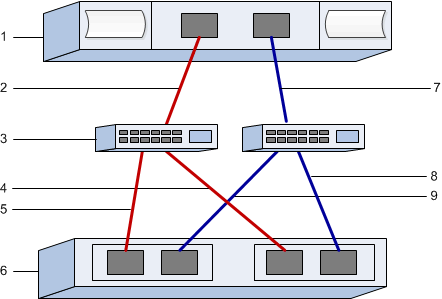

= FC-spezifische Aufgaben in E-Series – VMware ausführen
:allow-uri-read: 
:icons: font
:imagesdir: ../media/

[role="lead"]
Für das Fibre Channel-Protokoll konfigurieren Sie die Switches und bestimmen die Host-Port-IDs.

NOTE: Für EF300 und EF600 müssen Sie die Blockgröße auf 512 Byte festlegen, um die Kompatibilität mit VMware sicherzustellen. Weitere Informationen zum Einstellen eines Volumes auf 512 Byte finden Sie in der Online-Hilfe des SANtricity System Manager.

== Schritt: Konfigurieren Sie die FC Switches--VMware

Konfigurieren (Zoning) der Fibre Channel (FC)-Switches ermöglicht es den Hosts, eine Verbindung zum Storage-Array herzustellen, und begrenzt die Anzahl der Pfade. Sie Zonen der Switches mithilfe der Managementoberfläche für die Switches.

.Bevor Sie beginnen
Stellen Sie sicher, dass Sie Folgendes haben:

* Administrator-Anmeldeinformationen für die Switches.
* Der WWPN jedes Host-Initiator-Ports und jedes Controller-Zielports, der mit dem Switch verbunden ist. (Verwenden Sie Ihr HBA Utility für die Erkennung.)

NOTE: Das HBA-Dienstprogramm eines Anbieters kann zur Aktualisierung und Beschaffung spezifischer Informationen über den HBA verwendet werden. Anweisungen zum Erwerb des HBA-Dienstprogramms finden Sie im Support-Abschnitt der Website des Anbieters.

.Über diese Aufgabe
Jeder Initiator-Port muss sich in einer separaten Zone mit allen entsprechenden Ziel-Ports befinden. Informationen zum Zoning der Switches finden Sie in der Dokumentation des Switch-Anbieters.

.Schritte
. Melden Sie sich beim FC Switch-Administrationsprogramm an und wählen Sie dann die Zoning-Konfigurationsoption aus.
. Erstellen Sie eine neue Zone, die den ersten Host-Initiator-Port enthält, und die auch alle Ziel-Ports umfasst, die mit demselben FC-Switch wie der Initiator verbunden sind.
. Erstellen Sie zusätzliche Zonen für jeden FC-Host-Initiator-Port im Switch.
. Speichern Sie die Zonen, und aktivieren Sie dann die neue Zoning-Konfiguration.

== Schritt 2: Bestimmen Sie die Host-Port-WWPNs--FC

Zum Konfigurieren des FC-Zoning müssen Sie den weltweiten Port-Namen (WWPN) jedes Initiator-Ports bestimmen.

.Schritte
. Stellen Sie eine Verbindung zum ESXi Host über SSH oder die ESXi Shell her.
. Führen Sie den folgenden Befehl aus:
+
[listing]
----
esxcfg-scsidevs –a
----
. Notieren Sie die Initiator-IDs. Die Ausgabe wird dem folgenden Beispiel ähnlich sein:
+
[listing]
----
vmhba3 lpfc link-up  fc.20000090fa05e848:10000090fa05e848 (0000:03:00.0)
Emulex Corporation Emulex LPe16000 16Gb PCIe Fibre Channel Adapter
vmhba4 lpfc link-up  fc.20000090fa05e849:10000090fa05e849 (0000:03:00.1)
Emulex Corporation Emulex LPe16000 16Gb PCIe Fibre Channel Adapter
----

== Schritt 3: Notieren Sie Ihre Konfiguration

Sie können eine PDF-Datei auf dieser Seite erstellen und drucken und anschließend die Konfigurationsinformationen für den FC-Speicher mithilfe des folgenden Arbeitsblatts erfassen. Sie benötigen diese Informationen für Bereitstellungsaufgaben.

Die Abbildung zeigt einen Host, der in zwei Zonen mit einem Storage-Array der E-Series verbunden ist. Eine Zone wird durch die blaue Linie angezeigt; die andere Zone wird durch die rote Linie angezeigt. Jede Zone enthält einen Initiator-Port und alle Ziel-Ports.

=== Host-IDs

|===
| Nummer Der Legende | Host-Port-Verbindungen (Initiator) | WWPN 

 a| 
1
 a| 
Host
 a| 
_Nicht zutreffend_

 a| 
2
 a| 
Host-Port 0 zu FC-Switch-Zone 0
 a| 

 a| 
7
 a| 
Host Port 1 zu FC Switch Zone 1
 a| 

|===

=== Zielkennungen

|===
| Nummer Der Legende | Port-Verbindungen für Array-Controller (Ziel | WWPN 

 a| 
3
 a| 
Switch
 a| 
_Nicht zutreffend_

 a| 
6
 a| 
Array-Controller (Ziel)
 a| 
_Nicht zutreffend_

 a| 
5
 a| 
Controller A, Port 1 zu FC Switch 1
 a| 

 a| 
9
 a| 
Controller A, Port 2 zu FC Switch 2
 a| 

 a| 
4
 a| 
Controller B, Port 1 zu FC Switch 1
 a| 

 a| 
8
 a| 
Controller B, Port 2 zu FC Switch 2
 a| 

|===

=== Host wird zugeordnet

|===

 a| 
Zuordnung des Hostnamens
 a| 

 a| 
Host-OS-Typ
 a| 

|===