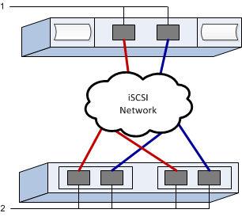

= Ausführen von iSCSI-spezifischen Aufgaben in E-Series – VMware
:allow-uri-read: 
:experimental: 
:icons: font
:imagesdir: ../media/

[role="lead"]
Für das iSCSI-Protokoll konfigurieren Sie die Switches und konfigurieren das Netzwerk auf der Array-Seite und auf der Host-Seite. Anschließend überprüfen Sie die IP-Netzwerkverbindungen.

NOTE: Um die Kompatibilität mit VMware zu gewährleisten, müssen Volumes für die 512-Byte-Emulation (512e) konfiguriert werden, wenn 4096-Byte-Laufwerke verwendet werden. Weitere Informationen zur Konfiguration eines Volumes für die 512-Byte-Emulation (512e) finden Sie in der Online-Hilfe des SANtricity System Manager.

[[step-1-record-your-configuration]]
== Schritt 1: Notieren Sie Ihre Konfiguration

Von dieser Seite kann ein PDF erstellt und gedruckt werden; anschließend kann das folgende Arbeitsblatt verwendet werden, um Ihre protokollspezifischen Speicherkonfigurationsinformationen zu erfassen. Diese Informationen werden bei der Durchführung der Bereitstellungsaufgaben benötigt.

Die Abbildung zeigt einen Host, der mit einem E-Series Storage-System verbunden ist, das durch VLANs und/oder separate Subnetze getrennt ist. Ein VLAN/Subnetz wird durch die blaue Linie angezeigt, das andere VLAN/Subnetz durch die rote Linie. Jedes VLAN/Subnetz enthält mindestens einen Initiator-Port und die Hälfte der Ziel-Ports. Die Anzahl der Host- und/oder Controller-Ports variiert je nach Anzahl der Netzwerkschnittstellen und dem Controller-Modell. Möglicherweise stehen mehr Ports zur Verfügung, bis zu 6 pro Controller.

[[host-mapping-information]]
=== Host-Mapping-Informationen

[cols="35h,~"]
|===
| Zuordnung des Hostnamens |  

| Host-OS-Typ |  

| Host-IQN |  

| Ziel-IQN |  
|===

[[step-2-configure-the-switches]]
== Schritt 2: Konfiguration der Switches

Sie konfigurieren die Switches entsprechend den Empfehlungen des Anbieters für iSCSI. Diese Empfehlungen können sowohl Konfigurationsrichtlinien als auch Code-Updates enthalten.

.Bevor Sie beginnen
Stellen Sie sicher, dass Sie Folgendes haben:

* Zwei separate Netzwerke für Hochverfügbarkeit, Vergewissern Sie sich, dass Sie den iSCSI-Datenverkehr in getrennten Netzwerksegmenten isolieren.
* Hardware-Flusssteuerung für Senden und Empfangen *durchgängig* aktiviert.
* Flusskontrolle mit Priorität deaktiviert.
* Jumbo-Frames werden gegebenenfalls aktiviert (empfohlen).

NOTE: Port-Kanäle/LACP werden von den Switch-Ports des Controllers nicht unterstützt. Host-seitiges LACP wird nicht empfohlen; Multipathing bietet dieselben Vorteile oder noch besser.

.Schritte
Informieren Sie sich in der Dokumentation des Switch-Anbieters.

[[step-3-configure-networking]]
== Schritt 3: Netzwerkkonfiguration

Je nach Ihren Datenspeicheranforderungen können Sie Ihr iSCSI-Netzwerk auf unterschiedliche Weise einrichten. Wenden Sie sich an Ihren Netzwerkadministrator, wenn Sie Tipps zur Auswahl der für Ihre Umgebung am besten geeigneten Konfiguration benötigen.

.Bevor Sie beginnen
Stellen Sie sicher, dass Sie Folgendes haben:

* Hardware-Flusssteuerung für Senden und Empfangen *durchgängig* aktiviert.
* Flusskontrolle mit Priorität deaktiviert.
* Jumbo-Frames werden gegebenenfalls aktiviert (empfohlen).
+
Wenn Sie Jumbo-Frames im IP-SAN aus Performancegründen verwenden, stellen Sie sicher, dass das Array, die Switches und die Hosts für die Verwendung von Jumbo-Frames konfiguriert sind. Informationen zur Aktivierung von Jumbo-Frames auf den Hosts und den Switches finden Sie in der Dokumentation Ihres Betriebssystems und Ihrer Switches. Zur Aktivierung von Jumbo-Frames auf dem Array sind die Schritte in Schritt 4 auszuführen.

.Über diese Aufgabe
Bei der Planung Ihrer iSCSI-Netzwerkkonfiguration sollten Sie daran denken, dass  https://configmax.broadcom.com/guest["VMware Configuration Maximums Guide"^] angibt, dass die maximal unterstützten iSCSI-Pfade zu einer LUN 32 betragen und die maximale Anzahl an Netzwerkkarten, die pro Server mit dem Software iSCSI Stack verbunden oder an Ports gebunden werden können, 8 beträgt. Diese Anforderung sollten Sie berücksichtigen, um die Konfiguration von zu vielen Pfaden zu vermeiden.

Standardmäßig erstellt der VMware iSCSI Software Initiator eine einzelne Sitzung pro iSCSI-Ziel, wenn Sie keine iSCSI-Port-Bindung verwenden.

NOTE: Die VMware iSCSI-Portbindung ist eine Funktion, die alle gebundenen VMkernel-Ports dazu zwingt, sich an allen Zielports anzumelden, die in den konfigurierten Netzwerksegmenten erreichbar sind. Sie ist für Arrays vorgesehen, die eine einzelne Netzwerkadresse für das iSCSI-Ziel bereitstellen. NetApp empfiehlt, die iSCSI-Portbindung nicht zu verwenden. Weitere Informationen finden Sie https://techdocs.broadcom.com/us/en/vmware-cis/vsphere/vsphere/9-1/vsphere-storage/configuring-iscsi-and-iser-adapters-and-storage-with-esxi/setting-up-network-for-iscsi-and-iser-with-esxi/best-practices-for-configuring-networking-with-software-iscsi.html["Best Practices für die Verwendung der Software iSCSI Portbindung in ESX/ESXi"^]. Wenn der ESXi-Host an den Speicher eines anderen Anbieters angeschlossen ist, empfiehlt NetApp die Verwendung separater iSCSI-VMkernel-Ports, um Konflikte mit der Portbindung zu vermeiden.

Verwenden Sie für eine gute Multipathing-Konfiguration mehrere Netzwerksegmente für das iSCSI-Netzwerk. Platzieren Sie mindestens einen Host-seitigen Port und mindestens einen Port jedes Array-Controllers in einem Netzwerksegment und eine identische Gruppe von Host- und Array-seitigen Ports in einem anderen Netzwerksegment. Verwenden Sie, falls möglich, mehrere Ethernet Switches, um zusätzliche Redundanz bereitzustellen.

.Schritte
Informieren Sie sich in der Dokumentation des Switch-Anbieters.

NOTE: Für IP-Overhead müssen viele Netzwerk-Switches über 9,000 Bytes konfiguriert werden. Weitere Informationen finden Sie in der Switch-Dokumentation.

[[step-4-configure-array-side-networking]]
== Schritt 4: Konfigurieren der Netzwerkverbindung auf der Array-Seite

Mit der SANtricity System Manager GUI können Sie das iSCSI-Netzwerk auf der Array-Seite konfigurieren.

.Bevor Sie beginnen
Stellen Sie sicher, dass Sie Folgendes haben:

* Die IP-Adresse oder der Domänenname für einen der Speicher-Array-Controller.
* Das Passwort für die System Manager GUI, die rollenbasierte Zugriffssteuerung (Role-Based Access Control, RBAC) oder LDAP und ein Verzeichnisdienst werden so konfiguriert, dass der Sicherheitszugriff auf das Speicher-Array gewährleistet ist. Weitere Informationen zur Zugriffsverwaltung finden Sie in der Online-Hilfe des SANtricity System Managers.

.Über diese Aufgabe
Dieser Task beschreibt den Zugriff auf die Konfiguration des iSCSI-Ports über die Seite Hardware. Sie können die Konfiguration auch über das Menü:System[Einstellungen > iSCSI-Ports konfigurieren] aufrufen.

NOTE: Weitere Informationen zur Einrichtung der Array-seitigen Netzwerkfunktionen in Ihrer VMware-Konfiguration enthält der folgende technische Bericht: https://www.netapp.com/pdf.html?item=/media/17017-tr4789.pdf["Konfigurationsleitfaden für VMware E-Series SANtricity: ISCSI-Integration mit ESXi 6.x und 7.x"^].

.Schritte
. Geben Sie in Ihrem Browser die folgende URL ein: `+https://<DomainNameOrIPAddress>+`
+
`IPAddress` Ist die Adresse für einen der Storage Array Controller.

+
Wenn SANtricity System Manager zum ersten Mal auf einem Array geöffnet wird, das nicht konfiguriert wurde, wird die Eingabeaufforderung Administratorkennwort festlegen angezeigt. Rollenbasierte Zugriffsverwaltung konfiguriert vier lokale Rollen: Administration, Support, Sicherheit und Monitoring. Die letzten drei Rollen haben zufällige Passwörter, die nicht erraten werden können. Nachdem Sie ein Passwort für die Administratorrolle festgelegt haben, können Sie alle Passwörter mit den Admin-Anmeldedaten ändern. Weitere Informationen zu den vier lokalen Benutzerrollen finden Sie in der Online-Hilfe des SANtricity-System-Managers.

. Geben Sie in den Feldern Administratorpasswort festlegen und Passwort bestätigen das Passwort für die Administratorrolle ein und klicken Sie dann auf *Passwort festlegen*.
+
Der Setup-Assistent wird gestartet, wenn keine Pools, Volumengruppen, Workloads oder Benachrichtigungen konfiguriert sind.

. Schließen Sie den Setup-Assistenten.
+
Sie verwenden den Assistenten später, um zusätzliche Setup-Aufgaben abzuschließen.

. Wählen Sie *Hardware*.
. Wenn die Grafik die Laufwerke anzeigt, klicken Sie auf *Zurück zum Regal anzeigen*.
+
Die Grafik ändert sich, um die Controller anstelle der Laufwerke anzuzeigen.

. Klicken Sie auf den Controller mit den iSCSI-Ports, die Sie konfigurieren möchten.
+
Das Kontextmenü des Controllers wird angezeigt.

. Wählen Sie *iSCSI-Ports konfigurieren*.
+
Das Dialogfeld iSCSI-Ports konfigurieren wird geöffnet.

. Wählen Sie in der Dropdown-Liste den Port aus, den Sie konfigurieren möchten, und klicken Sie dann auf *Weiter*.
. Wählen Sie die Einstellungen für den Konfigurationsanschluss aus, und klicken Sie dann auf *Weiter*.
+
Um alle Porteinstellungen anzuzeigen, klicken Sie rechts im Dialogfeld auf den Link *Weitere Porteinstellungen anzeigen*.

+
|===
| Port-Einstellung | Beschreibung 

 a| 
Konfigurierte Geschwindigkeit des ethernet-Ports
 a| 
Die gewünschte Geschwindigkeit wird ausgewählt. Die in der Dropdown-Liste angezeigten Optionen hängen von der maximalen Geschwindigkeit ab, die Ihr Netzwerk unterstützt (z. B. 25 Gbit/s).

NOTE: Die iSCSI Host-Schnittstellenkarten auf den Controllern handeln Geschwindigkeiten nicht automatisch aus. Die Geschwindigkeit für jeden Port muss auf 1 Gbit/s, 10 Gbit/s oder 25 Gbit/s eingestellt werden. Alle Ports müssen auf dieselbe Geschwindigkeit eingestellt sein.

 a| 
IPv4 aktivieren/IPv6 aktivieren
 a| 
Wählen Sie eine oder beide Optionen aus, um die Unterstützung für IPv4- und IPv6-Netzwerke zu aktivieren.

 a| 
TCP-Listening-Port (verfügbar durch Klicken auf *Weitere Port-Einstellungen anzeigen*.)
 a| 
Geben Sie bei Bedarf eine neue Portnummer ein.

Der Listening-Port ist die TCP-Port-Nummer, die der Controller zum Abhören von iSCSI-Anmeldungen von Host-iSCSI-Initiatoren verwendet. Der standardmäßige Listenanschluss ist 3260. Sie müssen 3260 oder einen Wert zwischen 49152 und 65535 eingeben.

 a| 
MTU-Größe (verfügbar durch Klicken auf *Weitere Porteinstellungen anzeigen*.)
 a| 
Geben Sie bei Bedarf eine neue Größe in Byte für die maximale Übertragungseinheit (MTU) ein.

Die Standardgröße der maximalen Übertragungseinheit (MTU) beträgt 1500 Byte pro Frame. Es muss ein Wert zwischen 1500 und 9000 eingegeben werden. Zum Aktivieren von Jumbo-Frames muss dieser Wert auf 9000 Byte festgelegt werden.

 a| 
ICMP PING-Antworten aktivieren
 a| 
Wählen Sie diese Option aus, um das ICMP (Internet Control Message Protocol) zu aktivieren. Die Betriebssysteme von vernetzten Computern verwenden dieses Protokoll zum Senden von Meldungen. Diese ICMP-Meldungen bestimmen, ob ein Host erreichbar ist und wie lange es dauert, bis Pakete von und zu diesem Host gelangen.

|===
+
Wenn Sie *IPv4 aktivieren* ausgewählt haben, wird ein Dialogfeld zur Auswahl von IPv4-Einstellungen geöffnet, nachdem Sie auf *Weiter* geklickt haben. Wenn Sie *IPv6* aktivieren ausgewählt haben, wird ein Dialogfeld zur Auswahl von IPv6-Einstellungen geöffnet, nachdem Sie auf *Weiter* geklickt haben. Wenn Sie beide Optionen ausgewählt haben, wird zuerst das Dialogfeld für IPv4-Einstellungen geöffnet, und nach dem Klicken auf *Weiter* wird das Dialogfeld für IPv6-Einstellungen geöffnet.

. Konfigurieren Sie die IPv4- und/oder IPv6-Einstellungen automatisch oder manuell. Um alle Porteinstellungen anzuzeigen, klicken Sie rechts im Dialogfeld auf den Link *Weitere Einstellungen anzeigen*.
+
|===
| Port-Einstellung | Beschreibung 

 a| 
Automatische Ermittlung der Konfiguration
 a| 
Wählen Sie diese Option aus, um die Konfiguration automatisch abzurufen.

 a| 
Statische Konfiguration manuell festlegen
 a| 
Wählen Sie diese Option aus, und geben Sie dann eine statische Adresse in die Felder ein. Geben Sie bei IPv4 die Subnetzmaske und das Gateway des Netzwerks an. Geben Sie für IPv6 die routingfähige IP-Adresse und die Router-IP-Adresse ein.

|===
. Klicken Sie Auf *Fertig Stellen*.
. Schließen Sie System Manager.

[[step-5-configure-host-side-networking]]
== Schritt 5: Hostseitige Netzwerkkonfiguration

Durch die Konfiguration des iSCSI-Netzwerkes auf der Hostseite kann der VMware iSCSI-Initiator eine Sitzung mit dem Array einrichten.

.Über diese Aufgabe
Diese Aufgabe konfiguriert die iSCSI-Netzwerkverbindung auf der Hostseite und stellt iSCSI-Sitzungen mit dem Storage Array her.

Nach Abschluss dieser Aufgabe ist der Host mit einem einzigen vSwitch konfiguriert, der sowohl VMkernel-Ports als auch vmnics enthält.

Weitere Informationen zur Konfiguration von iSCSI-Netzwerken für VMware finden Sie unter https://techdocs.broadcom.com/us/en/vmware-cis/vsphere/vsphere/9-1/vsphere-storage/configuring-iscsi-and-iser-adapters-and-storage-with-esxi.html["Konfigurieren von iSCSI Adaptern und Speicher mit ESXi"^].

NOTE: Notieren Sie während dieses Vorgangs den iSCSI Qualified Name (IQN) des hinzugefügten Software iSCSI Adapters. Dieser wird später für die Konfiguration der Hostzuordnungen benötigt.

.Bevor Sie beginnen
Stellen Sie sicher, dass Sie Folgendes haben:

* Es wurden Switches konfiguriert, die für den iSCSI-Speicherdatenverkehr verwendet werden.
* Die Hardware-Flusssteuerung für Senden und Empfangen ist auf dem Switch *durchgängig* aktiviert.
* Die Prioritätsflusssteuerung ist auf dem Switch deaktiviert.
* Die iSCSI-Konfiguration auf der Array-Seite ist abgeschlossen.
* Mindestens zwei Host-NIC-Ports für iSCSI-Datenverkehr.

.Schritte
. Für die hostseitige Konfiguration kann entweder der vSphere Client oder der vSphere Web Client verwendet werden. Siehe https://techdocs.broadcom.com/us/en/vmware-cis/vsphere/vsphere/9-1/vsphere-storage/configuring-iscsi-and-iser-adapters-and-storage-with-esxi.html["Konfigurieren von iSCSI Adaptern und Speicher mit ESXi"^].
+
Die Schnittstellen variieren in der Funktionalität und der genaue Workflow wird unterschiedlich.

. Das Netzwerk für iSCSI wird eingerichtet. Siehe https://techdocs.broadcom.com/us/en/vmware-cis/vsphere/vsphere/9-1/vsphere-storage/configuring-iscsi-and-iser-adapters-and-storage-with-esxi/setting-up-network-for-iscsi-and-iser-with-esxi.html["Einrichten des Netzwerks für iSCSI mit ESX"^].
+
.. Es wird empfohlen, die Portbindung nicht zu verwenden. Die VMware iSCSI-Portbindung ist eine Funktion, die alle gebundenen VMkernel-Ports dazu zwingt, sich bei allen Zielports anzumelden, die in den konfigurierten Netzwerksegmenten erreichbar sind. Sie ist für die Verwendung mit Arrays vorgesehen, die eine einzelne Netzwerkadresse für das iSCSI-Ziel bereitstellen. NetApp empfiehlt, die iSCSI-Portbindung nicht zu verwenden. Zusätzliche Informationen finden Sie unter https://techdocs.broadcom.com/us/en/vmware-cis/vsphere/vsphere/9-1/vsphere-storage/configuring-iscsi-and-iser-adapters-and-storage-with-esxi/setting-up-network-for-iscsi-and-iser-with-esxi/best-practices-for-configuring-networking-with-software-iscsi.html["Best Practices für die Verwendung der Software iSCSI Portbindung in ESX/ESXi"^]. Wenn der ESXi-Host an den Speicher eines anderen Anbieters angeschlossen ist, empfiehlt NetApp die Verwendung separater iSCSI-VMkernel-Ports, um Konflikte mit der Portbindung zu vermeiden.
.. NetApp empfiehlt mehrere Adapterzuordnungen auf einem vSphere Standard Switch, wobei Active/Standby-Adapter für Redundanz genutzt werden. Weitere Informationen finden Sie unter  https://techdocs.broadcom.com/us/en/vmware-cis/vsphere/vsphere/9-1/vsphere-storage/configuring-iscsi-and-iser-adapters-and-storage-with-esxi/setting-up-network-for-iscsi-and-iser-with-esxi/multiple-network-adapters-in-iscsi-or-iser-configuration.html["Mehrere Netzwerkadapter in iSCSI Konfiguration"^].
.. Jumbo-Frames können bei Bedarf mit iSCSI aktiviert werden. Siehe https://techdocs.broadcom.com/us/en/vmware-cis/vsphere/vsphere/9-1/vsphere-storage/configuring-iscsi-and-iser-adapters-and-storage-with-esxi/using-jumbo-frames-with-iscsi-and-iser.html["Verwenden von Jumbo Frames mit iSCSI auf ESX"^].

. Es ist ein Software iSCSI Adapter hinzuzufügen. Siehe https://techdocs.broadcom.com/us/en/vmware-cis/vsphere/vsphere/9-1/vsphere-storage/configuring-iscsi-and-iser-adapters-and-storage-with-esxi/configure-the-software-iscsi-adapter-with-esxi/add-or-remove-the-software-iscsi-adapter.html["Hinzufügen oder Entfernen des Software iSCSI Adapters"^].
+
.. Der Host-IQN wird erfasst, und optional wird ein iSCSI-Alias hinzugefügt. Siehe https://techdocs.broadcom.com/us/en/vmware-cis/vsphere/vsphere/9-1/vsphere-storage/configuring-iscsi-and-iser-adapters-and-storage-with-esxi/modify-general-properties-for-iscsi-and-iser-adapters-on-esxi-hosts.html["Allgemeine Eigenschaften für iSCSI auf ESX Hosts ändern"^].
.. Die CHAP-Parameter werden konfiguriert, wenn CHAP-Secrets verwendet werden. Siehe https://techdocs.broadcom.com/us/en/vmware-cis/vsphere/vsphere/9-1/vsphere-storage/configuring-iscsi-and-iser-adapters-and-storage-with-esxi/configuring-chap-parameters-for-iscsi-or-iser-storage-adapters-with-esxi.html["Konfiguration von CHAP-Parametern für iSCSI-Adapter auf einem ESX-Host"^].

Nach erfolgreichem Hinzufügen können die Verbindungen in der Ansicht „Speicheradapter“ im vSphere Client angezeigt werden. Falls dies nicht erfolgreich war, kann mit Schritt 6 fortgefahren werden, um die Kommunikation mit den Ports zu überprüfen und etwaige Verbindungseinstellungen zu korrigieren.

[[step-6-verify-ip-network-connections]]
== Schritt 6: Überprüfen der IP-Netzwerkverbindungen

Sie überprüfen IP-Netzwerkverbindungen des Internet Protocol (Internet Protocol), indem Sie Ping-Tests verwenden, um sicherzustellen, dass Host und Array kommunizieren können.

.Schritte
. Führen Sie auf dem Host einen der folgenden Befehle aus, je nachdem, ob Jumbo Frames aktiviert sind:
+
** Wenn Jumbo Frames nicht aktiviert sind, führen Sie den folgenden Befehl aus:
+
[listing]
----
vmkping <iSCSI_target_IP_address\>
----
** Wenn Jumbo Frames aktiviert sind, führen Sie den Ping-Befehl mit einer Nutzlastgröße von 8,972 Byte aus. Die kombinierten IP- und ICMP-Header sind 28 Bytes, was, wenn sie der Nutzlast hinzugefügt werden, 9,000 Bytes entspricht. Der -s-Schalter legt den Wert fest `packet size` Bit. Der -d Schalter setzt das DF-Bit (nicht fragment) auf das IPv4-Paket. Mit diesen Optionen können Jumbo-Frames mit 9,000 Byte erfolgreich zwischen iSCSI-Initiator und Ziel übertragen werden.
+
[listing]
----
vmkping -s 8972 -d <iSCSI_target_IP_address\>
----
+
In diesem Beispiel lautet die iSCSI-Ziel-IP-Adresse `192.0.2.8`.

+
[listing]
----
vmkping -s 8972 -d 192.0.2.8
Pinging 192.0.2.8 with 8972 bytes of data:
Reply from 192.0.2.8: bytes=8972 time=2ms TTL=64
Reply from 192.0.2.8: bytes=8972 time=2ms TTL=64
Reply from 192.0.2.8: bytes=8972 time=2ms TTL=64
Reply from 192.0.2.8: bytes=8972 time=2ms TTL=64
Ping statistics for 192.0.2.8:
  Packets: Sent = 4, Received = 4, Lost = 0 (0% loss),
Approximate round trip times in milliseconds:
  Minimum = 2ms, Maximum = 2ms, Average = 2ms
----

. Geben Sie A aus `vmkping` Befehl von der Initiatoradresse jedes Hosts (die IP-Adresse des für iSCSI verwendeten Host-Ethernet-Ports) an jeden Controller-iSCSI-Port. Führen Sie diese Aktion von jedem Host-Server in der Konfiguration aus, wobei die IP-Adressen bei Bedarf geändert werden.
+

NOTE: Wenn der Befehl mit der Meldung fehlschlägt `sendto() failed (Message too long)`, Überprüfen Sie die MTU-Größe (Jumbo Frame-Unterstützung) für die Ethernet-Schnittstellen auf dem Host-Server, dem Storage-Controller und den Switch-Ports.

. Falls die Erkennung in Schritt 5 fehlgeschlagen ist, erfolgt die Rückkehr zum Verfahren für die iSCSI Host-seitige Netzwerkkonfiguration, um die Sitzungserkennung abzuschließen.

