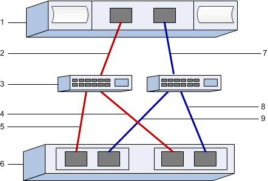

= NVMe over FC-spezifische Aufgaben in E-Series – VMware ausführen
:allow-uri-read: 
:icons: font
:imagesdir: ../media/

[role="lead"]
Sie konfigurieren die Switches für das NVMe over Fibre Channel-Protokoll und bestimmen die Host-Port-IDs.

NOTE: Um die Kompatibilität mit VMware zu gewährleisten, müssen Volumes für die 512-Byte-Emulation (512e) konfiguriert werden, wenn 4096-Byte-Laufwerke verwendet werden. Weitere Informationen zur Konfiguration eines Volumes für die 512-Byte-Emulation (512e) finden Sie in der Online-Hilfe des SANtricity System Manager.

NOTE: Bei der Planung Ihrer NVMe over FC Konfiguration ist zu beachten, dass die https://configmax.broadcom.com/guest["VMware Configuration Maximums Guide"^] maximale Anzahl unterstützter NVMe FC Initiator-Ports pro Server 2 beträgt. Diese Anforderung ist zu berücksichtigen, um die Konfiguration zu vieler Pfade zu vermeiden.

[[step-1-record-your-configuration]]
== Schritt 1: Notieren Sie Ihre Konfiguration

Es ist möglich, eine PDF-Datei dieser Seite zu erstellen und auszudrucken und anschließend das folgende Arbeitsblatt zu verwenden, um die Konfigurationsinformationen für NVMe über Fibre Channel Speicher zu erfassen. Diese Informationen werden für die Durchführung der Bereitstellungsaufgaben benötigt.

Die Abbildung zeigt einen Host, der in zwei Zonen mit einem E-Series Speicher-Array verbunden ist. Eine Zone ist durch die roten Linien gekennzeichnet, die andere Zone durch die blauen Linien. Jede Zone enthält einen Initiator-Port und die Hälfte aller Ziel-Ports. Die Anzahl der Controller-Ports variiert je nach Controller-Modell und Anzahl der Host-Schnittstellenkarten (HIC). Möglicherweise stehen mehr Ports zur Verfügung (bis zu 12 pro Controller). Weitere PDFs können bei Bedarf gedruckt werden.

[[host-identifiers]]
=== Host-IDs

|===
| Nummer Der Legende | Host-Port-Verbindungen (Initiator) | WWPN 

 a| 
1
 a| 
Host
 a| 
_Nicht zutreffend_

 a| 
2
 a| 
Host-Port 0 zu FC-Switch-Zone 0
 a| 

 a| 
7
 a| 
Host Port 1 zu FC Switch Zone 1
 a| 

|===

[[target-identifiers]]
=== Zielkennungen

|===
| Nummer Der Legende | Port-Verbindungen für Array-Controller (Ziel | WWPN 

 a| 
3
 a| 
Switch
 a| 
_Nicht zutreffend_

 a| 
6
 a| 
Array-Controller (Ziel)
 a| 
_Nicht zutreffend_

 a| 
5
 a| 
Controller A, Port 1 zu FC Switch 1
 a| 

 a| 
5
 a| 
Controller A, Port 2 zu FC-Switch 1
 a| 

 a| 
9
 a| 
Controller A, Port 3 mit FC-Switch 2 verbinden
 a| 

 a| 
9
 a| 
Controller A, Port 4 mit FC-Switch 2
 a| 

 a| 
4
 a| 
Controller B, Port 1 zu FC Switch 1
 a| 

 a| 
4
 a| 
Controller B, Port 2 zu FC-Switch 1
 a| 

 a| 
8
 a| 
Controller B, Port 3 mit FC-Switch 2
 a| 

 a| 
8
 a| 
Controller B, Port 4 mit FC-Switch 2
 a| 

|===

[[host-mapping-information]]
=== Host-Mapping-Informationen

[cols="35h,~"]
|===
| Zuordnung des Hostnamens |  

| Host-OS-Typ |  

| Host-NQN |  

| Ziel-NQN |  
|===

[[step-2-determine-the-host-ports-wwpns]]
== Schritt 2: Ermittlung der WWPNs der Host-Ports

Zum Konfigurieren des FC-Zoning müssen Sie den weltweiten Port-Namen (WWPN) jedes Initiator-Ports bestimmen.

.Schritte
. Eine Verbindung zum ESXi-Host kann über SSH oder die ESXi-Shell hergestellt werden. Informationen zum Aktivieren der ESXi-Shell finden Sie unter  https://knowledge.broadcom.com/external/article/311213/using-esxi-shell-in-esxi.html["Verwenden der ESXi Shell in ESXi"^].
. Führen Sie den folgenden Befehl aus:
+
[listing]
----
esxcli storage core adapter list
----
. Die Initiator-WWPN-Kennungen (UID im Format fc.WWNN:WWPN) sind zu notieren. Die Ausgabe sieht in etwa so aus wie in diesem Beispiel:
+
[listing]
----
HBA Name  Driver    Link State  UID                                   Capabilities         Description
--------  --------  ----------  ------------------------------------  -------------------  -----------
vmhba4    lpfc      link-up     fc.200070b7e4395530:100070b7e4395530  Second Level Lun ID  (0000:5e:00.0) Emulex Corporation Emulex LPe35000/LPe36000 Fibre Channel Adapter
vmhba5    lpfc      link-up     fc.200070b7e4395531:100070b7e4395531  Second Level Lun ID  (0000:5e:00.1) Emulex Corporation Emulex LPe35000/LPe36000 Fibre Channel Adapter
vmhba64   lpfc      link-up     fc.200070b7e4395530:100070b7e4395530                       (0000:5e:00.0) Emulex Corporation Emulex LPe35000/LPe36000 Fibre Channel Adapter
vmhba65   lpfc      link-up     fc.200070b7e4395531:100070b7e4395531                       (0000:5e:00.1) Emulex Corporation Emulex LPe35000/LPe36000 Fibre Channel Adapter

----

Im obigen Beispiel sind die UIDs für vmhba4 und vmhba64 sowie vmhba5 und vmhba65 identisch. Dies ist bei FC-Adaptern, die sowohl FCP als auch NVMe über FC unterstützen, zu erwarten. Jeder eindeutige WWPN sollte notiert werden.

NOTE: Eine weitere Befehlsoption ist `esxcli storage san fc list`. Dabei werden weitere Details und die WWPN im Hexadezimalformat, durch Doppelpunkte getrennt, angezeigt.

. Führen Sie den folgenden Befehl aus und notieren Sie den Host NQN (dieser wird später bei der Konfiguration der Host-Zuordnungen benötigt):
+
[listing]
----
esxcli nvme info get
----

[[step-3-configure-the-nvmefc-switches]]
== Schritt 3: Konfigurieren der NVMe/FC-Switches

Beim Konfigurieren (Zoning) von NVMe over Fibre Channel (FC)-Switches können sich die Hosts mit dem Storage-Array verbinden, und die Anzahl der Pfade wird begrenzt. Sie Zonen der Switches mithilfe der Managementoberfläche für die Switches.

.Bevor Sie beginnen
Stellen Sie sicher, dass Sie Folgendes haben:

* Administrator-Anmeldeinformationen für die Switches.
* Der WWPN jedes Host-Initiator-Ports und jedes Controller-Zielports, der mit dem Switch verbunden ist. (Verwenden Sie Ihr HBA Utility für die Erkennung.)

NOTE: Das HBA-Dienstprogramm eines Anbieters kann zur Aktualisierung und Beschaffung spezifischer Informationen über den HBA verwendet werden. Anweisungen zum Erwerb des HBA-Dienstprogramms finden Sie im Support-Abschnitt der Website des Anbieters.

.Über diese Aufgabe
Jeder Initiator-Port muss sich in einer separaten Zone mit allen entsprechenden Ziel-Ports befinden. Informationen zum Zoning der Switches finden Sie in der Dokumentation des Switch-Anbieters.

.Schritte
. Melden Sie sich beim FC Switch-Administrationsprogramm an und wählen Sie dann die Zoning-Konfigurationsoption aus.
. Erstellen Sie eine neue Zone, die den ersten Host-Initiator-Port enthält, und die auch alle Ziel-Ports umfasst, die mit demselben FC-Switch wie der Initiator verbunden sind.
. Erstellen Sie zusätzliche Zonen für jeden FC-Host-Initiator-Port im Switch.
. Speichern Sie die Zonen, und aktivieren Sie dann die neue Zoning-Konfiguration.

Detaillierte Anweisungen zur Konfiguration von Zonen finden Sie in der Dokumentation des Switch-Herstellers.
