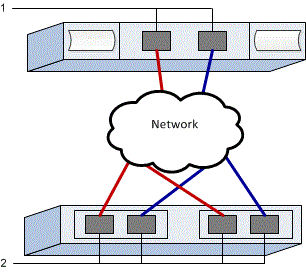

= Konfiguration von NVMe over TCP Switches für VMware in E Series
:allow-uri-read: 
:icons: font
:imagesdir: ../media/

[role="lead"]
Für das NVMe over TCP Protokoll werden die Switches konfiguriert und der NVMe Qualified Name (NQN) des Hosts ermittelt.

NOTE: Volumes müssen für die Verwendung der 512-Byte-Emulation (512e) konfiguriert werden, wenn 4096-Byte-Laufwerke verwendet werden, um die Kompatibilität mit VMware sicherzustellen. Weitere Informationen zum Konfigurieren eines Volumes für die 512-Byte-Emulation (512e) finden Sie in der Online-Hilfe des SANtricity System Manager.

[[step-1-record-your-configuration]]
== Schritt 1: Notieren Sie Ihre Konfiguration

Es ist möglich, eine PDF-Datei dieser Seite zu erstellen und auszudrucken und anschließend das folgende Arbeitsblatt zu verwenden, um Ihre protokollspezifischen Speicherkonfigurationsinformationen zu erfassen. Diese Informationen werden bei der Durchführung von Bereitstellungsaufgaben benötigt.

Die Abbildung zeigt einen Host, der mit einem E-Series Storage-Array verbunden ist, das durch VLANs und/oder separate Subnetze getrennt ist. Ein VLAN/Subnetz ist durch die blaue Linie gekennzeichnet, das andere VLAN/Subnetz durch die rote Linie. Jedes VLAN/Subnetz enthält mindestens einen Initiator-Port und die Hälfte der Ziel-Ports. Die Anzahl der Host- und/oder Controller-Ports variiert je nach Anzahl der Netzwerkschnittstellen und dem Controller-Modell. Möglicherweise stehen mehr Ports zur Verfügung, bis zu 6 pro Controller.

[[host-mapping-information]]
=== Host-Mapping-Informationen

[cols="35h,~"]
|===
| Zuordnung des Hostnamens |  

| Host-OS-Typ |  

| Host-NQN |  

| Ziel-NQN |  
|===

[[step-2-configure-the-nvmetcp-switches]]
== Schritt 2: Konfiguration der NVMe/TCP-Switches

Die Switches werden gemäß den Empfehlungen des Herstellers für NVMe über TCP konfiguriert. Diese Empfehlungen können sowohl Konfigurationsanweisungen als auch Codeaktualisierungen umfassen.

.Über diese Aufgabe
Diese Aufgabe beschreibt die allgemeinen Schritte zur Konfiguration der Switches für NVMe über TCP. Spezifische Anweisungen finden sich in der Dokumentation Ihres Switch-Herstellers.

.Bevor Sie beginnen
Stellen Sie sicher, dass Sie Folgendes haben:

* Zwei separate Netzwerke für hohe Verfügbarkeit. Stellen Sie sicher, dass Sie Ihren NVMe over TCP Datenverkehr auf separaten Netzwerksegmenten isolieren.

.Schritte
Informieren Sie sich in der Dokumentation des Switch-Anbieters.

[[step-3-configure-networking]]
== Schritt 3: Netzwerk konfigurieren

Sie können Ihr NVMe over TCP Netzwerk je nach Ihren Datenspeicheranforderungen auf verschiedene Arten einrichten. Ihr Netzwerkadministrator kann Hinweise zur Auswahl der optimalen Konfiguration für Ihre Umgebung geben.

.Über diese Aufgabe
Diese Aufgabe beschreibt die allgemeinen Schritte zur Konfiguration des Netzwerks für NVMe über TCP. Spezifische Anweisungen sind der Dokumentation Ihres Switch-Herstellers zu entnehmen.

.Bevor Sie beginnen
Stellen Sie sicher, dass Sie Folgendes haben:

* Für TCP-Datenverkehr konfigurierter Switch.

Bei der Planung Ihrer NVMe over TCP Netzwerkverbindung ist zu beachten, dass der  https://configmax.broadcom.com/guest["VMware Configuration Maximums Guide"^] angibt, dass die maximal unterstützten TCP NVMe Initiator Ports pro Server 2 betragen. Diese Anforderung ist zu berücksichtigen, um die Konfiguration zu vieler Pfade zu vermeiden.

Um eine optimale Multipathing-Konfiguration zu gewährleisten, werden mehrere Netzwerksegmente für das NVMe over TCP Netzwerk verwendet. In einem Netzwerksegment sollten mindestens ein Host-seitiger Port und mindestens ein Port jedes Array-Controllers sowie in einem anderen Netzwerksegment eine identische Gruppe von Host- und Array-seitigen Ports vorhanden sein. Nach Möglichkeit werden mehrere Ethernet-Switches verwendet, um zusätzliche Redundanz bereitzustellen.

.Schritte
Informieren Sie sich in der Dokumentation des Switch-Anbieters.

[[step-4-configure-array-side-networking]]
== Schritt 4: Netzwerkkonfiguration auf der Array-Seite

Sie verwenden die SANtricity System Manager Oberfläche, um NVMe over TCP Networking auf der Array-Seite zu konfigurieren.

.Über diese Aufgabe
Diese Aufgabe beschreibt, wie Sie über die Seite *Controller & Komponenten* im SANtricity System Manager auf die NVMe over TCP Portkonfiguration zugreifen können. Auf die Konfiguration kann auch über die Seite *NVMe over TCP Ports konfigurieren* im SANtricity System Manager zugegriffen werden.

.Bevor Sie beginnen
Stellen Sie sicher, dass Sie Folgendes haben:

* Die IP-Adresse oder der Domänenname für einen der Speicher-Array-Controller.
* Passwort für die System Manager-GUI oder Role-Based Access Control (RBAC) oder LDAP und ein Verzeichnisdienst sind für den entsprechenden Sicherheitszugriff auf das Speichersystem konfiguriert. Siehe die Online-Hilfe des SANtricity System Manager für weitere Informationen über link:https://docs.netapp.com/us-en/e-series-santricity/um-certificates/overview-access-management-um.html["Zugriffsmanagement"^].

.Schritte
. Geben Sie in Ihrem Browser die folgende URL ein: https://<DomainNameOrIPAddress>[]
+
`IPAddress` Ist die Adresse für einen der Storage Array Controller.

+
Wenn SANtricity System Manager zum ersten Mal auf einem Array geöffnet wird, das nicht konfiguriert wurde, wird die Eingabeaufforderung Administratorkennwort festlegen angezeigt. Rollenbasierte Zugriffsverwaltung konfiguriert vier lokale Rollen: Administration, Support, Sicherheit und Monitoring. Die letzten drei Rollen haben zufällige Passwörter, die nicht erraten werden können. Nachdem Sie ein Passwort für die Administratorrolle festgelegt haben, können Sie alle Passwörter mit den Admin-Anmeldedaten ändern. Weitere Informationen zu den vier lokalen Benutzerrollen finden Sie in der Online-Hilfe des SANtricity-System-Managers.

. Geben Sie in den Feldern Administratorpasswort festlegen und Passwort bestätigen das Passwort für die Administratorrolle ein und klicken Sie dann auf *Passwort festlegen*.
+
Der Setup-Assistent wird gestartet, wenn keine Pools, Volume-Gruppen, Workloads oder Benachrichtigungen konfiguriert sind.

. Schließen Sie den Setup-Assistenten.
+
Sie verwenden den Assistenten später, um zusätzliche Setup-Aufgaben abzuschließen.

. Wählen Sie *Hardware* > *Controllers and components*.
. Wählen Sie den Controller mit den NVMe over TCP-Ports aus, die Sie konfigurieren möchten.
+
Das Kontextmenü des Controllers wird angezeigt.

. *NVMe über TCP-Ports konfigurieren* auswählen.
+
Das Dialogfeld „NVMe über TCP-Ports konfigurieren“ wird geöffnet.

. Wählen Sie in der Dropdown-Liste den Port aus, den Sie konfigurieren möchten, und klicken Sie dann auf *Weiter*.
. Wählen Sie die Einstellungen für den Konfigurationsanschluss aus, und klicken Sie dann auf *Weiter*.
+
Um alle Porteinstellungen anzuzeigen, klicken Sie rechts im Dialogfeld auf den Link *Weitere Porteinstellungen anzeigen*.

+
|===
| Port-Einstellung | Beschreibung 

 a| 
Konfigurierte Geschwindigkeit des ethernet-Ports
 a| 
Wählen Sie die gewünschte Geschwindigkeit. Die Optionen, die in der Dropdown-Liste angezeigt werden, hängen von der maximalen Geschwindigkeit ab, die Ihr Netzwerk unterstützen kann (zum Beispiel 200 Gb/s).

 a| 
IPv4 aktivieren/IPv6 aktivieren
 a| 
Wählen Sie eine oder beide Optionen aus, um die Unterstützung für IPv4- und IPv6-Netzwerke zu aktivieren.

 a| 
MTU-Größe (Verfügbar durch Klicken auf „Weitere Porteinstellungen anzeigen“.)
 a| 
Geben Sie bei Bedarf eine neue Größe in Byte für die maximale Übertragungseinheit (MTU) ein.

Die Standardgröße der maximalen Übertragungseinheit (MTU) beträgt 4200 Byte pro Frame. Sie müssen einen Wert zwischen 1500 und 9000 eingeben.

|===
+
Wenn Sie *IPv4 aktivieren* ausgewählt haben, wird ein Dialogfeld zur Auswahl von IPv4-Einstellungen geöffnet, nachdem Sie auf *Weiter* geklickt haben. Wenn Sie *IPv6* aktivieren ausgewählt haben, wird ein Dialogfeld zur Auswahl von IPv6-Einstellungen geöffnet, nachdem Sie auf *Weiter* geklickt haben. Wenn Sie beide Optionen ausgewählt haben, wird zuerst das Dialogfeld für IPv4-Einstellungen geöffnet, und nach dem Klicken auf *Weiter* wird das Dialogfeld für IPv6-Einstellungen geöffnet.

+
Konfigurieren Sie die IPv4- und/oder IPv6-Einstellungen automatisch oder manuell. Um alle Porteinstellungen anzuzeigen, klicken Sie rechts im Dialogfeld auf den Link *Weitere Einstellungen anzeigen*.

+
|===
| Port-Einstellung | Beschreibung 

 a| 
Automatische Ermittlung der Konfiguration
 a| 
Wählen Sie diese Option aus, um die Konfiguration automatisch abzurufen.

 a| 
Statische Konfiguration manuell festlegen
 a| 
Wählen Sie diese Option aus, und geben Sie dann eine statische Adresse in die Felder ein. Geben Sie bei IPv4 die Subnetzmaske und das Gateway des Netzwerks an. Geben Sie für IPv6 die routingfähige IP-Adresse und die Router-IP-Adresse ein.

|===
. Klicken Sie Auf *Fertig Stellen*.
. Schließen Sie System Manager.

[[step-5-configure-host-side-networking]]
== Schritt 5: Host-seitige Netzwerkkonfiguration

Durch die Konfiguration des NVMe over TCP Netzwerks auf der Hostseite kann der VMware NVMe over TCP Speicheradapter Initiator eine Sitzung mit dem Array herstellen.

.Schritte
. Identifizieren Sie TCP-Netzwerkadapter und notieren Sie den mit vmnic gepaarten Uplink.
+
Die Netzwerkadapter des Hosts werden als vmnicN bezeichnet, wobei N eine eindeutige Nummer ist, die den Netzwerkadapter identifiziert, z. B. vmnic0, vmnic1 usw. Die physischen Adapter können unter „Netzwerk“ auf dem ESXi-Host oder auf der Registerkarte „Konfigurieren“ angezeigt werden, wenn der ESXi-Host im Bestand eines hostenden vCenter ausgewählt ist.

. Konfigurieren Sie die VMkernel-Portbindung für den TCP-Adapter mithilfe eines vSphere Standard-Switches.
+
Weitere Informationen finden sich unter link:https://techdocs.broadcom.com/us/en/vmware-cis/vsphere/vsphere/9-1/vsphere-storage/about-vmware-nvme-storage/configuring-nvme-over-tcp-on-esxi/configure-vmkernel-binding-for-the-tcp-adapter.html["Konfigurieren Sie die VMkernel-Bindung für den TCP-Adapter"^].

. Fügen Sie den Software-NVMe-over-TCP-Adapter hinzu.
+
Weitere Informationen finden sich unter link:https://techdocs.broadcom.com/us/en/vmware-cis/vsphere/vsphere/9-1/vsphere-storage/about-vmware-nvme-storage/configuring-nvme-over-tcp-on-esxi/configure-vmkernel-binding-for-the-tcp-adapter/configure-vmkernel-binding-for-the-tcp-adapter-with-a-vsphere-standard-switch.html["Software-NVMe-over-RDMA- oder NVMe-over-TCP-Adapter hinzufügen"^].

. NVMe-Controller für NVMe über TCP hinzufügen.
+
Weitere Informationen finden sich unter link:https://techdocs.broadcom.com/us/en/vmware-cis/vsphere/vsphere/9-1/vsphere-storage/about-vmware-nvme-storage/configuring-nvme-over-tcp-on-esxi/shared-content/submaps/GUID-23E6D699-BEDC-4B5F-9515-3390C0E73888_copy.html["Controller für NVMe over Fabrics hinzufügen"^].

NOTE: Die Host NQN kann während dieses Vorgangs im Dialogfeld „Controller hinzufügen“ abgerufen werden. Diese wird später für die Konfiguration der Host-Zuordnungen benötigt.

Nach erfolgreichem Hinzufügen können die Verbindungen in der Ansicht „Speicheradapter“ im vSphere Client eingesehen werden. Falls dies nicht erfolgreich war, ist mit Schritt 6 fortzufahren, um die Kommunikation mit den Ports zu überprüfen und etwaige Verbindungseinstellungen zu korrigieren.

[[step-6-verify-ip-network-connections]]
== Schritt 6: Überprüfen der IP-Netzwerkverbindungen

Sie überprüfen IP-Netzwerkverbindungen des Internet Protocol (Internet Protocol), indem Sie Ping-Tests verwenden, um sicherzustellen, dass Host und Array kommunizieren können.

.Schritte
. Auf dem Host wird der folgende Befehl ausgeführt:
+
[listing]
----
vmkping <NVMe over TCP_target_IP_address\>
----
+
In diesem Beispiel lautet die Ziel-IP-Adresse für NVMe over TCP 192.29.11.111.

+
[listing]
----
vmkping -d 192.29.11.111
PING 192.29.11.111 (192.29.11.111): 56 data bytes
64 bytes from 192.29.11.111: icmp_seq=0 ttl=64 time=0.902 ms
64 bytes from 192.29.11.111: icmp_seq=1 ttl=64 time=0.406 ms
64 bytes from 192.29.11.111: icmp_seq=2 ttl=64 time=0.855 ms
--- 192.29.11.111 ping statistics ---
3 packets transmitted, 3 packets received, 0% packet loss
round-trip min/avg/max = 0.406/0.721/0.902 ms
----
. Geben Sie von der Initiatoradresse jedes Hosts (der IP-Adresse des für NVMe über TCP verwendeten Ethernet-Ports des Hosts) zu jedem NVMe über TCP Port des Controllers einen  `vmkping` Befehl aus. Diese Aktion ist von jedem Host-Server in der Konfiguration auszuführen, wobei die IP-Adressen nach Bedarf anzupassen sind.
+

NOTE: Falls der Befehl mit der Meldung `sendto() failed (Message too long)` fehlschlägt, überprüfen Sie die MTU-Größe für die Ethernet-Schnittstellen am Host-Server, am Storage Controller und an den Switch-Ports.

. Falls die Erkennung in Schritt 5 nicht erfolgreich war, kehren Sie zur Konfigurationsprozedur für die hostseitige Netzwerkkonfiguration von NVMe over TCP zurück, um das Hinzufügen der Zielcontroller abzuschließen.

