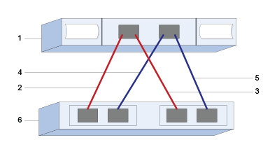

= Konfiguration von SAS-Host-Ports und -Einstellungen für VMware in der E-Series
:allow-uri-read: 
:icons: font
:imagesdir: ../media/

[role="lead"]
Für das SAS-Protokoll bestimmen Sie Host-Port-Adressen und treffen die empfohlenen Einstellungen.

[[step-1-record-your-configuration]]
== Schritt 1: Notieren Sie Ihre Konfiguration

Es ist möglich, eine PDF-Datei dieser Seite zu erstellen und auszudrucken und anschließend das folgende Arbeitsblatt zu verwenden, um Ihre protokollspezifischen Speicherkonfigurationsinformationen zu erfassen. Diese Informationen werden bei der Durchführung von Bereitstellungsaufgaben benötigt.

Die Abbildung zeigt einen Host, der direkt mit einem E-Series Speicherarray mit redundanten Verbindungen verbunden ist (bei einem 4-Port-SAS-HBA). Die erste redundante Verbindung wird durch die roten Linien dargestellt, die zweite redundante Verbindung durch die blauen Linien. Die Anzahl der Ports hängt von der Anzahl der Host-Ports ab. Es können auch nur 2 Host-Ports vorhanden sein. In diesem Fall ist mindestens die erste redundante Verbindung empfehlenswert.

[[host-identifiers]]
=== Host-IDs

|===
| Nummer Der Legende | Host-Port-Verbindungen (Initiator) | SAS-Adresse 

 a| 
1
 a| 
Host
 a| 
_Nicht zutreffend_

 a| 
2
 a| 
Host-Port 1 (Initiator) ist mit Controller A verbunden, Port 1
 a| 

 a| 
3
 a| 
Host-Port 2 (Initiator) ist mit Controller B verbunden, Port 1
 a| 

 a| 
4
 a| 
Host-(Initiator-)Port 3 ist mit Controller A, Port 1 verbunden
 a| 

 a| 
5
 a| 
Host-(Initiator-)Port 4 ist mit Controller B, Port 1 verbunden
 a| 

|===

[[host-mapping-information]]
=== Host-Mapping-Informationen

[cols="35h,~"]
|===
| Zuordnung des Hostnamens |  

| Host-OS-Typ |  
|===

[[step-2-determine-sas-host-identifiers]]
== Schritt 2: SAS-Hostkennungen ermitteln

Die SAS-Adressen können mit esxcli oder dem HBA-Dienstprogramm ermittelt werden.

.Über diese Aufgabe
Lesen Sie die Richtlinien für HBA Utilities:

* Die meisten HBA-Anbieter bieten ein HBA-Dienstprogramm an.

.Schritte
. Sie stellen über SSH oder die ESXi-Shell eine Verbindung zum ESXi Host her. Informationen zum Aktivieren der ESXi-Shell finden Sie unter  https://knowledge.broadcom.com/external/article/311213/using-esxi-shell-in-esxi.html["Verwenden der ESXi Shell in ESXi"^].
. Führen Sie den folgenden Befehl aus:
+
[listing]
----
esxcli storage core adapter list
----
. Die SAS-Adresskennung des Initiators ist zu notieren (UID im Format - sas.<SAS_Address>). Die Ausgabe sieht in etwa so aus wie in diesem Beispiel:
+
[listing]
----
HBA Name  Driver       Link State  UID                   Capabilities         Description
--------  ----------   ----------  --------------------  -------------------  -----------
vmhba1    lsi_msgpt35  link-n/a    sas.5b083fe0ca0e7000                       (0000:03:00.0) Avago (LSI Logic) SAS3008 12Gbps SAS HBA external
----

Im obigen Beispiel zeigt die UID nur die Basis-SAS-Adresse an. Bei den anderen Ports bleiben die ersten 14 Zeichen konstant, und nur die letzten beiden Zeichen variieren, um die verschiedenen Ports darzustellen. Typischerweise erhöht sich die letzte Ziffer für jeden Port einfach um 1. Die Basis-SAS-Adresse reicht in der Regel aus, um den Host-Adapter beim Host-Mapping zu identifizieren, da das E-Series Array die anderen Port-SAS-Adressen automatisch erkennt und zur Auswahl auflistet. Ein HBA-Dienstprogramm des Herstellers kann dabei helfen, die SAS-Adresse für jeden Port zu ermitteln.

NOTE: Eine weitere Befehlsoption ist `esxcli storage san sas list`. Dadurch werden weitere Details und die Basis-SAS-Adresse im hexadezimalen Format, durch Doppelpunkte getrennt, angezeigt.
