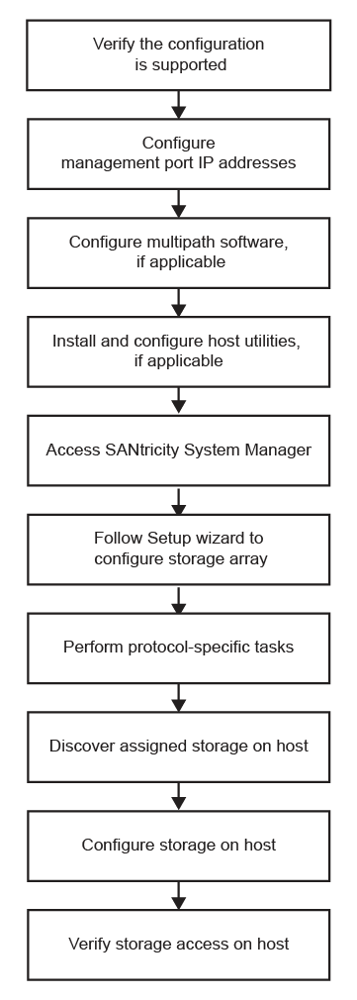

= Verstehen Sie den VMware Workflow in der E-Series
:allow-uri-read: 
:icons: font
:imagesdir: ../media/

[role="lead"]
Dieser Workflow führt Sie durch die „Express Methode“ zur Konfiguration Ihres Storage Arrays und von SANtricity System Manager, um Storage einem VMware Host zur Verfügung zu stellen.

