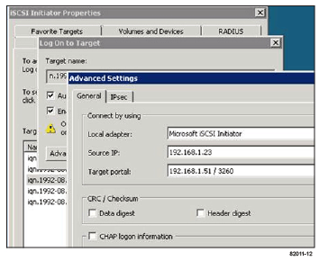

= Führen Sie iSCSI-spezifische Aufgaben aus
:allow-uri-read: 
:experimental: 
:icons: font
:imagesdir: ../media/

[role="lead"]
Für das iSCSI-Protokoll konfigurieren Sie die Switches, konfigurieren das Netzwerk auf Array- und Hostseite und überprüfen anschließend die IP-Netzwerkverbindungen.

== Schritt: Die Switches konfigurieren --iSCSI, Windows

Sie konfigurieren die Switches entsprechend den Empfehlungen des Anbieters für iSCSI. Diese Empfehlungen können sowohl Konfigurationsrichtlinien als auch Code-Updates enthalten.

.Was Sie benötigen
* Zwei separate Netzwerke für Hochverfügbarkeit, Stellen Sie sicher, dass Sie Ihren iSCSI-Datenverkehr durch VLANs oder zwei separate Netzwerke in getrennte Netzwerksegmente isolieren.
* Hardware-Flusssteuerung zum Senden und Empfangen aktiviert *Ende bis Ende*.
* Flusskontrolle mit Priorität deaktiviert.
* Gegebenenfalls aktivierten Jumbo Frames.

NOTE: Port-Kanäle/LACP werden von den Switch-Ports des Controllers nicht unterstützt. Host-seitiges LACP wird nicht empfohlen; Multipathing bietet dieselben Vorteile oder noch besser.

.Schritte
Informieren Sie sich in der Dokumentation des Switch-Anbieters.

== Schritt: Netzwerk-iSCSI Windows konfigurieren

Je nach Ihren Datenspeicheranforderungen können Sie Ihr iSCSI-Netzwerk auf unterschiedliche Weise einrichten. Wenden Sie sich an Ihren Netzwerkadministrator, wenn Sie Tipps zur Auswahl der für Ihre Umgebung am besten geeigneten Konfiguration benötigen.

Eine effektive Strategie zur Konfiguration des iSCSI-Netzwerks mit grundlegender Redundanz besteht darin, jeden Host-Port und einen Port jedes Controllers miteinander zu verbinden, um getrennte Switches zu verbinden und jeden Host- und Controller-Satz in separaten Netzwerksegmenten mithilfe von VLANs zu partitionieren.

.Was Sie benötigen
* Hardware-Flusssteuerung zum Senden und Empfangen aktiviert *Ende bis Ende*.
* Flusskontrolle mit Priorität deaktiviert.
* Gegebenenfalls aktivierten Jumbo Frames.
+
Wenn Sie aus Performance-Gründen Jumbo Frames im IP SAN verwenden, stellen Sie sicher, dass Sie das Array, die Switches und Hosts für die Verwendung von Jumbo Frames konfigurieren. Informationen zum Aktivieren von Jumbo-Frames auf den Hosts und Switches finden Sie in der Dokumentation zum Betriebssystem und Switch. Um Jumbo Frames auf dem Array zu aktivieren, führen Sie das Verfahren in Schritt 3 aus.

.Schritte
Informieren Sie sich in der Dokumentation des Switch-Anbieters.

NOTE: Für IP-Overhead müssen viele Netzwerk-Switches über 9,000 Bytes konfiguriert werden. Weitere Informationen finden Sie in der Switch-Dokumentation.

== Schritt 3: Array-seitiges Netzwerk konfigurieren – iSCSI, Windows

Mit der SANtricity System Manager GUI können Sie das iSCSI-Netzwerk auf der Array-Seite konfigurieren.

.Was Sie benötigen
* Die IP-Adresse oder der Domänenname für einen der Speicher-Array-Controller.
* Ein Passwort für die System Manager GUI, rollenbasierte Zugriffssteuerung (Role-Based Access Control, RBAC) oder LDAP und ein Verzeichnisdienst, der für den entsprechenden Sicherheitszugriff auf das Speicher-Array konfiguriert wurde. Weitere Informationen zur Zugriffsverwaltung finden Sie in der Online-Hilfe des SANtricity System Managers.

.Über diese Aufgabe
Dieser Task beschreibt den Zugriff auf die Konfiguration des iSCSI-Ports über die Seite Hardware. Sie können die Konfiguration auch über das Menü:System[Einstellungen > iSCSI-Ports konfigurieren] aufrufen.

.Schritte
. Geben Sie in Ihrem Browser die folgende URL ein: `+https://<DomainNameOrIPAddress>+`
+
`IPAddress` Ist die Adresse für einen der Storage Array Controller.

+
Wenn SANtricity System Manager zum ersten Mal auf einem Array geöffnet wird, das nicht konfiguriert wurde, wird die Eingabeaufforderung Administratorkennwort festlegen angezeigt. Rollenbasierte Zugriffsverwaltung konfiguriert vier lokale Rollen: Administration, Support, Sicherheit und Monitoring. Die letzten drei Rollen haben zufällige Passwörter, die nicht erraten werden können. Nachdem Sie ein Passwort für die Administratorrolle festgelegt haben, können Sie alle Passwörter mit den Admin-Anmeldedaten ändern. Weitere Informationen zu den vier lokalen Benutzerrollen finden Sie in der Online-Hilfe des SANtricity-System-Managers.

. Geben Sie in den Feldern Administratorpasswort festlegen und Passwort bestätigen das Passwort für die Administratorrolle ein und klicken Sie dann auf die Schaltfläche *Passwort festlegen*.
+
Wenn Sie System Manager öffnen und keine Pools, Volume-Gruppen, Workloads oder Benachrichtigungen konfiguriert wurden, wird der Setup-Assistent gestartet.

. Schließen Sie den Setup-Assistenten.
+
Sie verwenden den Assistenten später, um zusätzliche Setup-Aufgaben abzuschließen.

. Wählen Sie *Hardware*.
. Wenn die Grafik die Laufwerke anzeigt, klicken Sie auf *Zurück zum Regal anzeigen*.
+
Die Grafik ändert sich, um die Controller anstelle der Laufwerke anzuzeigen.

. Klicken Sie auf den Controller mit den iSCSI-Ports, die Sie konfigurieren möchten.
+
Das Kontextmenü des Controllers wird angezeigt.

. Wählen Sie *iSCSI-Ports konfigurieren*.
+
Das Dialogfeld iSCSI-Ports konfigurieren wird geöffnet.

. Wählen Sie in der Dropdown-Liste den Port aus, den Sie konfigurieren möchten, und klicken Sie dann auf *Weiter*.
. Wählen Sie die Einstellungen für den Konfigurationsanschluss aus, und klicken Sie dann auf *Weiter*.
+
Um alle Porteinstellungen anzuzeigen, klicken Sie rechts im Dialogfeld auf den Link *Weitere Porteinstellungen anzeigen*.

+
|===
| Port-Einstellung | Beschreibung 

 a| 
Konfigurierte Geschwindigkeit des ethernet-Ports
 a| 
Wählen Sie die gewünschte Geschwindigkeit. Die in der Dropdown-Liste angezeigten Optionen hängen von der maximalen Geschwindigkeit ab, die Ihr Netzwerk unterstützen kann (z. B. 10 Gbit/s).

NOTE: Die optionalen iSCSI-Host-Schnittstellenkarten in den E5700 und EF570 Controllern führen keine automatischen Verhandlungsgeschwindigkeiten durch. Sie müssen die Geschwindigkeit für jeden Port entweder auf 10 GB oder auf 25 GB einstellen. Alle Ports müssen auf dieselbe Geschwindigkeit festgelegt sein.

 a| 
IPv4 aktivieren/IPv6 aktivieren
 a| 
Wählen Sie eine oder beide Optionen aus, um die Unterstützung für IPv4- und IPv6-Netzwerke zu aktivieren.

 a| 
TCP-Listening-Port (verfügbar durch Klicken auf *Weitere Port-Einstellungen anzeigen*.)
 a| 
Geben Sie bei Bedarf eine neue Portnummer ein. Der Listening-Port ist die TCP-Port-Nummer, die der Controller zum Abhören von iSCSI-Anmeldungen von Host-iSCSI-Initiatoren verwendet. Der standardmäßige Listenanschluss ist 3260. Sie müssen 3260 oder einen Wert zwischen 49152 und 65535 eingeben.

 a| 
MTU-Größe (verfügbar durch Klicken auf *Weitere Porteinstellungen anzeigen*.)
 a| 
Geben Sie bei Bedarf eine neue Größe in Byte für die maximale Übertragungseinheit (MTU) ein. Die Standardgröße für maximale Übertragungseinheit (Maximum Transmission Unit, MTU) beträgt 1500 Byte pro Frame. Sie müssen einen Wert zwischen 1500 und 9000 eingeben.

 a| 
ICMP PING-Antworten aktivieren
 a| 
Wählen Sie diese Option aus, um das ICMP (Internet Control Message Protocol) zu aktivieren. Die Betriebssysteme von vernetzten Computern verwenden dieses Protokoll zum Senden von Meldungen. Diese ICMP-Meldungen bestimmen, ob ein Host erreichbar ist und wie lange es dauert, bis Pakete von und zu diesem Host gelangen.

|===
+
Wenn Sie *IPv4 aktivieren* ausgewählt haben, wird ein Dialogfeld zur Auswahl von IPv4-Einstellungen geöffnet, nachdem Sie auf *Weiter* geklickt haben. Wenn Sie *IPv6* aktivieren ausgewählt haben, wird ein Dialogfeld zur Auswahl von IPv6-Einstellungen geöffnet, nachdem Sie auf *Weiter* geklickt haben. Wenn Sie beide Optionen ausgewählt haben, wird zuerst das Dialogfeld für IPv4-Einstellungen geöffnet, und nach dem Klicken auf *Weiter* wird das Dialogfeld für IPv6-Einstellungen geöffnet.

. Konfigurieren Sie die IPv4- und/oder IPv6-Einstellungen automatisch oder manuell. Um alle Porteinstellungen anzuzeigen, klicken Sie rechts im Dialogfeld auf den Link *Weitere Einstellungen anzeigen*.
+
|===
| Port-Einstellung | Beschreibung 

 a| 
Automatische Ermittlung der Konfiguration
 a| 
Wählen Sie diese Option aus, um die Konfiguration automatisch abzurufen.

 a| 
Statische Konfiguration manuell festlegen
 a| 
Wählen Sie diese Option aus, und geben Sie dann eine statische Adresse in die Felder ein. Geben Sie bei IPv4 die Subnetzmaske und das Gateway des Netzwerks an. Geben Sie für IPv6 die routingfähige IP-Adresse und die Router-IP-Adresse ein.

 a| 
Aktivieren Sie die VLAN-Unterstützung (verfügbar durch Klicken auf *Weitere Einstellungen anzeigen*.)
 a| 

NOTE: Diese Option ist nur in einer iSCSI-Umgebung verfügbar. In einer NVMe over RoCE-Umgebung ist dies nicht verfügbar.

Wählen Sie diese Option aus, um ein VLAN zu aktivieren und seine ID einzugeben. Ein VLAN ist ein logisches Netzwerk, das sich verhält, als sei es physisch von anderen physischen und virtuellen lokalen Netzwerken (LANs) getrennt, die von denselben Switches, denselben Routern oder beiden unterstützt werden.

 a| 
ethernet-Priorität aktivieren (verfügbar durch Klicken auf *Weitere Einstellungen anzeigen*.)
 a| 

NOTE: Diese Option ist nur in einer iSCSI-Umgebung verfügbar. In einer NVMe over RoCE-Umgebung ist dies nicht verfügbar.

Wählen Sie diese Option aus, um den Parameter zu aktivieren, der die Priorität des Zugriffs auf das Netzwerk bestimmt. Wählen Sie mithilfe des Schiebereglers eine Priorität zwischen 1 und 7 aus. In einer gemeinsamen LAN-Umgebung (Local Area Network) wie Ethernet könnten viele Stationen den Zugang zum Netzwerk zu schaffen haben. Der Zugriff erfolgt in der Reihenfolge der eingehenden Reservierungen. Zwei Stationen versuchen möglicherweise gleichzeitig, auf das Netzwerk zuzugreifen, was dazu führt, dass beide Stationen wieder aus- und abschalten und warten, bevor sie es erneut versuchen. Dieser Vorgang wird bei geswitchten Ethernet minimiert, bei dem nur eine Station mit einem Switch-Port verbunden ist.

|===
. Klicken Sie Auf *Fertig Stellen*.
. Schließen Sie System Manager.

== Schritt 4: Host-seitiges Netzwerk konfigurieren – iSCSI

Sie müssen das iSCSI-Netzwerk auf der Hostseite konfigurieren, damit der Microsoft iSCSI-Initiator Sitzungen mit dem Array einrichten kann.

.Was Sie benötigen
* Vollständig konfigurierte Switches, die für den iSCSI-Speicherdatenverkehr verwendet werden.
* Hardware-Flusssteuerung zum Senden und Empfangen aktiviert *Ende bis Ende*
* Flusskontrolle mit Priorität deaktiviert.
* Array-seitige iSCSI-Konfiguration abgeschlossen.
* Die IP-Adresse der einzelnen Ports am Controller.

.Über diese Aufgabe
Bei diesen Anweisungen wird davon ausgegangen, dass für den iSCSI-Datenverkehr zwei NIC-Ports verwendet werden.

.Schritte
. Nicht verwendete Netzwerkadapter-Protokolle deaktiviert.
+
Zu diesen Protokollen gehören u. a. QoS, Datei- und Druckfreigabe und NetBIOS.

. Ausführen `> iscsicpl.exe` Über ein Terminal-Fenster auf dem Host öffnen Sie das Dialogfeld *iSCSI Initiator Properties*.
. Wählen Sie auf der Registerkarte **Discovery** die Option *Discover Portal* und geben Sie dann die IP-Adresse eines der iSCSI-Zielports ein.
. Wählen Sie auf der Registerkarte ** Ziele** das erste Zielportal aus, das Sie entdeckt haben, und wählen Sie dann *Verbinden* aus.
. Wählen Sie *Multi-Path aktivieren*, wählen Sie *Diese Verbindung zur Liste der bevorzugten Ziele* und wählen Sie dann **Erweitert** aus.
. Wählen Sie für * Local Adapter* *Microsoft iSCSI Initiator*.
. Wählen Sie für *Initiator IP* die IP-Adresse eines Ports im selben Subnetz oder VLAN als eines der iSCSI-Ziele aus.
. Wählen Sie für *Ziel-IP* die IP-Adresse eines Ports im selben Subnetz aus wie die im Schritt oben ausgewählte *Initiator-IP*.
. Behalten Sie die Standardwerte für die übrigen Kontrollkästchen bei, und wählen Sie dann *OK*.
. Wählen Sie erneut *OK* aus, wenn Sie zum Dialogfeld *mit Ziel verbinden* zurückkehren.
. Wiederholen Sie dieses Verfahren für jeden Initiator-Port und jede Sitzung (logischer Pfad) zum Speicher-Array, das Sie einrichten möchten.
+

== Schritt 5: Überprüfen Sie IP-Netzwerkverbindungen - iSCSI, Windows

Sie überprüfen IP-Netzwerkverbindungen des Internet Protocol (Internet Protocol), indem Sie Ping-Tests verwenden, um sicherzustellen, dass Host und Array kommunizieren können.

. Wählen Sie Menü:Start[Alle Programme > Zubehör > Eingabeaufforderung], und führen Sie dann einen der folgenden Befehle aus, je nachdem, ob Jumbo Frames aktiviert sind:
+
** Wenn Jumbo Frames nicht aktiviert sind, führen Sie den folgenden Befehl aus:
+
[listing]
----
ping -s <hostIP\> <targetIP\>
----
** Wenn Jumbo Frames aktiviert sind, führen Sie den Ping-Befehl mit einer Nutzlastgröße von 8,972 Byte aus. Die kombinierten IP- und ICMP-Header sind 28 Bytes, was, wenn sie der Nutzlast hinzugefügt werden, 9,000 Bytes entspricht. Der -f Schalter setzt das `don’t fragment (DF)` Bit. Mit dem -l-Schalter können Sie die Größe einstellen. Mit diesen Optionen können Jumbo-Frames mit 9,000 Byte erfolgreich zwischen iSCSI-Initiator und Ziel übertragen werden.
+
[listing]
----
ping -l 8972 -f <iSCSI_target_IP_address\>
----
+
In diesem Beispiel lautet die iSCSI-Ziel-IP-Adresse `192.0.2.8`.

+
[listing]
----
C:\>ping -l 8972 -f 192.0.2.8
Pinging 192.0.2.8 with 8972 bytes of data:
Reply from 192.0.2.8: bytes=8972 time=2ms TTL=64
Reply from 192.0.2.8: bytes=8972 time=2ms TTL=64
Reply from 192.0.2.8: bytes=8972 time=2ms TTL=64
Reply from 192.0.2.8: bytes=8972 time=2ms TTL=64
Ping statistics for 192.0.2.8:
  Packets: Sent = 4, Received = 4, Lost = 0 (0% loss),
Approximate round trip times in milli-seconds:
  Minimum = 2ms, Maximum = 2ms, Average = 2ms
----

. Geben Sie A aus `ping` Befehl von der Initiatoradresse jedes Hosts (die IP-Adresse des für iSCSI verwendeten Host-Ethernet-Ports) an jeden Controller-iSCSI-Port. Führen Sie diese Aktion von jedem Host-Server in der Konfiguration aus, wobei die IP-Adressen bei Bedarf geändert werden.
+

NOTE: Wenn der Befehl fehlschlägt (z. B. gibt er zurück `Packet needs to be fragmented but DF set`), überprüfen Sie die MTU-Größe (Jumbo Frame-Unterstützung) für die Ethernet-Schnittstellen auf dem Hostserver, dem Storage Controller und den Switch-Ports.

== Schritt 6: Notieren Sie Ihre Konfiguration

Sie können eine PDF-Datei auf dieser Seite erstellen und drucken und dann die iSCSI-Speicherkonfigurationsinformationen mithilfe des folgenden Arbeitsblatts aufzeichnen. Sie benötigen diese Informationen für Bereitstellungsaufgaben.

=== Empfohlene Konfiguration

Empfohlene Konfigurationen bestehen aus zwei Initiator-Ports und vier Ziel-Ports mit einem oder mehreren VLANs.

image::../media/50001_01_conf-win.gif[50001 01 conf Sieg]

=== Ziel-IQN

|===
| Nummer Der Legende | Ziel-Port-Verbindung | IQN 

 a| 
2
 a| 
Ziel-Port
 a| 

|===

=== Zuordnung des Hostnamens

|===
| Nummer Der Legende | Host-Informationen | Name und Typ 

 a| 
1
 a| 
Zuordnung des Hostnamens
 a| 

 a| 
 a| 
Host-OS-Typ
 a| 

|===