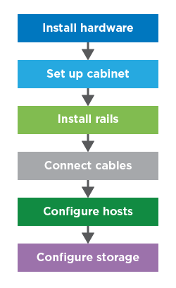

= Die Inbetriebnahme ist möglich mit E-Series
:allow-uri-read: 
:icons: font
:imagesdir: ../media/

[role="lead"]
Um mit E-Series Systemen betriebsbereit zu machen, installieren Sie Hardwarekomponenten, konfigurieren Host-Systeme und konfigurieren Storage.

Die Bereitstellung des Speicher-Arrays umfasst den folgenden Workflow:

== Schritt: Hardware installieren

So installieren Sie die E-Series Hardware: Rufen Sie die Installations- und Setup-Anleitung für Ihr Storage-Array und den Shelf-Typ auf:

* link:../install-hw-ef600/index.html["EF600 oder EF300 Serie mit Shelf mit 24 Laufwerken"^]
* https://library.netapp.com/ecm/ecm_download_file/ECMLP2842063["E2800/EF280 oder E5700/EF570 Serie mit Shelfs für 12 oder 24 Laufwerke"^]
* https://library.netapp.com/ecm/ecm_download_file/ECMLP2842061["E2800 oder E5700 Series mit Shelf für 60 Laufwerke"^]

== Schritt 2: Schrank einrichten

Wenn Sie einen neuen Schrank für das Speicher-Array einrichten, müssen Sie den Schrank an seinen permanenten Speicherort verschieben, die Hardware installieren und an eine Stromquelle anschließen. Um den Schrank einzurichten, gehen Sie wie folgt vor:

* link:../install-hw-cabinet/index.html["Installation eines 3040-HE-Cabinets"^]

== Schritt 3: Schienen einbauen

Im Lieferumfang jedes Shelfs enthalten ist Rack-montagebare Hardware. Detaillierte Anweisungen zur Installation der Schienen finden Sie unter:

* https://mysupport.netapp.com/ecm/ecm_download_file/ECMP1652045["Die verstellbaren Stützschienen einbauen"^]
* https://mysupport.netapp.com/ecm/ecm_download_file/ECMLP2484194["Installieren Sie das 2-HE-Gehäuse in ein 4-Säulen-Rack"^]
* https://mysupport.netapp.com/ecm/ecm_download_file/ECMM1280302["Installieren Sie das DE224C Shelf in einem zweiposten Rack"^]
* http://docs.netapp.com/platstor/topic/com.netapp.doc.hw-rail-superrail/home.html["Installation von SuperRail in einem 4-Säulen-Rack (DE224C/DE460C Shelfs)"^]

== Schritt 4: Kabel anschließen

Die Installations- und Setup-Anleitung (Schritt 1) enthält Anweisungen zum Anschließen von Kabeln. Wenn Sie jedoch Listen mit unterstützten Kabeln und Transceivern, Best Practices für die Verkabelung und detaillierte Informationen zu den Host-Ports für Ihren Controller benötigen, greifen Sie auf folgende Anweisungen zu:

* link:../install-hw-cabling/index.html["Verkabelung der E-Series Hardware"]

== Schritt 5: Hosts konfigurieren

Um Speicher für einen Host verfügbar zu machen, wählen Sie ein Handbuch für den Betriebssystemtyp des Hosts aus:

* link:../config-linux/index.html["Linux Express-Konfiguration"]
* link:../config-vmware/index.html["VMware Express-Konfiguration"]
* link:../config-windows/index.html["Windows Express-Konfiguration"]

== Schritt 6: Storage konfigurieren

Um Storage zu konfigurieren, können Sie auf die webbasierte Schnittstelle System Manager zugreifen, indem Sie einen Browser auf die IP-Adresse des Controllers zeigen. Ein Setup-Assistent hilft Ihnen beim Einstieg in die Systemkonfiguration. Alternativ können Sie auch die Befehlszeilenschnittstelle (CLI) verwenden.

Wählen Sie die gewünschte Benutzeroberfläche aus:

* https://docs.netapp.com/us-en/e-series-santricity/system-manager/index.html["Die SANtricity System Manager Hilfe für das 11,7-Fache"]
* https://docs.netapp.com/us-en/e-series-santricity-116/index.html["Hilfe zu SANtricity System Manager für 11,6 x"]

