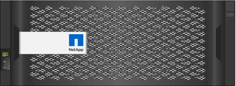

= E-Series Hardware im Überblick
:allow-uri-read: 
:icons: font
:imagesdir: ../media/

[role="lead"]
E-Series Storage-Arrays sind in verschiedenen Konfigurationen und Modellen erhältlich.

Ein Storage Array umfasst Shelfs, Controller, Laufwerke, Software und Firmware. Das Array kann in einem Rack oder Schrank mit anpassbarer Hardware für einen oder zwei Controller in einem Shelf mit 12, 24 oder 60 Laufwerken installiert werden. Sie können das Storage-Array von mehreren Schnittstellentypen bis hin zu verschiedenen Host-Betriebssystemen mit einem SAN verbinden.

E-Series Arrays sind in den folgenden Modellen verfügbar:

* E2800 Serie – Hybrid der Einstiegsklasse
* EF280 Serie – All-Flash der Einstiegsklasse
* EF300 Serie – All-Flash der Einstiegsklasse, All NVMe
* E5700 Series – Midrange Hybrid
* EF570 Serie – Midrange All Flash
* EF600 Serie: Midrange-All-Flash- und All-NVMe-Storage

== E2800 – Modelle

|===
| Komponente | Spezifikationen 

 a| 
Rack-Größen:
 a| 
* 2 HE/12 (2 Rack-Einheiten; 12 Laufwerke)
* 2 HE/24 (2 Rack-Einheiten; 24 Laufwerke)
+
image::../media/e2800_2u_front.gif[e2800 2 he vorne]

* 4 HE/60 (4 Rack-Einheiten; 60 Laufwerke)
+

 a| 
Laufwerke:
 a| 
Unterstützt die folgenden Laufwerkstypen:

* 3.5-Zoll-NL-SAS (bis zu 180)
* 2.5-Zoll-SAS-SSD (bis zu 120)
* 2.5-Zoll-SAS-HDD (bis zu 180)

 a| 
Schnittstellen:
 a| 
Verfügbar mit folgenden Schnittstellen:

* 12 GB SAS
* 10 GB oder 25 GB iSCSI
* 16 GB oder 32 GB Fibre Channel

|===

== EF280 Modelle

|===
| Komponente | Spezifikationen 

 a| 
Rack-Größen:
 a| 
2 HE/24 (2 Rack-Einheiten; 24 Laufwerke)image:../media/ef570_front.gif[""]

 a| 
Laufwerke:
 a| 
Unterstützt bis zu 96 SSD-2.5-Zoll-Laufwerke

 a| 
Schnittstellen:
 a| 
Verfügbar mit folgenden Schnittstellen:

* 12 GB SAS
* 10 GB oder 25 GB iSCSI
* 16 GB oder 32 GB Fibre Channel

|===

== EF300-Modelle

|===
| Komponente | Spezifikationen 

 a| 
Rack-Größen:
 a| 
2 HE/24 (2 Rack-Einheiten; 24 Laufwerke)image:../media/ef570_front.gif[""]

 a| 
Laufwerke und HICs:
 a| 
Unterstützt bis zu 24 NVMe-SSDs über eine einzige Host-Schnittstellenkarte pro Controller.

 a| 
Schnittstellen:
 a| 
Verfügbar mit folgenden Schnittstellen:

* 25 GB iSCSI
* 32 GB NVMe/Fibre Channel
* 32 GB SCSI/Fibre Channel
* 100-GB-iSER/IB
* 100 GB SRP/IB
* 100 GB NVMe/IB
* 100 GB NVMe/RoCE

|===

== E5700 Modelle

|===
| Komponente | Spezifikationen 

 a| 
Rack-Größen:
 a| 
* 2 HE/24 (2 Rack-Einheiten; 24 Laufwerke)
+
image::../media/e2800_2u_front.gif[e2800 2 he vorne]

* 4 HE/60 (4 Rack-Einheiten; 60 Laufwerke)
+

 a| 
Laufwerke:
 a| 
Unterstützt bis zu 480 der folgenden Laufwerkstypen:

* 3.5-Zoll-NL-SAS-Laufwerke
* 2.5-Zoll-SAS-SSD-Laufwerke
* 2.5-Zoll-SAS-HDD-Laufwerke

 a| 
Schnittstellen:
 a| 
Verfügbar mit folgenden Schnittstellen:

* 12 GB SAS
* 10 GB oder 25 GB iSCSI
* 16 GB oder 32 GB Fibre Channel
* 32 GB NVMe/Fibre Channel
* 100-GB-iSER/IB
* 100 GB SRP/IB
* 100 GB NVMe/IB
* 100 GB NVMe/RoCE

|===

== EF570 Modelle

|===
| Komponente | Spezifikationen 

 a| 
Rack-Größen:
 a| 
2 HE/24 (2 Rack-Einheiten; 24 Laufwerke)image:../media/ef570_front.gif[""]

 a| 
Laufwerke:
 a| 
Unterstützt bis zu 120 SSD-2.5-Zoll-Laufwerke

 a| 
Schnittstellen:
 a| 
Verfügbar mit folgenden Schnittstellen:

* 12 GB SAS
* 10 GB oder 25 GB iSCSI
* 16 GB oder 32 GB Fibre Channel
* 32 GB NVMe/Fibre Channel
* 100-GB-iSER/IB
* 100 GB SRP/IB
* 100 GB NVMe/IB
* 100 GB NVMe/RoCE

|===

== EF600 Modelle

|===
| Komponente | Spezifikationen 

 a| 
Rack-Größen:
 a| 
2 HE/24 (2 Rack-Einheiten; 24 Laufwerke)image:../media/ef570_front.gif[""]

 a| 
Laufwerke und HICs:
 a| 
Unterstützung von bis zu 24 NVMe-SSDs mit zwei Host-Schnittstellenkarten (HICs) pro Controller

 a| 
Schnittstellen:
 a| 
Verfügbar mit folgenden Schnittstellen:

* 25 GB iSCSI
* 32 GB NVMe/Fibre Channel
* 32 GB SCSI/Fibre Channel
* 100-GB-iSER/IB
* 100 GB SRP/IB
* 100 GB NVMe/IB
* 100 GB NVMe/RoCE
* 200-GB-iSER/IB
* 200 GB NVMe/IB
* 200 GB NVMe/RoCE

|===