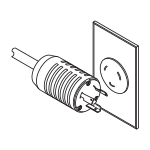

= Erforderliche Werkzeuge und Geräte für 3040 40-HE-Schränke (E-Series) zusammentragen
:allow-uri-read: 
:icons: font
:imagesdir: ../media/

[role="lead"]
Vor der Installation des 3040-HE-Cabinets müssen die erforderlichen Tools und Geräte vorhanden sein.

.Schritt
. Sammeln Sie alle in der folgenden Tabelle aufgeführten Elemente.
+
|===
|  | Element | Im Lieferumfang des Schrankes enthalten 

 a| 
image:../media/83009_02.gif["3/4-Zoll-Schraubenschlüssel und Inbusschlüssel"]
 a| 
*3/4 Zoll Schraubenschlüssel* (im Lieferumfang enthalten) -- zum Heben und Senken der Nivellierfüße unter dem Schrank.

*1/4 Zoll Innensechskantschlüssel* -- zum Anheben und Absenken des Stabilitätsfußes in der Vorderseite des Schrankes.
 a| 

 a| 
* NEMA L6-30*

 a| 
*AC-Netzkabel* -- zum Anschließen des Gehäuses an externe Stromquellen (Wandstecker).

** Die NEMA L6-30 Steckverbinder sind für den Einsatz in den USA und Kanada.
** Die IEC-60309-Steckverbinder sind für den weltweiten Einsatz mit Ausnahme der USA und Kanada geeignet.

NOTE: Jede PDU muss mit einer unabhängigen Stromquelle verbunden sein.
 a| 

 a| 
**IEC-60309**

image:../media/73122_01_dwg_iec_60309_power_cord.gif["IEC-60309-Kabel"]

 a| 
image:../media/78038_21.png["Im Lieferumfang des Schrankes enthalten"]
 a| 
**SAS-Kabel** (optional) – in jedem Laufwerksfach sind zwei Kabel enthalten, während die Kabel auf der Hostseite separat erworben werden müssen.

**Kommunikationskabel** (optional) – zur Befestigung des Fachs am Host.

Weitere erforderliche Informationen finden Sie im Installationshandbuch für das entsprechende Controller-Laufwerk-Fach.
 a| 

 a| 
image:../media/77038_06.gif["SAS- und Kommunikationskabel"]
 a| 
**Montierbare Kabelspulen** – an beiden Seiten der vertikalen Stromverteilausgänge installiert, um eine Überlänge der Kabel und eine Kabelführung zu ermöglichen. In jedem Controller-Laufwerksfach sind zwei Kabelspulen enthalten Kabelspulen werden auch mit eigenständigen Laufwerksfächern geliefert.
 a| 

 a| 
 a| 
**Scheren** – um die Metallbänder auf der Versandkiste zu schneiden.
 a| 

 a| 
 a| 
**Gabelstapler** (optional) – zum Entfernen des Schranks von der Versandpalette.
 a| 

 a| 
 a| 
**Frontblechsätze** (optional) – zur Abdeckung der leeren Schächte an der Vorderseite des Schrankes.
 a| 

 a| 
 a| 
**Antistatikbeutel** (optional) – zum Schutz von Komponenten, die während des Installationsvorgangs für den Schrank entfernt werden.
 a| 

|===

