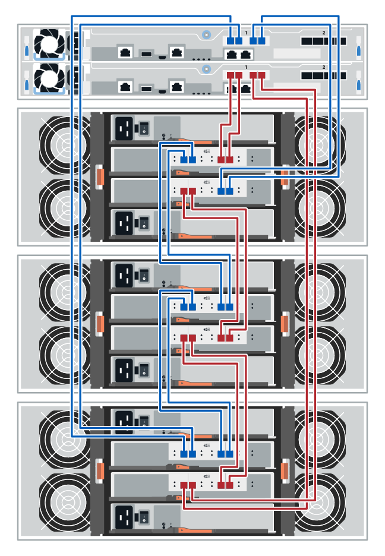

= Controller-Shelf zu Festplatten-Shelf verkabeln (E-Series)
:allow-uri-read: 
:icons: font
:imagesdir: ../media/

[role="lead"]
Sie müssen jeden Controller im Controller-Shelf mit einem I/O-Modul (IOM) in einem Festplatten-Shelf verbinden.

Dieses Verfahren gilt für Laufwerksregale IOM12, IOM12B und IOM12C.

NOTE: IOM12C-Module werden nur ab SANtricity OS 11.70.2 unterstützt. Stellen Sie sicher, dass die Firmware Ihres Controllers aktualisiert wurde, bevor Sie auf ein IOM12C installieren oder aktualisieren.

NOTE: Dieses Verfahren gilt für EAM-Hot-Swaps oder Ersatz wie für Regal-ähnliche. Dies bedeutet, dass Sie nur ein IOM12-Modul durch ein anderes IOM12-Modul oder ein IOM12C-Modul durch ein anderes IOM12C-Modul ersetzen können. (Ihr Regal kann zwei IOM12-Module oder zwei IOM12C-Module enthalten.)

Wenn Sie ein älteres Controller-Shelf mit einem DE212C, DE224C oder DE460 verkabeln, finden Sie unter https://mysupport.netapp.com/ecm/ecm_download_file/ECMLP2859057["Hinzufügen von IOM-Laufwerk-Shelfs zu einem vorhandenen E27XX-, E56XX- oder EF560-Controller-Shelf"^].

== Verkabelung bei E2800 und E5700

Die folgenden Informationen gelten für die Verkabelung von E2800, E2800B, EF280, E5700, EF5700B, Oder EF570 Controller Shelf zu einem DE212C, DE224C oder DE460 Festplatten-Shelf.

[role="tabbed-block"]
====
.Shelf mit 12 Laufwerken oder 24 Laufwerken
--
Sie können Ihr Controller-Shelf mit einem oder mehreren Shelfs mit 12 Laufwerken oder 24 Laufwerken verkabeln.

Das folgende Bild zeigt eine Darstellung des Controller-Shelf und der Festplatten-Shelfs. Informationen zum Auffinden der Ports auf Ihrem Modell finden Sie unter https://hwu.netapp.com/Controller/Index?platformTypeId=2357027["Hardware Universe"^].

image::../media/12_24_cabling.png[Controller-Shelf und Shelfs mit 12 Laufwerken oder 24 Laufwerken]

--
.Shelf mit 60 Laufwerken
--
Sie können Ihr Controller-Shelf mit einem oder mehreren Shelfs mit 60 Laufwerken verkabeln.

Das folgende Bild zeigt eine Darstellung des Controller-Shelf und der Festplatten-Shelfs. Informationen zum Auffinden der Ports auf Ihrem Modell finden Sie unter https://hwu.netapp.com/Controller/Index?platformTypeId=2357027["Hardware Universe"^].

image::../media/60_cabling.png[Controller-Shelf und Shelfs mit 60 Laufwerken]

--
====

== Verkabelung EF300 und EF600

Die folgenden Informationen gelten für die Verkabelung eines EF300-, EF600-, EF300C- oder EF600C-Controller-Shelfs mit einem DE212C-, DE224C- oder DE460-Festplatten-Shelf.

.Bevor Sie beginnen
Stellen Sie vor der Verkabelung einer EF300 oder EF600 sicher, dass die Firmware auf die neueste Version aktualisiert wird. Befolgen Sie zum Aktualisieren der Firmware die Anweisungen unter link:../upgrade-santricity/index.html["Aktualisieren des SANtricity Betriebssystems"^].

[role="tabbed-block"]
====
.Shelf mit 12 Laufwerken oder 24 Laufwerken
--
Sie können Ihr Controller-Shelf mit einem oder mehreren Shelfs mit 12 Laufwerken oder 24 Laufwerken verkabeln.

Das folgende Bild zeigt eine Darstellung des Controller-Shelf und der Festplatten-Shelfs. Informationen zum Auffinden der Ports auf Ihrem Modell finden Sie unter https://hwu.netapp.com/Controller/Index?platformTypeId=2357027["Hardware Universe"^].

image::../media/ef_to_de224c_four_shelves.png[Controller-Shelf und Shelfs mit 12 Laufwerken oder 24 Laufwerken]

--
.Shelf mit 60 Laufwerken
--
Sie können Ihr Controller-Shelf mit einem oder mehreren Shelfs mit 60 Laufwerken verkabeln.

Das folgende Bild zeigt eine Darstellung des Controller-Shelf und der Festplatten-Shelfs. Informationen zum Auffinden der Ports auf Ihrem Modell finden Sie unter https://hwu.netapp.com/Controller/Index?platformTypeId=2357027["Hardware Universe"^].

--
====

== Verkabelung E4000

Die folgenden Informationen gelten für die Verkabelung eines E4000 Controller Shelf mit einem DE212C-, DE224C- oder DE460-Festplatten-Shelf.

[role="tabbed-block"]
====
.Shelf mit 12 Laufwerken
--
Sie können Ihr Controller-Shelf mit einem oder mehreren Shelfs mit 12 Laufwerken verkabeln.

image::../media/e4012_cabling.png[Einem Controller Shelf und einem Shelf mit 12 Laufwerken]

--
.Shelf mit 60 Laufwerken
--
Sie können Ihr Controller-Shelf mit einem oder mehreren Shelfs mit 60 Laufwerken verkabeln.

image::../media/e4060_cabling.png[Controller-Shelf und Shelfs mit 60 Laufwerken]

--
====