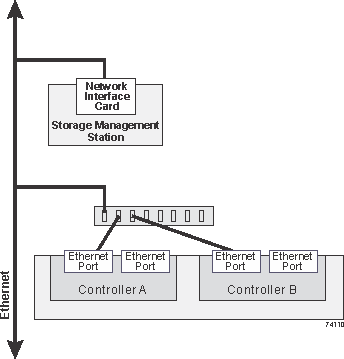

= Ethernet-Verkabelung für eine Management Station (E-Series)
:allow-uri-read: 
:icons: font
:imagesdir: ../media/

[role="lead"]
Sie können Ihr Storage-System mit einem Ethernet-Netzwerk verbinden, um das Out-of-Band-Storage-Array-Management zu ermöglichen. Sie müssen für alle Managementverbindungen für Storage-Arrays Ethernet-Kabel verwenden.

NOTE: Die EF300, EF600 und E4000 verfügen nur über einen Out-of-Band-ethernet-Management-Port.

== Direkte Topologie

Eine direkte Topologie verbindet den Controller direkt mit einem Ethernet-Netzwerk.

Sie müssen für Out-of-Band-Management den Management-Port 1 an jedem Controller anschließen und Port 2 vom technischen Support zum Storage Array zugänglich machen.

.Direkte Storage-Management-Verbindungen
image::../media/74167.gif[Direkte Storage-Management-Verbindungen]

== Fabric-Topologie

Eine Fabric-Topologie verbindet den Controller mithilfe eines Switches mit einem Ethernet-Netzwerk.

Sie müssen für Out-of-Band-Management den Management-Port 1 an jedem Controller anschließen und Port 2 vom technischen Support zum Storage Array zugänglich machen.

.Fabric Storage-Managementverbindungen

