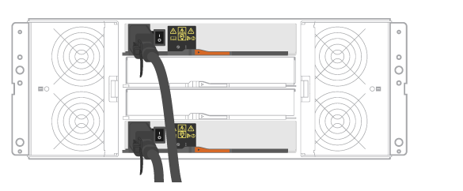

= Die Shelfs verkabeln
:allow-uri-read: 
:icons: font
:imagesdir: ../media/

[role="lead"]
Erfahren Sie, wie Sie die Stromkabel anschließen und die Laufwerk-Shelfs einschalten.

.Bevor Sie beginnen
* Installieren Sie Ihre Hardware.
* Treffen Sie antistatische Vorsichtsmaßnahmen.

Dieses Verfahren gilt für die IOM12- und IOM12B-Laufwerkseinschübe.

NOTE: IOM12B-Module werden nur ab SANtricity OS 11.70.2 unterstützt. Stellen Sie sicher, dass die Firmware Ihres Controllers aktualisiert wurde, bevor Sie auf ein IOM12B installieren oder aktualisieren.

NOTE: Dieses Verfahren gilt für EAM-Hot-Swaps oder Ersatz wie für Regal-ähnliche. So können Sie nur ein IOM12-Modul durch ein anderes IOM12-Modul ersetzen oder ein IOM12B-Modul durch ein anderes IOM12B-Modul ersetzen. (Ihr Shelf kann zwei IOM12-Module haben oder zwei IOM12B-Module haben.)

.Schritte
. Die Shelfs verkabeln.
+
Verkabeln Sie das System entsprechend Ihrer Konfiguration. Wenn Sie mehr Verkabelungsoptionen benötigen als die in diesem Abschnitt gezeigten Beispiele, lesen Sie link:../install-hw-cabling/index.html["Verkabelung"].

+
Für die in diesem Abschnitt gezeigten Beispiele benötigen Sie die folgenden Kabel:

+
|===

 a| 
image:../media/sas_cable.png[""]
 a| 
*SAS-Kabel*

|===
+
.Beispiel A: Ein E2860 Controller-Shelf mit zwei DE460C Festplatten-Shelfs in einer Standard-SAS-Konfiguration.
image:../media/example_a_2860.png[""]

+
.. Verkabeln Sie Controller A mit IOM A des ersten Festplatten-Shelf.
.. Verkabeln Sie IOM A des ersten Festplatten-Shelf mit IOM A des zweiten Festplatten-Shelf.
.. Verkabeln Sie IOM B des ersten Festplatten-Shelf mit IOM B des zweiten Festplatten-Shelf.
.. Verkabeln Sie Controller B mit IOM B des zweiten Festplatten-Shelf.

+
.Beispiel B: Ein E2860 Controller-Shelf mit einem DE460C Festplatten-Shelf in einer Standard-SAS-Konfiguration.

+
.. Verkabeln Sie Controller A mit IOM A
.. Verkabeln Sie Controller B mit IOM B.

. Schalten Sie die Festplatten-Shelfs ein.
+
Sie benötigen die folgenden Kabel:

+
|===

 a| 
image:../media/power_cable_inst-hw-e2800-e5700.png[""]
 a| 
*Stromkabel*

|===
+

CAUTION: Stellen Sie sicher, dass die Netzschalter des Laufwerks-Shelfs aus sind.

+
.. Verbinden Sie die beiden Stromkabel für jedes Shelf mit verschiedenen Stromverteilungs-Einheiten (PDUs) im Schrank oder Rack.
.. Wenn Sie Laufwerk-Shelfs haben, schalten Sie zuerst ihre beiden Netzschalter ein. Warten Sie zwei Minuten, bevor Sie das Controller-Shelf einschalten.
.. Schalten Sie die beiden Netzschalter am Controller-Shelf ein.
.. Überprüfen Sie die LEDs und die Anzeige mit sieben Segmenten auf jedem Controller.
+
Während des Startvorgangs zeigt die Anzeige in sieben Segmenten die sich wiederholende Sequenz von OS, SD, leer an, um anzuzeigen, dass der Controller die Tagesbeginn-Verarbeitung durchführt. Nachdem der Controller gestartet wurde, wird die Shelf-ID angezeigt.

+
|===

 a| 
*Beispiel: Stromanschlüsse befinden sich auf der Rückseite des Regals.*image:../media/trafford_power.png[""]

|===

