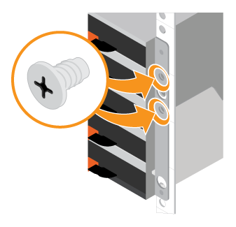

= Installieren Sie die Hardware E2860, E5760 und DE460
:allow-uri-read: 
:icons: font
:imagesdir: ../media/

[role="lead"]
So installieren Sie ein E2860, E5760 oder DE460 Storage-System in einem Rack mit zwei Säulen oder einem NetApp System-Rack.

.Bevor Sie beginnen
* Registrieren Sie Ihre Hardware unter http://mysupport.netapp.com/["NetApp Support"^].
* Bereiten Sie einen flachen, statischen Arbeitsbereich vor.
* Holen Sie sich ein ESD-Armband, und ergreifen Sie antistatische Vorsichtsmaßnahmen.

Lesen Sie alle Anweisungen durch, bevor Sie mit den folgenden Schritten fortfahren.

.Schritte
. Packen Sie den Hardwareinhalt aus, und führen Sie anschließend die enthaltene Hardware gegen den Packzettel aus.
. Installieren Sie die Schienen.
+
Wenn Sie Anweisungen zur Rackmontage enthalten haben, lesen Sie diese, um zu erfahren, wie Sie die Schienen installieren. Weitere Anweisungen zur Rack-Montage finden Sie unter link:../rackmount-hardware.html["Rack-montierte Hardware"].

+

NOTE: Bei quadratischen Lochschränken müssen Sie zuerst die mitgelieferten Käfigmuttern einbauen, um die Vorder- und Rückseite des Regals mit Schrauben zu befestigen.

+
|===
|  

 a| 
image:../media/install_rails_inst-hw-e2800-e5700.png["Installieren Sie die Schienen"]

|===
. Das Shelf einbauen.
+

CAUTION: Ein leeres Regal wiegt etwa 60 kg (132 lb). Zum sicheren Bewegen eines leeren Regals sind ein mechanisierter Lift oder vier Personen mit Hebegriffen erforderlich.

+
.. Wenn Sie das Regal mit der Hand anheben, setzen Sie die vier Hebe-Griffe an. Drücken Sie auf jeden Griff nach oben, bis er einrastet.
.. Das Regal von unten halten und in den Schrank schieben. Wenn die Hebegriffe verwendet werden, nehmen Sie sie einzeln ab, während das Regal in den Schrank rutscht. Um die Griffe zu entfernen, ziehen Sie den Entriegelungshebel nach unten und ziehen Sie dann aus dem Shelf heraus.
+
image:../media/4_person_lift_source.png["Es wurden vier Personen benötigt, um das Regal in den Schrank zu heben"]

. Befestigen Sie das Regal.
+
.. Bringen Sie die Schrauben an beiden Seiten in die ersten und dritten Löcher von der Oberseite des Regals ein, um sie an der Vorderseite des Gehäuses zu befestigen.
.. Legen Sie zwei hintere Halterungen an jeder Seite des oberen hinteren Bereichs des Regals an. Bringen Sie die Schrauben in die ersten und dritten Löcher jeder Halterung ein, um die Rückseite des Gehäuses zu befestigen.
+

. Installieren Sie die Laufwerke.
+
.. Wickeln Sie das Gurt-Ende des ESD-Armbands um Ihr Handgelenk, und befestigen Sie das Clip-Ende auf einer Metallmasse, um statische Entladungen zu vermeiden.
.. Setzen Sie das Laufwerk am linken vorderen Schlitz der oberen Schublade ein, indem Sie es vorsichtig in den Laufwerkschacht positionieren und den angehobenen Antriebsgriff absenken, bis er einrastet.
+
*** Falls Sie weniger als 60 Laufwerke installieren, wenn Sie Solid State-Laufwerke (SSDs) haben oder Ihre Laufwerke unterschiedliche Kapazitäten haben:
+
**** Legen Sie mindestens 20 Laufwerke pro Shelf fest. Installieren Sie zuerst Laufwerke an den vorderen vier Steckplätzen in jedem Einschub, um für eine ausreichende Kühlung zu sorgen.
**** Verteilen Sie alle verbleibenden Laufwerke auf die Schubladen. Installieren Sie, falls möglich, in jedem Fach eine gleiche Anzahl von jedem Laufwerkstyp, um die Erstellung von geschützten Laufwerksgruppen oder Festplattenpools zu ermöglichen.
**** Verteilen Sie alle SSDs gleichmäßig über die Schubladen.

.. Schieben Sie die Schublade vorsichtig nach hinten, indem Sie die Mitte drücken und beide Verriegelungen vorsichtig schließen.
+
*** Setzen Sie die Schublade nicht fest.
*** Verwenden Sie das Steckerwerkzeug, trennen Sie den Anschluss des Schlangenkabels, und schließen Sie es wieder an. Achten Sie darauf, dass ein Klicken zu hören ist, um festzustellen, ob die erneute Verbindung ordnungsgemäß hergestellt wurde.
*** Die Verbindung und erneute Verbindung sollten nur während der Ersteinrichtung oder bei der Auslieferung des Fachs an einen anderen Ort erfolgen.

.. Befestigen Sie die Frontverkleidung.

|===

 a| 
image:../media/trafford_overview.png["Blende einbauen"]

 a| 

CAUTION: Gefahr von Geräteschäden -- Stoppen Sie die Schublade, wenn Sie sich binden fühlen. Schieben Sie die Schublade mit den Freigabehebel an der Vorderseite der Schublade nach außen. Setzen Sie dann die Schublade vorsichtig wieder in den Schlitz ein.

|===