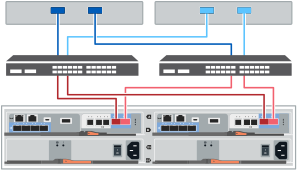

= Vollständige Einrichtung des Storage-Systems (E4012)
:allow-uri-read: 
:icons: font
:imagesdir: ../media/

[role="lead"]
Erfahren Sie, wie Sie die Controller mit Ihrem Netzwerk verbinden und die Einrichtung und Konfiguration des Storage-Systems abschließen.

== Schritt: Verkabeln Sie die Daten-Hosts

Verkabeln Sie das System entsprechend Ihrer Netzwerktopologie.

[role="tabbed-block"]
====
.Option 1: Direct-Attached-Topologie
--
Das folgende Beispiel zeigt die Verkabelung zu den Daten-Hosts mithilfe einer Direct-Attached-Topologie.

image:../media/drw_e4012_direct_topology_ieops-2047.svg["E4012 direkte Topologie, Breite=1000px"]

. Wenn Sie keine Erweiterungs-Shelves installiert haben, verbinden Sie jeden Host-Adapter direkt mit den Host-Ports e0a und e0b auf den Controllern.

--
.Option 2: Fabric-Topologie
--
Das folgende Beispiel zeigt die Verkabelung zu den Daten-Hosts mithilfe einer Fabric-Topologie.

. Verbinden Sie jeden Host-Adapter direkt mit dem Switch.
. Verbinden Sie jeden Switch direkt mit den Host-Ports e0a und e0b auf den Controllern.

--
====

== Schritt 2: Verbinden und Konfigurieren der Verwaltungsverbindung

Sie können die Controller-Management-Ports mit einem DHCP-Server oder einer statischen IP-Adresse konfigurieren.

[role="tabbed-block"]
====
.Option 1: DHCP-Server
--
Erfahren Sie, wie die Management-Ports mit einem DHCP-Server konfiguriert werden.

.Bevor Sie beginnen
* Konfigurieren Sie Ihren DHCP-Server so, dass für jeden Controller eine IP-Adresse, eine Subnetzmaske und eine Gateway-Adresse als permanentes Leasing zugeordnet werden.
* Holen Sie die zugewiesenen IP-Adressen zum Herstellen einer Verbindung zum Speichersystem vom Netzwerkadministrator ab.

.Schritte
. Schließen Sie ein Ethernet-Kabel an den Management-Port jedes Controllers an, und verbinden Sie das andere Ende mit Ihrem Netzwerk.
+
Die folgenden Abbildungen zeigen Beispiele für den Standort des Management-Ports des Controllers:

+
image:../media/e4000_management_port.png["E4000-Controller-Management-Port"]

. Öffnen Sie einen Browser, und stellen Sie eine Verbindung zum Storage-System mit einer der Controller-IP-Adressen her, die Sie vom Netzwerkadministrator bereitgestellt haben.

--
.Option 2: Statische IP-Adresse
--
Erfahren Sie, wie die Management-Ports manuell konfiguriert werden können, indem Sie die IP-Adresse und die Subnetzmaske eingeben.

.Bevor Sie beginnen
* Holen Sie die IP-Adresse, Subnetzmaske, Gateway-Adresse und DNS- und NTP-Serverinformationen des Controllers von Ihrem Netzwerkadministrator ab.
* Stellen Sie sicher, dass der verwendete Laptop keine Netzwerkkonfiguration von einem DHCP-Server empfängt.

.Schritte
. Verbinden Sie den Management-Port von Controller A mit einem Ethernet-Kabel mit dem Ethernet-Port eines Laptops.
+
Die folgenden Abbildungen zeigen Beispiele für den Standort des Management-Ports des Controllers:

+
image:../media/e4000_management_port.png["E4000-Controller-Management-Port"]

. Öffnen Sie einen Browser, und verwenden Sie die Standard-IP-Adresse (169.254.128.101), um eine Verbindung zum Controller herzustellen. Der Controller sendet ein selbstsigniertes Zertifikat zurück. Der Browser informiert Sie darüber, dass die Verbindung nicht sicher ist.
. Befolgen Sie die Anweisungen des Browsers, um SANtricity System Manager zu starten. Wenn Sie keine Verbindung herstellen können, überprüfen Sie, ob Sie keine Netzwerkkonfiguration von einem DHCP-Server erhalten.
. Legen Sie das Kennwort des Speichersystems fest, um sich anzumelden.
. Verwenden Sie die vom Netzwerkadministrator bereitgestellten Netzwerkeinstellungen im Assistenten * Netzwerkeinstellungen konfigurieren*, um die Netzwerkeinstellungen von Controller A zu konfigurieren, und wählen Sie dann *Fertig stellen* aus.
+

NOTE: Da Sie die IP-Adresse zurücksetzen, verliert System Manager die Verbindung zum Controller.

. Trennen Sie das ethernet-Kabel vom Speichersystem, und verbinden Sie den Management-Port von Controller A mit dem Netzwerk.
. Öffnen Sie einen Browser auf einem mit Ihrem Netzwerk verbundenen Computer, und geben Sie die neu konfigurierte IP-Adresse von Controller A ein.
+

NOTE: Wenn die Verbindung zu Controller A unterbrochen wird, können Sie ein ethernet-Kabel mit Controller B verbinden, um die Verbindung mit Controller A über Controller B (169.254.128.102) wiederherzustellen.

. Melden Sie sich mit dem zuvor festgelegten Passwort an. Der Assistent Netzwerkeinstellungen konfigurieren wird angezeigt.
. Verwenden Sie die vom Netzwerkadministrator bereitgestellten Netzwerkeinstellungen im Assistenten * Netzwerkeinstellungen konfigurieren*, um die Netzwerkeinstellungen von Controller B zu konfigurieren, und wählen Sie dann *Fertig stellen* aus.
. Verbinden Sie Controller B mit dem Netzwerk.
. Überprüfen Sie die Netzwerkeinstellungen von Controller B, indem Sie die neu konfigurierte IP-Adresse von Controller B in einem Browser eingeben.
+

NOTE: Wenn die Verbindung zu Controller B unterbrochen wird, können Sie Ihre zuvor validierte Verbindung zu Controller A verwenden, um die Verbindung mit Controller B über Controller A wiederherzustellen

--
====

== Schritt 3: Konfigurieren und verwalten Sie Ihr Storage-System

Verwenden Sie nach der Installation der Hardware die SANtricity Software zum Konfigurieren und Managen Ihres Storage-Systems.

.Bevor Sie beginnen
* Konfigurieren Sie Ihre Management-Ports.
* Überprüfen und notieren Sie Ihr Kennwort und Ihre IP-Adressen.

.Schritte
. Verwenden Sie die SANtricity Software zum Konfigurieren und Managen Ihrer Storage-Arrays.
. Bei der einfachsten Netzwerkkonfiguration verbinden Sie den Controller mit einem Webbrowser und verwenden SANtricity System Manager zum Verwalten eines einzelnen Speicherarrays der E4000-Serie. Verwenden Sie für den Zugriff auf System Manager dieselben IP-Adressen, die Sie zum Konfigurieren der Management-Ports verwendet haben.

