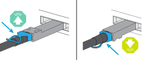
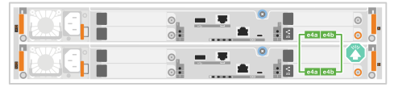
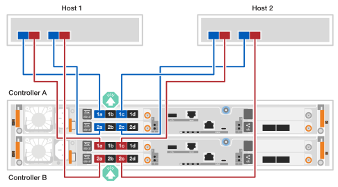
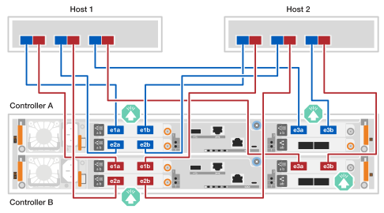
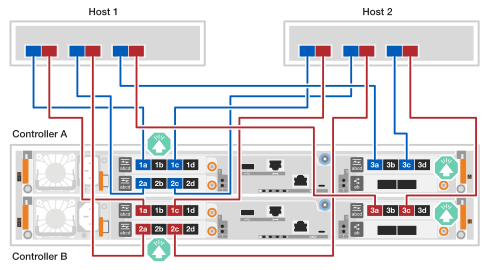
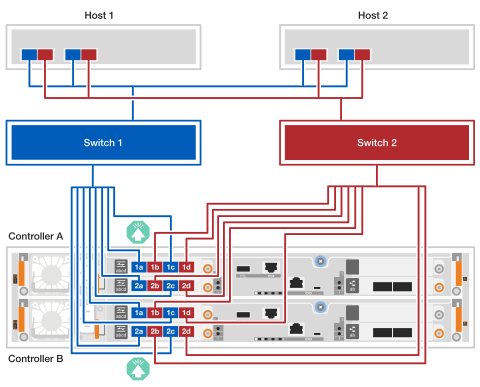
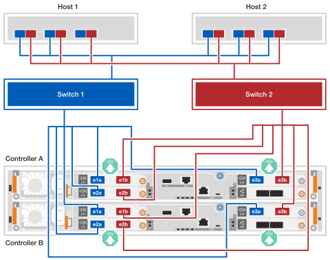
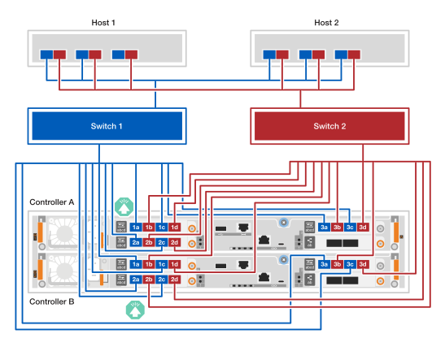
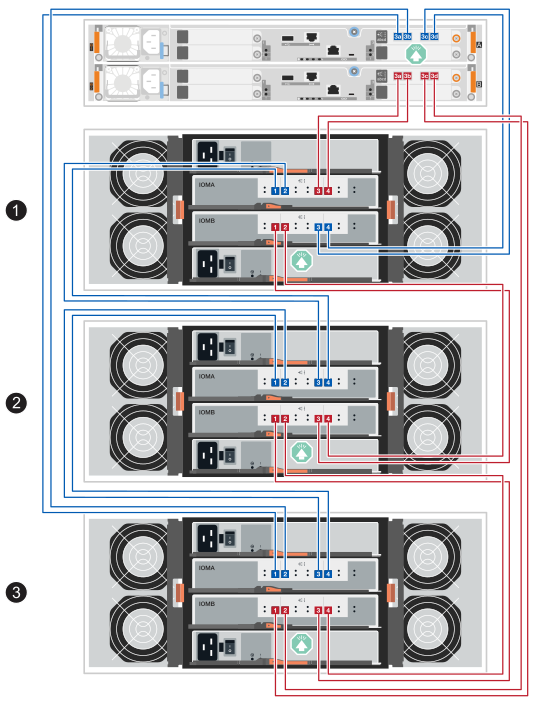

= Verkabelung der Hardware für EF50 und EF80 Storage-Systeme
:allow-uri-read: 
:icons: font
:imagesdir: ../media/

[role="lead"]
Nach der Installation Ihrer EF50 oder EF80 Speichersystemhardware erfolgt gegebenenfalls die Verkabelung der Inter-Controller-Spiegelung, der Host-Netzwerkverbindungen und der SAS-Einschübe. (Die Verkabelung der Management-Ports erfolgt später im Abschnitt „Vollständige Einrichtung des Speichersystems“.)

.Über diese Aufgabe
* Der Begriff _I/O-Modul_ wird in diesem Verfahren verwendet, um sich auf die Host-Schnittstellenkarten (HICs) zu beziehen.
* Die Kabelgrafiken enthalten Pfeilsymbole, die die richtige Ausrichtung (oben oder unten) der Zuglasche des Kabelsteckers beim Einstecken eines Steckers in einen Anschluss anzeigen.
+
Beim Einstecken des Steckers sollten Sie ein Klicken spüren; wenn Sie kein Klicken spüren, entfernen Sie ihn, drehen Sie ihn um und versuchen Sie es erneut.

+

[[step-1-cable-the-inter-controller-mirroring-connections]]
== Schritt 1: Verkabeln Sie die Spiegelungsverbindungen zwischen den Controllern

Verbinden Sie die Controller per Kabel, um die Inter-Controller-Spiegelung zu ermöglichen. Inter-Controller-Spiegelungsverbindungen gewährleisten vollständige Systemredundanz und werden für Cache-Spiegelung und I/O-Übertragung verwendet. Die Verkabelung ist für EF50 und EF80 Speichersysteme identisch.

NOTE: Unabhängig von der Geschwindigkeit der in Ihrem Speichersystem installierten Inter-Controller-Mirroring-I/O-Module (100 GbE oder 200 GbE, wie von Ihrem Speichersystem unterstützt), verwenden Sie die mitgelieferten 200-GbE-Kabel. Wenn die Geschwindigkeit der Inter-Controller-Mirroring-I/O-Module 100 GbE beträgt, arbeitet die Verbindung mit der niedrigeren Geschwindigkeit (100 GbE).

.Schritte
. Verbinden Sie die Controller miteinander:
+
.. Kabel Controller A Port e4a zu Controller B Port e4a.
.. Kabel Controller A Port e4b zu Controller B Port e4b.
+
*200 GbE Ethernet-Kabel*

+

+

[[step-2-cable-the-host-connections]]
== Schritt 2: Verkabeln Sie die Host-Verbindungen

Verkabeln Sie die Host-Anschlüsse Ihres Speichersystems entsprechend Ihrer Netzwerktopologie: direkt angeschlossen oder fabric-angebunden.

.Über diese Aufgabe
* Je nach Modell Ihres Storage-Systems und der SANtricity Version, die darauf ausgeführt wird, werden unterschiedliche Typen von Host-I/O-Modulen unterstützt. Die Verkabelungsbeispiele in diesem Verfahren zeigen Ethernet- und Fibre Channel- (FC) Host-I/O-Module.
+
Eine Übersicht aller unterstützten Host-E/A-Module und Steckplatzprioritäten für Ihr Speichersystemmodell finden Sie unter link:https://hwu.netapp.com["NetApp Hardware Universe"^].

* In den Verkabelungsbeispielen sind keine 4-Port 64Gb FC HBAs in Host 1 und Host 2 dargestellt; wenn Sie diese jedoch installiert haben, verkabeln Sie jeden anderen Port auf die gleiche Weise wie bei den 2-Port HBAs.

[role="tabbed-block"]
====
.Direkt-angebundene Topologie
--
Die folgenden Beispiele zeigen die Verkabelung eines Speichersystems mit den Hosts unter Verwendung einer Direct-Attached-Topologie.

.EF50 mit zwei 4-Port 64Gb FC I/O-Modulen
[%collapsible]
=====
.Über diese Aufgabe
* Das Verkabelungsbeispiel zeigt Host-I/O-Module in den Steckplätzen 1 und 2. Dies ist die maximale Anzahl an Host-I/O-Modulen, die vom EF50 storage system unterstützt wird. Allerdings ist nur das Host-I/O-Modul in Steckplatz 1 erforderlich; das Host-I/O-Modul in Steckplatz 2 ist optional.
+
Wenn in Ihrem Speichersystem ein Host-E/A-Modul installiert ist, können Sie die Verkabelung zum zusätzlichen Host-E/A-Modul ignorieren und nur das installierte Host-E/A-Modul verkabeln.

* Ein direkt angeschlossenes Speichersystem verfügt über zwei separate Pfade für Redundanz: Pfad A und Pfad B.
+
** Die Verbindung von Pfad A wird durch blaue Kabel und blaue Anschlüsse an den Hosts und Controllern dargestellt. Sie verbindet die HBA-Ports jedes Hosts mit den Ports a und c von Controller A.
** Die Verbindung von Pfad B wird durch rote Kabel und rote Anschlüsse an den Hosts und Controllern dargestellt. Sie verbindet die HBA-Ports jedes Hosts mit den Ports a und c von Controller B.

* Obwohl im Verkabelungsbeispiel die I/O-Modul-Anschlüsse a und c mit den Hosts verbunden sind, können Sie auch die Anschlüsse a und b oder die Anschlüsse c und d verwenden.

.Schritte
. Verbinden Sie die Hosts per Kabel mit den Controllern:
+
.. Kabel-Host 1 Pfad A (blau) HBA-Ports zu Controller A's a-Ports (1a und 2a).
.. Kabel Host 1 Pfad B (rot) HBA-Ports zu den a-Ports (1a und 2a) von Controller B.
.. Kabel-Host 2 Pfad A (blau) HBA-Ports zu den c-Ports von Controller A (1c und 2c).
.. Host 2 Pfad B (rot) HBA-Ports an die c-Ports (1c und 2c) von Controller B verkabeln.
+
*64-Gbit/s-FC-Kabel*

+

+

=====
.EF80 mit drei 2-Port 200 GbE I/O-Modulen
[%collapsible]
=====
.Über diese Aufgabe
* Das Verkabelungsbeispiel zeigt Host-I/O-Module in den Steckplätzen 1, 2 und 3. Dies ist die maximale Anzahl von Host-I/O-Modulen, die für das EF80 storage system unterstützt wird. Allerdings ist nur das Host-I/O-Modul in Steckplatz 1 erforderlich; Host-I/O-Module in Steckplatz 2 und Steckplatz 3 sind beide optional.
+
Wenn in Ihrem Speichersystem weniger Host-E/A-Module installiert sind, können Sie die Verkabelung zu den zusätzlichen Host-E/A-Modulen ignorieren und nur die installierten Host-E/A-Module verkabeln.

* Ein direkt angeschlossenes Speichersystem verfügt über zwei separate Pfade für Redundanz: Pfad A und Pfad B.
+
** Die Verbindung von Pfad A wird durch blaue Kabel und blaue Anschlüsse an den Hosts und Controllern dargestellt. Sie verbindet die HBA-Ports jedes Hosts mit den Ports a und b von Controller A.
** Die Verbindung von Pfad B wird durch rote Kabel und rote Anschlüsse an den Hosts und Controllern dargestellt. Sie verbindet die HBA-Ports jedes Hosts mit den Ports a und b des Controllers B.

.Schritte
. Verbinden Sie die Hosts per Kabel mit den Controllern:
+
.. Kabel-Host 1 Pfad A (blau) HBA-Ports zu Controller A's a-Ports (e1a, e2a und e3a).
.. Kabel Host 1 Pfad B (rot) HBA-Ports zu Controller B's a-Ports (e1a, e2a und e3a).
.. Host 2 Pfad A (blau) HBA-Ports an die b-Ports von Controller A (e1b, e2b und e3b) verkabeln.
.. Kabel-Host 2 Pfad B (rot) HBA-Ports an die b-Ports (e1b, e2b und e3b) von Controller B anschließen.
+
*200 GbE-Kabel*

+

+

=====
.EF80 mit drei 4-Port 64Gb FC I/O-Modulen
[%collapsible]
=====
.Über diese Aufgabe
* Das Verkabelungsbeispiel zeigt Host-I/O-Module in den Steckplätzen 1, 2 und 3. Dies ist die maximale Anzahl von Host-I/O-Modulen, die für das EF80 storage system unterstützt wird. Allerdings ist nur das Host-I/O-Modul in Steckplatz 1 erforderlich; Host-I/O-Module in Steckplatz 2 und Steckplatz 3 sind beide optional.
+
Wenn in Ihrem Speichersystem weniger Host-E/A-Module installiert sind, können Sie die Verkabelung zu den zusätzlichen Host-E/A-Modulen ignorieren und nur die installierten Host-E/A-Module verkabeln.

* Ein direkt angeschlossenes Speichersystem verfügt über zwei separate Pfade für Redundanz: Pfad A und Pfad B.
+
** Die Verbindung von Pfad A wird durch blaue Kabel und blaue Anschlüsse an den Hosts und Controllern dargestellt. Sie verbindet die HBA-Ports jedes Hosts mit den Ports a und c von Controller A.
** Die Verbindung von Pfad B wird durch rote Kabel und rote Anschlüsse an den Hosts und Controllern dargestellt. Sie verbindet die HBA-Ports jedes Hosts mit den Ports a und c von Controller B.

* Obwohl im Verkabelungsbeispiel die I/O-Modul-Anschlüsse a und c mit den Hosts verbunden sind, können Sie auch die Anschlüsse a und b oder die Anschlüsse c und d verwenden.

.Schritte
. Verbinden Sie die Hosts per Kabel mit den Controllern:
+
.. Kabel-Host 1 Pfad A (blau) HBA-Ports zu Controller A's a-Ports (1a, 2a und 3a).
.. Kabel Host 1 Pfad B (rot) HBA-Ports zu den a-Ports von Controller B (1a, 2a und 3a).
.. Kabel-Host 2 Pfad A (blau) HBA-Ports zu den c-Ports von Controller A (1c, 2c und 3c).
.. Host 2 Pfad B (rot) HBA-Ports an die c-Ports (1c, 2c und 3c) von Controller B verkabeln.
+
*64-Gbit/s-FC-Kabel*

+

+

=====
--
.Fabric-attached-Topologie
--
Die folgenden Beispiele zeigen die Verkabelung eines Speichersystems mit den Hosts unter Verwendung einer fabric-attached Topologie.

.EF50 mit zwei 4-Port 64Gb FC I/O-Modulen
[%collapsible]
=====
.Über diese Aufgabe
* Das Verkabelungsbeispiel zeigt Host-I/O-Module in den Steckplätzen 1 und 2. Dies ist die maximale Anzahl an Host-I/O-Modulen, die vom EF50 storage system unterstützt wird. Allerdings ist nur das Host-I/O-Modul in Steckplatz 1 erforderlich; das Host-I/O-Modul in Steckplatz 2 ist optional.
+
Wenn in Ihrem Speichersystem ein Host-E/A-Modul installiert ist, können Sie die Verkabelung zum zusätzlichen Host-E/A-Modul ignorieren und nur das installierte Host-E/A-Modul verkabeln.

* Ein gewebegebundenes Speichersystem verfügt über zwei separate Switch-Pfade zur Redundanz: Switch 1 Pfad und Switch 2 Pfad.
+
** Die Pfadverbindung von Switch 1 wird durch blaue Kabel und blaue Ports an den Hosts und Controllern dargestellt. Sie verbindet die HBA-Ports jedes Hosts über Switch 1 mit den a- und c-Ports von Controller A und Controller B.
** Die Pfadverbindung von Switch 2 ist durch rote Kabel und rote Ports an den Hosts und Controllern dargestellt. Sie verbindet die HBA-Ports jedes Hosts über Switch 2 mit den b- und d-Ports von Controller A und Controller B.

.Schritte
. Verbinden Sie die Hosts mit den Switches.
+
Sie können beliebige Ports an den Switches verwenden.

+
.. Verkabeln Sie die Host 1 und Host 2 Switch 1 Pfad (blau) HBA-Ports zu Switch 1.
.. Verkabeln Sie die Host 1 und Host 2 Switch 2 Pfad (rot) HBA-Ports zu Switch 2.

. Verbinden Sie die Switches mit den Controllern:
+
.. Kabelschalter 1 (blau) an die a- und c-Anschlüsse (1a, 2a, 1c und 2c) von Controller A anschließen.
.. Kabelschalter 1 (blau) an die a- und c-Anschlüsse (1a, 2a, 1c und 2c) von Controller B anschließen.
.. Kabelschalter 2 (rot) an die b- und d-Anschlüsse (1b, 2b, 1d und 2d) von Controller A anschließen.
.. Kabelschalter 2 (rot) an die b- und d-Anschlüsse (1b, 2b, 1d und 2d) von Controller B anschließen.
+
*64-Gbit/s-FC-Kabel*

+

+

=====
.EF80 mit drei 2-Port 200 GbE I/O-Modulen
[%collapsible]
=====
.Über diese Aufgabe
* Das Verkabelungsbeispiel zeigt Host-I/O-Module in den Steckplätzen 1, 2 und 3. Dies ist die maximale Anzahl von Host-I/O-Modulen, die für das EF80 storage system unterstützt wird. Allerdings ist nur das Host-I/O-Modul in Steckplatz 1 erforderlich; Host-I/O-Module in Steckplatz 2 und Steckplatz 3 sind beide optional.
+
Wenn in Ihrem Speichersystem weniger Host-E/A-Module installiert sind, können Sie die Verkabelung zu den zusätzlichen Host-E/A-Modulen ignorieren und nur die installierten Host-E/A-Module verkabeln.

* Das Verkabelungsbeispiel zeigt drei HBAs auf jedem Host. Wenn Ihre Hosts weniger als drei HBAs haben, können Sie die Verkabelung zu den zusätzlichen HBAs ignorieren und nur zu den installierten HBAs verkabeln.
* Ein gewebegebundenes Speichersystem verfügt über zwei separate Switch-Pfade zur Redundanz: Switch 1 Pfad und Switch 2 Pfad.
+
** Die Pfadverbindung von Switch 1 wird durch blaue Kabel und blaue Ports an den Hosts und Controllern dargestellt. Sie verbindet die HBA-Ports jedes Hosts über Switch 1 mit den a-Ports von Controller A und Controller B.
** Die Pfadverbindung von Switch 2 ist durch rote Kabel und rote Ports an den Hosts und Controllern dargestellt. Sie verbindet die HBA-Ports jedes Hosts über Switch 2 mit den b-Ports von Controller A und Controller B.

.Schritte
. Verbinden Sie die Hosts mit den Switches:
+
Sie können beliebige Ports an den Switches verwenden.

+
.. Verkabeln Sie die Host 1 und Host 2 Switch 1 Pfad (blau) HBA-Ports zu Switch 1.
.. Verkabeln Sie die Host 1 und Host 2 Switch 2 Pfad (rot) HBA-Ports zu Switch 2.

. Verbinden Sie die Switches mit den Controllern:
+
.. Kabelschalter 1 (blau) an die a-Ports (e1a, e2a und e3a) von Controller A anschließen.
.. Kabelschalter 1 (blau) an die a-Ports (e1a, e2a und e3a) von Controller B anschließen.
.. Kabelschalter 2 (rot) an die b-Ports (e1b, e2b und e3b) von Controller A anschließen.
.. Kabelschalter 2 (rot) an die b-Ports (e1b, e2b und e3b) von Controller B anschließen.
+
*200 GbE-Kabel*

+

+

=====
.EF80 mit drei 4-Port 64Gb FC I/O-Modulen
[%collapsible]
=====
.Über diese Aufgabe
* Das Verkabelungsbeispiel zeigt Host-I/O-Module in den Steckplätzen 1, 2 und 3. Dies ist die maximale Anzahl von Host-I/O-Modulen, die für das EF80 storage system unterstützt wird. Allerdings ist nur das Host-I/O-Modul in Steckplatz 1 erforderlich; Host-I/O-Module in Steckplatz 2 und Steckplatz 3 sind beide optional.
+
Wenn in Ihrem Speichersystem weniger Host-E/A-Module installiert sind, können Sie die Verkabelung zu den zusätzlichen Host-E/A-Modulen ignorieren und nur die installierten Host-E/A-Module verkabeln.

* Das Verkabelungsbeispiel zeigt drei HBAs auf jedem Host. Wenn Ihre Hosts weniger als drei HBAs haben, können Sie die Verkabelung zu den zusätzlichen HBAs ignorieren und nur zu den installierten HBAs verkabeln.
* Ein gewebegebundenes Speichersystem verfügt über zwei separate Switch-Pfade zur Redundanz: Switch 1 Pfad und Switch 2 Pfad.
+
** Die Pfadverbindung von Switch 1 wird durch blaue Kabel und blaue Ports an den Hosts und Controllern dargestellt. Sie verbindet die HBA-Ports jedes Hosts über Switch 1 mit den a- und c-Ports von Controller A und Controller B.
** Die Pfadverbindung von Switch 2 ist durch rote Kabel und rote Ports an den Hosts und Controllern dargestellt. Sie verbindet die HBA-Ports jedes Hosts über Switch 2 mit den b- und d-Ports von Controller A und Controller B.

.Schritte
. Verbinden Sie die Hosts mit den Switches:
+
Sie können beliebige Ports an den Switches verwenden.

+
.. Verkabeln Sie die Host 1 und Host 2 Switch 1 Pfad (blau) HBA-Ports zu Switch 1.
.. Verkabeln Sie die Host 1 und Host 2 Switch 2 Pfad (rot) HBA-Ports zu Switch 2.

. Verbinden Sie die Switches mit den Controllern:
+
.. Kabelschalter 1 (blau) an die Anschlüsse a und c von Controller A (1a, 2a, 3a, 1c, 2c und 3c) anschließen.
.. Kabelschalter 1 (blau) an die a- und c-Anschlüsse (1a, 2a, 3a, 1c, 2c und 3c) von Controller B anschließen.
.. Kabelschalter 2 (rot) an die b- und d-Anschlüsse (1b, 2b, 3b, 1d, 2d und 3d) von Controller A anschließen.
.. Kabelschalter 2 (rot) an die b- und d-Anschlüsse (1b, 2b, 3b, 1d, 2d und 3d) von Controller B anschließen.
+
*64-Gbit/s-FC-Kabel*

+

+

=====
--
====

[[step-3-cable-the-sas-shelf-connections]]
== Schritt 3: Verkabelung der SAS-Shelf-Verbindungen

Die folgenden Verfahren zeigen, wie die Controller an ein DE460C Shelf oder an einen Stack aus drei DE460C Shelfs angeschlossen werden.

.Über diese Aufgabe
* Die Verkabelungsbeispiele zeigen DE460C Einschübe; die gleiche Verkabelung gilt jedoch für alle unterstützten SAS-Einschübe. Informationen zu unterstützten SAS-Einschüben finden Sie unter link:https://hwu.netapp.com["NetApp Hardware Universe"^].
* Informationen zur maximalen Anzahl der für Ihr Speichersystem unterstützten Shelfs und zu allen Verkabelungsoptionen, z. B. optischen, finden Sie unter link:https://hwu.netapp.com["NetApp Hardware Universe"^].
* Die Verkabelungsverfahren zeigen Controller mit einem SAS E/A-Modul in Steckplatz 3. Dies ist die einzige unterstützte SAS E/A-Modulkonfiguration für SANtricity 12.10.
* Die Verkabelungsabbildungen zeigen die Verkabelung von Controller A in Blau und die Verkabelung von Controller B in Rot.
* Die Verkabelung der Controller und eines oder mehrerer Shelfs erfolgt immer so, dass zwei Kabelverbindungen für den A-seitigen Pfad (IOMA) und den B-seitigen Pfad (IOMB) vorhanden sind, wie in den Verkabelungsabbildungen gezeigt.
* Sie verwenden die mit Ihrem Speichersystem gelieferten Speicherkabel, bei denen es sich um den folgenden Kabeltyp handeln kann:
+
*mini-SAS HD Kabel*

+

[role="tabbed-block"]
====
.Option 1: Ein DE460C Shelf
--
Jeder Controller wird mit jedem IOM12 Modul auf dem DE460C Einschub verbunden, sodass die Controller über einen A-seitigen Pfad (IOMA) und einen B-seitigen Pfad (IOMB) zum Einschub verfügen.

.Schritte
. Controller A Port 3a mit Shelf IOMA Port 1 verkabeln.
. Verbinden Sie Controller A Port 3b mit Shelf IOMA Port 2.
. Verbinden Sie Controller A, Port 3c, mit Shelf IOMB, Port 3.
. Verbinden Sie Controller A, Port 3d, mit Shelf IOMB, Port 4.
. Verbinden Sie Controller B Port 3a mit Shelf IOMA Port 3.
. Controller B Port 3b mit Shelf IOMA Port 4 verkabeln.
. Verbinden Sie Controller B Port 3c mit Shelf IOMB Port 1.
. Controller B, Port 3d, mit Shelf IOMB, Port 2, verkabeln.

Wenn Sie die Verkabelung des Shelfs abgeschlossen haben, sollte die Verkabelung wie folgt aussehen:

image:../media/drw_ef50-ef80_1_de460c_cabling_ieops-2981.svg["Controller-Ports mit einem DE460C Shelf verkabeln"]

--
.Option 2: Drei DE460C Shelves
--
Die drei Shelfs werden miteinander verbunden (Shelf-zu-Shelf-Verbindungen), und anschließend wird jeder Controller mit jedem Ende des Shelf-Stacks (Shelf 1 und Shelf 3) verbunden, sodass die Controller über einen A-seitigen Pfad (IOMA) und einen B-seitigen Pfad (IOMB) zum Shelf-Stack verfügen.

. Die Shelf to Shelf Verbindungen für den IOMA Pfad werden verkabelt:
+
.. Verbinden Sie Shelf 1 IOMA Port 1 mit Shelf 2 IOMA Port 4.
.. Verbinden Sie IOMA Port 2 von Shelf 1 mit IOMA Port 3 von Shelf 2.
.. Kabel für Shelf 2 IOMA Port 1 mit Shelf 3 IOMA Port 4 verbinden.
.. Shelf 2 IOMA Anschluss 2 mit Shelf 3 IOMA Anschluss 3 verkabeln.

. Die Shelf-zu-Shelf-Verbindungen für den IOMB-Pfad werden verkabelt:
+
.. Verbinden Sie Shelf 1 IOMB Port 1 mit Shelf 2 IOMB Port 3.
.. Verbinden Sie Shelf 1 IOMB-Port 2 mit Shelf 2 IOMB-Port 4.
.. Verbinden Sie Shelf 2 IOMB Port 1 mit Shelf 3 IOMB Port 3.
.. Verbinden Sie Shelf 2 IOMB Port 2 mit Shelf 3 IOMB Port 4.

. Verbinden Sie Controller A mit Shelf 3 (IOMA-Pfad) und 1 (IOMB-Pfad):
+
.. Kabelcontroller A Port 3a zu Shelf 3 IOMA Port 1
.. Verbinden Sie Controller A Port 3b mit Shelf 3 IOMA Port 2.
.. Controller A Port 3c mit Shelf 1 IOMB Port 3 verkabeln.
.. Controller A, Port 3d, mit Shelf 1, IOMB Port 4, verkabeln.

. Controller B mit Shelf 1 (IOMA-Pfad) und 3 (IOMB-Pfad) verkabeln:
+
.. Controller B Port 3a mit Shelf 1 IOMA Port 3 verkabeln.
.. Controller B Port 3b mit Shelf 1 IOMA Port 4 verkabeln.
.. Controller B Port 3c mit Shelf 3 IOMB Port 1 verkabeln.
.. Verbinden Sie Controller B Port 3d mit Shelf 3 IOMB Port 2.

Wenn Sie die Shelves verkabelt haben, sollte die Verkabelung wie folgt aussehen:

--
====
.Was kommt als Nächstes?
Nach der Verkabelung Ihres Speichersystems link:install-power-hardware.html["Schalten Sie Ihr Speichersystem ein"].
