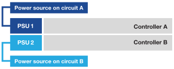

= Schalten Sie die Hardware ein – EF50 und EF80
:allow-uri-read: 
:icons: font
:imagesdir: ../media/

[role="lead"]
Nach der Verkabelung Ihres EF50 oder EF80 Speichersystems werden die Shelfs eingeschaltet, Shelf-IDs zugewiesen (falls zutreffend) und anschließend die Controller eingeschaltet.

.Bevor Sie beginnen
Treffen Sie antistatische Vorsichtsmaßnahmen.

[[step-1-power-on-the-shelves-and-assign-shelf-ids]]
== Schritt 1: Shelfs einschalten und Shelf-IDs zuweisen

Die Regale werden eingeschaltet, und anschließend wird jedem Regal eine eindeutige Regal-ID zugewiesen.

.Über diese Aufgabe
* Durch die Vergabe einer eindeutigen Shelf ID an jedes Shelf wird sichergestellt, dass das Shelf innerhalb Ihres Storage Systems klar unterscheidbar ist.
+
Eine gültige Shelf ID ist 01 bis 99.

+
Interne Shelfs (Storage), die in die Controller integriert sind, erhalten eine feste Shelf-ID von 00.

* Damit die Shelf-ID wirksam wird, muss ein Aus- und Einschalten des Shelfs erfolgen (dazu den Netzschalter an jedem Netzteil des SAS Shelfs ausschalten, mindestens 10 Sekunden warten und dann die Stromversorgung wieder einschalten).

.Schritte
. Die Einschaltung des Shelfs erfolgt, indem zuerst die Netzkabel mit dem Shelf verbunden, mit der Netzkabelhalterung gesichert, die Netzkabel an Stromquellen in verschiedenen Stromkreisen angeschlossen und anschließend der Netzschalter an jedem der Netzteile (an der Rückseite des Shelfs) eingeschaltet wird.
+
Das Shelf schaltet sich beim Einschalten automatisch ein und wird automatisch gebootet.

. Zum Zugriff auf die orangefarbene Shelf ID-Taste auf der Frontblende muss die linke Endkappe entfernt werden.
+
image::../media/drw_shelf_id_sas_ieops-2187.svg[Ändern der SAS-Shelf-ID]

+
[cols="20%,80%"]
|===

 a| 
image::../media/icon_round_1.png[Callout-Nummer 1]
 a| 
Regalendkappe

 a| 
image::../media/icon_round_2.png[[Legende Nummer 2]
 a| 
Shelf Frontplatte

 a| 
image::../media/icon_round_3.png[[Legende Nummer 3]
 a| 
Shelf ID Taste

 a| 
image::../media/icon_round_4.png[[Legende Nummer 4]
 a| 
Shelf ID Nummer

|===
. Die erste Ziffer der Regal-ID wird geändert:
+
.. Die Shelf ID Taste ist so lange gedrückt zu halten, bis die erste Zahl auf dem digitalen Display blinkt; anschließend ist die Taste loszulassen.
+
Es kann bis zu 15 Sekunden dauern, bis die Zahl blinkt. Dadurch wird der Programmiermodus für die Shelf ID aktiviert.

+

NOTE: Wenn die ID länger als 15 Sekunden blinkt, drücken und halten Sie die Shelf ID Taste erneut und achten Sie darauf, sie vollständig durchzudrücken.

.. Durch Drücken und Loslassen der Shelf ID Taste wird die Zahl erhöht, bis die gewünschte Zahl von 0 bis 9 erreicht ist.
+
Die Dauer jedes Tastendrucks und Loslassens kann nur eine Sekunde betragen.

+
Die erste Zahl blinkt weiterhin.

. Ändern Sie die zweite Ziffer der Shelf-ID:
+
.. Halten Sie die Taste gedrückt, bis die zweite Zahl auf der Digitalanzeige blinkt.
+
Es kann bis zu drei Sekunden dauern, bis die Zahl blinkt.

+
Die erste Zahl auf der Digitalanzeige blinkt nicht mehr.

.. Durch Drücken und Loslassen der Shelf ID Taste wird die Zahl erhöht, bis die gewünschte Zahl von 0 bis 9 erreicht ist.
+
Die zweite Zahl blinkt weiterhin.

. Die gewünschte Nummer wird gespeichert, und der Programmiermodus wird verlassen, indem die Shelf ID-Taste gedrückt gehalten wird, bis die zweite Ziffer aufhört zu blinken.
+
Es kann bis zu drei Sekunden dauern, bis die Zahl aufhört zu blinken.

+
Beide Zahlen auf dem Digitaldisplay beginnen zu blinken, und die gelb LED leuchtet nach etwa fünf Sekunden auf. Dies weist darauf hin, dass die ausstehende Shelf-ID noch nicht wirksam geworden ist.

. Durch Aus- und Wiedereinschalten des Shelfs für mindestens 10 Sekunden wird die Shelf-ID wirksam.
+
.. Der Netzschalter an jedem der Netzteile muss ausgeschaltet werden.
.. 10 Sekunden warten.
.. Schalten Sie an jedem der Netzteile den Netzschalter ein, um den Aus- und Wiedereinschaltvorgang abzuschließen.
+
Wenn ein Netzteil eingeschaltet wird, sollte die zweifarbige LED grün leuchten.

. Die linke Endkappe wieder anbringen.

[[step-2-power-on-the-controllers]]
== Schritt 2: Einschalten der Controller

Nachdem Sie Ihre Regale eingeschaltet und ihnen eindeutige IDs zugewiesen haben, werden die Controller eingeschaltet.

. Schließen Sie ein Netzkabel an jedes Controller-Netzteil an und verbinden Sie sie dann mit Stromquellen an verschiedenen Stromkreisen.
+

NOTE: Wenn Sie Stromverteilungseinheiten (PDUs) von Drittanbietern verwenden, verwenden Sie keine Steckdosen direkt hinter den Controllern, da Sie sonst den Zugang zu den Controllern blockieren könnten.

+
*Stromkabel*

+

+

+
** Das System beginnt zu starten. Der erste Startvorgang kann bis zu acht Minuten dauern.
** Die LEDs am Systemgehäuse blinken und die Lüfter starten, was darauf hinweist, dass die Controller eingeschaltet werden.
+
Beim Startvorgang ist es normal, dass die Lüfter sehr laut sind.

** Das digitale Display an der Vorderseite des Systemgehäuses (hinter der Blende) leuchtet nicht.

. Sichern Sie die Netzkabel mit der Sicherungsvorrichtung an jedem Netzteil.

.Was kommt als Nächstes?
Nach dem Einschalten Ihres Speichersystems link:install-complete-setup.html["vollständige Einrichtung des Speichersystems"].
