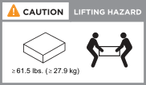

= Vorbereitung der Installation eines EF50 oder EF80 Speichersystems
:allow-uri-read: 
:icons: font
:imagesdir: ../media/

[role="lead"]
Bereiten Sie die Installation Ihres EF50 oder EF80 Storage-Systems vor, indem Sie den Standort vorbereiten, die Hebevorkehrungen für Ihr Storage-System beachten, die Kartons auspacken und den Inhalt mit dem Lieferschein vergleichen sowie das Storage-System registrieren, um Zugang zu Supportleistungen zu erhalten.

[[step-1-prepare-the-site]]
== Schritt 1: Bereiten Sie den Standort vor

Stellen Sie sicher, dass der Standort und der Schrank oder das Rack, das Sie verwenden möchten, den Spezifikationen für Ihr Storage-System entsprechen.

.Schritte
. Mithilfe dieser link:https://hwu.netapp.com["NetApp Hardware Universe"^] Funktion kann bestätigt werden, dass Ihr Standort die Umgebungs- und elektrischen Anforderungen für Ihr Speichersystem erfüllt.
. Stellen Sie sicher, dass Sie ausreichend Schrank- oder Rackplatz für Ihr Speichersystem und alle Switches haben.
+
Falls erforderlich, finden Sie in link:https://hwu.netapp.com["NetApp Hardware Universe"^] die genauen Abmessungen Ihres Speichersystems.

+
** 2U für ein Speichersystem
** 1U für die meisten Switches

. Installieren Sie alle erforderlichen Netzwerk-Switches.
. Stellen Sie sicher, dass Sie einen von der Managementsoftware unterstützten Browser verwenden:
+
** Google Chrome (Version 89 und höher)
** Microsoft Edge (Version 90 und höher)
** Mozilla Firefox (Version 80 und höher)
** Safari (Version 14 und höher)

. Besorgen Sie die folgende Ausrüstung und die Werkzeuge, die für die Installation benötigt werden:
+
** Elektrostatische Entladung (ESD) Armband
** Philips #2 Schraubendreher
** Taschenlampe

[[step-2-understand-the-lifting-precautions]]
== Schritt 2: Die Hebevorkehrungen verstehen

Bevor Sie die Kartons entpacken und später, wenn Sie Ihr Lagersystem installieren, sollten Sie das Gewicht Ihres Lagersystems kennen, damit Sie beim Anheben und Bewegen die notwendigen Vorsichtsmaßnahmen treffen können.

Ein EF50- oder EF80-Lagersystem kann bis zu 61,5 lbs (27,9 kg) wiegen. Zum Anheben des Lagersystems sollten zwei Personen oder ein hydraulischer Aufzug verwendet werden.

[[step-3-unpack-the-boxes]]
== Schritt 3: Entpacken Sie die Kartons

Nachdem Sie sich vergewissert haben, dass der Aufstellungsort und der Schrank oder das Regal, das Sie verwenden möchten, den Spezifikationen für Ihr Lagersystem entsprechen und Sie die Vorsichtsmaßnahmen beim Heben verstanden haben, entpacken Sie alle Kartons und vergleichen Sie den Inhalt mit den Angaben auf dem Lieferschein.

.Schritte
. Öffnen Sie alle Kartons vorsichtig und legen Sie den Inhalt in einer organisierten Weise aus.
. Vergleichen Sie den entpackten Inhalt mit dem Lieferschein.
+
Sie können Ihren Lieferschein abrufen, indem Sie den QR-Code an der Seite des Versandkartons scannen.

+

NOTE: Sollten Unstimmigkeiten auftreten, notieren Sie diese für weitere Maßnahmen.

+
Die folgenden Elemente sind einige der Inhalte, die Sie in den Boxen sehen könnten.

+
Falls erforderlich, finden Sie unter link:https://hwu.netapp.com["NetApp Hardware Universe"^] Informationen zu weiteren unterstützten Kabeln und deren Verwendungszweck.

+
[cols="9,9,5"]
|===

| *Hardware* | *Kabel* |  

 a| 
** Speichersystem mit Laufwerken
** Schalter
** Rack-mount Hardware mit Anleitung
** Blende

 a| 
** Ethernet-Kabel zur Spiegelung zwischen Controllern
** Management-Ethernet-Kabel (RJ-45-Kabel)
** Netzwerkkabel
** Stromkabel

|  
|===

[[step-4-register-your-storage-system]]
== Schritt 4: Registrieren Sie Ihr Speichersystem

Nachdem Sie sichergestellt haben, dass Ihr Standort die Spezifikationen für Ihr Speichersystem erfüllt und Sie überprüft haben, dass Sie alle Teile, die Sie bestellt haben, erhalten haben, sollten Sie Ihr Speichersystem registrieren.

NOTE: Sie können Ihr Speichersystem jetzt oder später registrieren. Später erfolgt beim Systemstart die Aufforderung zur Registrierung Ihres Systems.

. Die Seriennummer (SN) jedes Controllers ist zu notieren.
+
Sie finden die Seriennummer an folgenden Stellen:

+
** Auf jedem Controller
** Auf dem Lieferschein
** In Ihrer Bestätigungs-E-Mail
+

. Falls Sie noch kein Konto haben, erstellen Sie ein Konto bei  http://mysupport.netapp.com/["NetApp Support"^].
. Die Registrierung Ihres Systems erfolgt gemäß den Anweisungen im NetApp Knowledge Base-Artikel https://kb.netapp.com/nss/System_Registration/How_to_register_a_new_system_on_the_NetApp_Support_Site["So registrieren Sie ein neues System"^].

.Was kommt als Nächstes?
Nach den Vorbereitungen zur Installation Ihres Speichersystems link:install-hardware.html["Installieren Sie die Hardware"].
