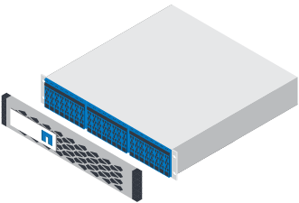

= Installation vorbereiten
:allow-uri-read: 
:icons: font
:imagesdir: ../media/

[role="lead"]
Erfahren Sie, wie Sie die Installation Ihres EF300- oder EF600-Storage-Systems vorbereiten.

Wenn Sie die Erweiterung EF300 für SAS verkabeln, lesen Sie die folgenden Informationen:

* link:../maintenance-ef600/sas-add-supertask-task.html["Fügen Sie SAS-Erweiterungskarten hinzu"^] Für die Installation von SAS-Erweiterungskarten.
* link:../install-hw-cabling/index.html["Verkabelungsübersicht"] Für SAS-Erweiterungskabel.

.Schritte
. Erstellen Sie ein Konto und registrieren Sie Ihre Hardware unter http://mysupport.netapp.com/["mysupport.netapp.com"^].
. Stellen Sie sicher, dass die folgenden Elemente in dem Feld enthalten sind, das Sie erhalten haben.
+
|===

 a| 

 a| 
Shelf mit installierten Laufwerken (Blende und Endkappen separat verpackt)

 a| 
image:../media/superrails_inst-hw-ef600.png[""]
 a| 
Rack-montierte Hardware

|===
+
In der folgenden Tabelle sind die Kabeltypen aufgeführt, die Sie möglicherweise erhalten können. Wenn Sie ein Kabel erhalten, das nicht in der Tabelle aufgeführt ist, lesen Sie https://hwu.netapp.com/["Hardware Universe"] Um das Kabel zu lokalisieren und dessen Verwendung zu identifizieren.

+
|===
| Steckverbindertyp | Kabeltyp | Nutzung 

 a| 
image:../media/cable_ethernet_inst-hw-ef600.png[""]
 a| 
RJ-45 Ethernet-Kabel (falls bestellt)
 a| 
Management-Verbindung

 a| 
image:../media/cable_io_inst-hw-ef600.png[""]
 a| 
E/A-Kabel (falls bestellt)
 a| 
Verkabelung der Daten-Hosts

 a| 
image:../media/cable_power_inst-hw-ef600.png[""]
 a| 
Stromkabel (falls bestellt)
 a| 
Einschalten des Storage-Systems

|===
. Stellen Sie sicher, dass Sie die folgenden Angaben machen.
+
|===

 a| 
image:../media/screwdriver_inst-hw-ef600.png[""]
 a| 
Kreuzschlitzschraubendreher #2

 a| 
image:../media/flashlight_inst-hw-ef600.png[""]
 a| 
Taschenlampe

 a| 

 a| 
ESD-Riemen

 a| 
image:../media/2u_rackspace_inst-hw-ef600.png[""]
 a| 
2-HE-Rack-Fläche: Eine Standardgröße von 19 Zoll 48.30 cm Rack für 2-HE-Shelfs mit folgenden Abmessungen:

*Tiefe*: 19.0 Zoll (48.3 cm)

*Breite*: 17.6 Zoll (44.7 cm)

*Höhe*: 3.34 Zoll (8.48 cm)

*Regal*: 24-Laufwerk

*Höchstgewicht*: 60.5 lb (27.4 kg)

NOTE: Wenn Sie Schränke von Drittanbietern verwenden, kann dies dazu führen, dass die Netzkabel den Zugriff auf den Controller einschränken.

 a| 
image:../media/management_station_inst-hw-ef600_g60b3.png[""]
 a| 
Ein unterstützter Browser für die Verwaltungssoftware:

** Google Chrome (Version 78 und höher)
** Microsoft Internet Explorer (Version 11 und höher)
** Microsoft Edge (88 und höher)
** Mozilla Firefox (Version 70 und höher)
** Safari (Version 12 und höher)

|===

