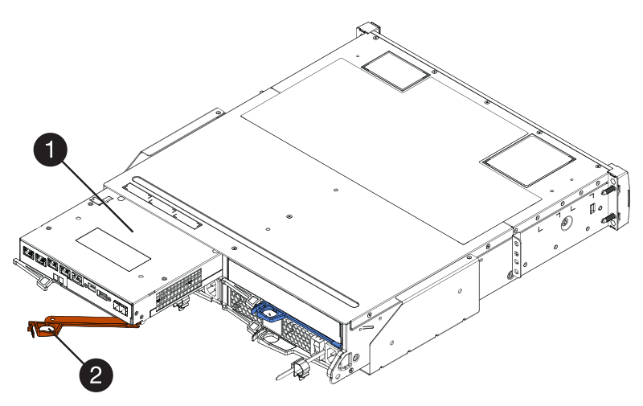

= Controller-Austausch bei der E2800 Simplexkonfiguration
:allow-uri-read: 
:experimental: 
:icons: font
:imagesdir: ../media/

[role="lead"]
Sie können einen fehlerhaften Controller-Behälter in einer Simplex-Konfiguration (Single-Controller) für die folgenden Controller-Shelves ersetzen:

* E2812 Controller-Shelf
* E2824 Controller-Shelf

.Über diese Aufgabe
Der Controller-Behälter enthält eine Controllerkarte, einen Akku und eine optionale Host-Schnittstellenkarte (HIC). Wenn Sie einen defekten Controller-Behälter ersetzen, müssen Sie die Batterie und HIC, falls vorhanden, aus dem ursprünglichen Controller-Behälter entfernen und in den Ersatzcontroller-Behälter installieren.

.Was Sie benötigen
* Ein Ersatzcontroller-Behälter mit der gleichen Teilenummer wie der Controller-Behälter, den Sie austauschen.
* Ein ESD-Armband, oder Sie haben andere antistatische Vorsichtsmaßnahmen getroffen.
* Etiketten, um jedes Kabel zu identifizieren, das mit dem Controller-Behälter verbunden ist.
* #1 Kreuzschlitzschraubendreher.
* Eine Management Station mit einem Browser, der für den Controller auf den SANtricity System Manager zugreifen kann. (Zeigen Sie zum Öffnen der System Manager-Schnittstelle den Domain-Namen oder die IP-Adresse des Controllers im Browser.)

== Schritt 1: Vorbereitung auf den Austausch der Steuerung (Simplexkonfiguration)

Bereiten Sie sich darauf vor, einen Controller-Behälter zu ersetzen, indem Sie den Sicherheitsschlüssel des Laufwerks speichern, die Konfiguration sichern und Support-Daten sammeln. Dann können Sie die Host-I/O-Vorgänge beenden und das Controller-Shelf herunterfahren.

.Schritte
. Notieren Sie sich, falls möglich, welche Version der SANtricity OS Software derzeit auf dem Controller installiert ist. Öffnen Sie SANtricity System Manager und wählen Sie MENU:Support[Upgrade Center > Software und Firmware-Bestandsaufnahme anzeigen].
. Wenn die Laufwerksicherheit aktiviert ist, stellen Sie sicher, dass ein gespeicherter Schlüssel existiert und dass Sie den Passphrase kennen, der für die Installation erforderlich ist.
+

CAUTION: *Möglicher Verlust des Datenzugriffs* -- Wenn alle Laufwerke im Speicher-Array für die Sicherheit aktiviert sind, kann der neue Controller erst dann auf das Speicher-Array zugreifen, wenn Sie die gesicherten Laufwerke mit dem Enterprise Management-Fenster in SANtricity Storage Manager entsperren.

+
Zum Speichern des Schlüssels (je nach Status des Controllers ist möglicherweise nicht möglich):

+
.. Wählen Sie im SANtricity System Manager Menü:Einstellungen[System].
.. Wählen Sie unter * Drive Security Key Management* die Option *Back Up Key* aus.
.. Geben Sie in den Feldern *Passphrase definieren/Passphrase erneut eingeben* einen Passphrase für diese Sicherungskopie ein und bestätigen Sie diesen.
.. Klicken Sie Auf *Backup*.
.. Notieren Sie Ihre Schlüsseldaten an einem sicheren Ort und klicken Sie dann auf *Schließen*.

. Sichern Sie die Konfigurationsdatenbank des Storage-Arrays mit SANtricity System Manager.
+
Wenn beim Entfernen eines Controllers ein Problem auftritt, können Sie die gespeicherte Datei verwenden, um Ihre Konfiguration wiederherzustellen. Das System speichert den aktuellen Status der RAID-Konfigurationsdatenbank, die alle Daten für Volume-Gruppen und Festplatten-Pools auf dem Controller enthält.

+
** Über System Manager:
+
... Wählen Sie MENU:Support[Support Center > Diagnose].
... Wählen Sie *Konfigurationsdaten Erfassen*.
... Klicken Sie Auf *Collect*.
+
Die Datei wird im Ordner Downloads für Ihren Browser mit dem Namen *configurationData-<arrayName>-<dateTime>.7z* gespeichert.

** Alternativ können Sie die Konfigurationsdatenbank mit dem folgenden CLI-Befehl sichern:
+
`save storageArray dbmDatabase sourceLocation=onboard contentType=all file="filename";`

. Support-Daten für Ihr Storage Array mit SANtricity System Manager erfassen
+
Wenn beim Entfernen eines Controllers ein Problem auftritt, können Sie die gespeicherte Datei zum Beheben des Problems verwenden. Das System speichert Bestands-, Status- und Performancedaten Ihres Speicherarrays in einer einzelnen Datei.

+
.. Wählen Sie MENU:Support[Support Center > Diagnose].
.. Wählen Sie *Support-Daten Erfassen* Aus.
.. Klicken Sie Auf *Collect*.
+
Die Datei wird im Ordner Downloads für Ihren Browser mit dem Namen *Support-Data.7z* gespeichert.

. Vergewissern Sie sich, dass zwischen dem Storage-Array und allen verbundenen Hosts keine I/O-Vorgänge stattfinden. Sie können beispielsweise die folgenden Schritte durchführen:
+
** Beenden Sie alle Prozesse, die die LUNs umfassen, die den Hosts vom Storage zugeordnet sind.
** Stellen Sie sicher, dass keine Applikationen Daten auf LUNs schreiben, die vom Storage den Hosts zugeordnet sind.
** Heben Sie die Bereitstellung aller Dateisysteme auf, die mit den Volumes im Array verbunden sind, auf.
+

NOTE: Die genauen Schritte zur Stoerung von Host-I/O-Vorgängen hängen vom Host-Betriebssystem und der Konfiguration ab, die den Umfang dieser Anweisungen übersteigen. Wenn Sie nicht sicher sind, wie Sie I/O-Vorgänge für Hosts in Ihrer Umgebung anhalten, sollten Sie das Herunterfahren des Hosts in Betracht ziehen.

+

CAUTION: *Möglicher Datenverlust* -- Wenn Sie diesen Vorgang während der I/O-Vorgänge fortsetzen, können Sie Daten verlieren.

. Warten Sie, bis alle Daten im Cache-Speicher auf die Laufwerke geschrieben werden.
+
Die grüne LED „Cache aktiv“ auf der Rückseite des Controllers leuchtet, wenn Daten im Cache auf die Laufwerke geschrieben werden müssen. Sie müssen warten, bis diese LED ausgeschaltet ist.

. Wählen Sie auf der Startseite des SANtricity System Managers die Option *Vorgänge in Bearbeitung anzeigen*.
. Bestätigen Sie, dass alle Vorgänge abgeschlossen wurden, bevor Sie mit dem nächsten Schritt fortfahren.
. Schalten Sie beide Netzschalter am Controller Shelf aus.
. Warten Sie, bis alle LEDs am Controller-Shelf ausgeschaltet sind.
. Wählen Sie *recheck* aus dem Recovery Guru, und bestätigen Sie, dass das Feld *OK to remove* im Bereich Details *Ja* angezeigt wird, was darauf hinweist, dass es sicher ist, diese Komponente zu entfernen.
+
Daten auf dem Speicher-Array sind erst zugänglich, wenn Sie den Controller-Behälter ersetzen.

== Schritt 2: Fehlerhafte Steuerung entfernen (Simplexkonfiguration)

Ersetzen Sie den defekten Behälter durch einen neuen.

=== Schritt 2a: Controller-Kanister ausbauen (Simplexkonfiguration)

Entfernen Sie einen Controller-Behälter.

.Schritte
. Setzen Sie ein ESD-Armband an oder ergreifen Sie andere antistatische Vorsichtsmaßnahmen.
. Beschriften Sie jedes Kabel, das am Controller-Behälter befestigt ist.
. Trennen Sie alle Kabel vom Controller-Behälter.
+

CAUTION: Um eine verminderte Leistung zu vermeiden, dürfen die Kabel nicht verdreht, gefaltet, gequetscht oder treten.

. Wenn die HIC-Ports am Controller-Behälter SFP+-Transceiver verwenden, entfernen Sie die SFPs.
+
Da Sie die HIC aus dem fehlerhaften Controller-Behälter entfernen müssen, müssen Sie alle SFPs von den HIC-Ports entfernen. Sie können jedoch alle SFPs in den Baseboard Host Ports installieren lassen. Wenn Sie bereit sind, den neuen Controller zu verkabeln, können Sie einfach diese SFPs in den neuen Controller-Behälter verschieben. Dieser Ansatz ist besonders hilfreich, wenn Sie über mehrere SFP-Module verfügen.

. Vergewissern Sie sich, dass die LED Cache Active auf der Rückseite des Controllers ausgeschaltet ist.
+
Die grüne LED „Cache aktiv“ auf der Rückseite des Controllers leuchtet, wenn Daten im Cache auf die Laufwerke geschrieben werden müssen. Sie müssen warten, bis diese LED ausgeschaltet ist, bevor Sie den Controller-Behälter entfernen.

+

NOTE: Die Abbildung zeigt einen Beispiel-Controller-Behälter. Ihr Controller kann über eine andere Anzahl und einen anderen Typ von Host-Ports verfügen.

+
image::../media/28_dwg_2800_controller_attn_led_maint-e2800.gif[28 dwg 2800 Controller attn LED maint e2800]

+
*(1)* _Cache Active LED_

. Drücken Sie die Verriegelung am Nockengriff, bis sie loslässt, und öffnen Sie dann den Nockengriff nach rechts, um den Steuerkanister von der Mittelebene zu lösen.
+

+
*(1)* _Controller-Behälter_

+
*(2)* _Cam Griff_

. Schieben Sie den Controller-Behälter mit zwei Händen und dem Nockengriff aus dem Regal.
+

CAUTION: Verwenden Sie immer zwei Hände, um das Gewicht eines Reglerkanisters zu unterstützen.

+
Wenn Sie den Controller-Behälter entfernen, schwenkt eine Klappe an ihre Stelle, um den leeren Schacht zu blockieren und so den Luftstrom und die Kühlung zu erhalten.

. Drehen Sie den Controller-Behälter so um, dass die abnehmbare Abdeckung nach oben zeigt.
. Setzen Sie den Steuerungsbehälter auf eine flache, statisch freie Oberfläche.

=== Schritt 2b: Batterie entfernen (Simplexkonfiguration)

Nachdem Sie den Controller-Behälter aus dem Controller-Regal entfernt haben, entfernen Sie den Akku.

.Schritte
. Entfernen Sie die Abdeckung des Reglerkanisters, indem Sie die Taste nach unten drücken und die Abdeckung abnehmen.
. Vergewissern Sie sich, dass die grüne LED im Controller (zwischen Akku und DIMMs) aus ist.
+
Wenn diese grüne LED leuchtet, wird der Controller weiterhin mit Strom versorgt. Sie müssen warten, bis diese LED erlischt, bevor Sie Komponenten entfernen.

+
image::../media/28_dwg_e2800_internal_cache_active_led_maint-e2800.gif[28 DWG e2800 interner Cache, aktiver LED maint e2800]

+
*(1)* _Interner Cache Aktiv_

+
*(2)* _Akku_

. Suchen Sie den blauen Freigabehebel für die Batterie.
. Entriegeln Sie den Akku, indem Sie den Freigabehebel nach unten und vom Controller-Behälter wegdrücken.
+
image::../media/28_dwg_e2800_remove_battery_maint-e2800.gif[28 m e2800 Batterie-Nr. e2800 entfernen]

+
*(1)* _Entriegelung der Batterie_

+
*(2)* _Akku_

. Heben Sie den Akku an, und schieben Sie ihn aus dem Controller-Behälter.

=== Schritt 2c: Entfernen der Host-Schnittstellenkarte (Simplexkonfiguration)

Wenn der Controller-Behälter eine Host-Schnittstellenkarte (HIC) enthält, entfernen Sie die HIC aus dem ursprünglichen Controller-Behälter, damit Sie sie im neuen Controller-Behälter wiederverwenden können.

.Schritte
. Entfernen Sie mit einem #1 Kreuzschlitzschraubendreher die Schrauben, mit denen die HIC-Frontplatte am Controller-Behälter befestigt ist.
+
Es gibt vier Schrauben: Eine auf der Oberseite, eine auf der Seite und zwei auf der Vorderseite.

+
image::../media/28_dwg_e2800_hic_faceplace_screws_maint-e2800.gif[28-wg-e2800-Gewindestifte für die Frontpartie maint e2800]

. Entfernen Sie die HIC-Frontplatte.
. Lösen Sie mit den Fingern oder einem Kreuzschlitzschraubendreher die drei Rändelschrauben, mit denen die HIC an der Controllerkarte befestigt ist.
. Lösen Sie die HIC vorsichtig von der Controllerkarte, indem Sie die Karte nach oben heben und wieder zurückschieben.
+

CAUTION: Achten Sie darauf, dass die Komponenten auf der Unterseite der HIC oder auf der Oberseite der Controller-Karte nicht verkratzen oder stoßen.

+
image::../media/28_dwg_e2800_hic_thumbscrews_maint-e2800.gif[28 dwg e2800 HIC Rändelschrauben maint e2800]

+
*(1)* _Host Interface Card_

+
*(2)* _Gewindestifte_

. Platzieren Sie die HIC auf einer statischen Oberfläche.

== Schritt 3: Neuen Controller installieren (Simplexkonfiguration)

Installieren Sie einen neuen Controller-Behälter, um den defekten auszutauschen.

=== Schritt 3a: Batterie einbauen (Simplexkonfiguration)

Setzen Sie den Akku in den Behälter des Ersatzcontrollers ein. Sie können den Akku, den Sie aus dem ursprünglichen Controller-Behälter entfernt haben, installieren oder einen neuen Akku installieren, den Sie bestellt haben.

.Schritte
. Packen Sie den Ersatzbehälter aus, und stellen Sie ihn auf eine flache, statische Oberfläche, so dass die abnehmbare Abdeckung nach oben zeigt.
+
Bewahren Sie das Verpackungsmaterial auf, das beim Versand des defekten Reglerkanisters verwendet werden soll.

. Drücken Sie die Abdeckungstaste nach unten, und schieben Sie die Abdeckung ab.
. Richten Sie den Controller-Behälter so aus, dass der Steckplatz für die Batterie zu Ihnen zeigt.
. Setzen Sie den Akku in einem leichten Abwärtswinkel in den Controller-Behälter ein.
+
Sie müssen den Metallflansch an der Vorderseite der Batterie in den Schlitz an der Unterseite des Controller-Kanisters stecken und die Oberseite der Batterie unter den kleinen Ausrichtstift auf der linken Seite des Kanisters schieben.

. Schieben Sie die Akkuverriegelung nach oben, um die Batterie zu sichern.
+
Wenn die Verriegelung einrastet, Haken unten an der Verriegelung in einen Metallschlitz am Gehäuse.

+
image::../media/28_dwg_e2800_insert_battery_maint-e2800.gif[28-m-e2800-Batterieeinschub e2800]

+
*(1)* _Entriegelung der Batterie_

+
*(2)* _Akku_

. Drehen Sie den Controller-Behälter um, um zu bestätigen, dass der Akku ordnungsgemäß installiert ist.
+

CAUTION: *Möglicher Hardwareschaden* -- der Metallflansch an der Vorderseite der Batterie muss vollständig in den Schlitz am Controller-Behälter eingesetzt werden (wie in der ersten Abbildung dargestellt). Wenn der Akku nicht richtig eingesetzt ist (wie in der zweiten Abbildung dargestellt), kann der Metallflansch die Controllerplatine kontaktieren, was beim Einschalten der Stromversorgung zu einer Beschädigung des Controllers führt.

+
** *Korrekt* -- der Metallflansch der Batterie ist vollständig in den Steckplatz am Controller eingesetzt:
+
image:../media/28_dwg_e2800_battery_flange_ok_maint-e2800.gif[""]

** *Incorrect* -- der Metallflansch der Batterie ist nicht in den Steckplatz am Controller eingelegt:
+
image:../media/28_dwg_e2800_battery_flange_not_ok_maint-e2800.gif[""]

=== Schritt 3b: Host-Schnittstellenkarte installieren (Simplexkonfiguration)

Wenn Sie eine Host Interface Card (HIC) aus dem ursprünglichen Controller-Behälter entfernt haben, installieren Sie diese HIC im neuen Controller-Behälter.

.Schritte
. Entfernen Sie mit einem #1 Kreuzschlitzschraubendreher die vier Schrauben, mit denen die leere Frontplatte am Behälter des Ersatzcontrollers befestigt ist, und entfernen Sie die Frontplatte.
. Richten Sie die drei Rändelschrauben der HIC an den entsprechenden Löchern am Controller aus, und richten Sie den Anschluss an der Unterseite der HIC an dem HIC-Schnittstellenanschluss auf der Controllerkarte aus.
+
Achten Sie darauf, dass die Komponenten auf der Unterseite der HIC oder auf der Oberseite der Controller-Karte nicht verkratzen oder stoßen.

. Senken Sie die HIC vorsichtig ab, und setzen Sie den HIC-Anschluss ein, indem Sie vorsichtig auf die HIC drücken.
+

CAUTION: *Mögliche Geräteschäden* -- vorsichtig sein, den goldenen Ribbon-Anschluss für die Controller-LEDs zwischen der HIC und den Daumenschrauben nicht zu quetschen.

+
image::../media/28_dwg_e2800_hic_thumbscrews_maint-e2800.gif[28 dwg e2800 HIC Rändelschrauben maint e2800]

+
*(1)* _Host Interface Card_

+
*(2)* _Gewindestifte_

. Ziehen Sie die HIC-Rändelschrauben manuell fest.
+
Verwenden Sie keinen Schraubendreher, oder ziehen Sie die Schrauben möglicherweise zu fest.

. Befestigen Sie mit einem #1 Kreuzschlitzschraubendreher die HIC-Frontplatte, die Sie aus dem ursprünglichen Controller-Behälter entfernt haben, mit vier Schrauben am neuen Controller-Behälter.
+
image::../media/28_dwg_e2800_hic_faceplace_screws_maint-e2800.gif[28-wg-e2800-Gewindestifte für die Frontpartie maint e2800]

=== Schritt 3c: Neuen Controller-Behälter einbauen (Simplexkonfiguration)

Nach der Installation der Batterie und der HIC kann der neue Controller-Behälter im Controller-Shelf installiert werden, sofern er ursprünglich installiert wurde.

.Schritte
. Bringen Sie die Abdeckung wieder am Controller-Behälter an, indem Sie die Abdeckung von hinten nach vorne schieben, bis die Taste einrastet.
. Drehen Sie den Controller-Behälter so um, dass die abnehmbare Abdeckung nach unten zeigt.
. Schieben Sie den Steuerkanister bei geöffnetem Nockengriff vollständig in das Reglerregal.
+

+
*(1)* _Controller-Behälter_

+
*(2)* _Cam Griff_

. Bewegen Sie den Nockengriff nach links, um den Steuerkanister zu verriegeln.
. Installieren Sie die SFPs vom ursprünglichen Controller in den Host-Ports des neuen Controllers, und schließen Sie alle Kabel wieder an.
+
Wenn Sie mehr als ein Host-Protokoll verwenden, installieren Sie unbedingt die SFPs in den korrekten Host-Ports.

. Legen Sie fest, wie Sie dem Ersatz-Controller eine IP-Adresse zuweisen, je nachdem, ob Sie seinen Ethernet-Port 1 (gekennzeichnet mit P1) mit einem Netzwerk mit einem DHCP-Server verbunden haben und ob alle Laufwerke gesichert sind.
+
|===
| Verwenden des DHCP-Servers? | Alle Laufwerke gesichert? | Schritte 

 a| 
Ja.
 a| 
Nein
 a| 
Der neue Controller erhält seine IP-Adresse vom DHCP-Server. Dieser Wert kann sich von der IP-Adresse des ursprünglichen Controllers unterscheiden. Suchen Sie die MAC-Adresse auf dem Etikett auf der Rückseite des Ersatz-Controllers, und wenden Sie sich an Ihren Netzwerkadministrator mit diesen Informationen, um die vom DHCP-Server zugewiesene IP-Adresse zu erhalten.

 a| 
Ja.
 a| 
Ja.
 a| 
Der neue Controller erhält seine IP-Adresse vom DHCP-Server. Dieser Wert kann sich von der IP-Adresse des ursprünglichen Controllers unterscheiden. Suchen Sie die MAC-Adresse auf dem Etikett auf der Rückseite des Ersatz-Controllers, und wenden Sie sich an Ihren Netzwerkadministrator mit diesen Informationen, um die vom DHCP-Server zugewiesene IP-Adresse zu erhalten. Sie können dann die Laufwerke mit der Befehlszeilenschnittstelle entsperren.

 a| 
Nein
 a| 
Nein
 a| 
Der neue Controller nimmt die IP-Adresse des entfernten Controllers an.

 a| 
Nein
 a| 
Ja.
 a| 
Sie müssen die IP-Adresse des neuen Controllers manuell einstellen. (Sie können die IP-Adresse des alten Controllers wiederverwenden oder eine neue IP-Adresse verwenden.) Wenn der Controller über eine IP-Adresse verfügt, können Sie die Laufwerke mithilfe der Befehlszeilenschnittstelle entsperren. Nachdem die Laufwerke entsperrt sind, verwendet der neue Controller die IP-Adresse des ursprünglichen Controllers automatisch wieder.

|===

== Schritt 4: Vollständiger Controller-Austausch (Simplexkonfiguration)

Schalten Sie das Controller-Shelf ein, sammeln Sie Support-Daten und setzen Sie den Betrieb fort.

.Schritte
. Schalten Sie die beiden Netzschalter an der Rückseite des Controller-Shelf ein.
+
** Schalten Sie die Netzschalter während des Einschaltvorgangs nicht aus, was in der Regel 90 Sekunden oder weniger dauert.
** Die Lüfter in jedem Regal sind beim ersten Start sehr laut. Das laute Geräusch beim Anfahren ist normal.

. Überprüfen Sie beim Booten des Controllers die Controller-LEDs und die Anzeige für sieben Segmente.
+
** Das 7-Segment-Display zeigt die sich wiederholende Sequenz *OS*, *SD*, *_blank_* an, um anzuzeigen, dass der Controller die SOD-Verarbeitung (Start-of-day) durchführt. Nachdem ein Controller erfolgreich gestartet wurde, sollte auf seinem siebenstelligen Display die Fach-ID angezeigt werden.
** Die gelbe Warn-LED am Controller leuchtet und schaltet sich dann aus, sofern kein Fehler vorliegt.
** Die grünen Host-Link-LEDs leuchten auf.
+

NOTE: Die Abbildung zeigt einen Beispiel-Controller-Behälter. Ihr Controller kann über eine andere Anzahl und einen anderen Typ von Host-Ports verfügen.

+
image::../media/28_dwg_attn_led_7s_display_maint-e2800.gif[28-Sekunden-LED 7s Display maint e2800]

+
*(1)* _Warn-LED (gelb)_

+
*(2)* _Sieben-Segment-Anzeige_

+
*(3)* _Host Link LEDs_

. Wenn eine der Warn-LEDs des Controller-Shelfs weiterhin leuchtet, überprüfen Sie, ob der Controller-Behälter ordnungsgemäß installiert wurde und alle Kabel korrekt eingesetzt sind. Setzen Sie ggf. den Controller-Behälter wieder ein.
+

NOTE: Wenden Sie sich an den technischen Support, wenn das Problem nicht gelöst werden kann.

. Wenn das Speicher-Array über sichere Laufwerke verfügt, importieren Sie den Sicherheitsschlüssel des Laufwerks. Andernfalls fahren Sie mit dem nächsten Schritt fort. Befolgen Sie die unten beschriebenen Verfahren für ein Speicher-Array mit allen sicheren Laufwerken oder einer Kombination von sicheren und unsicheren Laufwerken.
+

NOTE: _Unsichere Laufwerke_ sind nicht zugewiesene Laufwerke, globale Hot-Spare-Laufwerke oder Laufwerke, die Teil einer Volume-Gruppe oder eines Pools sind, der nicht durch die Drive Security-Funktion gesichert ist. _Secure Drives_ sind Laufwerke zugewiesen, die Teil einer gesicherten Volume-Gruppe oder eines Festplatten-Pools sind, indem Drive Security verwendet wird.

+
** *Nur gesicherte Laufwerke (keine unsicheren Laufwerke)*:
+
... Rufen Sie die Befehlszeilenschnittstelle (CLI) des Speicher-Arrays auf.
... Geben Sie den folgenden Befehl ein, um den Sicherheitsschlüssel zu importieren:
+
[listing]
----
import storageArray securityKey file="C:/file.slk"
passPhrase="passPhrase";
----
+
Wo?

+
**** `C:/file.slk` Steht für den Speicherort und den Namen des Laufwerksicherheitsschlüssels
**** `passPhrase` Ist der Passphrase, der zum Entsperren der Datei benötigt wird Nachdem der Sicherheitsschlüssel importiert wurde, wird der Controller neu gestartet und der neue Controller nimmt die gespeicherten Einstellungen für das Speicher-Array an.

... Gehen Sie zum nächsten Schritt, um zu bestätigen, dass der neue Controller optimal ist.

** *Mischung aus sicheren und unsicheren Laufwerken*:
+
... Sammeln Sie das Support-Bundle, und öffnen Sie das Speicher-Array-Profil.
... Suchen und notieren Sie alle nicht sicheren Antriebe, die im Support Bundle zu finden sind.
... Schaltet das System aus.
... Entfernen Sie die unsicheren Laufwerke.
... Ersetzen Sie den Controller.
... Schalten Sie das System ein, und warten Sie, bis die sieben Segmente angezeigt werden, um die Nummer des Fachs anzuzeigen.
... Wählen Sie im SANtricity System Manager Menü:Einstellungen[System].
... Wählen Sie im Abschnitt Sicherheitsschlüsselverwaltung die Option *Schlüssel erstellen/ändern* aus, um einen neuen Sicherheitsschlüssel zu erstellen.
... Wählen Sie * Sichere Laufwerke entsperren* aus, um den gespeicherten Sicherheitsschlüssel zu importieren.
... Führen Sie die aus `set allDrives nativeState` CLI-Befehl.
+
Der Controller wird automatisch neu gestartet.

... Warten Sie, bis der Controller gestartet wird, und warten Sie, bis die sieben-Segment-Anzeige die Nummer des Fachs oder eine blinkende L5 anzeigt.
... Schaltet das System aus.
... Installieren Sie die unsicheren Laufwerke neu.
... Setzt den Controller mithilfe von SANtricity System Manager zurück.
... Schalten Sie das System ein, und warten Sie, bis die sieben Segmente angezeigt werden, um die Nummer des Fachs anzuzeigen.
... Gehen Sie zum nächsten Schritt, um zu bestätigen, dass der neue Controller optimal ist.

. Vergewissern Sie sich im SANtricity System Manager, dass der neue Controller optimal ist.
+
.. Wählen Sie *Hardware*.
.. Wählen Sie für das Controller-Shelf *Zurück von Regal anzeigen* aus.
.. Wählen Sie den ausgetauschten Controllerbehälter aus.
.. Wählen Sie *Anzeigeeinstellungen*.
.. Vergewissern Sie sich, dass der *Status* des Controllers optimal ist.
.. Wenn der Status nicht optimal ist, markieren Sie den Controller und wählen Sie *Online platzieren*.

. Support-Daten für Ihr Storage Array mit SANtricity System Manager erfassen
+
.. Wählen Sie Menü:Support[Support Center > *Diagnose].
.. Wählen Sie *Support-Daten Erfassen* Aus.
.. Klicken Sie Auf *Collect*.
+
Die Datei wird im Ordner Downloads für Ihren Browser mit dem Namen *Support-Data.7z* gespeichert.

.Was kommt als Nächstes?
Der Austausch des Controllers ist abgeschlossen. Sie können den normalen Betrieb fortsetzen.
