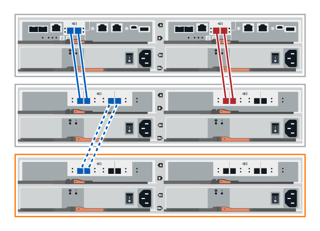
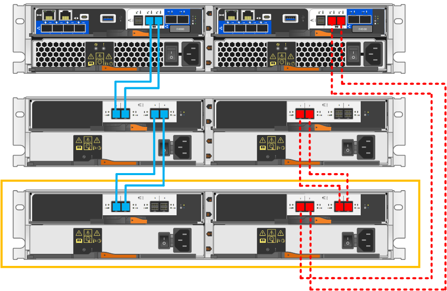

= Hot Hinzufügen eines Festplatten-Shelfs
:allow-uri-read: 
:icons: font
:imagesdir: ../media/

[role="lead"]
Sie können ein neues Festplatten-Shelf hinzufügen, während die Stromversorgung weiterhin auf die anderen Komponenten des Storage-Systems angewendet wird. Sie können Storage-Systemkapazität konfigurieren, neu konfigurieren, hinzufügen oder verschieben, ohne den Benutzerzugriff auf Daten zu unterbrechen.

.Bevor Sie beginnen
Aufgrund der Komplexität dieses Verfahrens wird Folgendes empfohlen:

* Lesen Sie alle Schritte vor Beginn des Verfahrens durch.
* Stellen Sie sicher, dass das Hinzufügen eines Festplatten-Shelfs während des laufenden Vorgangs erfolgt.

.Über diese Aufgabe
Dieses Verfahren gilt für das Hot-Hinzufügen eines Laufwerk-Shelfs DE212C, DE224C oder DE460C zu einem E2800, E2800B, EF280, E5700, E5700B, EF570, EF300, EF600 oder E4000 Controller-Shelf.

Dieses Verfahren gilt für die IOM12- und IOM12B-Laufwerkseinschübe.

NOTE: IOM12B-Module werden nur ab SANtricity OS 11.70.2 unterstützt. Stellen Sie sicher, dass die Firmware Ihres Controllers aktualisiert wurde, bevor Sie auf ein IOM12B installieren oder aktualisieren.

NOTE: Dieses Verfahren gilt für EAM-Hot-Swaps oder Ersatz wie für Regal-ähnliche. So können Sie nur ein IOM12-Modul durch ein anderes IOM12-Modul ersetzen oder ein IOM12B-Modul durch ein anderes IOM12B-Modul ersetzen. (Ihr Shelf kann zwei IOM12-Module haben oder zwei IOM12B-Module haben.)

Wenn Sie ein älteres Controller-Shelf mit einem DE212C, DE224C oder DE460 verkabeln, finden Sie unter https://mysupport.netapp.com/ecm/ecm_download_file/ECMLP2859057["Hinzufügen von IOM-Laufwerk-Shelfs zu einem vorhandenen E27XX-, E56XX- oder EF560-Controller-Shelf"^].

NOTE: Um die Integrität des Systems zu erhalten, müssen Sie den Vorgang genau in der dargestellten Reihenfolge befolgen.

== Schritt 1: Bereiten Sie sich vor, das Laufwerk-Shelf hinzuzufügen

Damit Sie ein Festplatten-Shelf vorbereiten können, müssen Sie nach kritischen Ereignissen suchen und den Status der IOMs überprüfen.

.Bevor Sie beginnen
* Die Stromversorgung des Storage-Systems muss die Anforderungen an das neue Festplatten-Shelf erfüllen. Informationen zur Stromversorgung Ihres Festplatten-Shelfs finden Sie im https://hwu.netapp.com/Controller/Index?platformTypeId=2357027["Hardware Universe"^].
* Das Verkabelungsmuster für das vorhandene Storage-System muss mit einem der in diesem Verfahren angegebenen Schemata übereinstimmen.

.Schritte
. Wählen Sie im SANtricity System Manager die Option *Support* > *Support Center* > *Diagnose* aus.
. Wählen Sie *Support-Daten Erfassen* Aus.
+
Das Dialogfeld Support-Daten erfassen wird angezeigt.

. Klicken Sie Auf *Collect*.
+
Die Datei wird im Ordner Downloads für Ihren Browser mit dem Namen Support-Data.7z gespeichert. Die Daten werden nicht automatisch an den technischen Support gesendet.

. Wählen Sie *Support* > *Ereignisprotokoll*.
+
Auf der Seite Ereignisprotokoll werden die Ereignisdaten angezeigt.

. Wählen Sie die Überschrift der Spalte *Priorität* aus, um kritische Ereignisse oben in der Liste zu sortieren.
. Überprüfen Sie die systemkritischen Ereignisse auf Ereignisse, die in den letzten zwei bis drei Wochen aufgetreten sind, und vergewissern Sie sich, dass alle letzten kritischen Ereignisse behoben oder anderweitig behoben wurden.
+

NOTE: Wenn in den letzten zwei bis drei Wochen nicht gelöste kritische Ereignisse aufgetreten sind, beenden Sie das Verfahren und wenden Sie sich an den technischen Support. Setzen Sie das Verfahren nur fort, wenn das Problem behoben ist.

. Wenn EAMs an Ihre Hardware angeschlossen sind, führen Sie die folgenden Schritte aus. Andernfalls fahren Sie mit fort <<step2_install_drive_shelf,Schritt 2: Installieren Sie das Laufwerk-Shelf und schalten Sie die Stromversorgung ein.>>
+
.. Wählen Sie *Hardware*.
.. Wählen Sie das Symbol * IOMs (ESMs)* aus.
+
image::../media/sam1130_ss_hardware_iom_icon.gif[EAMs (ESMs)-Symbol]

+
Das Dialogfeld Einstellungen für Shelf-Komponenten wird angezeigt, wobei die Registerkarte *IOMs (ESMs)* ausgewählt ist.

.. Stellen Sie sicher, dass der für jedes IOM/ESM angezeigte Status _optimal_ lautet.
.. Klicken Sie auf *Weitere Einstellungen anzeigen*.
.. Vergewissern Sie sich, dass die folgenden Bedingungen vorliegen:
+
*** Die Anzahl der erkannten ESMs/IOMs entspricht der Anzahl der im System installierten ESMs/IOMs und denen für jedes Laufwerk-Shelf.
*** Beide ESMs/IOMs zeigen, dass Kommunikation in Ordnung ist.
*** Die Datenrate beträgt 12 GB/s für DE212C, DE224C und DE460C Laufwerk-Shelfs oder 6 GB/s für andere Laufwerksfächer.

== Schritt 2: Installieren Sie das Festplatten-Shelf und bringen Sie Strom an

Sie installieren ein neues Festplatten-Shelf oder ein zuvor installiertes Festplatten-Shelf, schalten den Strom ein und überprüfen, ob entsprechende LEDs erforderlich sind.

.Schritte
. Wenn Sie ein Festplatten-Shelf installieren, das zuvor in einem Storage-System installiert wurde, entfernen Sie die Laufwerke. Die Laufwerke müssen nacheinander in diesem Verfahren installiert werden.
+
Wenn der Installationsverlauf des Festplatten-Shelf, das Sie installieren, unbekannt ist, müssen Sie davon ausgehen, dass dieses zuvor in einem Storage-System installiert wurde.

. Installieren Sie das Festplatten-Shelf im Rack, in dem die Komponenten des Storage-Systems enthalten sind.
+

NOTE: In der Installationsanleitung Ihres Modells finden Sie das vollständige Verfahren zur physischen Installation und Verkabelung. Die Installationsanweisungen für Ihr Modell enthalten Hinweise und Warnungen, die Sie zur sicheren Installation eines Festplatten-Shelfs berücksichtigen müssen.

. Schalten Sie das neue Festplatten-Shelf ein, und vergewissern Sie sich, dass am Festplatten-Shelf keine gelbe Warn-LEDs leuchten. Beheben Sie, wenn möglich, alle Fehlerbedingungen, bevor Sie mit diesem Verfahren fortfahren.

== Schritt 3: Verkabeln Sie Ihr System

Wenn Sie ein älteres Controller-Shelf mit einem DE212C, DE224C oder DE460 verkabeln, finden Sie unter https://mysupport.netapp.com/ecm/ecm_download_file/ECMLP2859057["Hinzufügen von IOM-Laufwerk-Shelfs zu einem vorhandenen E27XX-, E56XX- oder EF560-Controller-Shelf"^].

[role="tabbed-block"]
====
.Schließen Sie das Festplatten-Shelf für die E2800 oder die E5700 an
--
Sie verbinden das Festplatten-Shelf mit Controller A, bestätigen den IOM-Status und verbinden dann das Festplatten-Shelf mit Controller B

.Schritte
. Verbinden Sie das Festplatten-Shelf mit Controller A.
+
Die folgende Abbildung zeigt eine Beispielverbindung zwischen einem zusätzlichen Festplatten-Shelf und Controller A Informationen zum Auffinden der Ports auf Ihrem Modell finden Sie im https://hwu.netapp.com/Controller/Index?platformTypeId=2357027["Hardware Universe"^].

+
image::../media/hot_e5700_0.png[Laufwerk-Shelf mit dem Controller verbinden]

+

. Klicken Sie im SANtricity System Manager auf *Hardware*.
+

NOTE: An diesem Punkt in der Prozedur verfügen Sie nur über einen aktiven Pfad zum Controller-Shelf.

. Blättern Sie nach unten, um alle Laufwerk-Shelfs im neuen Storage-System zu sehen. Wenn das neue Festplatten-Shelf nicht angezeigt wird, lösen Sie das Verbindungsproblem.
. Wählen Sie das Symbol *ESMs/IOMs* für das neue Festplatten-Shelf aus.
+
image::../media/sam1130_ss_hardware_iom_icon.gif[Symbol für ESMs/EAMs]

+
Das Dialogfeld *Shelf-Komponenteneinstellungen* wird angezeigt.

. Wählen Sie im Dialogfeld *Shelf-Komponenteneinstellungen* die Registerkarte *ESMs/IOMs* aus.
. Wählen Sie * Weitere Optionen anzeigen* aus, und überprüfen Sie Folgendes:
+
** IOM/ESM A wird aufgelistet.
** Die aktuelle Datenrate beträgt 12 Gbit/s für ein SAS-3 Festplatten-Shelf.
** Kartenkommunikation ist in Ordnung.

. Trennen Sie alle Erweiterungskabel von Controller B.
. Verbinden Sie das Festplatten-Shelf mit Controller B.
+
Die folgende Abbildung zeigt eine Beispielverbindung zwischen einem zusätzlichen Laufwerk-Shelf und Controller B Informationen zum Auffinden der Ports auf Ihrem Modell finden Sie im https://hwu.netapp.com/Controller/Index?platformTypeId=2357027["Hardware Universe"^].

+
image::../media/hot_e5700_2.png[Beispiel für eine Verbindung mit einem Festplatten-Shelf]

. Wenn er nicht bereits ausgewählt ist, wählen Sie im Dialogfeld *Shelf-Komponenteneinstellungen* die Registerkarte *ESMs/IOMs* aus, und wählen Sie dann *Weitere Optionen anzeigen*. Stellen Sie sicher, dass die Kartenkommunikation *JA* lautet.
+

NOTE: Der Status „optimal“ zeigt an, dass der Verlust eines Redundanzfehlers im Zusammenhang mit dem neuen Festplatten-Shelf behoben wurde und das Storage-System stabilisiert ist.

--
.Schließen Sie das Festplatten-Shelf für EF300 oder EF600 an
--
Sie verbinden das Festplatten-Shelf mit Controller A, bestätigen den IOM-Status und verbinden dann das Festplatten-Shelf mit Controller B

.Bevor Sie beginnen
* Sie haben Ihre Firmware auf die neueste Version aktualisiert. Befolgen Sie zum Aktualisieren der Firmware die Anweisungen im link:../upgrade-santricity/index.html["Aktualisieren des SANtricity Betriebssystems"].

.Schritte
. Trennen Sie beide A-seitlichen Controller-Kabel von den IOM12-Ports eins und zwei vom vorherigen letzten Shelf im Stack, und verbinden Sie sie dann mit den neuen IOM12-Shelf-Ports eins und zwei.
+
image::../media/de224c_sides.png[Trennen Sie die Kabel von Controller A und verbinden Sie sie mit dem neuen Shelf]

. Die Kabel an Die A-seitigen IOM12-Anschlüsse drei und vier vom neuen Shelf an die bisherigen IOM12-Anschlüsse 1 und 2 anschließen.
+
Die folgende Abbildung zeigt eine Beispielverbindung für Eine Seite zwischen einem zusätzlichen Festplatten-Shelf und dem vorherigen letzten Shelf. Informationen zum Auffinden der Ports auf Ihrem Modell finden Sie im https://hwu.netapp.com/Controller/Index?platformTypeId=2357027["Hardware Universe"^].

+
image::../media/hot_ef_0.png[Beispiel für die Verkabelung von Festplatten-Shelfs]

+
image::../media/hot_ef_1.png[Beispiel für die Verkabelung von Festplatten-Shelfs]

. Klicken Sie im SANtricity System Manager auf *Hardware*.
+

NOTE: An diesem Punkt in der Prozedur verfügen Sie nur über einen aktiven Pfad zum Controller-Shelf.

. Blättern Sie nach unten, um alle Laufwerk-Shelfs im neuen Storage-System zu sehen. Wenn das neue Festplatten-Shelf nicht angezeigt wird, lösen Sie das Verbindungsproblem.
. Wählen Sie das Symbol *ESMs/IOMs* für das neue Festplatten-Shelf aus.
+
image::../media/sam1130_ss_hardware_iom_icon.gif[Symbol für ESMs/EAMs]

+
Das Dialogfeld *Shelf-Komponenteneinstellungen* wird angezeigt.

. Wählen Sie im Dialogfeld *Shelf-Komponenteneinstellungen* die Registerkarte *ESMs/IOMs* aus.
. Wählen Sie * Weitere Optionen anzeigen* aus, und überprüfen Sie Folgendes:
+
** IOM/ESM A wird aufgelistet.
** Die aktuelle Datenrate beträgt 12 Gbit/s für ein SAS-3 Festplatten-Shelf.
** Kartenkommunikation ist in Ordnung.

. Trennen Sie die B-seitlichen Controller-Kabel von den IOM12-Ports eins und zwei vom vorherigen letzten Shelf im Stack, und verbinden Sie sie dann mit den neuen IOM12-Anschlüssen eins und zwei.
. Die Kabel an die B-seitigen IOM12-Anschlüsse drei und vier vom neuen Shelf an die letzten IOM12-Anschlüsse 1 und 2 anschließen.
+
Die folgende Abbildung zeigt eine Beispielverbindung für die B-Seite zwischen einem zusätzlichen Festplatten-Shelf und dem vorherigen letzten Shelf. Informationen zum Auffinden der Ports auf Ihrem Modell finden Sie im https://hwu.netapp.com/Controller/Index?platformTypeId=2357027["Hardware Universe"^].

+
image::../media/hot_ef_2.png[Beispiel für die Verkabelung von Festplatten-Shelfs]

. Wenn er nicht bereits ausgewählt ist, wählen Sie im Dialogfeld *Shelf-Komponenteneinstellungen* die Registerkarte *ESMs/IOMs* aus, und wählen Sie dann *Weitere Optionen anzeigen*. Stellen Sie sicher, dass die Kartenkommunikation *JA* lautet.
+

NOTE: Der Status „optimal“ zeigt an, dass der Verlust eines Redundanzfehlers im Zusammenhang mit dem neuen Festplatten-Shelf behoben wurde und das Storage-System stabilisiert ist.

--
.Schließen Sie das Festplatten-Shelf für E4000 an
--
Sie verbinden das Festplatten-Shelf mit Controller A, bestätigen den IOM-Status und verbinden dann das Festplatten-Shelf mit Controller B

.Schritte
. Verbinden Sie das Festplatten-Shelf mit Controller A.
+
image::../media/hot_e4000_cabling_1.png[Festplatten-Shelf-Verkabelung]

. Klicken Sie im SANtricity System Manager auf *Hardware*.
+

NOTE: An diesem Punkt in der Prozedur verfügen Sie nur über einen aktiven Pfad zum Controller-Shelf.

. Blättern Sie nach unten, um alle Laufwerk-Shelfs im neuen Storage-System zu sehen. Wenn das neue Festplatten-Shelf nicht angezeigt wird, lösen Sie das Verbindungsproblem.
. Wählen Sie das Symbol *ESMs/IOMs* für das neue Festplatten-Shelf aus.
+
image::../media/sam1130_ss_hardware_iom_icon.gif[EAM-Hardwaresymbol]

+
Das Dialogfeld *Shelf-Komponenteneinstellungen* wird angezeigt.

. Wählen Sie im Dialogfeld *Shelf-Komponenteneinstellungen* die Registerkarte *ESMs/IOMs* aus.
. Wählen Sie * Weitere Optionen anzeigen* aus, und überprüfen Sie Folgendes:
+
** IOM/ESM A wird aufgelistet.
** Die aktuelle Datenrate beträgt 12 Gbit/s für ein SAS-3 Festplatten-Shelf.
** Kartenkommunikation ist in Ordnung.

. Trennen Sie alle Erweiterungskabel von Controller B.
. Verbinden Sie das Festplatten-Shelf mit Controller B.
+

. Wenn er nicht bereits ausgewählt ist, wählen Sie im Dialogfeld *Shelf-Komponenteneinstellungen* die Registerkarte *ESMs/IOMs* aus, und wählen Sie dann *Weitere Optionen anzeigen*. Stellen Sie sicher, dass die Kartenkommunikation *JA* lautet.
+

NOTE: Der Status „optimal“ zeigt an, dass der Verlust eines Redundanzfehlers im Zusammenhang mit dem neuen Festplatten-Shelf behoben wurde und das Storage-System stabilisiert ist.

--
====

== Schritt 4: Schließen Sie Hot Add ab

Sie schließen das Hot Add-Laufwerk aus, indem Sie auf Fehler überprüfen und bestätigen, dass das neu hinzugefügte Festplatten-Shelf die neueste Firmware verwendet.

.Schritte
. Klicken Sie im SANtricity System Manager auf *Home*.
. Wenn der Link *Recover from Problems* in der Mitte oben auf der Seite angezeigt wird, klicken Sie auf den Link und beheben Sie alle im Recovery Guru angezeigten Probleme.
. Klicken Sie im SANtricity System Manager auf *Hardware* und scrollen Sie nach unten, um das neu hinzugefügte Festplatten-Shelf anzuzeigen.
. Fügen Sie bei Laufwerken, die zuvor in einem anderen Storage-System installiert waren, dem neu installierten Festplatten-Shelf ein Laufwerk hinzu. Warten Sie, bis jedes Laufwerk erkannt wird, bevor Sie das nächste Laufwerk einsetzen.
+
Wenn ein Laufwerk vom Speichersystem erkannt wird, wird die Darstellung des Laufwerkssteckplatzes auf der Seite *Hardware* als blaues Rechteck angezeigt.

. Wählen Sie die Registerkarte *Support* > *Support Center* > *Support-Ressourcen* aus.
. Klicken Sie auf den Link *Software and Firmware Inventory* und überprüfen Sie, welche Versionen der IOM/ESM-Firmware und der Laufwerk-Firmware auf dem neuen Festplatten-Shelf installiert sind.
+

NOTE: Eventuell müssen Sie auf der Seite nach unten blättern, um den Link zu finden.

. Aktualisieren Sie gegebenenfalls die Laufwerk-Firmware.
+
Die IOM/ESM-Firmware aktualisiert automatisch die neueste Version, es sei denn, Sie haben die Upgrade-Funktion deaktiviert.

Das Hot Add-Verfahren ist abgeschlossen. Sie können den normalen Betrieb fortsetzen.
