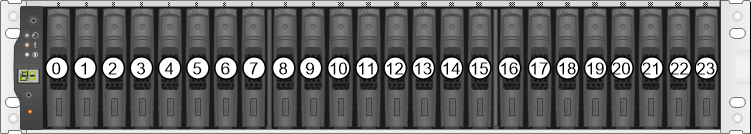

= Anforderungen für den Austausch von E2800 Laufwerken
:allow-uri-read: 
:icons: font
:imagesdir: ../media/

[role="lead"]
Bevor Sie ein E2800-Laufwerk ersetzen, sollten Sie zunächst die Anforderungen und Überlegungen überprüfen.

== Shelf-Typen

Ein Laufwerk kann entweder in einem Controller-Shelf mit 12, 24 oder 60 Laufwerken oder als Festplatten-Shelf ersetzt werden.

=== Shelfs mit 12 Laufwerken oder 24 Laufwerken

Die Abbildungen zeigen, wie die Laufwerke in jedem Shelf-Typ nummeriert werden (die Frontblende oder die Endkappen des Shelfs wurden entfernt).

*Laufwerksnummerierung in einem E2812 Controller-Shelf oder DE212C-Festplatten-Shelf:*

image::../media/28_dwg_e2812_de212c_drive_numbering.gif[28 dwg e2812 de212c Laufwerksnummerierung]

*Laufwerksnummerierung in einem E2824 Controller-Shelf, EF280 Flash-Array oder DE224C Festplatten-Shelf:*

NOTE: Ihr E2812, E2824 und EF280 Storage-Array kann ein oder mehrere herkömmliche SAS-2-Laufwerksfächer umfassen, einschließlich DE1600 Fach mit 12 Laufwerken, das DE5600 Fach mit 24 Laufwerken oder das DE6600 Fach mit 60 Laufwerken Anweisungen zum Austauschen eines Laufwerks in einem dieser Laufwerksfächer finden Sie unter link:https://library.netapp.com/ecm/ecm_download_file/ECMLP2577975["Austauschen eines Laufwerks in E2660, E2760, E5460, E5560 oder E5660 Einschüben"^] Und link:https://library.netapp.com/ecm/ecm_download_file/ECMLP2577971["Ersetzen eines Laufwerks in E2600, E2700, E5400, E5500 und E5600 12-Laufwerk- oder 24-Laufwerksschächten"^].

=== Shelfs mit 60 Laufwerken

Sowohl das E2860 Controller-Shelf als auch das DE460C Festplatten-Shelf bestehen aus fünf Laufwerksfächer, die jeweils 12 Laufwerksschächte enthalten. Die Laufwerksschublade 1 befindet sich oben, und die Laufwerksschublade 5 befindet sich unten.

image::../media/28_dwg_e2860_de460c_front_no_callouts_maint-e2800.gif[28 dwg e2860 de460c Vorderseite ohne Rufumschalter maint e2800]

Bei einem E2860 Controller-Shelf-Einschub und einem DE460C Festplatten-Shelf-Einschub werden Laufwerke in jedem Laufwerkschublade im Shelf von 0 bis 11 nummeriert.

image::../media/dwg_trafford_drawer_with_hdds_callouts_maint-e2800.gif[Wg trafford Schublade mit hdds-Calouts maint e2800]

NOTE: Ihr E2860 Storage-Array kann ein oder mehrere herkömmliche SAS-2-Laufwerksfächer umfassen, einschließlich DE1600 Fach mit 12 Laufwerken, dem DE5600 Tablett für 24 Laufwerke oder dem DE6600 Fach mit 60 Laufwerken Anweisungen zum Austauschen eines Laufwerks in einem dieser Laufwerksfächer finden Sie unter link:https://library.netapp.com/ecm/ecm_download_file/ECMLP2577975["Austauschen eines Laufwerks in E2660, E2760, E5460, E5560 oder E5660 Einschüben"^] Und link:https://library.netapp.com/ecm/ecm_download_file/ECMLP2577971["Ersetzen eines Laufwerks in E2600, E2700, E5400, E5500 und E5600 12-Laufwerk- oder 24-Laufwerksschächten"^].

=== Laufwerksschublade

Eine Laufwerkschublade kann in einem E2860 Controller-Shelf und einem DE460C Festplatten-Shelf ersetzt werden. Jeder der Shelfs mit 60 Laufwerken verfügt über fünf Laufwerkfächer.

image::../media/28_dwg_e2860_de460c_front_no_callouts_maint-e2800.gif[28 dwg e2860 de460c Vorderseite ohne Rufumschalter maint e2800]

Jeder der fünf Schubladen kann bis zu 12 Laufwerke aufnehmen.

image:../media/92_dwg_de6600_drawer_with_hdds_no_callouts_maint-e2800.gif[""]

== Handhabung von Laufwerken

Die Laufwerke in Ihrem Speicher-Array sind anfällig. Eine unsachgemäße Handhabung von Laufwerken stellt eine der Hauptursachen für Laufwerkausfälle dar.

Befolgen Sie die folgenden Regeln, um Beschädigungen an den Laufwerken in Ihrem Speicher-Array zu vermeiden:

* Verhindern elektrostatischer Entladung (ESD):
+
** Halten Sie das Laufwerk in der ESD-Tasche, bis Sie bereit sind, es zu installieren.
** Setzen Sie kein Metallwerkzeug oder Messer in den ESD-Beutel.
+
Öffnen Sie die ESD-Tasche von Hand oder schneiden Sie die Oberseite mit einer Schere ab.

** Bewahren Sie den ESD-Beutel und alle Verpackungsmaterialien auf, falls Sie später ein Laufwerk zurückschicken müssen.
** Tragen Sie stets ein ESD-Handgelenkband, das an einer nicht lackierten Oberfläche am Gehäuse geerdet ist.
+
Wenn ein Handgelenkband nicht verfügbar ist, berühren Sie eine unlackierte Oberfläche des Speichergehäuses, bevor Sie das Laufwerk handhaben.

* Vorsichtig mit Laufwerken umgehen:
+
** Beim Entfernen, Einbau oder Tragen eines Laufwerks immer zwei Hände verwenden.
** Niemals einen Antrieb in ein Regal zwingen, und mit sanftem, festem Druck den Riegel vollständig einrücken.
** Platzieren Sie Laufwerke auf gepolsterten Flächen und stapeln Sie niemals Laufwerke auf einander.
** Laufwerke nicht gegen andere Oberflächen abstoßen.
** Lösen Sie vor dem Entfernen eines Laufwerks aus einem Shelf den Griff und warten Sie 30 Sekunden, bis sich das Laufwerk heruntergefahren hat.
** Verwenden Sie beim Transport von Laufwerken stets die genehmigte Verpackung.

* Magnetfelder vermeiden:
+
** Halten Sie Laufwerke von magnetischen Geräten fern.
+
Magnetfelder können alle Daten auf dem Laufwerk zerstören und irreparable Schäden an der Antriebsschaltung verursachen.

