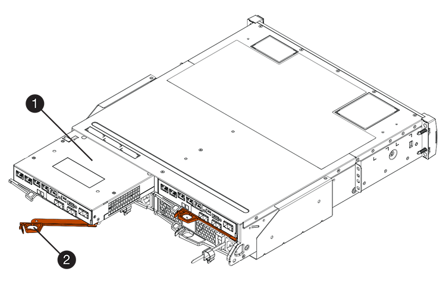
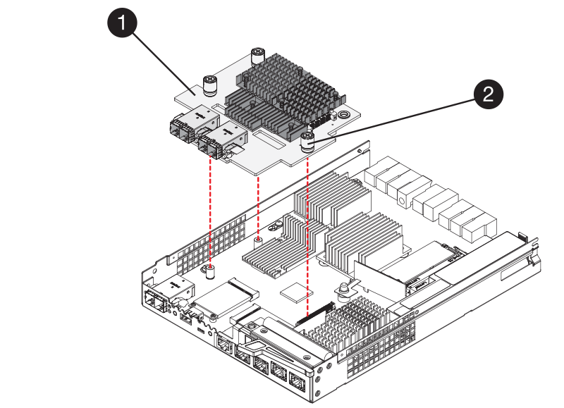

= E2800 Host-Schnittstellenkarte hinzufügen
:allow-uri-read: 
:experimental: 
:icons: font
:imagesdir: ../media/

[role="lead"]
Über Baseboard-Host-Ports können Sie eine Host-Schnittstellenkarte (HIC) zum E2800 Controller-Behälter hinzufügen. Darüber hinaus erhöht sich in Ihrem E2800 Storage-Array die Anzahl der Host-Ports und bietet zusätzliche Host-Protokolle.

.Über diese Aufgabe
Während dieses Verfahrens müssen Sie das Speicher-Array ausschalten, die HIC installieren und wieder Strom einschalten.

.Bevor Sie beginnen
* Prüfen link:hics-overview-supertask-concept.html["Anforderungen für den Austausch der E2800 HIC"].
* Planen Sie für dieses Verfahren ein Wartungsfenster zur Ausfallzeit. Die Stromversorgung muss ausgeschaltet sein, wenn Sie HICs installieren. Daher können Sie erst dann auf Daten im Speicher-Array zugreifen, wenn Sie diesen Vorgang erfolgreich abgeschlossen haben. (In einer Duplexkonfiguration liegt dies daran, dass beide Controller beim Einschalten dieselbe HIC-Konfiguration haben müssen.)
* Stellen Sie sicher, dass Sie Folgendes haben:
+
** Ein oder zwei HICs, je nachdem, ob Sie einen oder zwei Controller im Storage-Array haben. Die HICs müssen mit Ihren Steuerungen kompatibel sein.
** Ein ESD-Armband, oder Sie haben andere antistatische Vorsichtsmaßnahmen getroffen.
** A #1 Kreuzschlitzschraubendreher.
** Etiketten, um jedes Kabel zu identifizieren, das mit dem Controller-Behälter verbunden ist.
** Alle erforderliche Host-Hardware, die für die neuen Host-Ports installiert ist, wie z. B. Switches oder Host Bus Adapter (HBAs).
** Alle Kabel, Transceiver, Switches und Host Bus Adapter (HBAs), die für den Anschluss der neuen Host-Ports benötigt werden.
+
Informationen über kompatible Hardware finden Sie im https://mysupport.netapp.com/NOW/products/interoperability["NetApp Interoperabilitätsmatrix"^] Und das http://hwu.netapp.com/home.aspx["NetApp Hardware Universe"^].

** Eine Management Station mit einem Browser, der für den Controller auf den SANtricity System Manager zugreifen kann. (Zeigen Sie zum Öffnen der System Manager-Schnittstelle den Domain-Namen oder die IP-Adresse des Controllers im Browser.)

== Schritt 1: Vorbereitung auf das Hinzufügen von HIC

Bereiten Sie sich vor, die HIC hinzuzufügen, indem Sie die Konfigurationsdatenbank des Speicherarrays sichern, Supportdaten erfassen und Host-I/O-Vorgänge anhalten. Dann können Sie das Controller-Shelf herunterfahren.

.Schritte
. Stellen Sie auf der Startseite des SANtricity-System-Managers sicher, dass das Speicher-Array den optimalen Status hat.
+
Wenn der Status nicht optimal lautet, verwenden Sie den Recovery Guru oder wenden Sie sich an den technischen Support, um das Problem zu lösen. Fahren Sie mit diesem Verfahren nicht fort.

. Sichern Sie die Konfigurationsdatenbank des Storage-Arrays mit SANtricity System Manager.
+
Wenn während dieses Verfahrens ein Problem auftritt, können Sie die gespeicherte Datei verwenden, um Ihre Konfiguration wiederherzustellen. Das System speichert den aktuellen Status der RAID-Konfigurationsdatenbank, die alle Daten für Volume-Gruppen und Festplatten-Pools auf dem Controller enthält.

+
** Über System Manager:
+
... Wählen Sie MENU:Support[Support Center > Diagnose].
... Wählen Sie *Konfigurationsdaten Erfassen*.
... Klicken Sie Auf *Collect*.
+
Die Datei wird im Ordner Downloads für Ihren Browser mit dem Namen *configurationData-<arrayName>-<dateTime>.7z* gespeichert.

** Alternativ können Sie die Konfigurationsdatenbank mit dem folgenden CLI-Befehl sichern:
+
`save storageArray dbmDatabase sourceLocation=onboard contentType=all file="filename";`

. Support-Daten für Ihr Storage Array mit SANtricity System Manager erfassen
+
Wenn während dieses Verfahrens ein Problem auftritt, können Sie die gespeicherte Datei verwenden, um das Problem zu beheben. Das System speichert Bestands-, Status- und Performancedaten Ihres Speicherarrays in einer einzelnen Datei.

+
.. Wählen Sie MENU:Support[Support Center > Diagnose].
.. Wählen Sie *Support-Daten Erfassen* Aus.
.. Klicken Sie Auf *Collect*.
+
Die Datei wird im Ordner Downloads für Ihren Browser mit dem Namen *Support-Data.7z* gespeichert.

. Vergewissern Sie sich, dass zwischen dem Storage-Array und allen verbundenen Hosts keine I/O-Vorgänge stattfinden. Sie können beispielsweise die folgenden Schritte durchführen:
+
** Beenden Sie alle Prozesse, die die LUNs umfassen, die den Hosts vom Storage zugeordnet sind.
** Stellen Sie sicher, dass keine Applikationen Daten auf LUNs schreiben, die vom Storage den Hosts zugeordnet sind.
** Heben Sie die Bereitstellung aller Dateisysteme auf, die mit den Volumes im Array verbunden sind, auf.
+

NOTE: Die genauen Schritte zur Stoerung von Host-I/O-Vorgängen hängen vom Host-Betriebssystem und der Konfiguration ab, die den Umfang dieser Anweisungen übersteigen. Wenn Sie nicht sicher sind, wie Sie I/O-Vorgänge für Hosts in Ihrer Umgebung anhalten, sollten Sie das Herunterfahren des Hosts in Betracht ziehen.

+

CAUTION: *Möglicher Datenverlust* -- Wenn Sie diesen Vorgang während der I/O-Vorgänge fortsetzen, kann die Host-Anwendung den Zugriff auf die Daten verlieren, da der Speicher nicht zugänglich ist.

. Wenn das Speicher-Array an einer Spiegelungsbeziehung beteiligt ist, beenden Sie alle Host-I/O-Vorgänge auf dem sekundären Storage Array.
. Warten Sie, bis alle Daten im Cache-Speicher auf die Laufwerke geschrieben werden.
+
Die grüne LED „Cache aktiv“ auf der Rückseite jedes Controllers leuchtet, wenn die Daten im Cache auf die Laufwerke geschrieben werden müssen. Sie müssen warten, bis diese LED ausgeschaltet ist.

+
image::../media/28_dwg_2800_controller_attn_led_maint-e2800.gif[28 dwg 2800 Controller attn LED maint e2800]

+
*(1)* _Cache Active LED_

. Wählen Sie auf der Startseite des SANtricity System Managers die Option *Vorgänge in Bearbeitung anzeigen*. Warten Sie, bis alle Vorgänge abgeschlossen sind, bevor Sie mit dem nächsten Schritt fortfahren.
. Schalten Sie das Controller-Shelf aus.
+
.. Schalten Sie beide Netzschalter am Controller Shelf aus.
.. Warten Sie, bis alle LEDs am Controller-Shelf ausgeschaltet sind.

== Schritt 2: Controller-Behälter entfernen

Entfernen Sie den Controller-Behälter, damit Sie die neue Host-Schnittstellenkarte hinzufügen können.

.Schritte
. Beschriften Sie jedes Kabel, das am Controller-Behälter befestigt ist.
. Trennen Sie alle Kabel vom Controller-Behälter.
+

CAUTION: Um eine verminderte Leistung zu vermeiden, dürfen die Kabel nicht verdreht, gefaltet, gequetscht oder treten.

. Vergewissern Sie sich, dass die LED Cache Active auf der Rückseite des Controllers ausgeschaltet ist.
+
Die grüne LED „Cache aktiv“ auf der Rückseite des Controllers leuchtet, wenn Daten im Cache auf die Laufwerke geschrieben werden müssen. Sie müssen warten, bis diese LED ausgeschaltet ist, bevor Sie den Controller-Behälter entfernen.

+
image::../media/28_dwg_2800_controller_attn_led_maint-e2800.gif[28 dwg 2800 Controller attn LED maint e2800]

+
*(1)* _Cache Active LED_

. Drücken Sie den Riegel am Nockengriff, bis er loslässt, und öffnen Sie dann den Nockengriff nach rechts, um den Steuerkanister aus dem Regal zu lösen.
+
Die folgende Abbildung zeigt ein Beispiel für ein E2812 Controller-Shelf, ein E2824 Controller-Shelf oder ein EF280 Flash-Array:

+

+
*(1)* _Controller-Behälter_

+
*(2)* _Cam Griff_

+
Die folgende Abbildung zeigt ein Beispiel für ein E2860 Controller-Shelf:

+
image::../media/28_dwg_e2860_add_controller_canister_maint-e2800.gif[28 DWG e2860, Zusatz-Controller-Behälter, Version 2800]

+
*(1)* _Controller-Behälter_

+
*(2)* _Cam Griff_

. Schieben Sie den Controller-Behälter mit zwei Händen und dem Nockengriff aus dem Regal.
+

CAUTION: Verwenden Sie immer zwei Hände, um das Gewicht eines Reglerkanisters zu unterstützen.

+
Wenn Sie den Controller-Behälter aus einem E2812-Controller-Shelf, einem E2824-Controller-Shelf oder einem EF280 Flash-Array entfernen, wird eine Klappe an ihre Stelle gewechselt, um den leeren Schacht zu blockieren. Dadurch wird der Luftstrom und die Kühlung aufrechterhalten.

. Drehen Sie den Controller-Behälter so um, dass die abnehmbare Abdeckung nach oben zeigt.
. Setzen Sie den Steuerungsbehälter auf eine flache, statisch freie Oberfläche.

== Schritt 3: Installieren Sie die HIC

Installieren Sie die HIC, um die Anzahl der Host Ports in Ihrem Speicher-Array zu erhöhen.

CAUTION: *Möglicher Verlust des Datenzugriffs* -- Installieren Sie nie eine HIC in einem E2800 Controller-Behälter, wenn dieser HIC für einen anderen E-Series Controller entworfen wurde. Bei einer Duplexkonfiguration müssen außerdem beide Controller und beide HICs identisch sein. Wenn inkompatible oder nicht übereinstimmende HICs vorhanden sind, werden die Controller gesperrt, wenn Sie Strom verwenden.

.Schritte
. Packen Sie die neue HIC und die neue HIC-Frontplatte aus.
. Drücken Sie die Taste an der Abdeckung des Controllerkanisters, und schieben Sie die Abdeckung ab.
. Vergewissern Sie sich, dass die grüne LED im Controller (durch die DIMMs) aus ist.
+
Wenn diese grüne LED leuchtet, wird der Controller weiterhin mit Strom versorgt. Sie müssen warten, bis diese LED erlischt, bevor Sie Komponenten entfernen.

+
image::../media/28_dwg_e2800_internal_cache_active_led_maint-e2800.gif[28 DWG e2800 interner Cache, aktiver LED maint e2800]

+
*(1)* _Interner Cache Aktiv_

+
*(2)* _Akku_

. Entfernen Sie mit einem #1 Kreuzschlitzschraubendreher die vier Schrauben, mit denen die leere Frontplatte am Controller-Behälter befestigt ist, und entfernen Sie die Frontplatte.
. Richten Sie die drei Rändelschrauben der HIC an den entsprechenden Löchern am Controller aus, und richten Sie den Anschluss an der Unterseite der HIC an dem HIC-Schnittstellenanschluss auf der Controllerkarte aus.
+
Achten Sie darauf, dass die Komponenten auf der Unterseite der HIC oder auf der Oberseite der Controller-Karte nicht verkratzen oder stoßen.

. Senken Sie die HIC vorsichtig ab, und setzen Sie den HIC-Anschluss ein, indem Sie vorsichtig auf die HIC drücken.
+

CAUTION: *Mögliche Geräteschäden* -- vorsichtig sein, den goldenen Ribbon-Anschluss für die Controller-LEDs zwischen der HIC und den Daumenschrauben nicht zu quetschen.

+

+
*(1)* _Host Interface Card (HIC)_

+
*(2)* _Gewindestifte_

. Ziehen Sie die HIC-Rändelschrauben manuell fest.
+
Verwenden Sie keinen Schraubendreher, oder ziehen Sie die Schrauben möglicherweise zu fest.

. Befestigen Sie die neue HIC-Frontplatte mit einem #1 Kreuzschlitzschraubendreher mit den vier zuvor entfernten Schrauben am Controller-Behälter.
+
image::../media/28_dwg_e2800_hic_faceplace_screws_maint-e2800.gif[28-wg-e2800-Gewindestifte für die Frontpartie maint e2800]

== Schritt 4: Controller-Behälter wieder einbauen

Setzen Sie den Controller-Behälter wieder in das Controller-Shelf ein, nachdem Sie die neue HIC installiert haben.

.Schritte
. Drehen Sie den Controller-Behälter so um, dass die abnehmbare Abdeckung nach unten zeigt.
. Schieben Sie den Steuerkanister bei geöffnetem Nockengriff vollständig in das Reglerregal.
+
Die folgende Abbildung zeigt ein Beispiel für ein E2824 Controller-Shelf oder ein EF280 Flash-Array:

+

+
*(1)* _Controller-Behälter_

+
*(2)* _Cam Griff_

+
Die folgende Abbildung zeigt ein Beispiel für ein E2860 Controller-Shelf: image:../media/28_dwg_e2860_add_controller_canister_maint-e2800.gif[""]

+
*(1)* _Controller-Behälter_

+
*(2)* _Cam Griff_

. Bewegen Sie den Nockengriff nach links, um den Steuerkanister zu verriegeln.
. Schließen Sie alle entfernten Kabel wieder an.
+

NOTE: Schließen Sie derzeit keine Datenkabel an die neuen HIC-Ports an.

. (Optional) Wenn Sie HICs zu einer Duplexkonfiguration hinzufügen, wiederholen Sie alle Schritte, um den zweiten Controller-Behälter zu entfernen, die zweite HIC zu installieren und den zweiten Controller-Behälter neu zu installieren.

== Schritt 5: HIC-Ergänzung abschließen

Überprüfen Sie die Controller-LEDs und die Anzeige für sieben Segmente und bestätigen Sie dann, dass der Status des Controllers optimal lautet.

.Schritte
. Schalten Sie die beiden Netzschalter an der Rückseite des Controller-Shelf ein.
+
** Schalten Sie die Netzschalter während des Einschaltvorgangs nicht aus, was in der Regel 90 Sekunden oder weniger dauert.
** Die Lüfter in jedem Regal sind beim ersten Start sehr laut. Das laute Geräusch beim Anfahren ist normal.

. Überprüfen Sie beim Booten des Controllers die Controller-LEDs und die Anzeige für sieben Segmente.
+
** Das 7-Segment-Display zeigt die sich wiederholende Sequenz *OS*, *SD*, *_blank_* an, um anzuzeigen, dass der Controller die SOD-Verarbeitung (Start-of-day) durchführt. Nachdem ein Controller erfolgreich gestartet wurde, sollte auf seinem siebenstelligen Display die Fach-ID angezeigt werden.
** Die gelbe Warn-LED am Controller leuchtet und schaltet sich dann aus, sofern kein Fehler vorliegt.
** Die grünen Host-Link-LEDs leuchten weiterhin, bis Sie die Hostkabel anschließen.
+

NOTE: Die Abbildung zeigt einen Beispiel-Controller-Behälter. Ihr Controller kann über eine andere Anzahl und einen anderen Typ von Host-Ports verfügen.

+
image::../media/28_dwg_attn_led_7s_display_maint-e2800.gif[28-Sekunden-LED 7s Display maint e2800]

+
*(1)* _Warn-LED (gelb)_

+
*(2)* _Sieben-Segment-Anzeige_

+
*(3)* _Host Link LEDs_

. Überprüfen Sie im SANtricity System Manager, ob der Status des Controllers optimal lautet.
+
Wenn der Status nicht optimal ist oder eine der Warn-LEDs leuchtet, vergewissern Sie sich, dass alle Kabel richtig eingesetzt sind, und überprüfen Sie, ob die HIC und der Controller-Behälter richtig installiert sind. Entfernen Sie gegebenenfalls den Controller-Behälter und die HIC, und setzen Sie ihn wieder ein.

+

NOTE: Wenden Sie sich an den technischen Support, wenn das Problem nicht gelöst werden kann.

. Wenn für die neuen HIC-Ports SFP+-Transceiver erforderlich sind, installieren Sie die SFPs.
. Wenn Sie eine HIC mit SFP+ (optischen)-Ports installiert haben, bestätigen Sie, dass die neuen Ports über das erwartete Host-Protokoll verfügen.
+
.. Wählen Sie im SANtricity System Manager die Option *Hardware* aus.
.. Wenn die Grafik die Laufwerke anzeigt, klicken Sie auf *Zurück zum Regal anzeigen*.
.. Wählen Sie die Grafik für Controller A oder Controller B aus
.. Wählen Sie im Kontextmenü die Option *Einstellungen anzeigen* aus.
.. Wählen Sie die Registerkarte *Host Interfaces* aus.
.. Klicken Sie auf *Weitere Einstellungen anzeigen*.
.. Sehen Sie sich die Details der HIC-Ports an (die Ports mit der Bezeichnung *e0__x_* oder *0__x__* in HIC-Position *Steckplatz 1*), um festzustellen, ob Sie bereit sind, die Host-Ports mit den Daten-Hosts zu verbinden:
+
*** _Wenn die neuen HIC-Ports das erwartete Protokoll haben:_ Sie sind bereit, die neuen HIC-Ports mit den Daten-Hosts zu verbinden; fahren Sie mit dem nächsten Schritt fort.
*** _Wenn die neuen HIC-Ports *nicht* das von Ihnen erwartete Protokoll haben:_ Sie müssen ein Software Feature Pack anwenden, bevor Sie die neuen HIC-Ports mit den Daten-Hosts verbinden können. Siehe link:hpp-change-host-protocol-task.html["Ändern des Host-Protokolls für die E2800"]. Verbinden Sie dann die Host Ports mit den Daten-Hosts, und setzen Sie den Betrieb fort.

. Verbinden Sie die Kabel der Host-Ports des Controllers mit den Daten-Hosts.
+
Wenn Sie Anweisungen zur Konfiguration und Verwendung eines neuen Host-Protokolls benötigen, finden Sie im link:../config-linux/index.html["Linux Express-Konfiguration"], link:../config-windows/index.html["Windows Express-Konfiguration"], Oder link:../config-vmware/index.html["VMware Express-Konfiguration"].

.Was kommt als Nächstes?
Das Hinzufügen einer Host-Schnittstellenkarte zum Speicher-Array ist abgeschlossen. Sie können den normalen Betrieb fortsetzen.
