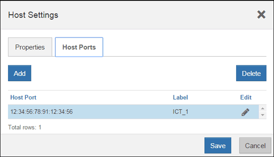

= Schließen Sie die Host-Protokoll-Konvertierung an - E2800
:allow-uri-read: 
:experimental: 
:icons: font
:imagesdir: ../media/

[role="lead"]
Nach dem Konvertieren des Protokolls der Host-Ports müssen Sie zusätzliche Schritte durchführen, bevor Sie das neue Protokoll verwenden können.

Die Schritte hängen von dem Start- und Endprotokoll der Baseboard-Host-Ports und den HIC-Ports ab.

== Vollständige FC-zu-iSCSI-Konvertierung

Wenn Sie alle Host Ports von FC zu iSCSI konvertiert haben, müssen Sie iSCSI-Netzwerk konfigurieren.

.Schritte
. Konfigurieren Sie die Switches.
+
Die Switches für den iSCSI-Datenverkehr sollten entsprechend den Empfehlungen des Anbieters für iSCSI konfiguriert werden. Diese Empfehlungen können sowohl Konfigurationsrichtlinien als auch Code-Updates enthalten.

. Wählen Sie im SANtricity System Manager Menü:Hardware[iSCSI-Ports konfigurieren].
. Wählen Sie die Porteinstellungen aus.
+
Sie können Ihr iSCSI-Netzwerk auf unterschiedliche Weise einrichten. Wenden Sie sich an Ihren Netzwerkadministrator, wenn Sie Tipps zur Auswahl der für Ihre Umgebung am besten geeigneten Konfiguration benötigen.

. Aktualisieren Sie die Host-Definitionen in SANtricity System Manager.
+

NOTE: Falls Sie Anweisungen zum Hinzufügen von Hosts oder Host-Clustern benötigen, finden Sie in der Online-Hilfe von SANtricity System Manager.

+
.. Wählen Sie Menü:Storage[Hosts].
.. Wählen Sie den Host aus, dem der Port zugeordnet werden soll, und klicken Sie auf *Einstellungen anzeigen/bearbeiten*.
+
Das Dialogfeld Hosteinstellungen wird angezeigt.

.. Klicken Sie auf die Registerkarte *Host Ports*.
+

.. Klicken Sie auf *Hinzufügen*, und verwenden Sie das Dialogfeld *Host-Port hinzufügen*, um dem Host eine neue Host-Port-ID zuzuordnen.
+
Die Länge des Namens der Host-Port-Kennung wird durch die Host-Schnittstellentechnologie bestimmt. Die Namen der FC-Host-Port-ID müssen 16 Zeichen lang sein. Die Namen der iSCSI-Host-Port-ID dürfen maximal 223 Zeichen lang sein. Der Port muss eindeutig sein. Eine bereits konfigurierte Portnummer ist nicht zulässig.

.. Klicken Sie auf *Löschen*, und entfernen Sie mit dem Dialogfeld *Host-Port löschen* eine Host-Port-ID (Zuordnung aufheben).
+
Mit der Option *Löschen* wird der Host-Port nicht physisch entfernt. Mit dieser Option wird die Zuordnung zwischen dem Host-Port und dem Host entfernt. Sofern Sie den Host Bus Adapter oder den iSCSI-Initiator nicht entfernen, wird der Host-Port noch vom Controller erkannt.

.. Klicken Sie auf *Speichern*, um Ihre Änderungen auf die Einstellungen der Host-Port-ID anzuwenden.
.. Wiederholen Sie diese Schritte, um zusätzliche Host-Port-IDs hinzuzufügen und zu entfernen.

. Booten Sie den Host neu, oder führen Sie einen erneuten Scan durch, damit der Host die LUNs ordnungsgemäß erkennt.
. Volumes neu mounten oder mit Block-Volume beginnen

== Vollständige Konvertierung von iSCSI zu FC

Wenn Sie alle Host-Ports von iSCSI zu FC konvertiert haben, müssen Sie FC-Netzwerk konfigurieren.

.Schritte
. Installieren Sie das HBA Utility, und bestimmen Sie Initiator-WWPNs.
. Die Schalter einteilen.
+
Durch das Zoning der Switches werden die Hosts eine Verbindung zum Storage herstellen und die Anzahl der Pfade begrenzt. Sie Zonen der Switches mithilfe der Managementoberfläche der Switches.

. Aktualisieren Sie die Host-Definitionen in SANtricity System Manager.
+
.. Wählen Sie Menü:Storage[Hosts].
.. Wählen Sie den Host aus, dem der Port zugeordnet werden soll, und klicken Sie auf *Einstellungen anzeigen/bearbeiten*.
+
Das Dialogfeld Hosteinstellungen wird angezeigt.

.. Klicken Sie auf die Registerkarte *Host Ports*.
+

.. Klicken Sie auf *Hinzufügen*, und verwenden Sie das Dialogfeld *Host-Port hinzufügen*, um dem Host eine neue Host-Port-ID zuzuordnen.
+
Die Länge des Namens der Host-Port-Kennung wird durch die Host-Schnittstellentechnologie bestimmt. Die Namen der FC-Host-Port-ID müssen 16 Zeichen lang sein. Die Namen der iSCSI-Host-Port-ID dürfen maximal 223 Zeichen lang sein. Der Port muss eindeutig sein. Eine bereits konfigurierte Portnummer ist nicht zulässig.

.. Klicken Sie auf *Löschen*, und entfernen Sie mit dem Dialogfeld *Host-Port löschen* eine Host-Port-ID (Zuordnung aufheben).
+
Mit der Option *Löschen* wird der Host-Port nicht physisch entfernt. Mit dieser Option wird die Zuordnung zwischen dem Host-Port und dem Host entfernt. Sofern Sie den Host Bus Adapter oder den iSCSI-Initiator nicht entfernen, wird der Host-Port noch vom Controller erkannt.

.. Klicken Sie auf *Speichern*, um Ihre Änderungen auf die Einstellungen der Host-Port-ID anzuwenden.
.. Wiederholen Sie diese Schritte, um zusätzliche Host-Port-IDs hinzuzufügen und zu entfernen.

. Starten Sie den Host neu, oder führen Sie einen erneuten Scan durch, um so den zugeordneten Storage richtig zu erkennen.
. Volumes neu mounten oder mit Block-Volume beginnen

== Vollständige Konvertierung von FC zu FC/iSCSI

Wenn Sie zuvor alle FC-Host-Ports hatten und einige davon in iSCSI konvertiert haben, müssen Sie möglicherweise Ihre vorhandene Konfiguration zur Unterstützung von iSCSI ändern.

Sie können eine der folgenden Optionen verwenden, um die neuen iSCSI-Ports zu verwenden. Die genauen Schritte hängen von Ihren aktuellen und geplanten Netzwerktopologien ab. Bei Option 1 wird davon ausgegangen, dass neue iSCSI-Hosts an das Array angeschlossen werden sollen. Bei Option 2 wird angenommen, dass Sie die an die umgewandelten Ports angeschlossenen Hosts von FC zu iSCSI konvertieren möchten.

=== Option 1: Verschieben Sie FC-Hosts und fügen Sie neue iSCSI-Hosts hinzu

. Verschieben Sie alle FC-Hosts von den neuen iSCSI-Ports zu den Ports, die weiterhin FC.
. Entfernen Sie FC-SFPs, wenn Sie noch keine Dual-Protokoll-SFPs verwenden.
. Verbinden Sie neue iSCSI-Hosts mit diesen Ports entweder direkt oder über einen Switch.
. Konfigurieren Sie das iSCSI-Netzwerk für die neuen Hosts und Ports. Anweisungen hierzu finden Sie im link:../config-linux/index.html["Linux Express-Konfiguration"], link:../config-windows/index.html["Windows Express-Konfiguration"], Oder link:../config-vmware/index.html["VMware Express-Konfiguration"].

=== Option 2: Konvertieren von FC-Hosts nach iSCSI

. Fahren Sie die FC-Hosts herunter, die mit den konvertierten Ports verbunden sind.
. Stellen Sie eine iSCSI-Topologie für die umgewandelten Ports bereit. Konvertieren Sie beispielsweise alle Switches von FC nach iSCSI.
. Wenn Sie noch keine SFPs mit zwei Protokollen einsetzen, entfernen Sie die FC-SFPs von den umgewandelten Ports und ersetzen Sie sie durch iSCSI SFPs oder SFPs mit zwei Protokollen.
. Verbinden Sie die Kabel mit den SFP-Modulen der umgewandelten Ports, und vergewissern Sie sich, dass sie mit dem richtigen iSCSI-Switch oder Host verbunden sind.
. Schalten Sie die Hosts ein.
. Verwenden Sie die https://mysupport.netapp.com/NOW/products/interoperability["NetApp Interoperabilitätsmatrix"^] Tool zum Konfigurieren der iSCSI-Hosts.
. Bearbeiten Sie die Host-Partition, um die iSCSI-Host-Port-IDs hinzuzufügen und die FC-Host-Port-IDs zu entfernen.
. Nach dem Neustart der iSCSI-Hosts können Sie die Volumes mithilfe der entsprechenden Verfahren auf den Hosts registrieren und sie Ihrem Betriebssystem zur Verfügung stellen.
+
** Sie können den SMcli-Befehl verwenden `-identifyDevices` Um die entsprechenden Gerätenamen für die Volumes anzuzeigen. Die SMcli ist im SANtricity Betriebssystem enthalten und kann über den SANtricity System Manager heruntergeladen werden. Weitere Informationen zum Herunterladen des SMcli über den SANtricity-System-Manager finden Sie im https://docs.netapp.com/us-en/e-series-santricity/sm-settings/download-cli.html["Laden Sie das Thema Befehlszeilenschnittstelle (CLI) in der Online-Hilfe des SANtricity Systemmanagers herunter"^].
** Unter Umständen müssen Sie bestimmte Tools und Optionen verwenden, die mit Ihrem Betriebssystem zur Verfügung gestellt werden, um die Volumes verfügbar zu machen (also Laufwerksbuchstaben zuzuweisen, Mount-Punkte zu erstellen usw.). Weitere Informationen finden Sie in der Dokumentation Ihres Host-Betriebssystems.

== Vollständige Konvertierung von iSCSI zu FC/iSCSI

Wenn Sie zuvor alle iSCSI-Host-Ports hatten und einige davon in FC konvertiert haben, müssen Sie möglicherweise Ihre vorhandene Konfiguration zur Unterstützung von FC ändern.

Sie können eine der folgenden Optionen verwenden, um die neuen FC-Ports zu verwenden. Die genauen Schritte hängen von Ihren aktuellen und geplanten Netzwerktopologien ab. Bei Option 1 wird angenommen, dass Sie neue FC-Hosts an das Array anschließen möchten. Option 2 setzt voraus, dass Sie die Hosts, die an die umgewandelten Ports von iSCSI zu FC angeschlossen sind, konvertieren möchten.

=== Option 1: Verschieben Sie iSCSI-Hosts und fügen Sie neue FC-Hosts hinzu

. Verschieben Sie alle iSCSI-Hosts von den neuen FC-Ports zu den Ports, die iSCSI bleiben.
. Entfernen Sie FC-SFPs, wenn Sie noch keine Dual-Protokoll-SFPs verwenden.
. Verbinden Sie neue FC-Hosts mit diesen Ports – entweder direkt oder über einen Switch.
. Konfigurieren Sie das FC-Netzwerk für die neuen Hosts und Ports. Anweisungen hierzu finden Sie im link:../config-windows/index.html["Linux Express-Konfiguration"], link:../config-windows/index.html["Windows Express-Konfiguration"], Oder link:../config-vmware/index.html["VMware Express-Konfiguration"].

=== Option 2: Konvertieren von iSCSI-Hosts zu FC

. Fahren Sie die iSCSI-Hosts herunter, die mit den konvertierten Ports verbunden sind.
. Stellen Sie eine FC-Topologie für die umgewandelten Ports bereit. Konvertieren Sie beispielsweise alle Switches von iSCSI nach FC.
. Wenn Sie noch keine SFPs mit zwei Protokollen einsetzen, entfernen Sie die iSCSI-SFPs von den umgewandelten Ports und ersetzen Sie sie durch FC SFPs oder SFPs mit zwei Protokollen.
. Verbinden Sie die Kabel mit den SFP-Modulen der umgewandelten Ports, und vergewissern Sie sich, dass sie mit dem richtigen FC-Switch oder Host verbunden sind.
. Schalten Sie die Hosts ein.
. Verwenden Sie die https://mysupport.netapp.com/NOW/products/interoperability["NetApp Interoperabilitätsmatrix"^] Tool zum Konfigurieren der FC-Hosts.
. Bearbeiten Sie die Host-Partition, um die FC-Host-Port-IDs hinzuzufügen und die iSCSI-Host-Port-IDs zu entfernen.
. Verwenden Sie nach dem Neustart der neuen FC-Hosts die entsprechenden Verfahren auf den Hosts, um die Volumes zu registrieren und sie Ihrem Betriebssystem zur Verfügung zu stellen.
+
** Sie können den SMcli-Befehl verwenden `-identifyDevices` Um die entsprechenden Gerätenamen für die Volumes anzuzeigen. Die SMcli ist im SANtricity Betriebssystem enthalten und kann über den SANtricity System Manager heruntergeladen werden. Weitere Informationen zum Herunterladen des SMcli über den SANtricity-System-Manager finden Sie im https://docs.netapp.com/us-en/e-series-santricity/sm-settings/download-cli.html["Laden Sie das Thema Befehlszeilenschnittstelle (CLI) in der Online-Hilfe des SANtricity Systemmanagers herunter"^].
** Unter Umständen müssen Sie bestimmte Tools und Optionen verwenden, die mit Ihrem Betriebssystem zur Verfügung gestellt werden, um die Volumes verfügbar zu machen (also Laufwerksbuchstaben zuzuweisen, Mount-Punkte zu erstellen usw.). Weitere Informationen finden Sie in der Dokumentation Ihres Host-Betriebssystems.

== Vollständige FC-/iSCSI-Konvertierung

Wenn Sie zuvor eine Kombination aus FC Host-Ports und iSCSI Host-Ports hatten und alle Ports in FC konvertiert wurden, müssen Sie möglicherweise Ihre vorhandene Konfiguration ändern, um die neuen FC-Ports zu verwenden.

Sie können eine der folgenden Optionen verwenden, um die neuen FC-Ports zu verwenden. Die genauen Schritte hängen von Ihren aktuellen und geplanten Netzwerktopologien ab. Bei Option 1 wird angenommen, dass Sie neue FC-Hosts an das Array anschließen möchten. Bei Option 2 wird angenommen, dass Sie die angeschlossenen Hosts in die Ports 1 und 2 von iSCSI zu FC konvertieren möchten.

=== Option 1: Entfernen Sie iSCSI-Hosts und fügen Sie FC-Hosts hinzu

. Wenn Sie noch keine SFPs mit zwei Protokollen einsetzen, entfernen Sie iSCSI-SFPs und ersetzen Sie diese durch FC SFPs oder SFPs mit zwei Protokollen.
. Entfernen Sie FC-SFPs, wenn Sie noch keine Dual-Protokoll-SFPs verwenden.
. Verbinden Sie neue FC-Hosts mit diesen Ports – entweder direkt oder über einen Switch
. Konfigurieren Sie das FC-Netzwerk für die neuen Hosts und Ports. Anweisungen hierzu finden Sie im link:../config-linux/index.html["Linux Express-Konfiguration"], link:../config-windows/index.html["Windows Express-Konfiguration"], Oder link:../config-vmware/index.html["VMware Express-Konfiguration"].

=== Option 2: Konvertieren von iSCSI-Hosts zu FC

. Fahren Sie die iSCSI-Hosts herunter, die mit den Ports verbunden sind, die Sie konvertiert haben.
. Für diese Ports wird eine FC-Topologie bereitgestellt. Konvertieren Sie beispielsweise alle Switches, die mit diesen Hosts verbunden sind, von iSCSI nach FC.
. Wenn Sie noch keine SFPs mit zwei Protokollen einsetzen, entfernen Sie die iSCSI-SFPs von den Ports und ersetzen Sie diese durch FC SFPs oder SFPs mit zwei Protokollen.
. Verbinden Sie die Kabel mit den SFPs und vergewissern Sie sich, dass sie mit dem korrekten FC-Switch oder Host verbunden sind.
. Schalten Sie die Hosts ein.
. Verwenden Sie die https://mysupport.netapp.com/NOW/products/interoperability["NetApp Interoperabilitätsmatrix"^] Tool zum Konfigurieren der FC-Hosts.
. Bearbeiten Sie die Host-Partition, um die FC-Host-Port-IDs hinzuzufügen und die iSCSI-Host-Port-IDs zu entfernen.
. Verwenden Sie nach dem Neustart der neuen FC-Hosts die entsprechenden Verfahren auf den Hosts, um die Volumes zu registrieren und sie Ihrem Betriebssystem zur Verfügung zu stellen.
+
** Sie können den SMcli-Befehl verwenden `-identifyDevices` Um die entsprechenden Gerätenamen für die Volumes anzuzeigen. Die SMcli ist im SANtricity Betriebssystem enthalten und kann über den SANtricity System Manager heruntergeladen werden. Weitere Informationen zum Herunterladen des SMcli über den SANtricity-System-Manager finden Sie im https://docs.netapp.com/us-en/e-series-santricity/sm-settings/download-cli.html["Laden Sie das Thema Befehlszeilenschnittstelle (CLI) in der Online-Hilfe des SANtricity Systemmanagers herunter"^].
** Unter Umständen müssen Sie bestimmte Tools und Optionen verwenden, die mit Ihrem Betriebssystem zur Verfügung gestellt werden, um die Volumes verfügbar zu machen (also Laufwerksbuchstaben zuzuweisen, Mount-Punkte zu erstellen usw.). Weitere Informationen finden Sie in der Dokumentation Ihres Host-Betriebssystems.

== Vollständige FC/iSCSI-Konvertierung

Wenn Sie zuvor eine Kombination aus FC-Host-Ports und iSCSI-Host-Ports hatten und alle Ports in iSCSI konvertiert wurden, müssen Sie möglicherweise Ihre vorhandene Konfiguration ändern, um die neuen iSCSI-Ports zu verwenden.

Sie können eine der folgenden Optionen verwenden, um die neuen iSCSI-Ports zu verwenden. Die genauen Schritte hängen von Ihren aktuellen und geplanten Netzwerktopologien ab. Bei Option 1 wird davon ausgegangen, dass neue iSCSI-Hosts an das Array angeschlossen werden sollen. Bei Option 2 wird angenommen, dass Sie Hosts von FC in iSCSI konvertieren möchten.

=== Option 1: Entfernen Sie FC-Hosts und fügen Sie iSCSI-Hosts hinzu

. Wenn Sie noch keine SFPs mit zwei Protokollen einsetzen, entfernen Sie FC-SFPs und ersetzen Sie diese durch iSCSI SFPs oder SFPs mit zwei Protokollen.
. Verbinden Sie neue iSCSI-Hosts mit diesen Ports entweder direkt oder über einen Switch.
. Konfigurieren Sie das iSCSI-Netzwerk für die neuen Hosts und Ports. Anweisungen hierzu finden Sie im link:../config-linux/index.html["Linux Express-Konfiguration"], link:../config-windows/index.html["Windows Express-Konfiguration"], Oder link:../config-vmware/index.html["VMware Express-Konfiguration"].

=== Option 2: Konvertieren von FC-Hosts nach iSCSI

. Fahren Sie die FC-Hosts herunter, die mit den Ports verbunden sind, die Sie konvertiert haben.
. Für diese Ports wird eine iSCSI-Topologie bereitgestellt. Konvertieren Sie beispielsweise alle Switches, die mit diesen Hosts verbunden sind, von FC nach iSCSI.
. Wenn Sie bereits SFPs mit zwei Protokollen einsetzen, entfernen Sie die FC-SFPs von den Ports und ersetzen sie durch iSCSI SFPs oder SFPs mit zwei Protokollen.
. Verbinden Sie die Kabel mit den SFPs und vergewissern Sie sich, dass sie mit dem korrekten iSCSI-Switch oder Host verbunden sind.
. Schalten Sie die Hosts ein.
. Verwenden Sie die https://mysupport.netapp.com/NOW/products/interoperability["NetApp Interoperabilitätsmatrix"^] Tool zum Konfigurieren DER ISCSI-Hosts.
. Bearbeiten Sie die Host-Partition, um die iSCSI-Host-Port-IDs hinzuzufügen und die FC-Host-Port-IDs zu entfernen.
. Nach dem Neustart der neuen iSCSI-Hosts können Sie die Volumes mithilfe der entsprechenden Verfahren auf den Hosts registrieren und sie Ihrem Betriebssystem zur Verfügung stellen.
+
** Sie können den SMcli-Befehl verwenden `-identifyDevices` Um die entsprechenden Gerätenamen für die Volumes anzuzeigen. Die SMcli ist im SANtricity Betriebssystem enthalten und kann über den SANtricity System Manager heruntergeladen werden. Weitere Informationen zum Herunterladen des SMcli über den SANtricity-System-Manager finden Sie im https://docs.netapp.com/us-en/e-series-santricity/sm-settings/download-cli.html["Laden Sie das Thema Befehlszeilenschnittstelle (CLI) in der Online-Hilfe des SANtricity Systemmanagers herunter"^].
** Unter Umständen müssen Sie bestimmte Tools und Optionen verwenden, die mit Ihrem Betriebssystem zur Verfügung gestellt werden, um die Volumes verfügbar zu machen (also Laufwerksbuchstaben zuzuweisen, Mount-Punkte zu erstellen usw.). Weitere Informationen finden Sie in der Dokumentation Ihres Host-Betriebssystems.

