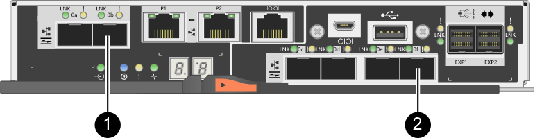

= Anforderungen für das Ändern des Host-Port-Protokolls – E2800
:allow-uri-read: 
:icons: font
:imagesdir: ../media/

[role="lead"]
Überprüfen Sie vor der Konvertierung des Host-Protokolls für ein E2800 Array die Anforderungen.

== Host-Ports, die Sie ändern können

NOTE: Es können nur 16-GB-FC-/10-GB-iSCSI-HICs und optische Basis-Ports auf einem E2800 Controller konvertiert werden.

Die folgende Abbildung zeigt die Rückseite eines E2800 Controllers mit zwei SFP+ (optisch) Baseboard-Host-Ports *(1)* und vier SFP+ (optisch) HIC-Ports *(2)*.

image::../media/28_dwg_e2800_optical_base_quad_sfp_hic.gif[Host- und HIC-Ports auf einem E2800 Controller“]

NOTE: Eine HIC mit zwei Ports ist ebenfalls erhältlich.

Der E2800 Controller oder Controller in Ihrem Storage-Array können verschiedene Arten von Baseboard-Host-Ports und verschiedene Arten von HIC-Ports haben. Die Tabelle zeigt, welche Host-Ports mit einem Funktionspaket geändert werden können.

|===
| Wenn Sie diese Baseboard Host Ports haben... | Und Sie haben diese HIC-Ports... | Sie können... 

 a| 
Zwei SFP+-Ports (optisch)
 a| 
Keine
 a| 
Nur die Baseboard-Host-Ports

 a| 
Zwei SFP+-Ports (optisch)
 a| 
Vier SFP+-Ports (optisch)
 a| 
Alle Ports

 a| 
Zwei SFP+-Ports (optisch)
 a| 
Zwei SFP+-Ports (optisch)
 a| 
Alle Ports

 a| 
Zwei SFP+-Ports (optisch)
 a| 
Zwei oder vier SAS-Ports
 a| 
Nur die Baseboard-Host-Ports

 a| 
Zwei SFP+-Ports (optisch)
 a| 
Zwei RJ-45-Anschlüsse (Base-T)
 a| 
Nur die Baseboard-Host-Ports

 a| 
Zwei RJ-45-Anschlüsse (Base-T)
 a| 
Keine
 a| 
Keine der Ports

 a| 
Zwei RJ-45-Anschlüsse (Base-T)
 a| 
Zwei RJ-45-Anschlüsse (Base-T)
 a| 
Keine der Ports

|===
Die Baseboard-Host-Ports und die HIC-Ports können das gleiche Host-Protokoll oder verschiedene Host-Protokolle verwenden.

== Anforderungen für die Änderung des Host-Protokolls

* Sie müssen für dieses Verfahren ein Wartungsfenster zur Ausfallzeit planen.
* Sie müssen Host-I/O-Vorgänge stoppen, wenn Sie die Konvertierung durchführen, und Sie können nicht auf Daten auf dem Speicher-Array zugreifen, bis Sie die Konvertierung erfolgreich abgeschlossen haben.
* Sie müssen Out-of-Band-Management verwenden. (Sie können dieses Verfahren nicht mit der bandinternen Verwaltung abschließen.)
* Sie haben die erforderliche Hardware für die Konvertierung erhalten. Ihr NetApp Vertriebsmitarbeiter hilft Ihnen dabei, die benötigte Hardware zu ermitteln und die richtigen Teile zu bestellen.
* Wenn Sie versuchen, die Baseboard Host Ports Ihres Storage Arrays zu ändern und derzeit Dual-Protokoll-Transceiver (auch als _Unified_ bezeichnet) SFP Transceiver zu verwenden, die Sie von NetApp gekauft haben, müssen Sie Ihre SFP-Transceiver nicht ändern.
* Stellen Sie sicher, dass die Dual-Protokoll-SFP-Transceiver sowohl FC (mit 4 Gbit/s, 16 Gbit/s) als auch iSCSI (mit 10 Gbit/s) unterstützen, jedoch keine 1 Gbit/s iSCSI. Siehe link:../maintenance-e2800/hpp-change-host-protocol-task.html["Schritt: Bestimmen Sie, ob Sie SFPs mit zwei Protokollen haben"] Um zu bestimmen, welche Art von SFP-Transceivern installiert ist.

== Überlegungen beim Ändern des Host-Protokolls

Die Überlegungen zum Ändern des Host-Protokolls hängen von den Start- und Endprotokollen der Baseboard-Host-Ports und den HIC-Ports ab.

Wenn Sie eine Funktion zur Spiegelung oder die Funktion Data Assurance (da) verwenden, müssen Sie wissen, was mit diesen Funktionen geschieht, wenn Sie das Host-Port-Protokoll wie unten beschrieben ändern.

NOTE: Die folgenden Überlegungen gelten nur, wenn Sie ein bereits in Gebrauch getes Speicher-Array konvertieren. Diese Überlegungen gelten nicht, wenn Sie ein neues Speicher-Array konvertieren, das noch keine Hosts und Volumes definiert hat.

=== Konvertierung von FC zu iSCSI

* Wenn Ihre Konfiguration SAN-Boot-Hosts enthält, die mit den FC-Baseboard-Ports verbunden sind, überprüfen Sie den https://mysupport.netapp.com/NOW/products/interoperability["NetApp Interoperabilitätsmatrix"^] Tool, um sicherzustellen, dass die Konfiguration auf iSCSI unterstützt wird. Wenn dies nicht der Fall ist, können Sie das Host-Protokoll nicht in iSCSI konvertieren.
* Die da-Funktion wird für iSCSI nicht unterstützt.
+
** Wenn Sie derzeit DA verwenden und FC-Host-Ports in iSCSI konvertieren möchten, müssen Sie da auf allen Volumes deaktivieren.
** Wenn Sie vor der Konvertierung in iSCSI nicht DA deaktivieren, ist das Speicher-Array nach der Konvertierung nicht mehr konform.

* Die Funktion Synchronous Mirroring wird für iSCSI nicht unterstützt.
+
** Wenn Sie derzeit synchrone Spiegelung-Beziehungen verwenden und FC-Host-Ports in iSCSI konvertieren möchten, müssen Sie die synchrone Spiegelung deaktivieren.
** In der Online-Hilfe von SANtricity System Manager können Sie alle synchronen gespiegelten Paare entfernen, die Spiegelbeziehungen auf dem lokalen Storage Array und auf dem Remote Storage Array entfernen. Befolgen Sie darüber hinaus die Anweisungen in der Online-Hilfe, um Synchronous Mirroring zu deaktivieren.
+

CAUTION: Wenn Sie die Synchronous Mirroring-Beziehungen vor der Konvertierung in iSCSI nicht deaktivieren, kann es zu Datenverlusten und Datenverlust kommen.

* Für die asynchrone Spiegelung muss sowohl das lokale Storage-Array als auch das Remote-Storage-Array dasselbe Protokoll verwenden.
+
** Wenn Sie derzeit asynchrone Spiegelung verwenden und alle Host-Ports von FC zu iSCSI konvertieren möchten, müssen Sie die asynchrone Spiegelung deaktivieren, bevor Sie das Funktionspaket anwenden.
** Löschen Sie alle gespiegelten Konsistenzgruppen in der Online-Hilfe von SANtricity System Manager und entfernen Sie alle gespiegelten Paare aus dem lokalen und Remote Storage Arrays. Befolgen Sie außerdem die Anweisungen in der Online-Hilfe, um Asynchronous Mirroring zu deaktivieren.

=== Konvertierung von iSCSI zu FC

* Für die asynchrone Spiegelung muss sowohl das lokale Storage-Array als auch das Remote-Storage-Array dasselbe Protokoll verwenden. Wenn Sie derzeit asynchrone Spiegelung mit den Baseboard-Ports verwenden, müssen Sie das asynchrone Spiegeln deaktivieren, bevor Sie das Protokoll ändern.
* Löschen Sie alle gespiegelten Konsistenzgruppen in der Online-Hilfe von SANtricity System Manager und entfernen Sie alle gespiegelten Paare aus dem lokalen und Remote Storage Arrays. Befolgen Sie außerdem die Anweisungen in der Online-Hilfe, um Asynchronous Mirroring zu deaktivieren.

=== Konvertierung von FC zu FC/iSCSI

Überlegungen zur Spiegelung:

* Synchrones Spiegeln wird für iSCSI nicht unterstützt.
* Wenn ein Speicher-Array, das für die Spiegelung verwendet wird, derzeit nur FC-Ports hat und Sie einige von ihnen in iSCSI konvertieren möchten, müssen Sie bestimmen, welche Ports für die Spiegelung verwendet werden.
* Sie müssen die Ports im lokalen Speicher-Array und im Remote-Speicher-Array nicht in dasselbe Protokoll konvertieren, solange beide Speicher-Arrays nach der Konvertierung mindestens einen aktiven FC-Port aufweisen.
* Wenn Sie die Ports, die für gespiegelte Beziehungen verwendet werden, konvertieren möchten, müssen Sie alle synchronen oder asynchronen Spiegelbeziehungen deaktivieren, bevor Sie das Funktionspaket anwenden.
* Wenn Sie die Ports, die zur Spiegelung verwendet werden, konvertieren möchten, werden asynchrone Spiegelungsvorgänge nicht beeinträchtigt.
* Bevor Sie das Feature Pack anwenden, sollten Sie bestätigen, dass alle Spiegelkonsistency Groups synchronisiert werden. Nach dem Anwenden des Feature Packs sollten Sie die Kommunikation zwischen dem lokalen Speicher-Array und dem Remote-Speicher-Array testen.

Überlegungen zu Datensicherheit:

* Die Data Assurance (da)-Funktion wird für iSCSI nicht unterstützt.
+
Um sicherzustellen, dass der Datenzugriff nicht unterbrochen wird, müssen Sie vor dem Anwenden des Feature Packs unter Umständen da-Volumes aus Host-Clustern neu zuordnen oder entfernen.

+

NOTE: Data Assurance Funktion für iSCSI wird von SANtricity Version 11.40 und neuer unterstützt.

+
|===
| Ihr habt... | Sie müssen... 

 a| 
DA Volumes im Standard-Cluster
 a| 
Ordnen Sie alle da-Volumes im Standardcluster neu zu.

** Wenn Sie da-Volumes nicht zwischen Hosts freigeben möchten, führen Sie die folgenden Schritte aus:
+
... Erstellen Sie für jeden Satz von FC-Host-Ports eine Host-Partition (sofern dies nicht bereits geschehen ist).
... Weisen Sie die da-Volumes den entsprechenden Host-Ports erneut zu.

** Wenn Sie da-Volumes zwischen Hosts freigeben möchten, führen Sie die folgenden Schritte aus:
+
... Erstellen Sie für jeden Satz von FC-Host-Ports eine Host-Partition (sofern dies nicht bereits geschehen ist).
... Erstellen Sie ein Host-Cluster, das die entsprechenden Host-Ports enthält.
... Weisen Sie die da-Volumes dem neuen Hostcluster erneut zu.
+

NOTE: Durch diesen Ansatz wird der Volume-Zugriff auf alle Volumes verhindert, die im Standard-Cluster verbleiben.

 a| 
DA Sie Volumes in einem Host-Cluster ABSCHAFFEN, der ausschließlich FC-Hosts enthält, und Sie möchten reine iSCSI-Hosts hinzufügen
 a| 
Entfernen Sie mit einer dieser Optionen alle dem Cluster gehörenden da-Volumes.

NOTE: DA-Volumes können in diesem Szenario nicht gemeinsam genutzt werden.

** Wenn Sie da-Volumes nicht zwischen Hosts teilen möchten, weisen Sie alle da-Volumes einzelnen FC-Hosts innerhalb des Clusters neu zu.
** Trennen Sie die reinen iSCSI-Hosts in ihrem eigenen Host-Cluster und behalten Sie den FC-Host-Cluster wie er ist (mit gemeinsamen da-Volumes).
** Fügen Sie einen FC-HBA zu den nur-iSCSI-Hosts hinzu, um die gemeinsame Nutzung von da- und nicht-DA-Volumes zu ermöglichen.

 a| 
DA Volumes in einem Host-Cluster, der reine FC-Hosts enthält, oder da-Volumes, die einer einzelnen FC-Host-Partition zugeordnet sind
 a| 
Vor dem Anwenden des Feature Packs ist keine Aktion erforderlich. DA-Volumes bleiben ihrem jeweiligen FC-Host zugeordnet.

 a| 
Keine Partitionen definiert
 a| 
Vor dem Anwenden des Feature Packs ist keine Aktion erforderlich, da derzeit keine Volumes zugeordnet sind. Befolgen Sie nach dem Konvertieren des Host-Protokolls das richtige Verfahren, um Host-Partitionen und, falls gewünscht, Host-Cluster zu erstellen.

|===

=== Konvertierung von iSCSI zu FC/iSCSI

* Wenn Sie einen Port konvertieren möchten, der für die Spiegelung verwendet wird, müssen Sie die Spiegelungsbeziehungen zu einem Port verschieben, der nach der Konvertierung iSCSI bleibt.
+
Andernfalls kann die Kommunikationsverbindung nach der Konvertierung ausgefallen sein, weil ein Protokoll nicht stimmt zwischen dem neuen FC-Port auf dem lokalen Array und dem bestehenden iSCSI-Port auf dem Remote-Array.

* Wenn Sie die Ports, die nicht für die Spiegelung verwendet werden, konvertieren möchten, werden asynchrone Spiegelungsvorgänge nicht beeinträchtigt.
+
Bevor Sie das Feature Pack anwenden, sollten Sie bestätigen, dass alle Spiegelkonsistency Groups synchronisiert werden. Nach dem Anwenden des Feature Packs sollten Sie die Kommunikation zwischen dem lokalen Speicher-Array und dem Remote-Speicher-Array testen.

=== Konvertierung von FC/iSCSI zu FC

* Wenn alle Host-Ports zu FC konvertiert werden, beachten Sie, dass asynchrone Spiegelung über FC auf dem FC-Port mit der höchsten Nummer erfolgen muss.
* Wenn Sie planen, die für gespiegelte Beziehungen verwendeten Ports zu konvertieren, müssen Sie diese Beziehungen deaktivieren, bevor Sie das Feature Pack anwenden.
+

CAUTION: *Möglicher Datenverlust* -- Wenn Sie die asynchronen Spiegelungsbeziehungen, die über iSCSI vor der Umwandlung der Ports in FC aufgetreten sind nicht löschen, können die Controller gesperrt werden, und Sie können Daten verlieren.

* Wenn das Storage-Array derzeit iSCSI-Baseboard-Ports und FC-HIC-Ports besitzt, werden asynchrone Spiegelungsvorgänge nicht beeinträchtigt.
+
Vor und nach der Konvertierung erfolgt die Spiegelung auf dem FC-Port mit der höchsten Nummer, der weiterhin den HIC-Port mit der Bezeichnung *2* in der Abbildung erhält. Bevor Sie das Feature Pack anwenden, sollten Sie bestätigen, dass alle Spiegelkonsistency Groups synchronisiert werden. Nach dem Anwenden des Feature Packs sollten Sie die Kommunikation zwischen dem lokalen Speicher-Array und dem Remote-Speicher-Array testen.

* Wenn das Storage-Array derzeit FC-Baseboard-Ports und iSCSI-HIC-Ports besitzt, müssen Sie alle über FC auftretenden Spiegelungsbeziehungen löschen, bevor Sie das Funktionspaket anwenden.
+
Wenn Sie das Feature Pack anwenden, wird die Spiegelungsunterstützung vom Host-Port mit der höchsten Nummer (in der Abbildung mit *1* beschriftet) zum HIC-Port mit der höchsten Nummer (in der Abbildung * 2*) verschoben.

+

+
|===
3+| Vor der Konvertierung 3+| Nach der Konvertierung .2+| Erforderliche Schritte 

| Baseboard-Ports | HIC-Ports | Für die Spiegelung verwendeter Port | Baseboard-Ports | HIC-Ports | Für die Spiegelung verwendeter Port 

 a| 
ISCSI
 a| 
FC
 a| 
*(2)*
 a| 
FC
 a| 
FC
 a| 
*(2)*
 a| 
Synchronisieren Sie die Spiegelkonsistency Groups vor und testen Sie danach die Kommunikation

 a| 
FC
 a| 
ISCSI
 a| 
*(1)*
 a| 
FC
 a| 
FC
 a| 
*(2)*
 a| 
Löschen Sie Spiegelungsbeziehungen vor und stellen Sie die Spiegelung danach wieder her

|===

=== Konvertierung von FC/iSCSI zu iSCSI

* Synchrones Spiegeln wird für iSCSI nicht unterstützt.
* Wenn Sie die Ports, die für gespiegelte Beziehungen verwendet werden, konvertieren möchten, müssen Sie Spiegelungsbeziehungen deaktivieren, bevor Sie das Funktionspaket anwenden.
+

CAUTION: *Möglicher Datenverlust* -- Wenn Sie nicht löschen die Spiegelungsbeziehungen, die über FC vor der Konvertierung der Ports in iSCSI auftraten, können die Controller gesperrt werden, und Sie könnten Daten verlieren.

* Wenn Sie die Ports, die zur Spiegelung verwendet werden, nicht konvertieren möchten, werden Spiegelungsvorgänge nicht beeinträchtigt.
* Bevor Sie das Feature Pack anwenden, sollten Sie bestätigen, dass alle Spiegelkonsistency Groups synchronisiert werden.
* Nach dem Anwenden des Feature Packs sollten Sie die Kommunikation zwischen dem lokalen Speicher-Array und dem Remote-Speicher-Array testen.

=== Dasselbe Host-Protokoll und dieselben Spiegelungsvorgänge

Spiegelungsvorgänge werden nicht beeinträchtigt, wenn die Host-Ports, die für die Spiegelung genutzt werden, dasselbe Protokoll beibehalten, nachdem Sie das Funktionspaket angewendet haben. Selbst vor dem Anwenden des Feature Packs sollten Sie vor dem Anwenden bestätigen, dass alle Konsistenzgruppen der Spiegelung synchronisiert werden.

Nach dem Anwenden des Feature Packs sollten Sie die Kommunikation zwischen dem lokalen Speicher-Array und dem Remote-Speicher-Array testen. Lesen Sie die Online-Hilfe für den SANtricity System Manager, wenn Sie Fragen dazu haben.
