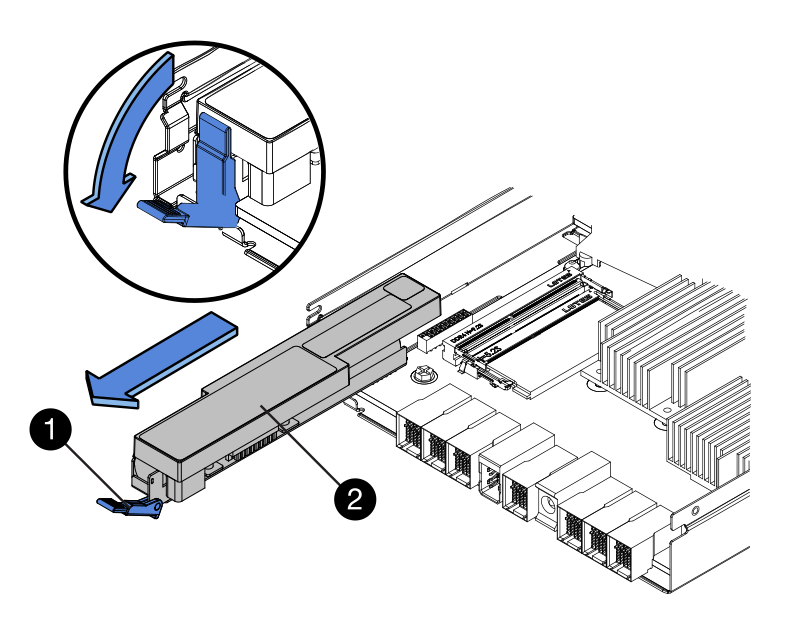

= E5700-Akku austauschen
:allow-uri-read: 
:experimental: 
:icons: font
:imagesdir: ../media/

[role="lead"]
Sie können eine fehlerhafte Batterie in einem E5700 Storage-System ersetzen.

.Über diese Aufgabe
Jeder E5700 Controller-Behälter enthält eine Batterie, die im Cache gespeicherte Daten erhält, wenn die Wechselstromversorgung ausfällt. Wenn der Recovery Guru im SANtricity System Manager entweder den Status „Batterie ausgefallen“ oder den Status „Batteriewechsel erforderlich“ meldet, müssen Sie die betroffene Batterie austauschen.

.Bevor Sie beginnen
* Überprüfen Sie, ob keine Volumes verwendet werden oder ob auf allen Hosts, die diese Volumes verwenden, ein Multipath-Treiber installiert ist.
* Prüfen link:batteries-intro-concept.html["Anforderungen für den Austausch von E5700-Batterien"].
* Stellen Sie sicher, dass Sie Folgendes haben:
+
** Eine Ersatzbatterie.
** Ein ESD-Armband, oder Sie haben andere antistatische Vorsichtsmaßnahmen getroffen.
** Etiketten, um jedes Kabel zu identifizieren, das mit dem Controller-Behälter verbunden ist.
** Eine Management Station mit einem Browser, der für den Controller auf den SANtricity System Manager zugreifen kann. (Zeigen Sie zum Öffnen der System Manager-Schnittstelle den Domain-Namen oder die IP-Adresse des Controllers im Browser.)

== Schritt 1: Controller offline setzen (Duplex)

Wenn Sie über eine Duplexkonfiguration verfügen, legen Sie den betroffenen Controller offline, sodass Sie den fehlerhaften Akku sicher entfernen können. Der Controller, den Sie nicht in den Offline-Modus versetzen, muss den Status „Online“ (im optimalen Status) aufweisen.

NOTE: Führen Sie diese Aufgabe nur aus, wenn Ihr Speicher-Array über zwei Controller verfügt (Duplexkonfiguration).

.Schritte
. Sehen Sie sich im SANtricity System Manager die Details im Recovery Guru an, um zu überprüfen, ob ein Problem mit einer Batterie vorliegt, und um sicherzustellen, dass keine weiteren Punkte zuerst behoben werden müssen.
. Stellen Sie im Bereich Details des Recovery Guru fest, welche Batterie ersetzt werden soll.
. Sichern Sie die Konfigurationsdatenbank des Storage-Arrays mit SANtricity System Manager.
+
Wenn beim Entfernen eines Controllers ein Problem auftritt, können Sie die gespeicherte Datei verwenden, um Ihre Konfiguration wiederherzustellen. Das System speichert den aktuellen Status der RAID-Konfigurationsdatenbank, die alle Daten für Volume-Gruppen und Festplatten-Pools auf dem Controller enthält.

+
** Über den SANtricity System Manager:
+
... Wählen Sie MENU:Support[Support Center > Diagnose].
... Wählen Sie *Konfigurationsdaten Erfassen*.
... Klicken Sie Auf *Collect*.
+
Die Datei wird im Ordner Downloads für Ihren Browser mit dem Namen *configurationData-<arrayName>-<dateTime>.7z* gespeichert.

** Alternativ können Sie die Konfigurationsdatenbank mit dem folgenden CLI-Befehl sichern:
+
`save storageArray dbmDatabase sourceLocation=onboard contentType=all file="filename";`

. Support-Daten für Ihr Storage Array mit SANtricity System Manager erfassen
+
Wenn beim Entfernen eines Controllers ein Problem auftritt, können Sie die gespeicherte Datei zum Beheben des Problems verwenden. Das System speichert Bestands-, Status- und Performancedaten Ihres Speicherarrays in einer einzelnen Datei.

+
.. Wählen Sie MENU:Support[Support Center > Diagnose].
.. Wählen Sie *Support-Daten Erfassen* Aus.
.. Klicken Sie Auf *Collect*.
+
Die Datei wird im Ordner Downloads für Ihren Browser mit dem Namen *Support-Data.7z* gespeichert.

. Wenn der Controller nicht bereits offline ist, versetzen Sie ihn jetzt mithilfe von SANtricity System Manager in den Offline-Modus.
+
** Über den SANtricity System Manager:
+
... Wählen Sie *Hardware*.
... Wenn die Grafik die Laufwerke anzeigt, wählen Sie *Zurück vom Shelf anzeigen* aus, um die Controller anzuzeigen.
... Wählen Sie den Controller aus, den Sie in den Offline-Modus versetzen möchten.
... Wählen Sie im Kontextmenü die Option *Offline platzieren* aus, und bestätigen Sie, dass Sie den Vorgang ausführen möchten.
+

NOTE: Wenn Sie mit dem Controller auf SANtricity System Manager zugreifen, den Sie offline schalten möchten, wird eine Meldung vom SANtricity System Manager nicht verfügbar angezeigt. Wählen Sie *mit einer alternativen Netzwerkverbindung verbinden* aus, um automatisch über den anderen Controller auf SANtricity System Manager zuzugreifen.

** Alternativ können Sie die Controller mit den folgenden CLI-Befehlen offline schalten:
+
* Für Steuerung A:* `set controller [a] availability=offline`

+
* Für Regler B:* `set controller [b] availability=offline`

. Warten Sie, bis SANtricity System Manager den Status des Controllers auf „Offline“ aktualisiert.
+

CAUTION: Beginnen Sie keine anderen Vorgänge, bis der Status aktualisiert wurde.

== Schritt 2: Controller-Behälter entfernen

Bevor Sie den defekten Akku entfernen können, müssen Sie den Controller-Behälter entfernen.

.Schritte
. Setzen Sie ein ESD-Armband an oder ergreifen Sie andere antistatische Vorsichtsmaßnahmen.
. Beschriften Sie jedes Kabel, das am Controller-Behälter befestigt ist.
. Trennen Sie alle Kabel vom Controller-Behälter.
+

CAUTION: Um eine verminderte Leistung zu vermeiden, dürfen die Kabel nicht verdreht, gefaltet, gequetscht oder treten.

. Wenn die Host-Ports am Controller-Behälter SFP+-Transceiver verwenden, lassen Sie sie nicht installiert.
. Vergewissern Sie sich, dass die LED Cache Active auf der Rückseite des Controllers ausgeschaltet ist.
. Drücken Sie den Riegel am Nockengriff, bis er loslässt, und öffnen Sie dann den Nockengriff nach rechts, um den Steuerkanister aus dem Regal zu lösen.
+
Die folgende Abbildung ist ein Beispiel für ein E5724 Controller-Shelf:

+
image::../media/28_dwg_e2824_remove_controller_canister_maint-e5700.gif[Controller-Behälter ausbauen]

+
*(1)* _Controller-Behälter_

+
*(2)* _Cam Griff_

+
Die folgende Abbildung ist ein Beispiel für ein E5760 Controller-Shelf:

+
image::../media/28_dwg_e2860_add_controller_canister_maint-e5700.gif[Controller-Behälter ausbauen]

+
*(1)* _Controller-Behälter_

+
*(2)* _Cam Griff_

. Schieben Sie den Controller-Behälter mit zwei Händen und dem Nockengriff aus dem Regal.
+

CAUTION: Verwenden Sie immer zwei Hände, um das Gewicht eines Reglerkanisters zu unterstützen.

+
Wenn Sie den Controller-Behälter aus einem E5724-Controller-Regal entfernen, schwingt eine Klappe an ihrer Stelle, um den leeren Schacht zu blockieren, was zu einer Aufrechterhaltung des Luftstroms und der Kühlung beiträgt.

. Drehen Sie den Controller-Behälter so um, dass die abnehmbare Abdeckung nach oben zeigt.
. Setzen Sie den Steuerungsbehälter auf eine flache, statisch freie Oberfläche.

== Schritt 3: Fehlerhafte Batterie entfernen

Nachdem Sie den Controller-Behälter aus dem Controller-Regal entfernt haben, entfernen Sie den Akku.

.Schritte
. Entfernen Sie die Abdeckung des Reglerkanisters, indem Sie die Taste nach unten drücken und die Abdeckung abnehmen.
. Vergewissern Sie sich, dass die grüne LED im Controller (zwischen Akku und DIMMs) aus ist.
+
Wenn diese grüne LED leuchtet, wird der Controller weiterhin mit Strom versorgt. Sie müssen warten, bis diese LED erlischt, bevor Sie Komponenten entfernen.

+
image::../media/28_dwg_e2800_internal_cache_active_led_maint-e5700.gif[LED für aktiven internen Cache]

+
*(1)* _LED Interner Cache aktiv_

+
*(2)* _Akku_

. Suchen Sie den blauen Freigabehebel für die Batterie.
. Entriegeln Sie den Akku, indem Sie den Freigabehebel nach unten und vom Controller-Behälter wegdrücken.
+

+
*(1)* _Entriegelung der Batterie_

+
*(2)* _Akku_

. Heben Sie den Akku an, und schieben Sie ihn aus dem Controller-Behälter.
. Befolgen Sie die für Ihren Standort geeigneten Verfahren, um den defekten Akku zu recyceln oder zu entsorgen.
+

CAUTION: Um die International Air Transport Association (IATA) Bestimmungen zu erfüllen, dürfen Sie nur dann eine Lithiumbatterie mit Luft versenden, wenn sie im Regal des Regals installiert ist.

== Schritt 4: Neue Batterie einbauen

Installieren Sie nach dem Entfernen der fehlerhaften Batterie eine neue.

.Schritte
. Packen Sie den neuen Akku aus, und stellen Sie ihn auf eine flache, statische Oberfläche.
+

NOTE: Zur sicheren Einhaltung der IATA-Vorschriften werden Ersatzbatterien mit einem Ladestatus von 30 Prozent oder weniger (SoC) ausgeliefert. Wenn Sie die Stromversorgung wieder einschalten, beachten Sie, dass das Schreib-Caching erst wieder aufgenommen wird, wenn der Ersatzakku vollständig geladen ist und der erste Lernzyklus abgeschlossen wurde.

. Richten Sie den Controller-Behälter so aus, dass der Steckplatz für die Batterie zu Ihnen zeigt.
. Setzen Sie den Akku in einem leichten Abwärtswinkel in den Controller-Behälter ein.
+
Sie müssen den Metallflansch an der Vorderseite der Batterie in den Schlitz an der Unterseite des Controller-Kanisters stecken und die Oberseite der Batterie unter den kleinen Ausrichtstift auf der linken Seite des Kanisters schieben.

. Schieben Sie die Akkuverriegelung nach oben, um die Batterie zu sichern.
+
Wenn die Verriegelung einrastet, Haken unten an der Verriegelung in einen Metallschlitz am Gehäuse.

+
image::../media/28_dwg_e2800_insert_battery_maint-e5700.gif[Batterie einlegen]

+
*(1)* _Entriegelung der Batterie_

+
*(2)* _Akku_

. Drehen Sie den Controller-Behälter um, um zu bestätigen, dass der Akku ordnungsgemäß installiert ist.
+

CAUTION: *Möglicher Hardwareschaden* -- der Metallflansch an der Vorderseite der Batterie muss vollständig in den Schlitz am Controller-Behälter eingesetzt werden (wie in der ersten Abbildung dargestellt). Wenn der Akku nicht richtig eingesetzt ist (wie in der zweiten Abbildung dargestellt), kann der Metallflansch die Controllerplatine kontaktieren, was beim Einschalten der Stromversorgung zu einer Beschädigung des Controllers führt.

+
** *Korrekt* -- der Metallflansch der Batterie ist vollständig in den Steckplatz am Controller eingesetzt:
+
image:../media/28_dwg_e2800_battery_flange_ok_maint-e5700.gif["Batterieflansch korrigieren"]

** *Incorrect* -- der Metallflansch der Batterie ist nicht in den Steckplatz am Controller eingelegt:
+
image:../media/28_dwg_e2800_battery_flange_not_ok_maint-e5700.gif["Falscher Batterieflansch"]

== Schritt 5: Installieren Sie den Controller-Behälter neu

Setzen Sie nach dem Einbau der neuen Batterie den Controller-Behälter wieder in das Reglerregal ein.

.Schritte
. Setzen Sie die Abdeckung am Controller-Behälter wieder ein, indem Sie die Abdeckung von hinten nach vorne schieben, bis die Taste einrastet.
. Drehen Sie den Controller-Behälter so um, dass die abnehmbare Abdeckung nach unten zeigt.
. Schieben Sie den Steuerkanister bei geöffnetem Nockengriff vollständig in das Reglerregal.
+
image::../media/28_dwg_e2824_remove_controller_canister_maint-e5700.gif[Setzen Sie den Controller-Behälter wieder ein]

+
*(1)* _Controller-Behälter_

+
*(2)* _Cam Griff_

+
image::../media/28_dwg_e2860_add_controller_canister_maint-e5700.gif[Setzen Sie den Controller-Behälter wieder ein]

+
*(1)* _Controller-Behälter_

+
*(2)* _Cam Griff_

. Bewegen Sie den Nockengriff nach links, um den Steuerkanister zu verriegeln.
. Schließen Sie alle Kabel wieder an.

== Schritt 6: Controller online stellen (Duplex)

Legen Sie bei einer Duplexkonfiguration den Controller online, sammeln Sie Support-Daten und setzen Sie den Betrieb fort.

NOTE: Führen Sie diese Aufgabe nur aus, wenn Ihr Speicher-Array über zwei Controller verfügt.

.Schritte
. Überprüfen Sie beim Booten des Controllers die Controller-LEDs und die siebenSegment-Anzeige.
+

NOTE: Die Abbildung zeigt einen Beispiel-Controller-Behälter. Ihr Controller kann über eine andere Anzahl und einen anderen Typ von Host-Ports verfügen.

+
Wenn die Kommunikation mit der anderen Steuerung wiederhergestellt wird:

+
** Die 7-Segment-Anzeige zeigt die sich wiederholende Sequenz *OS*, *OL*, *_blank_* an, um anzuzeigen, dass der Controller offline ist.
** Die gelbe Warn-LED leuchtet weiterhin.
** Je nach Host-Schnittstelle leuchten die Host-Link-LEDs möglicherweise auf, blinken oder leuchten nicht. image:../media/e5700_hic_3_callouts_maint-e5700.gif["LEDs für E5700 Controller"]
+
*(1)* _Host Link LEDs_

+
*(2)* _Warn-LED (gelb)_

+
*(3)* _Sieben-Segment-Anzeige_

. Stellen Sie den Controller mit SANtricity System Manager online.
+
** Über den SANtricity System Manager:
+
... Wählen Sie *Hardware*.
... Wenn die Grafik die Laufwerke anzeigt, wählen Sie *Zurück von Regal anzeigen*.
... Wählen Sie den Controller aus, den Sie online platzieren möchten.
... Wählen Sie im Kontextmenü * Online platzieren* aus, und bestätigen Sie, dass Sie den Vorgang ausführen möchten.
+
Das System stellt den Controller online.

** Alternativ können Sie die Controller mit den folgenden CLI-Befehlen online schalten:
+
* Für Steuerung A:* `set controller [a] availability=online;`

+
* Für Regler B:* `set controller [b] availability=online;`

. Wenn der Controller wieder online ist, bestätigen Sie, dass sein Status optimal lautet, und überprüfen Sie die Warn-LEDs für das Controller-Shelf.
+
Wenn der Status nicht optimal ist oder eine der Warn-LEDs leuchtet, vergewissern Sie sich, dass alle Kabel richtig eingesetzt sind, und überprüfen Sie, ob die Batterie und der Controller-Behälter richtig installiert sind. Gegebenenfalls den Controller-Behälter und die Batterie ausbauen und wieder einbauen.

+

NOTE: Wenden Sie sich an den technischen Support, wenn das Problem nicht gelöst werden kann.

. Falls nötig, erfassen Sie mit SANtricity System Manager Support-Daten für Ihr Storage Array.
+
.. Wählen Sie *Support* > *Support Center* > *Diagnose*.
.. Wählen Sie *Support-Daten Erfassen* Aus.
.. Klicken Sie Auf *Collect*.
+
Die Datei wird im Ordner Downloads für Ihren Browser mit dem Namen *Support-Data.7z* gespeichert.

.Was kommt als Nächstes?
Der Austausch des Akkus ist abgeschlossen. Sie können den normalen Betrieb fortsetzen.
