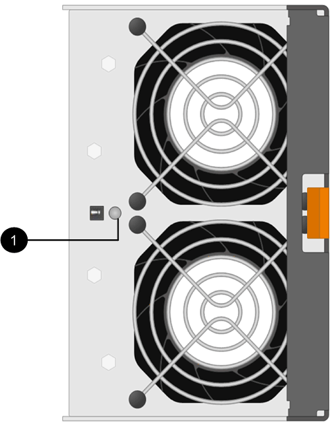

= Austausch des E5700 Lüfterkanisters (60 Laufwerke)
:allow-uri-read: 
:experimental: 
:icons: font
:imagesdir: ../media/

[role="lead"]
Ein Lüfterbehälter kann in einem E5700 Array durch ein Shelf mit 60 Laufwerken ersetzt werden, das folgende Shelf-Typen umfasst:

* E5760 Controller-Shelf
* DE460C Festplatten-Shelf

.Über diese Aufgabe
Jedes Controller-Shelf oder Laufwerks-Shelf für 60 Laufwerke enthält zwei Lüfter-Kanister. Wenn ein Lüfterbehälter ausfällt, müssen Sie ihn so schnell wie möglich austauschen, um sicherzustellen, dass das Regal ausreichend gekühlt wird.

CAUTION: *Möglicher Geräteschaden* -- Wenn Sie diesen Vorgang bei eingeschaltetes Strom durchführen, müssen Sie ihn innerhalb von 30 Minuten abschließen, um eine Überhitzung der Anlage zu verhindern.

.Bevor Sie beginnen
* Prüfen link:canisters-overview-supertask-concept.html["Anforderungen für den Austausch des E5700 Kanisters"].
* Überprüfen Sie die Details im Recovery Guru, um zu bestätigen, dass ein Problem mit einer Batterie vorliegt, und stellen Sie sicher, dass keine weiteren Punkte zuerst behoben werden müssen.
* Überprüfen Sie, ob die gelbe Warn-LED am Lüfterbehälter leuchtet und dass ein Fehler im Lüfter auftritt. Wenden Sie sich an den technischen Support, wenn die Warn-LEDs für beide Lüfterbehälter im Regal gelb leuchten.
* Stellen Sie sicher, dass Sie Folgendes haben:
+
** Ein Ersatzlüfterbehälter (Lüfter), der für Ihr Controller-Shelf- oder Festplatten-Shelf-Modell unterstützt wird.
** Ein ESD-Armband, oder Sie haben andere antistatische Vorsichtsmaßnahmen getroffen.
** Eine Management Station mit einem Browser, der für den Controller auf den SANtricity System Manager zugreifen kann. (Zeigen Sie zum Öffnen der System Manager-Schnittstelle den Domain-Namen oder die IP-Adresse des Controllers im Browser.)

== Schritt 1: Bereiten Sie den Austausch des Ventilatorkanisters vor

Bereiten Sie den Austausch eines Lüfterkanisters in einem Controller-Shelf mit 60 Laufwerken oder Festplatten vor.

.Schritte
. Support-Daten für Ihr Storage Array mit SANtricity System Manager erfassen
+
Wenn während dieses Verfahrens ein Problem auftritt, können Sie die gespeicherte Datei verwenden, um das Problem zu beheben. Das System speichert Bestands-, Status- und Performancedaten Ihres Speicherarrays in einer einzelnen Datei.

+
.. Wählen Sie MENU:Support[Support Center > Diagnose].
.. Wählen Sie *Support-Daten Erfassen* Aus.
.. Klicken Sie Auf *Collect*.
+
Die Datei wird im Ordner Downloads für Ihren Browser mit dem Namen *Support-Data.7z* gespeichert.

. Stellen Sie aus dem SANtricity-System-Manager fest, welcher Lüfterbehälter ausgefallen ist.
+
.. Wählen Sie *Hardware*.
.. Sehen Sie sich das Lüftersymbol image:../media/sam1130_ss_hardware_fan_icon_maint-e5700.gif["Lüftersymbol"]rechts neben der Dropdown-Liste *Regal* an, um festzustellen, welches Regal den defekten Lüfterbehälter hat.
+
Wenn eine Komponente ausgefallen ist, ist dieses Symbol rot.

.. Wenn Sie das Regal mit einem roten Symbol finden, wählen Sie *Zurück vom Regal anzeigen*.
.. Wählen Sie entweder Lüfterbehälter oder das rote Lüftersymbol.
.. Prüfen Sie auf der Registerkarte *Lüfter* die Status der Lüfterbehälter, um zu ermitteln, welcher Lüfterbehälter ersetzt werden muss.
+
Eine Komponente mit dem Status *failed* muss ersetzt werden.

+

CAUTION: Wenn der zweite Lüfterbehälter im Regal keinen *optimalen*-Status hat, versuchen Sie nicht, den defekten Lüfterbehälter zu tauschen. Wenden Sie sich stattdessen an den technischen Support, um Hilfe zu erhalten.

+
Informationen zum fehlgeschlagenen Lüfterbehälter finden Sie auch im Bereich Details des Recovery Guru oder Sie können das Event-Protokoll unter Support prüfen und nach Komponententyp filtern.

. Suchen Sie auf der Rückseite des Speicherarrays die Warn-LEDs, um den zu entfernenden Lüfterbehälter zu finden.
+
Sie müssen den Lüfterbehälter austauschen, dessen Warn-LED leuchtet.

+

+
*(1)* _Warn-LED_. Wenn diese LED als *gelb* angezeigt wird, weist der Lüfter einen Fehler auf.

== Schritt 2: Entfernen Sie den defekten Lüfterbehälter und installieren Sie einen neuen

Entfernen Sie einen defekten Lüfterbehälter, so dass Sie ihn durch einen neuen ersetzen können.

CAUTION: Wenn Sie die Stromversorgung des Speicherarrays nicht ausschalten, stellen Sie sicher, dass Sie den Lüfterbehälter innerhalb von 30 Minuten entfernen und austauschen, um zu verhindern, dass das System überhitzt.

.Schritte
. Packen Sie den neuen Lüfterbehälter aus, und legen Sie ihn auf eine Ebene Fläche in der Nähe des Regals.
+
Bewahren Sie das gesamte Verpackungsmaterial für die Verwendung auf, wenn Sie den defekten Lüfter zurücksenden.

. Drücken Sie die orangefarbene Lasche, um den Lüfterbehälter zu lösen.
+
image::../media/28_dwg_e2860_de460c_single_fan_canister_with_orange_tab_callout_maint-e5700.gif[Drücken Sie die orangefarbene Lasche, um den Griff des Lüfterbehälters zu lösen]

+
*(1)* _Tab, auf den Sie drücken, um den Lüfter-Kanister-Griff zu lösen._

. Ziehen Sie den Lüfterbehälter mithilfe des Griffs für den Lüfterbehälter aus dem Regal.
+
image::../media/28_dwg_e2860_de460c_fan_canister_handle_with_callout_maint-e5700.gif[Ziehen Sie den Lüfterbehälter mithilfe des Griffs heraus]

+
*(1)* _Griff zum Herausziehen des Ventilatorkanisters._

. Schieben Sie den Ersatzlüfterbehälter vollständig in das Regal und bewegen Sie dann den Griff des Lüfterbehälter, bis er mit der orangefarbenen Lasche einrastet.

== Schritt 3: Vollständige Lüfterbehälter Austausch

Überprüfen Sie, ob der neue Lüfterbehälter ordnungsgemäß funktioniert, sammeln Sie Support-Daten und setzen Sie den normalen Betrieb fort.

.Schritte
. Überprüfen Sie die gelbe Warn-LED am neuen Lüfterbehälter.
+

NOTE: Nachdem Sie den Lüfterbehälter ausgetauscht haben, leuchtet die Warn-LED weiterhin (gelb), während die Firmware überprüft, ob der Lüfterbehälter ordnungsgemäß installiert wurde. Nach Abschluss dieses Vorgangs erlischt die LED.

. Wählen Sie im Recovery Guru im SANtricity System Manager *recheck* aus, um sicherzustellen, dass das Problem behoben wurde.
. Wenn noch ein ausgefallener Lüfterbehälter gemeldet wird, wiederholen Sie die Schritte in <<Schritt 2: Entfernen Sie den defekten Lüfterbehälter und installieren Sie einen neuen>>. Wenn das Problem weiterhin besteht, wenden Sie sich an den technischen Support.
. Entfernen Sie den antistatischen Schutz.
. Support-Daten für Ihr Storage Array mit SANtricity System Manager erfassen
+
Wenn während dieses Verfahrens ein Problem auftritt, können Sie die gespeicherte Datei verwenden, um das Problem zu beheben. Das System speichert Bestands-, Status- und Performancedaten Ihres Speicherarrays in einer einzelnen Datei.

+
.. Wählen Sie MENU:Support[Support Center > Diagnose].
.. Wählen Sie *Support-Daten Erfassen* Aus.
.. Klicken Sie Auf *Collect*.
+
Die Datei wird im Ordner Downloads für Ihren Browser mit dem Namen *Support-Data.7z* gespeichert.

. Senden Sie das fehlerhafte Teil wie in den dem Kit beiliegenden RMA-Anweisungen beschrieben an NetApp zurück.

.Was kommt als Nächstes?
Der Austausch des Ventilatorkanals ist abgeschlossen. Sie können den normalen Betrieb fortsetzen.
