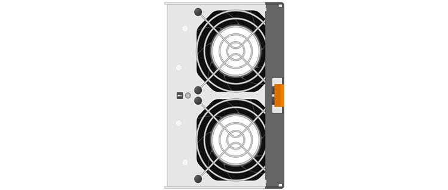

= Voraussetzungen für den Austausch des Kanisters – E5700
:allow-uri-read: 
:icons: font
:imagesdir: ../media/

[role="lead"]
Bevor Sie einen E5700-Behälter ersetzen, sollten Sie Anforderungen und Überlegungen überprüfen.

Behälter bestehen aus drei verschiedenen Typen: Stromverlüfter (Netzteile), die eine redundante Stromversorgung und eine ausreichende Kühlung in einem Controller-Shelf mit 12 Laufwerken oder 24 Laufwerken bereitstellen. Stromversorgungs-Behälter, die für Redundanz in einem Controller-Shelf für 60 Laufwerke oder Festplatten-Shelf verwendet werden. Und Lüfter-Kanister, die zum Kühlen des Controller-Shelfs für 60 Laufwerke oder des Laufwerks-Shelfs verwendet werden.

== Stromversorgung

NOTE: Das Verfahren zum Austausch der Stromversorgung gilt für den IOM-Austausch. Führen Sie zum Austauschen des EAM das Verfahren zum Austausch des Netzteils durch.

Jedes Controller-Shelf oder Laufwerk-Shelf für 24 Laufwerke enthält zwei Netzteile mit integrierten Lüftern. Diese werden im SANtricity-System-Manager als _Power-Fan-Behälter_ bezeichnet. Wenn ein Lüfter-Behälter ausfällt, müssen Sie ihn so schnell wie möglich austauschen, um sicherzustellen, dass das Regal über eine redundante Stromquelle und eine ausreichende Kühlung verfügt.

=== Shelf-Typen für ein Netzteil

Sie können ein Netzteil in den folgenden Shelves ersetzen:

* E5724 Controller Shelf
* DE224C Festplatten-Shelf

Die folgende Abbildung zeigt ein Beispiel für E5724 Controller-Shelf mit zwei Netzteilen (Lüfter-Behälter). Die DE224C Festplatten-Shelfs sind identisch, umfassen aber I/O-Module (IOMs) anstelle von Controller-Containern.

image::../media/e5700_power_supply_callout.png[E5700 Controller-Stromversorgung]

*(1)* _Controller-Regal mit zwei Netzteilen (Power-Fan-Kanister) unter den Controller-Kanistern._

In den Themen __replace Netzteil____ wird nicht beschrieben, wie ein ausgefallener Netzteil in einem DE1600 oder DE5600-Laufwerksfach ersetzt wird, der mit dem E5700 oder E2800 Controller-Shelfs verbunden sein kann. Anweisungen zu den Laufwerksfachmodellen finden Sie unter link:https://library.netapp.com/ecm/ecm_download_file/ECMP1140874["Ersetzen eines Netzlüfterkanisters im DE1600 Laufwerksfach oder DE5600 Laufwerksfach"].

=== Anforderungen für den Austausch eines Netzteils

Wenn Sie ein Netzteil austauschen möchten, beachten Sie die folgenden Anforderungen.

* Sie benötigen ein Ersatznetzteil (Lüfter-Behälter), das für Ihr Controller-Shelf- oder Festplatten-Shelf-Modell unterstützt wird.
* Sie müssen über ein ESD-Armband verfügen oder andere antistatische Vorsichtsmaßnahmen getroffen haben.
* Sie können ein Netzteil (Power-Fan-Behälter) ersetzen, während Ihr Speicher-Array eingeschaltet ist und Host-I/O-Vorgänge ausführt, sofern die folgenden Bedingungen erfüllt sind:
+
** Das zweite Netzteil (Power-Fan-Behälter) im Shelf hat einen optimalen Status.
** Im Feld *OK to remove* im Bereich Details des Recovery Guru im SANtricity System Manager wird *Ja* angezeigt, was darauf hinweist, dass es sicher ist, diese Komponente zu entfernen.
+

NOTE: Wenn das zweite Netzteil (Power-Fan-Behälter) im Shelf nicht über den optimalen Status verfügt oder wenn der Recovery Guru darauf hinweist, dass es nicht in Ordnung ist, den Lüfter-Behälter zu entfernen, wenden Sie sich an den technischen Support.

== Leistungsbehälter

Jedes Controller-Shelf oder Festplatten-Shelf für 60 Laufwerke enthält zwei Stromankanister für Redundanz.

=== Regaltypen für einen Aktivkohlebehälter

Sie können einen Leistungsbehälter in den folgenden Regalen ersetzen:

* E5760 Controller-Shelfs
* DE460C Festplatten-Shelf

In den Themen _Replace Power Canister_ wird nicht beschrieben, wie ein ausgefallener Strombehälter in einem DE6600-Laufwerksfach ersetzt werden kann, der möglicherweise an das Controller-Shelf angeschlossen ist.

Die folgende Abbildung zeigt die Rückseite eines DE460C Festplatten-Shelfs mit den beiden Power Canisters:

image::../media/28_dwg_de460c_rear_no_callouts_maint-e5700.gif[DE460C mit zwei Leistungskanistern]

Die folgende Abbildung zeigt einen Leistungsbehälter:

image::../media/28_dwg_e2860_de460c_psu_maint-e5700.gif[Leistungsbehälter]

=== Anforderungen für den Austausch eines Netzkanisters

Wenn Sie einen Netzbehälter austauschen möchten, beachten Sie die folgenden Anforderungen.

* Sie haben einen Ersatznetzbehälter, der für Ihr Controller-Shelf- oder Festplatten-Shelf-Modell unterstützt wird.
* Sie haben einen Strombehälter, der installiert ist und läuft.
* Sie haben ein ESD-Armband oder andere antistatische Vorsichtsmaßnahmen getroffen.
* Sie können einen Netzbehälter ersetzen, während Ihr Speicher-Array eingeschaltet ist und Host-I/O-Vorgänge ausführt, sofern die folgenden Bedingungen erfüllt sind:
* Der andere Leistungsbehälter im Regal hat den optimalen Status.
+

NOTE: Während Sie das Verfahren durchführen, versorgt der andere Netzbehälter beide Lüfter mit Strom, um sicherzustellen, dass das Gerät nicht überhitzt.

* Im Feld *OK to remove* im Bereich Details des Recovery Guru im SANtricity System Manager wird *Ja* angezeigt, was darauf hinweist, dass es sicher ist, diese Komponente zu entfernen.
+

NOTE: Wenn der zweite Strombehälter im Regal keinen optimalen Status hat oder wenn der Recovery Guru angibt, dass es nicht in Ordnung ist, den Strombehälter zu entfernen, wenden Sie sich an den technischen Support.

== Gebläsebehälter

Jedes Controller-Shelf oder Laufwerks-Shelf für 60 Laufwerke enthält zwei Lüfter-Kanister.

=== Regaltypen für einen Lüfterbehälter

Sie können einen Lüfterbehälter in den folgenden Regalen ersetzen:

* E5760 Controller-Shelfs
* DE460C Festplatten-Shelf

Die Themen _Lüfterbehälter ersetzen_ beschreiben nicht, wie ein ausgefallener Lüfterbehälter in einem DE6600-Laufwerksfach ersetzt wird, der möglicherweise an das Controller-Shelf angeschlossen ist.

Die folgende Abbildung zeigt einen Lüfterbehälter:

Die folgende Abbildung zeigt die Rückseite eines DE460C Shelfs mit zwei Lüfterbehältern:

image::../media/28_dwg_de460c_rear_no_callouts_maint-e5700.gif[DE460C mit zwei Lüfterkanistern]

CAUTION: *Möglicher Geräteschaden* -- Wenn Sie einen Lüfterbehälter durch eingeschaltetes Strom ersetzen, müssen Sie den Austauschvorgang innerhalb von 30 Minuten abschließen, um eine Überhitzung der Anlage zu verhindern.

=== Anforderungen für den Austausch eines Lüfterkanisters

Wenn Sie einen Lüfterbehälter ersetzen möchten, beachten Sie die folgenden Anforderungen.

* Sie haben einen Ersatzlüfterbehälter (Lüfter), der für Ihr Controller-Shelf- oder Festplatten-Shelf-Modell unterstützt wird.
* Sie haben einen Lüfterbehälter, der installiert ist und läuft.
* Sie haben ein ESD-Armband oder andere antistatische Vorsichtsmaßnahmen getroffen.
* Wenn Sie dieses Verfahren bei eingeschaltter Stromversorgung durchführen, müssen Sie es innerhalb von 30 Minuten abschließen, um zu verhindern, dass das Gerät überhitzt wird.
* Sie können einen Lüfterbehälter ersetzen, während Ihr Speicher-Array eingeschaltet ist und Host-I/O-Vorgänge ausführt, sofern die folgenden Bedingungen erfüllt sind:
+
** Der zweite Gebläsebehälter im Regal hat einen optimalen Status.
** Im Feld *OK to remove* im Bereich Details des Recovery Guru im SANtricity System Manager wird *Ja* angezeigt, was darauf hinweist, dass es sicher ist, diese Komponente zu entfernen.
+

NOTE: Wenn der zweite Lüfterbehälter im Regal keinen optimalen Status hat oder wenn der Recovery Guru angibt, dass es nicht in Ordnung ist, den Lüfterbehälter zu entfernen, wenden Sie sich an den technischen Support.

