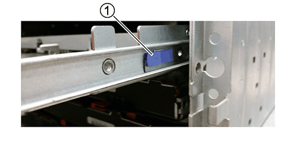

= Austauschen des E5700 Laufwerkseinschubs (60 Laufwerke)
:allow-uri-read: 
:experimental: 
:icons: font
:imagesdir: ../media/

[role="lead"]
Sie können eine Laufwerksschublade in einem E5700 Array ersetzen.

.Über diese Aufgabe
Die Schritte zum Ersetzen einer fehlerhaften Laufwerksschublade in einem E5760 Controller-Shelf oder einem DE460C Festplatten-Shelf hängen davon ab, ob die Volumes in der Schublade durch Abschubladenschutz geschützt sind. Wenn sich alle Volumes in der Laufwerksschublade in Festplattenpools oder Volume-Gruppen befinden, die einen Schubladenschutz besitzen, können Sie diesen Vorgang online ausführen. Andernfalls müssen Sie alle Host-I/O-Aktivitäten beenden und das Shelf ausschalten, bevor Sie das Laufwerkschublade ersetzen.

.Bevor Sie beginnen
* Überprüfen Sie die Anforderungen für die Festplattenbehandlung in link:drives-overview-supertask-concept.html["Anforderungen für den Austausch von E5700-Laufwerken"].
* Stellen Sie sicher, dass das Festplatten-Shelf alle folgenden Bedingungen erfüllt:
+
** Das Festplatten-Shelf darf nicht über die Temperatur liegen.
** Beide Lüfter müssen installiert sein und den Status „optimal“ aufweisen.
** Alle Festplatten-Shelf-Komponenten müssen vorhanden sein.
** Die Volumes in der Laufwerksschublade können nicht beeinträchtigt sein.

CAUTION: *Möglicher Verlust des Datenzugriffs* -- Wenn ein Volume sich bereits im beeinträchtigten Zustand befindet und Sie Laufwerke aus der Laufwerkschublade entfernen, kann das Volume fehlschlagen.

* Stellen Sie sicher, dass Sie Folgendes haben:
+
** Ein von NetApp unterstütztes Ersatzlaufwerk für Ihr Controller Shelf oder Festplatten-Shelf.
** Ein ESD-Armband, oder Sie haben andere antistatische Vorsichtsmaßnahmen getroffen.
** Eine Taschenlampe.
** Eine permanente Markierung, um die genaue Position jedes Laufwerks zu notieren, während Sie das Laufwerk aus der Schublade entfernen.
** Zugriff auf die Befehlszeilenschnittstelle (CLI) des Speicher-Arrays. Wenn Sie keinen Zugriff auf die CLI haben, können Sie einen der folgenden Aktionen ausführen:
+
*** *Für SANtricity System Manager (Version 11.60 und höher)* -- Laden Sie das CLI-Paket (ZIP-Datei) aus dem System Manager herunter. Wechseln Sie zum Menü:Einstellungen[System > Add-ons > Command Line Interface]. Sie können dann CLI-Befehle von einer Betriebssystemaufforderung ausgeben, z. B. von der DOS C:-Eingabeaufforderung.
*** *Für SANtricity Storage Manager/Enterprise Management Window (EMW)* -- Folgen Sie den Anweisungen im Express Guide, um die Software herunterzuladen und zu installieren. Sie können CLI-Befehle über EMW ausführen, indem Sie Menü:Extras[Skript ausführen] auswählen.

== Schritt 1: Vorbereitung auf den Austausch der Laufwerksschublade (60 Laufwerke)

Bereiten Sie den Austausch einer Laufwerkschublade vor, indem Sie feststellen, ob der Austauschvorgang während des Online-Betriebs des Festplatten-Shelfs durchgeführt werden kann oder wenn Sie die I/O-Aktivität des Hosts beenden und eines der Shelfs, die eingeschaltet sind, ausschalten müssen. Wenn Sie eine Schublade in einem Shelf durch einen Schubladenschutz ersetzen, müssen Sie die Host-I/O-Aktivität nicht beenden und ein Regal ausschalten.

.Schritte
. Ermitteln, ob das Festplatten-Shelf eingeschaltet ist.
+
** Wenn die Stromversorgung ausgeschaltet ist, müssen Sie den CLI-Befehl nicht ausgeben. Gehen Sie zu <<Schritt 2: Die Kabelketten entfernen>>.
** Wenn der Strom eingeschaltet ist, fahren Sie mit dem nächsten Schritt fort.

. Geben Sie den folgenden Befehl in die Befehlszeile ein, und drücken Sie *Enter*:
+
[listing]
----
SMcli <ctlr_IP1\> -p "array_password" -c "set tray [trayID] drawer [drawerID]
serviceAllowedIndicator=on;"
----
+
Wo?

+
** `<ctlr_IP1>` Ist die Kennung des Controllers.
** `array_password` Ist das Passwort für das Speicher-Array. Sie müssen den Wert für Array_password in doppelte Anführungszeichen (") setzen.
** `[trayID]` Ist die Kennung des Festplatten-Shelf, das das Laufwerksfach enthält, das Sie ersetzen möchten. Die Werte für die Shelf-ID des Laufwerks sind 0 bis 99. Sie müssen den Wert für einschließen `trayID` In eckigen Klammern.
** `[drawerID]` Ist die Kennung der Laufwerksschublade, die Sie ersetzen möchten. Die Werte für die Fach-ID sind 1 (oberes Fach) bis 5 (unteres Fach). Sie müssen den Wert für einschließen `drawerID` In eckigen Klammern. Mit diesem Befehl wird sichergestellt, dass Sie das am häufigsten herausziehbare Fach im Festplatten-Shelf 10 entfernen können:

+
[listing]
----
SMcli <ctlr_IP1\> -p "safety-1" -c "set tray [10] drawer [1]
serviceAllowedIndicator=forceOnWarning;"
----
. Ermitteln Sie wie folgt, ob Sie die Host-I/O-Aktivität anhalten müssen:
+
** Wenn der Befehl erfolgreich ist, müssen Sie die Host-I/O-Aktivität nicht beenden. Alle Laufwerke in der Schublade befinden sich in Pools oder Volume-Gruppen mit Schubladenschutz. Gehen Sie zu <<Schritt 2: Die Kabelketten entfernen>>.
+

CAUTION: *Möglicher Schaden an Laufwerken* -- Warten Sie 30 Sekunden, nachdem der Befehl abgeschlossen ist, bevor Sie die Laufwerkschublade öffnen. Durch das Warten von 30 Sekunden können die Laufwerke heruntergefahren werden, um mögliche Hardware-Schäden zu vermeiden.

** Wenn eine Warnung angezeigt wird, dass dieser Befehl nicht ausgeführt werden konnte, müssen Sie die Host-I/O-Aktivität beenden, bevor Sie das Fach entfernen. Die Warnung wird angezeigt, weil sich ein oder mehrere Laufwerke in der betroffenen Schublade in Pools oder Volume-Gruppen ohne Schubladenverlustschutz befinden. Um einen Datenverlust zu vermeiden, müssen Sie die nächsten Schritte ausführen, um die Host I/O-Aktivität zu beenden und das Laufwerk-Shelf und das Controller-Shelf auszuschalten.

. Vergewissern Sie sich, dass zwischen dem Storage-Array und allen verbundenen Hosts keine I/O-Vorgänge stattfinden. Sie können beispielsweise die folgenden Schritte durchführen:
+
** Beenden Sie alle Prozesse, die die LUNs umfassen, die den Hosts vom Storage zugeordnet sind.
** Stellen Sie sicher, dass keine Applikationen Daten auf LUNs schreiben, die vom Storage den Hosts zugeordnet sind.
** Heben Sie die Bereitstellung aller Dateisysteme auf, die mit den Volumes im Array verbunden sind, auf.
+

NOTE: Die genauen Schritte zur Stoerung von Host-I/O-Vorgängen hängen vom Host-Betriebssystem und der Konfiguration ab, die den Umfang dieser Anweisungen übersteigen. Wenn Sie nicht sicher sind, wie Sie I/O-Vorgänge für Hosts in Ihrer Umgebung anhalten, sollten Sie das Herunterfahren des Hosts in Betracht ziehen.

. Wenn das Speicher-Array an einer Spiegelungsbeziehung beteiligt ist, beenden Sie alle Host-I/O-Vorgänge auf dem sekundären Storage Array.
+

CAUTION: *Möglicher Datenverlust* -- Wenn Sie diesen Vorgang während der I/O-Vorgänge fortsetzen, kann die Host-Anwendung Daten verlieren, da das Speicher-Array nicht zugänglich ist.

. Warten Sie, bis alle Daten im Cache-Speicher auf die Laufwerke geschrieben werden.
+
Die grüne LED „Cache aktiv“ auf der Rückseite jedes Controllers leuchtet, wenn die Daten im Cache auf die Laufwerke geschrieben werden müssen. Sie müssen warten, bis diese LED ausgeschaltet ist.

+
image::../media/e5700_ib_hic_w_cache_led_callouts_maint-e5700.gif[e5700 ib hic w Cache LED Callouts maint e5700]

+
*(1)* _Cache Active LED_

. Wählen Sie auf der Startseite des SANtricity System Managers die Option *Vorgänge in Bearbeitung anzeigen*.
. Warten Sie, bis alle Vorgänge abgeschlossen sind, bevor Sie mit dem nächsten Schritt fortfahren.
. Schalten Sie die Shelfs wie folgt aus:
+
** _Wenn Sie eine Schublade in einem Regal ersetzen *mit* Schubladenschutz_:
+
Es ist NICHT erforderlich, die Shelfs auszuschalten.

+
Sie können das Verfahren zum Austauschen durchführen, während das Laufwerksfach online ist, da das `Set Drawer Service Action Allowed Indicator` CLI-Befehl erfolgreich abgeschlossen.

** _Wenn Sie eine Schublade in einem *Controller* Regal ersetzen *ohne* Schubladenschutz_:
+
... Schalten Sie beide Netzschalter am Controller Shelf aus.
... Warten Sie, bis alle LEDs am Controller Shelf nicht mehr leuchten.

** _Wenn Sie eine Schublade in einem Laufwerkshelf *Expansion* ersetzen *ohne* Schubladenverlust_:
+
... Schalten Sie beide Netzschalter am Controller Shelf aus.
... Warten Sie, bis alle LEDs am Controller Shelf nicht mehr leuchten.
... Schalten Sie beide Netzschalter am Laufwerk-Shelf aus.
... Warten Sie zwei Minuten, bis die Fahraktivität beendet ist.

== Schritt 2: Die Kabelketten entfernen

Entfernen Sie beide Kabelketten, damit Sie eine fehlerhafte Laufwerksschublade entfernen und ersetzen können. Die linken und rechten Kabelketten ermöglichen es den Schubladen ein- und auszuschieben.

.Über diese Aufgabe
Jede Antriebsschublade hat linke und rechte Kabelketten. Die Metallenden an den Kabelketten gleiten wie folgt in die entsprechenden vertikalen und horizontalen Führungsschienen im Gehäuse:

* Die linken und rechten vertikalen Führungsschienen verbinden die Kabelkette mit der Mittelplatine des Gehäuses.
* Die linken und rechten horizontalen Führungsschienen verbinden die Kabelkette mit der jeweiligen Schublade.

CAUTION: *Möglicher Hardwareschaden* -- Wenn das Laufwerksfach eingeschaltet ist, wird die Kabelkette so lange aktiviert, bis beide Enden wieder angeschlossen sind. Um ein Kurzschluss am Gerät zu vermeiden, darf der nicht angeschlossene Kabelkettenanschluss das Metallgehäuse nicht berühren, wenn das andere Ende der Kabelkette noch angeschlossen ist.

.Schritte
. Stellen Sie sicher, dass die Host-I/O-Aktivität angehalten wurde und das Festplatten-Shelf oder Controller-Shelf ausgeschaltet ist, oder geben Sie das aus `Set Drawer Attention Indicator` CLI-Befehl.
. Entfernen Sie den rechten Lüfterbehälter von der Rückseite des Antriebsregals:
+
.. Drücken Sie die orangefarbene Lasche, um den Lüfterbehälter zu lösen.
+
Die Abbildung zeigt den Griff für den Lüfterbehälter erweitert und von der orangefarbenen Lasche links gelöst.

+
image::../media/28_dwg_e2860_de460c_fan_canister_handle_with_callout_maint-e5700.gif[28 DWG e2860 de460c Lüfterbehälter Griff mit Callout e5700]

+
*(1)* _Behälter-Griff_

.. Ziehen Sie den Lüfterbehälter mithilfe des Griffs aus dem Laufwerksfach heraus und legen Sie ihn beiseite.
.. Wenn das Fach eingeschaltet ist, stellen Sie sicher, dass der linke Lüfter seine maximale Geschwindigkeit erreicht.
+

CAUTION: *Mögliche Geräteschäden aufgrund von Überhitzung* -- Wenn das Fach eingeschaltet ist, entfernen Sie nicht beide Lüfter gleichzeitig. Andernfalls kann das Gerät überhitzen.

. Bestimmen Sie, welche Kabelkette zu trennen ist:
+
** Wenn der Strom eingeschaltet ist, zeigt die gelbe Warn-LED an der Vorderseite der Schublade die erforderliche Kabelkette an.
** Wenn die Stromversorgung ausgeschaltet ist, müssen Sie manuell feststellen, welche der fünf Kabelketten getrennt werden sollen. Die Abbildung zeigt die rechte Seite des Antriebsregals, wobei der Lüfterbehälter entfernt wurde. Wenn der Lüfterbehälter entfernt wurde, sehen Sie die fünf Kabelketten und die vertikalen und horizontalen Anschlüsse für jede Schublade.
+
Die obere Kabelkette ist an der Antriebsschublade 1 befestigt. Die untere Kabelkette ist an der Antriebsschublade 5 befestigt. Die Rufbereitungen für Laufwerksschublade 1 werden zur Verfügung gestellt.

+
image::../media/trafford_cable_rail_1_maint-e5700.gif[trafford Kabelschiene 1 Mai e5700]

+
*(1)* _Kabelkette_

+
*(2)* _vertikaler Anschluss (an Midplane angeschlossen)_

+
*(3)* _horizontaler Anschluss (an Schublade angeschlossen)_

. Um den Zugang zu erleichtern, bewegen Sie die Kabelkette auf der rechten Seite nach links.
. Trennen Sie eine der rechten Kabelketten von der entsprechenden vertikalen Führungsschiene.
+
.. Suchen Sie mit einer Taschenlampe den orangefarbenen Ring am Ende der Kabelkette, der mit der vertikalen Führungsschiene im Gehäuse verbunden ist.
+
image::../media/trafford_cable_rail_3_maint-e5700.gif[trafford Seilbahn 3 maint e5700]

+
*(1)* _Orange Ring auf vertikaler Führungsschiene_

+
*(2)* _Kabelkette, teilweise entfernt_

.. Um die Kabelkette zu entriegeln, stecken Sie Ihren Finger in den orangen Ring und drücken Sie in Richtung Systemmitte.
.. Ziehen Sie zum Abziehen der Kabelkette vorsichtig den Finger zu Ihnen, der etwa 2.5 cm lang ist. Den Kabelkettenstecker in der vertikalen Führungsschiene verlassen. (Wenn das Laufwerksfach eingeschaltet ist, dürfen Sie den Kabelkettenanschluss nicht auf das Metallgehäuse berühren.)

. Trennen Sie das andere Ende der Kabelkette:
+
.. Suchen Sie mit einer Taschenlampe den orangefarbenen Ring am Ende der Kabelkette, der an der horizontalen Führungsschiene im Gehäuse befestigt ist.
+
Die Abbildung zeigt den horizontalen Stecker auf der rechten Seite und die Kabelkette ist getrennt und teilweise auf der linken Seite herausgezogen.

+
image::../media/trafford_cable_rail_2_maint-e5700.gif[trafford Kabelschiene, 2 Maint e5700]

+
*(1)* _Orange Ring auf horizontaler Führungsschiene_

+
*(2)* _Kabelkette, teilweise entfernt_

.. Um die Kabelkette zu entriegeln, stecken Sie vorsichtig Ihren Finger in den orangen Ring und drücken Sie ihn nach unten.
+
Die Abbildung zeigt den orangefarbenen Ring an der horizontalen Führungsschiene (siehe Punkt 1 in der Abbildung oben), da er nach unten gedrückt wird, so dass der Rest der Kabelkette aus dem Gehäuse gezogen werden kann.

.. Ziehen Sie den Finger zu sich, um die Kabelkette abzuziehen.

. Ziehen Sie die gesamte Kabelkette vorsichtig aus dem Festplatten-Shelf heraus.
. Den rechten Lüfterbehälter austauschen:
+
.. Schieben Sie den Lüfterbehälter vollständig in das Regal.
.. Bewegen Sie den Lüfterbehälter-Griff, bis er mit der orangefarbenen Lasche einrastet.
.. Wenn das Festplatten-Shelf mit Strom versorgt wird, bestätigen Sie, dass die gelbe Warn-LED auf der Rückseite des Lüfters nicht leuchtet und dass die Rückseite des Lüfters Luft einström.
+
Die LED könnte nach der Neuinstallation des Lüfters bis zu einer Minute eingeschaltet bleiben, während sich beide Lüfter in die richtige Geschwindigkeit einlassen.

+
Wenn der Strom ausgeschaltet ist, laufen die Lüfter nicht und die LED leuchtet nicht.

. Entfernen Sie den linken Lüfterbehälter von der Rückseite des Antriebsregals.
. Wenn das Festplatten-Shelf mit Strom versorgt wird, stellen Sie sicher, dass der richtige Lüfter auf die maximale Geschwindigkeit wechselt.
+

CAUTION: *Mögliche Geräteschäden aufgrund von Überhitzung* -- Wenn das Regal eingeschaltet ist, entfernen Sie nicht beide Lüfter gleichzeitig. Andernfalls kann das Gerät überhitzen.

. Trennen Sie die linke Kabelkette von der vertikalen Führungsschiene:
+
.. Suchen Sie mit einer Taschenlampe den orangefarbenen Ring am Ende der Kabelkette an der vertikalen Führungsschiene.
.. Um die Kabelkette zu entriegeln, stecken Sie Ihren Finger in den orangen Ring.
.. Ziehen Sie zum Abziehen der Kabelkette ca. 2.5 cm zu Ihnen. Den Kabelkettenstecker in der vertikalen Führungsschiene verlassen.
+

CAUTION: *Möglicher Hardwareschaden* -- Wenn das Laufwerksfach eingeschaltet ist, wird die Kabelkette so lange aktiviert, bis beide Enden wieder angeschlossen sind. Um ein Kurzschluss am Gerät zu vermeiden, darf der nicht angeschlossene Kabelkettenanschluss das Metallgehäuse nicht berühren, wenn das andere Ende der Kabelkette noch angeschlossen ist.

. Trennen Sie die linke Kabelkette von der horizontalen Führungsschiene, und ziehen Sie die gesamte Kabelkette aus dem Laufwerkshelf.
+
Wenn Sie diesen Vorgang beim Einschalten ausführen, schalten sich alle LEDs aus, wenn Sie den letzten Kabelkettenanschluss, einschließlich der gelben Warn-LED, trennen.

. Den linken Lüfterbehälter austauschen. Wenn das Festplatten-Shelf mit Strom versorgt wird, stellen Sie sicher, dass die gelbe LED auf der Rückseite des Lüfters nicht leuchtet und dass an der Rückseite des Lüfters Luft herauskommt.
+
Die LED könnte nach der Neuinstallation des Lüfters bis zu einer Minute eingeschaltet bleiben, während sich beide Lüfter in die richtige Geschwindigkeit einlassen.

== Schritt 3: Entfernen der Laufwerkschublade (60 Laufwerke)

Entfernen Sie ein ausgefallenes Laufwerksfach, um es durch ein neues zu ersetzen.

CAUTION: *Möglicher Verlust des Datenzugriffs* -- Magnetfelder können alle Daten auf dem Laufwerk zerstören und irreparable Schäden an der Antriebsschaltung verursachen. Um den Verlust des Datenzugriffs und die Beschädigung der Laufwerke zu vermeiden, sollten Laufwerke immer von magnetischen Geräten ferngehalten werden.

.Schritte
. Stellen Sie sicher, dass:
+
** Die rechten und linken Kabelketten werden aus der Laufwerkschublade entfernt.
** Die rechten und linken Lüfterkanister werden ausgetauscht.

. Entfernen Sie die Blende von der Vorderseite des Laufwerks-Shelf.
. Entriegeln Sie die Antriebsschublade, indem Sie an beiden Hebeln herausziehen.
. Ziehen Sie die Antriebsschublade vorsichtig mit den ausgestreckte Hebeln heraus, bis sie einrastet. Entfernen Sie das Laufwerkschublade nicht vollständig aus dem Festplatten-Shelf.
. Wenn Volumes bereits erstellt und zugewiesen wurden, verwenden Sie einen permanenten Marker, um die genaue Position der einzelnen Laufwerke zu notieren. Wenn Sie z. B. die folgende Zeichnung als Referenz verwenden, schreiben Sie die entsprechende Steckplatznummer oben auf jedem Laufwerk.
+
image::../media/dwg_trafford_drawer_with_hdds_callouts_maint-e5700.gif[Wg trafford Schublade mit hdds Callouts maint e5700]

+

CAUTION: *Möglicher Verlust des Datenzugriffs* -- Vergewissern Sie sich, die genaue Position jedes Laufwerks zu notieren, bevor Sie es entfernen.

. Entfernen Sie die Laufwerke aus der Laufwerkschublade:
+
.. Ziehen Sie vorsichtig die orangefarbene Freigabeklinke zurück, die auf der mittleren Vorderseite jedes Laufwerks sichtbar ist.
.. Heben Sie den Antriebsgriff senkrecht an.
.. Heben Sie das Laufwerk mit dem Griff aus der Laufwerkschublade.
+
image::../media/92_dwg_de6600_install_or_remove_drive_maint-e5700.gif[92 DWG-D6600-Installation oder Entfernung der Laufwerkstümchen e5700]

.. Setzen Sie das Laufwerk auf eine flache, statische Oberfläche und nicht an magnetischen Geräten.

. Entfernen Sie die Laufwerksschublade:
+
.. Stellen Sie den Kunststofffreigabehebel auf beiden Seiten der Antriebsschublade ein.
+

+
*(1)* _Freigabehebel der Laufwerkschublade_

.. Lösen Sie beide Freigabehebel, indem Sie die Verriegelungen zu Ihnen ziehen.
.. Halten Sie die beiden Freigabehebel fest, und ziehen Sie die Laufwerkschublade zu sich hin.
.. Entfernen Sie die Laufwerkschublade aus dem Festplatten-Shelf.

== Schritt 4: Neue Laufwerksschublade einbauen (60 Laufwerke)

Installieren Sie ein neues Laufwerksfach, um das fehlerhafte zu ersetzen.

.Schritte
. Bestimmen Sie einen Speicherort für die Installation der einzelnen Laufwerke.
. Von der Vorderseite des Laufwerksregals, eine Taschenlampe in den leeren Schubladenschlitz erstrahlen, und suchen Sie den Lock-out Tumbler für diesen Schlitz.
+
Die austarre Trommel-Baugruppe ist eine Sicherheitsfunktion, die verhindert, dass mehr als eine Laufwerkschublade gleichzeitig geöffnet werden kann.

+
image::../media/92_pht_de6600_lock_out_tumbler_detail_maint-e5700.gif[92 pht-D6600 verriegelt die Trommel Detail-Version e5700]

+
*(1)* _Absperrtumbler_

+
*(2)* _Schubladenführung_

. Positionieren Sie die Ersatzlaufschublade vor dem leeren Steckplatz und leicht rechts neben der Mitte.
+
Durch eine leichte Positionierung der Schublade rechts neben der Mitte wird sichergestellt, dass der Verriegelungsbecher und die Führung der Schublade korrekt eingerastet sind.

. Schieben Sie die Laufwerkschublade in den Schlitz, und stellen Sie sicher, dass die Führung der Schublade unter den verriegelten Tumbler rutscht.
+

CAUTION: *Gefahr von Geräteschäden* -- Schäden entstehen, wenn die Schubladenführung nicht unter den Verriegelungstumbler rutscht.

. Schieben Sie die Laufwerkschublade vorsichtig ganz nach innen, bis die Verriegelung vollständig einrastet.
+
Ein höherer Widerstand ist normal, wenn die Schublade zum ersten Mal geschlossen wird.

+

CAUTION: *Risiko von Geräteschäden* -- Stoppen Sie die Antriebsklade, wenn Sie sich binden fühlen. Schieben Sie die Schublade mit den Freigabehebel an der Vorderseite der Schublade nach außen. Setzen Sie anschließend die Schublade wieder in den Schlitz ein, stellen Sie sicher, dass sich der Trommel über der Schiene befindet und die Schienen korrekt ausgerichtet sind.

== Schritt 5: Kabelketten befestigen

Schließen Sie die Kabelketten an, damit Sie die Laufwerke sicher wieder in die Laufwerksschublade einsetzen können.

Beim Anschließen einer Kabelkette die Reihenfolge umkehren, die Sie beim Trennen der Kabelkette verwendet haben. Sie müssen den horizontalen Stecker der Kette in die horizontale Führungsschiene im Gehäuse stecken, bevor Sie den vertikalen Stecker der Kette in die vertikale Führungsschiene im Gehäuse einsetzen.

.Schritte
. Stellen Sie sicher, dass:
+
** Sie haben den Schritt zur Installation der neuen Laufwerkschublade abgeschlossen.
** Sie haben zwei Ersatzkabelketten, die LINKS und RECHTS gekennzeichnet sind (am horizontalen Anschluss neben der Laufwerksschublade).

. Entfernen Sie den Lüfterbehälter von der Rückseite des Laufwerksschuppens auf der rechten Seite, und stellen Sie ihn beiseite.
. Wenn das Shelf eingeschaltet ist, stellen Sie sicher, dass der linke Lüfter auf seine maximale Geschwindigkeit geht.
+

CAUTION: *Mögliche Geräteschäden aufgrund von Überhitzung* -- Wenn das Regal eingeschaltet ist, entfernen Sie nicht beide Lüfter gleichzeitig. Andernfalls kann das Gerät überhitzen.

. Schließen Sie die rechte Kabelkette an:
+
.. Suchen Sie die horizontalen und vertikalen Anschlüsse an der rechten Kabelkette und der entsprechenden horizontalen Führungsschiene und der vertikalen Führungsschiene im Gehäuse.
.. Richten Sie beide Kabelkettenanschlüsse an den entsprechenden Führungsschienen aus.
.. Schieben Sie den horizontalen Stecker der Kabelkette auf die horizontale Führungsschiene, und schieben Sie ihn so weit wie möglich hinein.
+

CAUTION: *Gefahr einer Gerätestörung* -- Verschieben Sie den Stecker in die Führungsschiene. Wenn der Stecker oben auf der Führungsschiene sitzt, können Probleme auftreten, wenn das System läuft.

+
Die Abbildung zeigt die horizontalen und vertikalen Führungsschienen für die zweite Antriebsschublade im Gehäuse.

+
image::../media/2860_dwg_both_guide_rails_maint-e5700.gif[2860 Personen beide Führungsschienen maint e5700]

+
*(1)* _horizontale Führungsschiene_

+
*(2)* _Vertikale Führungsschiene_

.. Schieben Sie den vertikalen Stecker der rechten Kabelkette in die vertikale Führungsschiene.
.. Nachdem Sie beide Enden der Kabelkette wieder angeschlossen haben, ziehen Sie die Kabelkette vorsichtig an, um zu überprüfen, ob beide Stecker verriegelt sind.
+

CAUTION: *Gefahr einer Fehlfunktion des Geräts* -- Wenn die Anschlüsse nicht verriegelt sind, kann sich die Kabelkette beim Schubladenbetrieb lösen.

. Setzen Sie den rechten Lüfterbehälter wieder ein. Wenn das Festplatten-Shelf mit Strom versorgt wird, vergewissern Sie sich, dass die gelbe LED auf der Rückseite des Lüfters ausgeschaltet ist und nun wieder aus der Rückseite herauskommt.
+
Die LED könnte nach dem Wiedereinbau des Lüfters bis zu einer Minute eingeschaltet bleiben, während der Lüfter sich auf die richtige Geschwindigkeit eingestellt hat.

. Entfernen Sie den Lüfterbehälter auf der linken Seite des Regals von der Rückseite des Antriebsregals.
. Wenn das Shelf eingeschaltet ist, stellen Sie sicher, dass der rechte Lüfter auf seine maximale Geschwindigkeit geht.
+

CAUTION: *Mögliche Geräteschäden aufgrund von Überhitzung* -- Wenn das Regal eingeschaltet ist, entfernen Sie nicht beide Lüfter gleichzeitig. Andernfalls kann das Gerät überhitzen.

. Bringen Sie die linke Kabelkette wieder an:
+
.. Suchen Sie die horizontalen und vertikalen Anschlüsse der Kabelkette und die entsprechenden horizontalen und vertikalen Führungsschienen im Gehäuse.
.. Richten Sie beide Kabelkettenanschlüsse an den entsprechenden Führungsschienen aus.
.. Schieben Sie den horizontalen Stecker der Kabelkette in die horizontale Führungsschiene und schieben Sie ihn so weit wie möglich hinein.
+

CAUTION: *Gefahr einer Gerätestörung* -- Verrutschen Sie den Stecker innerhalb der Führungsschiene. Wenn der Stecker oben auf der Führungsschiene sitzt, können Probleme auftreten, wenn das System läuft.

.. Schieben Sie den vertikalen Stecker der linken Kabelkette in die vertikale Führungsschiene.
.. Nachdem Sie beide Enden der Kabelkette wieder angeschlossen haben, ziehen Sie die Kabelkette vorsichtig an, um zu überprüfen, ob beide Stecker verriegelt sind.
+

CAUTION: *Gefahr einer Fehlfunktion des Geräts* -- Wenn die Anschlüsse nicht verriegelt sind, kann sich die Kabelkette beim Schubladenbetrieb lösen.

. Setzen Sie den linken Lüfterbehälter wieder ein. Wenn das Festplatten-Shelf mit Strom versorgt wird, vergewissern Sie sich, dass die gelbe LED auf der Rückseite des Lüfters ausgeschaltet ist und nun wieder aus der Rückseite herauskommt.
+
Die LED könnte nach der Neuinstallation des Lüfters bis zu einer Minute eingeschaltet bleiben, während sich beide Lüfter in die richtige Geschwindigkeit einlassen.

== Schritt 6: Austausch der Laufwerkschublade abschließen (60 Laufwerke)

Füllen Sie den Austausch der Laufwerksschublade aus, indem Sie die Laufwerke wieder einsetzen und die Frontverkleidung in der richtigen Reihenfolge austauschen.

CAUTION: *Möglicher Verlust des Datenzugriffs* -- Sie müssen jedes Laufwerk in seiner ursprünglichen Position in der Laufwerksschublade installieren.

.Schritte
. Setzen Sie die Laufwerke wieder in die Laufwerksschublade ein:
+
.. Entriegeln Sie die Laufwerkschublade, indem Sie an beiden Hebeln an der Vorderseite der Schublade herausziehen.
.. Ziehen Sie die Antriebsschublade vorsichtig mit den ausgestreckte Hebeln heraus, bis sie einrastet. Entfernen Sie das Laufwerkschublade nicht vollständig aus dem Festplatten-Shelf.
.. Ermitteln Sie anhand der Hinweise, die Sie beim Entfernen der Laufwerke gemacht haben, welches Laufwerk in jedem Steckplatz installiert werden soll.
+
image::../media/dwg_trafford_drawer_with_hdds_callouts_maint-e5700.gif[Wg trafford Schublade mit hdds Callouts maint e5700]

.. Heben Sie den Griff am Antrieb senkrecht an.
.. Richten Sie die beiden angehobenen Tasten auf beiden Seiten des Laufwerks an den Kerben auf der Schublade aus.
+
Die Abbildung zeigt die rechte Ansicht eines Laufwerks und zeigt die Position der angehobenen Tasten an.

+
image::../media/28_dwg_e2860_de460c_drive_cru_maint-e5700.gif[28 DWG e2860 de460c Drive Cru maint e5700]

+
*(1)* _Hochgetaster auf der rechten Seite des Laufwerks_

.. Senken Sie das Laufwerk gerade nach unten, stellen Sie sicher, dass das Laufwerk vollständig nach unten in den Schacht gedrückt wird, und drehen Sie dann den Laufwerkgriff nach unten, bis das Laufwerk einrastet.
+
image::../media/92_dwg_de6600_install_or_remove_drive_maint-e5700.gif[92 DWG-D6600-Installation oder Entfernung der Laufwerkstümchen e5700]

.. Wiederholen Sie diese Schritte, um alle Laufwerke zu installieren.

. Schieben Sie die Schublade wieder in das Laufwerk-Shelf, indem Sie sie aus der Mitte schieben und beide Hebel schließen.
+

CAUTION: *Gefahr einer Gerätestörung* -- Verschließen Sie die Antriebsschublade durch Drücken beider Hebel vollständig. Sie müssen die Laufwerkschublade vollständig schließen, um einen ordnungsgemäßen Luftstrom zu gewährleisten und eine Überhitzung zu vermeiden.

. Befestigen Sie die Blende an der Vorderseite des Festplatten-Shelf.
. Wenn Sie ein oder mehrere Shelves heruntergefahren haben, wenden Sie das Gerät wieder an:
+
** *Wenn Sie eine Laufwerkschublade in einem _Controller_ Regal ohne Schubladenverlust ersetzt haben*:
+
... Schalten Sie beide Netzschalter am Controller Shelf ein.
... Warten Sie 10 Minuten, bis der Einschalvorgang abgeschlossen ist.
... Vergewissern Sie sich, dass beide Lüfter aufleuchten und die gelbe LED auf der Rückseite der Lüfter ausgeschaltet ist.

** *Wenn Sie eine Laufwerkschublade in einem Laufwerkshelf _Expansion_ ohne Schubladenverlust ersetzt haben*:
+
... Schalten Sie beide Netzschalter am Laufwerk-Shelf ein.
... Vergewissern Sie sich, dass beide Lüfter aufleuchten und die gelbe LED auf der Rückseite der Lüfter ausgeschaltet ist.
... Warten Sie zwei Minuten, bevor Sie das Controller-Shelf einschalten.
... Schalten Sie beide Netzschalter am Controller Shelf ein.
... Warten Sie 10 Minuten, bis der Einschalvorgang abgeschlossen ist.
... Vergewissern Sie sich, dass beide Lüfter aufleuchten und die gelbe LED auf der Rückseite der Lüfter ausgeschaltet ist.

.Was kommt als Nächstes?
Der Austausch der Laufwerksschublade ist abgeschlossen. Sie können den normalen Betrieb fortsetzen.
