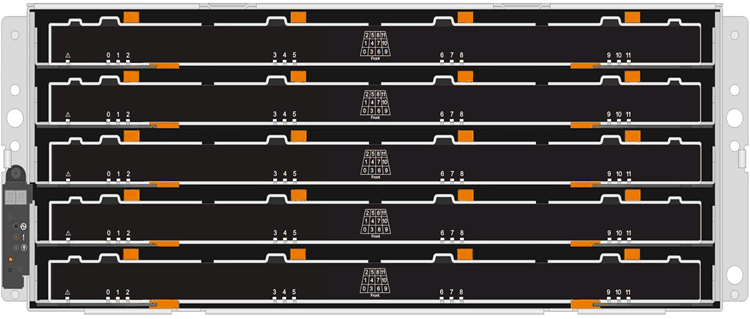

= Voraussetzung für den Austausch des Laufwerks – E5700
:allow-uri-read: 
:icons: font
:imagesdir: ../media/

[role="lead"]
Vor dem Austausch eines Laufwerks sollten Sie die Anforderungen und Überlegungen überprüfen.

== Shelf-Typen

Sie können ein Laufwerk in einem Shelf mit 24 Laufwerken, in einem Shelf mit 60 Laufwerken oder in einer Laufwerkschublade ersetzen.

=== Shelfs mit 24 Laufwerken

Die Abbildungen zeigen, wie die Laufwerke in jedem Shelf-Typ nummeriert werden (die Frontblende oder die Endkappen des Shelfs wurden entfernt).

*Laufwerksnummerierung in einem E5724 Controller-Shelf oder DE224C Festplatten-Shelf*

image::../media/28_dwg_e2824_de224c_drive_numbering_maint-e5700.gif[DE224C Laufwerksnummerierung]

NOTE: Ihr E5724 Storage Array kann ein oder mehrere veraltete SAS-2 Laufwerksfächern enthalten, einschließlich des DE5600 Einschüben für 24 Laufwerke oder des DE6600 Tabletts für 60 Laufwerke Anweisungen zum Austauschen eines Laufwerks in einem dieser Laufwerksfächer finden Sie unter link:https://mysupport.netapp.com/ecm/ecm_download_file/ECMLP2577975["Austauschen eines Laufwerks in E2660, E2760, E5460, E5560 oder E5660 Laufwerksfächern"] Und link:https://library.netapp.com/ecmdocs/ECMLP2577971/html/GUID-E9157E41-F4BF-4237-9454-F1C9145247F0.html["Ersetzen eines Laufwerks in E2600, E2700, E5400, E5500 und E5600 12-Laufwerk- oder 24-Laufwerksschächten"].

=== Shelfs mit 60 Laufwerken

Sowohl das E5760 Controller-Shelf als auch das DE460C Festplatten-Shelf bestehen aus fünf Laufwerkschubladen, die jeweils 12 Laufwerksschächte enthalten. Die Laufwerksschublade 1 befindet sich oben, und die Laufwerksschublade 5 befindet sich unten.

Bei einem E5760 Controller-Shelf-Einschub und einem DE460C Festplatten-Shelf-Einschub werden Laufwerke in jeder Laufwerkschublade im Shelf von 0 bis 11 nummeriert.

image::../media/dwg_trafford_drawer_with_hdds_callouts_maint-e5700.gif[Laufwerknummerierung]

NOTE: Ihr E5760 Storage Array verfügt möglicherweise über ein oder mehrere veraltete SAS-2 Laufwerksfächer, einschließlich DE1600 Fach mit 12 Laufwerken, einem DE5600 Tablett für 24 Laufwerke oder dem DE6600 Tablett für 60 Laufwerke Anweisungen zum Austauschen eines Laufwerks in einem dieser Laufwerksfächer finden Sie unter link:https://mysupport.netapp.com/ecm/ecm_download_file/ECMLP2577975["Austauschen eines Laufwerks in E2660, E2760, E5460, E5560 oder E5660 Laufwerksfächern"] Und link:https://library.netapp.com/ecmdocs/ECMLP2577971/html/GUID-E9157E41-F4BF-4237-9454-F1C9145247F0.html["Ersetzen eines Laufwerks in E2600, E2700, E5400, E5500 und E5600 12-Laufwerk- oder 24-Laufwerksschächten"].

=== Laufwerksschublade

Sie können eine Laufwerksschublade in einem E5760 Controller-Shelf und einem DE460C Laufwerk-Shelf ersetzen. Jeder der Shelfs mit 60 Laufwerken verfügt über fünf Laufwerkfächer.

Jeder der fünf Schubladen kann bis zu 12 Laufwerke aufnehmen.

image::../media/92_dwg_de6600_drawer_with_hdds_no_callouts_maint-e5700.gif[Laufwerksschublade]

== Anforderungen für die Handhabung von Laufwerken

CAUTION: Die Laufwerke in Ihrem Speicher-Array sind anfällig. Eine unsachgemäße Handhabung von Laufwerken stellt eine der Hauptursachen für Laufwerkausfälle dar.

Befolgen Sie die folgenden Regeln, um Beschädigungen an den Laufwerken in Ihrem Speicher-Array zu vermeiden:

* Verhindern elektrostatischer Entladung (ESD):
+
** Halten Sie das Laufwerk in der ESD-Tasche, bis Sie bereit sind, es zu installieren.
** Setzen Sie kein Metallwerkzeug oder Messer in den ESD-Beutel.
+
Öffnen Sie die ESD-Tasche von Hand oder schneiden Sie die Oberseite mit einer Schere ab.

** Bewahren Sie den ESD-Beutel und alle Verpackungsmaterialien auf, falls Sie später ein Laufwerk zurückschicken müssen.
** Tragen Sie stets ein ESD-Handgelenkband, das an einer nicht lackierten Oberfläche am Gehäuse geerdet ist.
+
Wenn ein Handgelenkband nicht verfügbar ist, berühren Sie eine unlackierte Oberfläche des Speichergehäuses, bevor Sie das Laufwerk handhaben.

* Vorsichtig mit Laufwerken umgehen:
+
** Beim Entfernen, Einbau oder Tragen eines Laufwerks immer zwei Hände verwenden.
** Niemals einen Antrieb in ein Regal zwingen, und mit sanftem, festem Druck den Riegel vollständig einrücken.
** Platzieren Sie Laufwerke auf gepolsterten Flächen und stapeln Sie niemals Laufwerke auf einander.
** Laufwerke nicht gegen andere Oberflächen abstoßen.
** Lösen Sie vor dem Entfernen eines Laufwerks aus einem Shelf den Griff und warten Sie 60 Sekunden, bis sich das Laufwerk heruntergefahren hat.
** Verwenden Sie beim Transport von Laufwerken stets die genehmigte Verpackung.

* Magnetfelder vermeiden:
+
** Halten Sie Laufwerke von magnetischen Geräten fern.
+
Magnetfelder können alle Daten auf dem Laufwerk zerstören und irreparable Schäden an der Antriebsschaltung verursachen.

