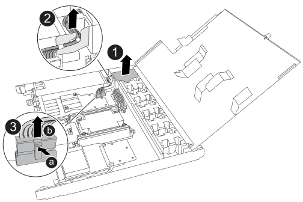

= Ersetzen Sie den Controller - EF50 und EF80
:allow-uri-read: 
:icons: font
:imagesdir: ../media/

[role="lead"]
Tauschen Sie den defekten Controller in Ihrem EF50- oder EF80-Speichersystem aus, indem Sie überprüfen, ob alle Daten im Cache-Speicher auf die Laufwerke geschrieben wurden, alle Kabel vom defekten Controller abziehen, den defekten Controller entfernen, die Komponenten auf den Ersatzcontroller übertragen und den Ersatzcontroller installieren.

.Über diese Aufgabe
* Installieren Sie den Ersatzcontroller innerhalb von 60 Minuten nach dem Ausbau des defekten Controllers, um eine ordnungsgemäße Kühlung für das Speichersystem aufrechtzuerhalten.
+

CAUTION: Um eine Überhitzung zu vermeiden, lassen Sie den Controller-Einschub nicht länger als 60 Minuten leer.

* Sie müssen den defekten Controller offline schalten, bevor Sie eines seiner Kabel abziehen.
* Sie können die Standort-LEDs (blau) des Speichersystems (an der Vorderseite des Speichersystems und an beiden Controllern) einschalten, um das betroffene Speichersystem leichter zu finden. Verwenden Sie den SANtricity System Manager, wählen Sie *Hardware* > *Controllers and components*, wählen Sie die Registerkarte *Controller shelf* und wählen Sie im Kontextmenü *Turn on locator light*.

== Schritt 1: Entfernen Sie den Controller

Vergewissern Sie sich, dass alle Daten im Cache-Speicher auf die Laufwerke geschrieben wurden, trennen Sie alle Kabel vom defekten Controller, und entfernen Sie dann den defekten Controller aus dem Gehäuse.

.Schritte
. Stellen Sie am betroffenen Controller sicher, dass die NV Caching Active (grün) LED aus ist.
+
Wenn die NV Caching Active (grün) LED aus ist, wurden alle Daten im Cache-Speicher auf die Laufwerke geschrieben und es ist sicher, den defekten Controller zu entfernen.

+

NOTE: Wenn die NV Caching Active (grüne) LED leuchtet, werden zwischengespeicherte Daten auf die Laufwerke geschrieben. Sie müssen warten, bis der Vorgang abgeschlossen ist und die NV Caching Active LED erlischt. Wenn die LED jedoch länger als fünf Minuten leuchtet, wenden Sie sich an  https://mysupport.netapp.com/site/global/dashboard["NetApp Support"] bevor Sie mit diesem Verfahren fortfahren.

+
Die LED „NV Caching Active“ (grün) befindet sich neben dem NV-Symbol auf dem Controller.

+
image::../media/drw_g_nvmem_led_ieops-1839.svg[Position der NV-Status-LED]

+
[cols="1,4"]
|===

 a| 
image::../media/icon_round_1.png[Callout-Nummer 1]
 a| 
NV-Symbol und NV-Caching-Aktiv-LED am Controller

|===

. Setzen Sie ein ESD-Armband an oder ergreifen Sie andere antistatische Vorsichtsmaßnahmen.
. Beschriften Sie jedes Kabel, das an den defekten Controller angeschlossen ist.
. Trennen Sie das Netzkabel von der Stromversorgung am betroffenen Controller.
+

NOTE: Das Netzteil (PSU) hat keinen Netzschalter.

. Ziehen Sie alle Kabel vom defekten Controller ab.
. Entfernen Sie den defekten Controller:
+
Die folgende Abbildung zeigt die Funktionsweise der Controller-Handles (von der linken Seite des Controllers) beim Entfernen eines Controllers:

+
image::../media/drw_g_and_t_handles_remove_ieops-1837.svg[Controller-Handle-Operation zum Entfernen eines Controllers]

+
[cols="1,4"]
|===

 a| 
image::../media/icon_round_1.png[Callout-Nummer 1]
 a| 
Drücken Sie an beiden Enden des Controllers die vertikalen Verriegelungslaschen nach außen, um die Griffe in ihre horizontale Position zu bringen.

 a| 
image::../media/icon_round_2.png[Callout-Nummer 2]
 a| 
** Ziehen Sie die Griffe zu sich heran, um den Controller aus der Midplane zu lösen.
+
Wenn Sie ziehen, fahren die Griffe aus dem Controller heraus und dann spüren Sie einen Widerstand, ziehen Sie weiter.

** Ziehen Sie den Controller aus dem Gehäuse, während Sie die Unterseite des Controllers stützen, und legen Sie ihn auf eine ebene, antistatische Arbeitsfläche.

 a| 
image::../media/icon_round_3.png[Callout-Nummer 3]
 a| 
Drehen Sie bei Bedarf die Griffe aufrecht (neben den Laschen), um sie aus dem Weg zu räumen.

|===
. Öffnen Sie die Controller-Abdeckung, indem Sie die Rändelschraube gegen den Uhrzeigersinn drehen, um sie zu lösen, und öffnen Sie dann die Abdeckung.

== Schritt 2: Netzteil umstellen

Verschieben Sie das Netzteil (PSU) auf den Ersatzcontroller.

.Schritte
. Entfernen Sie das Netzteil vom defekten Controller:
+
Stellen Sie sicher, dass sich der linke Controllergriff in aufrechter Position befindet, damit Sie Zugang zum Netzteil haben.

+
image::../media/ef50-ef80_psu_ac_orange_tab_replace_ieops-2611.svg[AC-Netzteil austauschen]

+
[cols="1,4"]
|===

 a| 
image::../media/icon_round_1.png[Callout-Nummer 1]
 a| 
Drehen Sie den Griff des Netzteils nach oben in die horizontale Position und fassen Sie ihn dann an.

 a| 
image::../media/icon_round_2.png[Callout-Nummer 2]
 a| 
Drücken Sie mit dem Daumen auf die orangefarbene Verriegelungslasche, um das Netzteil vom Controller zu lösen.

 a| 
image::../media/icon_round_3.png[Callout-Nummer 3]
 a| 
Ziehen Sie das Netzteil aus dem Controller heraus, während Sie mit der anderen Hand dessen Gewicht stützen.

CAUTION: Das Netzteil ist kurz. Halten Sie es beim Herausnehmen aus dem Controller immer mit beiden Händen fest, damit es nicht plötzlich aus dem Controller herausschwingt und Sie verletzt.

|===
. Setzen Sie das Netzteil in den Ersatzcontroller ein:
+
.. Stützen Sie mit beiden Händen die Kanten des PSU und richten Sie sie an der Öffnung im Controller aus.
.. Schieben Sie das Netzteil vorsichtig in den Controller, bis die orangefarbene Verriegelungslasche einrastet.
+
Das Netzteil muss korrekt mit dem internen Anschluss und dem Verriegelungsmechanismus verbunden sein. Wiederholen Sie diesen Schritt, wenn Sie das Gefühl haben, dass das Netzteil nicht richtig sitzt.

+

NOTE: Um eine Beschädigung des internen Anschlusses zu vermeiden, verwenden Sie beim Einschieben des Netzteils in den Controller keine übermäßige Kraft.

.. Drehen Sie den Griff nach unten, damit er den normalen Betrieb nicht behindert.

== Schritt 3: Die Ventilatoren umstellen

Bewegen Sie die Lüfter zum Ersatzcontroller.

.Schritte
. Entfernen Sie einen der Lüfter vom defekten Controller:
+
image::../media/drw_g_fan_replace_ieops-1903.svg[Lüfter austauschen]

+
[cols="1,4"]
|===

 a| 
image::../media/icon_round_1.png[Callout-Nummer 1]
| Halten Sie den Ventilator an den blauen Berührungspunkten auf beiden Seiten fest. 

 a| 
image::../media/icon_round_2.png[Callout-Nummer 2]
| Ziehen Sie den Lüfter gerade nach oben aus der Fassung. 
|===
. Setzen Sie den Lüfter in den Ersatzcontroller ein, indem Sie ihn an den Führungen ausrichten, und drücken Sie ihn dann nach unten, bis der Lüfteranschluss vollständig in der Buchse sitzt.
. Wiederholen Sie diese Schritte für die verbleibenden Ventilatoren.

== Schritt 4: NV-Batterie umsetzen

Setzen Sie die NV-Batterie in den Ersatzcontroller ein.

.Schritte
. Entfernen Sie die NV-Batterie aus dem defekten Controller:
+

+
[cols="1,4"]
|===

 a| 
image::../media/icon_round_1.png[Callout-Nummer 1]
 a| 
Heben Sie die NV-Batterie an und nehmen Sie sie aus ihrem Fach heraus.

 a| 
image::../media/icon_round_2.png[Callout-Nummer 2]
 a| 
Entfernen Sie den Kabelbaum aus seiner Halterung.

 a| 
image::../media/icon_round_3.png[Callout-Nummer 3]
 a| 
.. Drücken Sie die Lasche am Stecker hinein und halten Sie sie gedrückt.
.. Ziehen Sie den Stecker nach oben und aus der Buchse.
+
Wenn Sie den Stecker herausziehen, bewegen Sie ihn vorsichtig von einem Ende zum anderen (längs), um ihn zu lösen.

|===
. Setzen Sie die NV-Batterie in den Ersatzcontroller ein:
+
.. Stecken Sie den Kabelstecker in die Buchse.
.. Verlegen Sie die Verkabelung an der Seite des Netzteils, in dessen Halterung und dann durch den Kanal vor dem NV-Batteriefach.
.. Setzen Sie die NV-Batterie in das Fach ein.
+
Der NV-Akku sollte bündig in seinem Fach sitzen.

== Schritt 5: System-DIMMs verschieben

Setzen Sie die DIMMs in den Ersatzcontroller ein.

Falls Sie DIMM-Blindplatten haben, müssen Sie diese nicht verschieben, der Ersatzcontroller sollte mit ihnen installiert geliefert werden.

.Schritte
. Entfernen Sie eines der DIMMs aus dem defekten Controller:
+
image::../media/drw_g_dimm_ieops-1873.svg[DIMM ersetzen]

+
[cols="1,4"]
|===

 a| 
image::../media/icon_round_1.png[Callout-Nummer 1]
 a| 
DIMM-Steckplatznummerierung und -positionen.

NOTE: Je nach Speichersystemmodell verfügen Sie über zwei oder vier DIMMs.

 a| 
image::../media/icon_round_2.png[Callout-Nummer 1]
 a| 
** Beachten Sie die Ausrichtung des DIMM im Sockel, damit Sie das DIMM im Ersatzcontroller in der richtigen Ausrichtung einsetzen können.
** Werfen Sie das DIMM aus, indem Sie die beiden DIMM-Auswurfklappen an beiden Enden des DIMM-Steckplatzes langsam auseinanderdrücken.

IMPORTANT: Fassen Sie das DIMM vorsichtig an den Ecken oder Kanten an, um Druck auf die Bauteile der DIMM-Leiterplatte zu vermeiden.

 a| 
image::../media/icon_round_3.png[Callout-Nummer 3]
 a| 
Heben Sie das DIMM-Modul an und nehmen Sie es aus dem Steckplatz heraus.

Die Auswerferklappen bleiben in der offenen Position.

|===
. Installieren Sie das DIMM im Ersatzcontroller:
+
.. Stellen Sie sicher, dass sich die DIMM-Auswurfklappen am Anschluss in der geöffneten Position befinden.
.. Fassen Sie das DIMM an den Ecken und setzen Sie es gerade in den Steckplatz ein.
+
Die Kerbe an der Unterseite des DIMM, zwischen den Pins, muss mit der Nase im Steckplatz übereinstimmen.

+
Bei korrekter Einsetzung lässt sich das DIMM leicht einschieben, sitzt aber stramm im Steckplatz. Falls nicht, setzen Sie das DIMM erneut ein.

.. Überprüfen Sie den DIMM visuell, um sicherzustellen, dass er gleichmäßig ausgerichtet und vollständig in den Steckplatz eingesetzt ist.
.. Drücken Sie vorsichtig, aber fest auf die Oberkante des DIMM, bis die Auswurfstasten an beiden Enden des DIMM in die Kerben einrasten.

. Wiederholen Sie diese Schritte für die restlichen DIMMs.

== Schritt 6: Verschieben Sie die E/A-Module

Verschieben Sie die E/A-Module und alle E/A-Blindmodule auf den Ersatzcontroller.

.Schritte
. Entfernen Sie eines der E/A-Module vom defekten Controller:
+
Stellen Sie sicher, dass Sie sich merken, in welchem Steckplatz sich das E/A-Modul befand.

+
Wenn Sie das E/A-Modul in Steckplatz 4 entfernen, stellen Sie sicher, dass der rechte Controller-Griff in aufrechter Position ist, damit Sie Zugang zum E/A-Modul haben.

+
image::../media/drw_g_io_module_replace_ieops-1900.svg[E/A-Modul entfernen]

+
[cols="1,4"]
|===

 a| 
image::../media/icon_round_1.png[Callout-Nummer 1]
 a| 
Drehen Sie die Rändelschraube des I/O-Moduls gegen den Uhrzeigersinn, um sie zu lösen.

 a| 
image::../media/icon_round_2.png[Callout-Nummer 2]
 a| 
Ziehen Sie das I/O-Modul mithilfe der Lasche mit der Portbezeichnung auf der linken Seite und der Rändelschraube auf der rechten Seite aus dem Controller heraus.

|===
. Installieren Sie das E/A-Modul in den Ersatzcontroller:
+
.. Richten Sie das E/A-Modul an den Kanten des Steckplatzes aus.
.. Schieben Sie das I/O-Modul vorsichtig ganz in den Steckplatz und achten Sie darauf, dass das Modul richtig im Anschluss sitzt.
+
Sie können die Lasche auf der linken Seite und die Rändelschraube auf der rechten Seite verwenden, um das I/O Module einzudrücken.

.. Drehen Sie die Rändelschraube im Uhrzeigersinn, um sie festzuziehen.

. Wiederholen Sie diese Schritte, um die restlichen E/A-Module und alle E/A-Blanking-Module auf den Ersatzcontroller zu verschieben.

== Schritt 7: Installieren Sie den Controller

Bauen Sie den Ersatzcontroller in das Gehäuse ein, schließen Sie das Netzkabel und alle zugehörigen Kabel wieder an.

.Über diese Aufgabe
Die folgende Abbildung zeigt die Bedienung der Griffe des Controllers (von der linken Seite eines Controllers) beim Wiedereinbau des Controllers und kann als Referenz für die Schritte des Wiedereinbaus des Controllers verwendet werden.

image::../media/drw_g_and_t_handles_reinstall_ieops-1838.svg[Bedienvorgang zum Installieren eines Controllers]

[cols="1,4"]
|===

 a| 
image::../media/icon_round_1.png[Callout-Nummer 1]
 a| 
Falls Sie die Griffe des Controllers nach oben (neben den Laschen) gedreht haben, um sie während der Wartung des Controllers aus dem Weg zu räumen, drehen Sie sie nun wieder in die horizontale Position.

 a| 
image::../media/icon_round_2.png[Callout-Nummer 2]
 a| 
Drücken Sie die Griffe, um den Controller wieder in das Gehäuse einzusetzen.

 a| 
image::../media/icon_round_3.png[Callout-Nummer 3]
 a| 
Drehen Sie die Griffe in die aufrechte Position und arretieren Sie sie mit den Verriegelungslaschen.

|===
.Schritte
. Schließen Sie die Abdeckung des Controllers und drehen Sie die Rändelschraube im Uhrzeigersinn, bis sie fest sitzt.
. Setzen Sie den Controller in das Gehäuse ein:
+
.. Richten Sie die Rückseite des Controllers an der Öffnung im Gehäuse aus und drücken Sie vorsichtig, aber fest auf die Griffe, bis der Controller die Midplane erreicht und vollständig eingesetzt ist.
+

NOTE: Wenden Sie beim Einschieben des Controllers in das Gehäuse keine übermäßige Kraft an; dies könnte die Anschlüsse beschädigen.

.. Drehen Sie die Griffe des Controllers nach oben und verriegeln Sie sie mit den Laschen.

. Schließen Sie das Netzkabel wieder an das Netzteil an und sichern Sie das Netzkabel mit der Netzkabelhalterung.
+
Sobald die Stromversorgung wiederhergestellt ist, sollte die Status-LED grün sein.

. Schließen Sie alle Kabel wieder an den Controller an.
+

NOTE: Die Kabel müssen wieder angeschlossen werden, bevor der Controller online geht. Dies ist besonders wichtig für die Spiegelungskabelverbindungen, da sie die vollständige Systemredundanz gewährleisten und für Cache-Spiegelung und E/A-Übertragung verwendet werden.

.Was kommt als Nächstes?
Nach dem Austausch des defekten Controllers link:controller-replace-online-controller.html["online den Ersatzcontroller"].
