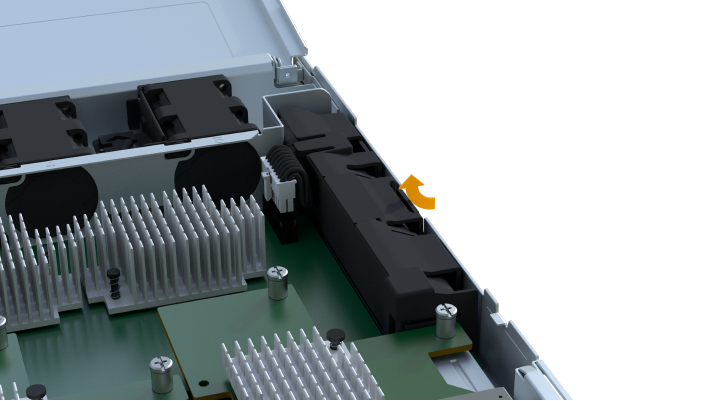

= Tauschen Sie den EF300- oder EF600-Akku aus
:allow-uri-read: 
:experimental: 
:icons: font
:imagesdir: ../media/

[role="lead"]
Sie können einen Akku in einem EF300- oder EF600-Speichersystem ersetzen.

.Über diese Aufgabe
Jeder Controller-Behälter enthält eine Batterie, die zwischengespeicherte Daten behält, wenn die Wechselstromversorgung ausfällt. Wenn der Recovery Guru im SANtricity System Manager entweder den Status „Batterie ausgefallen“ oder den Status „Batteriewechsel erforderlich“ meldet, müssen Sie die betroffene Batterie austauschen.

.Bevor Sie beginnen
* Überprüfen Sie, ob keine Volumes verwendet werden oder ob auf allen Hosts, die diese Volumes verwenden, ein Multipath-Treiber installiert ist.
* Überprüfen Sie die link:batteries-overview-requirements-concept.html["Anforderungen für den Austausch der EF300- oder EF600-Batterie"].

.Was Sie benötigen
* Der Ersatzakku.
* Ein ESD-Armband oder andere antistatische Vorsichtsmaßnahmen.
* Ein flacher, statischer freier Arbeitsbereich.
* Etiketten, um jedes Kabel zu identifizieren, das mit dem Controller-Behälter verbunden ist.
* Eine Management Station mit einem Browser, der für den Controller auf den SANtricity System Manager zugreifen kann. (Zeigen Sie zum Öffnen der System Manager-Schnittstelle den Domain-Namen oder die IP-Adresse des Controllers im Browser.)

== Schritt 1: Controller offline schalten

Sichern Sie die Daten, und platzieren Sie den betroffenen Controller in den Offline-Modus.

.Schritte
. Sehen Sie sich im SANtricity System Manager die Details im Recovery Guru an, um zu überprüfen, ob ein Problem mit einer Batterie vorliegt, und um sicherzustellen, dass keine weiteren Punkte zuerst behoben werden müssen.
. Stellen Sie im Bereich Details des Recovery Guru fest, welche Batterie ersetzt werden soll.
. Sichern Sie die Konfigurationsdatenbank des Storage-Arrays mit SANtricity System Manager.
+
Wenn beim Entfernen eines Controllers ein Problem auftritt, können Sie die gespeicherte Datei verwenden, um Ihre Konfiguration wiederherzustellen. Das System speichert den aktuellen Status der RAID-Konfigurationsdatenbank, die alle Daten für Volume-Gruppen und Festplatten-Pools auf dem Controller enthält.

+
** Über System Manager:
+
... Wählen Sie MENU:Support[Support Center > Diagnose].
... Wählen Sie *Konfigurationsdaten Erfassen*.
... Klicken Sie Auf *Collect*.
+
Die Datei wird im Ordner Downloads für Ihren Browser mit dem Namen *configurationData-<arrayName>-<dateTime>.7z* gespeichert.

. Wenn der Controller nicht bereits offline ist, versetzen Sie ihn jetzt mithilfe von SANtricity System Manager in den Offline-Modus.
+
.. Wählen Sie *Hardware*.
.. Wenn die Grafik die Laufwerke anzeigt, wählen Sie *Zurück vom Shelf anzeigen* aus, um die Controller anzuzeigen.
.. Wählen Sie den Controller aus, den Sie in den Offline-Modus versetzen möchten.
.. Wählen Sie im Kontextmenü die Option *Offline platzieren* aus, und bestätigen Sie, dass Sie den Vorgang ausführen möchten.
+

NOTE: Wenn Sie mit dem Controller auf SANtricity System Manager zugreifen, den Sie offline schalten möchten, wird eine Meldung vom SANtricity System Manager nicht verfügbar angezeigt. Wählen Sie *mit einer alternativen Netzwerkverbindung verbinden* aus, um automatisch über den anderen Controller auf SANtricity System Manager zuzugreifen.

. Warten Sie, bis SANtricity System Manager den Status des Controllers auf „Offline“ aktualisiert.
+

NOTE: Beginnen Sie keine anderen Vorgänge, bis der Status aktualisiert wurde.

. Wählen Sie im Recovery Guru * erneut aus und bestätigen Sie, dass das Feld OK zum Entfernen im Bereich Details Ja angezeigt wird, was darauf hinweist, dass es sicher ist, diese Komponente zu entfernen.

== Schritt 2: Controller-Behälter entfernen

Tauschen Sie die fehlerhafte Batterie durch eine neue aus.

.Schritte
. Setzen Sie ein ESD-Armband an oder ergreifen Sie andere antistatische Vorsichtsmaßnahmen.
. Beschriften Sie jedes Kabel, das am Controller-Behälter befestigt ist.
. Trennen Sie alle Kabel vom Controller-Behälter.
+

CAUTION: Um eine verminderte Leistung zu vermeiden, dürfen die Kabel nicht verdreht, gefaltet, gequetscht oder treten.

. Vergewissern Sie sich, dass die LED Cache Active auf der Rückseite des Controllers ausgeschaltet ist.
. Drücken Sie die Griffe auf beiden Seiten des Controllers, und ziehen Sie sie nach hinten, bis sie sich aus dem Shelf lösen.
+
image::../media/remove_controller_5.png[Controller 5 ausbauen]

. Schieben Sie den Controller-Behälter mit zwei Händen und den Griffen aus dem Regal. Wenn sich die Vorderseite des Controllers nicht im Gehäuse befindet, ziehen Sie sie mit zwei Händen vollständig heraus.
+

CAUTION: Verwenden Sie immer zwei Hände, um das Gewicht eines Reglerkanisters zu unterstützen.

+
image::../media/remove_controller_6.png[Controller 6 ausbauen]

. Setzen Sie den Steuerungsbehälter auf eine flache, statisch freie Oberfläche.

== Schritt 3: Fehlerhafte Batterie entfernen

Ziehen Sie den defekten Akku aus dem Controller.

.Schritte
. Entfernen Sie die Abdeckung des Reglerkanisters, indem Sie die einzelne Rändelschraube lösen und den Deckel öffnen.
. Stellen Sie sicher, dass die grüne LED im Controller aus ist.
+
Wenn diese grüne LED leuchtet, wird der Controller weiterhin mit Strom versorgt. Sie müssen warten, bis diese LED erlischt, bevor Sie Komponenten entfernen.

. Suchen Sie die Registerkarte „Drücken“ auf der Seite des Controllers.
. Lösen Sie die Batterie, indem Sie auf die Lasche drücken und das Batteriegehäuse zusammendrücken.
+

. Drücken Sie vorsichtig das Anschlussgehäuse der Batterieverdrahtung. Ziehen Sie den Akku aus der Platine heraus.
+
image::../media/batt_2.png[batt 2]

. Heben Sie die Batterie aus der Steuerung heraus und legen Sie sie auf eine flache, statische Oberfläche.
+
image::../media/batt_4.png[batt 4]

. Befolgen Sie die für Ihren Standort geeigneten Verfahren, um den defekten Akku zu recyceln oder zu entsorgen.
+

CAUTION: Um die International Air Transport Association (IATA) Bestimmungen zu erfüllen, dürfen Sie nur dann eine Lithiumbatterie mit Luft versenden, wenn sie im Regal des Regals installiert ist.

== Schritt 4: Neue Batterie einbauen

Nachdem Sie den defekten Akku aus dem Controller-Behälter entfernt haben, befolgen Sie diesen Schritt, um den neuen Akku zu installieren.

.Schritte
. Packen Sie den neuen Akku aus, und stellen Sie ihn auf eine flache, statische Oberfläche.
+

NOTE: Zur sicheren Einhaltung der IATA-Vorschriften werden Ersatzbatterien mit einem Ladestatus von 30 Prozent oder weniger (SoC) ausgeliefert. Wenn Sie die Stromversorgung wieder einschalten, beachten Sie, dass das Schreib-Caching erst wieder aufgenommen wird, wenn der Ersatzakku vollständig geladen ist und der erste Lernzyklus abgeschlossen wurde.

. Setzen Sie den Akku in den Controller ein, indem Sie das Batteriegehäuse mit den Metallverriegelungen an der Seite des Controllers aufschieben.
+
image::../media/batt_5.png[batt 5]

+
Der Akku rastet ein.

. Stecken Sie den Batteriestecker wieder in die Platine ein.

== Schritt 5: Controller-Behälter wieder einbauen

Setzen Sie den Controller wieder in das Controller-Shelf ein.

.Schritte
. Senken Sie die Abdeckung am Controller-Behälter ab, und befestigen Sie die Daumenschraube.
. Schieben Sie den Controller-Behälter vorsichtig ganz in das Reglerregal, während Sie die Controller-Griffe zusammendrücken.
+

NOTE: Der Controller klickt hörbar, wenn er richtig in das Regal eingebaut ist.

+
image::../media/remove_controller_7.png[Controller 7 ausbauen]

== Schritt 6: Vollständige Batteriewechsel

Platzieren Sie den Controller online, sammeln Sie Support-Daten und setzen Sie den Betrieb fort.

.Schritte
. Platzieren Sie den Controller in den Online-Modus
+
.. Wechseln Sie in System Manager zur Seite Hardware.
.. Wählen Sie *Zurück von Controller anzeigen*.
.. Wählen Sie den Controller mit der ausgetauschten Batterie aus.
.. Wählen Sie in der Dropdown-Liste * Online platzieren* aus.

. Überprüfen Sie beim Booten des Controllers die Controller-LEDs.
+
Wenn die Kommunikation mit der anderen Steuerung wiederhergestellt wird:

+
** Die gelbe Warn-LED leuchtet weiterhin.
** Je nach Host-Schnittstelle leuchtet, blinkt oder leuchtet die LED für Host-Link möglicherweise nicht.

. Wenn der Controller wieder online ist, bestätigen Sie, dass sein Status optimal lautet, und überprüfen Sie die Warn-LEDs für das Controller-Shelf.
+
Wenn der Status nicht optimal ist oder eine der Warn-LEDs leuchtet, vergewissern Sie sich, dass alle Kabel richtig eingesetzt sind und der Controller-Behälter richtig installiert ist. Gegebenenfalls den Controller-Behälter ausbauen und wieder einbauen.

+

NOTE: Wenden Sie sich an den technischen Support, wenn das Problem nicht gelöst werden kann.

. Klicken Sie auf MENU:Support[Upgrade Center], um sicherzustellen, dass die neueste Version von SANtricity OS installiert ist.
+
Installieren Sie bei Bedarf die neueste Version.

. Überprüfen Sie, ob alle Volumes an den bevorzugten Eigentümer zurückgegeben wurden.
+
.. Wählen Sie Menü:Storage[Volumes]. Überprüfen Sie auf der Seite * All Volumes*, ob die Volumes an die bevorzugten Eigentümer verteilt werden. Wählen Sie MENU:Mehr[Eigentumsrechte ändern], um Volumeneigentümer anzuzeigen.
.. Wenn alle Volumes Eigentum des bevorzugten Eigentümers sind, fahren Sie mit Schritt 6 fort.
.. Wenn keines der Volumes zurückgegeben wird, müssen Sie die Volumes manuell zurückgeben. Wechseln Sie zum Menü:Mehr[Umverteilung von Volumes].
.. Wenn nach der automatischen Verteilung oder manuellen Verteilung nur einige der Volumes an ihre bevorzugten Eigentümer zurückgegeben werden, muss der Recovery Guru auf Probleme mit der Host-Konnektivität prüfen.
.. Wenn kein Recovery Guru zur Verfügung steht oder wenn Sie den Recovery-Guru-Schritten folgen, werden die Volumes immer noch nicht an ihren bevorzugten Besitzer zurückgegeben.

. Support-Daten für Ihr Storage Array mit SANtricity System Manager erfassen
+
.. Wählen Sie MENU:Support[Support Center > Diagnose].
.. Wählen Sie *Support-Daten Erfassen* Aus.
.. Klicken Sie Auf *Collect*.
+
Die Datei wird im Ordner Downloads für Ihren Browser mit dem Namen *Support-Data.7z* gespeichert.

.Was kommt als Nächstes?
Der Austausch des Akkus ist abgeschlossen. Sie können den normalen Betrieb fortsetzen.
