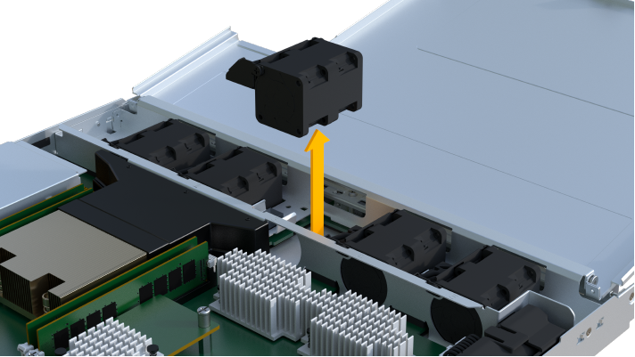
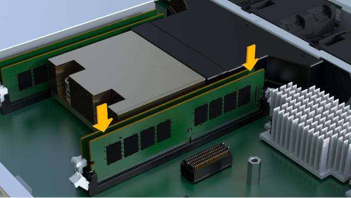
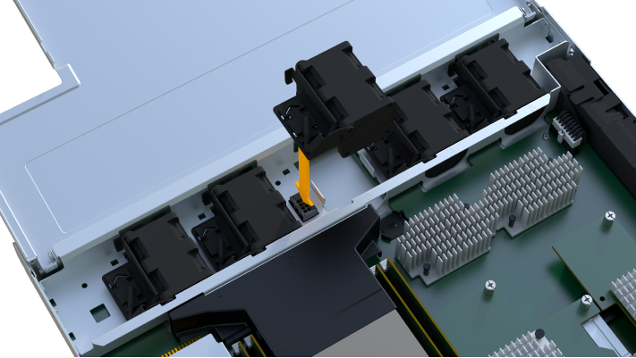

= EF300- oder EF600-Controller austauschen
:allow-uri-read: 
:experimental: 
:icons: font
:imagesdir: ../media/

[role="lead"]
Ein einzelner Controller kann in einem EF300- oder EF600 Controller-Shelf ersetzt werden.

.Über diese Aufgabe
Wenn Sie einen defekten Controller-Behälter ersetzen, müssen Sie den Akku, das Netzteil, die DIMMs, die Lüfter und die Host Interface Card (HIC) aus dem ursprünglichen Controller-Behälter entfernen und dann im Ersatzcontroller-Behälter installieren.

.Bevor Sie beginnen
* Prüfen link:controllers-overview-supertask-concept.html["Anforderungen für den Austausch des EF300- oder EF600 Controllers"].
* Bestimmen Sie, ob ein ausgefallener Controller-Behälter auf zwei Arten besteht:
+
** Der Recovery Guru im SANtricity System Manager führt Sie dazu, den Controller-Behälter zu ersetzen.
** Die gelbe Warn-LED am Controller-Behälter leuchtet und zeigt an, dass der Controller einen Fehler aufweist.
+
[]
====

NOTE: Die gelbe Warn-LED des Controllers erlischt, wenn die folgenden Austauschbedingungen vorliegen:

*** Alt-Stromversorgung fehlgeschlagen
*** Pfad des alternativen Laufwerks fehlgeschlagen
*** Schublade ist offen/fehlt
*** Lüfter ist ausgefallen/fehlt
*** Netzteil fehlt

====

* Stellen Sie sicher, dass Sie Folgendes haben:
+
** Ein Ersatzcontroller-Behälter mit der gleichen Teilenummer wie der Controller-Behälter, den Sie austauschen.
** Ein ESD-Armband, oder Sie haben andere antistatische Vorsichtsmaßnahmen getroffen.
** Ein flacher, statischer freier Arbeitsbereich.
** A #1 Kreuzschlitzschraubendreher
** Etiketten, um jedes Kabel zu identifizieren, das mit dem Controller-Behälter verbunden ist.
** Eine Management Station mit einem Browser, der für den Controller auf den SANtricity System Manager zugreifen kann. (Zeigen Sie zum Öffnen der System Manager-Schnittstelle den Domain-Namen oder die IP-Adresse des Controllers im Browser.)

== Schritt 1: Vorbereitung auf den Austausch der Steuerung

Bereiten Sie sich darauf vor, einen defekten Controller-Behälter auszutauschen, indem Sie überprüfen, ob der Ersatzcontroller-Behälter die richtige FRU-Teilenummer hat, die Konfiguration sichern und Support-Daten erfassen.

.Schritte
. Packen Sie den neuen Controller-Behälter aus, und stellen Sie ihn auf eine flache, statische Oberfläche.
+
Bewahren Sie das Verpackungsmaterial auf, das beim Versand des defekten Reglerkanisters verwendet werden soll.

. Suchen Sie die Etiketten für MAC-Adresse und FRU-Teilenummer auf der Rückseite des Controller-Behälters.
. Suchen Sie im SANtricity System Manager die Teilenummer des Ersatzteils für den zu ersetzenden Controllerbehälter.
+
Wenn ein Controller einen Fehler aufweist und ausgetauscht werden muss, wird im Bereich Details des Recovery Guru die Ersatzteilnummer angezeigt. Wenn Sie diese Nummer manuell suchen müssen, führen Sie die folgenden Schritte aus:

+
.. Wählen Sie *Hardware*.
.. Suchen Sie das Controller-Shelf, das mit dem Controller-Symbol gekennzeichnet ist image:../media/sam1130_ss_hardware_controller_icon_maint-ef600.gif[""].
.. Klicken Sie auf das Controller-Symbol.
.. Wählen Sie den Controller aus und klicken Sie auf *Weiter*.
.. Notieren Sie sich auf der Registerkarte *Base* die *Ersatz-Teilenummer* für den Controller.

. Vergewissern Sie sich, dass die Ersatzteilnummer des ausgefallenen Controllers mit der FRU-Teilenummer für den Ersatz-Controller identisch ist.
+

CAUTION: *Möglicher Verlust des Datenzugangs* -- Wenn die zweiteiligen Nummern nicht gleich sind, versuchen Sie dieses Verfahren nicht. Wenn der ausgefallene Controller-Behälter eine Host-Schnittstellenkarte (HIC) enthält, müssen Sie diese HIC im neuen Controller-Behälter installieren. Da keine Controller oder HIC-Fehler vorhanden sind, wird der neue Controller gesperrt, wenn er online geschaltet wird.

. Sichern Sie die Konfigurationsdatenbank des Storage-Arrays mit SANtricity System Manager.
+
Wenn beim Entfernen eines Controllers ein Problem auftritt, können Sie die gespeicherte Datei verwenden, um Ihre Konfiguration wiederherzustellen. Das System speichert den aktuellen Status der RAID-Konfigurationsdatenbank, die alle Daten für Volume-Gruppen und Festplatten-Pools auf dem Controller enthält.

+
** Über System Manager:
+
... Wählen Sie MENU:Support[Support Center > Diagnose].
... Wählen Sie *Konfigurationsdaten Erfassen*.
... Klicken Sie Auf *Collect*.
+
Die Datei wird im Ordner Downloads für Ihren Browser mit dem Namen *configurationData-<arrayName>-<dateTime>.7z* gespeichert.

. Wenn der Controller nicht bereits offline ist, versetzen Sie ihn jetzt mithilfe von SANtricity System Manager in den Offline-Modus.
+
.. Wählen Sie *Hardware*.
.. Wenn die Grafik die Laufwerke anzeigt, wählen Sie *Zurück vom Shelf anzeigen* aus, um die Controller anzuzeigen.
.. Wählen Sie den Controller aus, den Sie in den Offline-Modus versetzen möchten.
.. Wählen Sie im Kontextmenü die Option *Offline platzieren* aus, und bestätigen Sie, dass Sie den Vorgang ausführen möchten.

+

NOTE: Wenn Sie mit dem Controller auf SANtricity System Manager zugreifen, den Sie offline schalten möchten, wird eine Meldung vom SANtricity System Manager nicht verfügbar angezeigt. Wählen Sie *mit einer alternativen Netzwerkverbindung verbinden* aus, um automatisch über den anderen Controller auf SANtricity System Manager zuzugreifen.

. Warten Sie, bis SANtricity System Manager den Status des Controllers auf „Offline“ aktualisiert.
+

CAUTION: Beginnen Sie keine anderen Vorgänge, bis der Status aktualisiert wurde.

. Wählen Sie *recheck* aus dem Recovery Guru, und bestätigen Sie, dass das Feld *OK to remove* im Bereich Details *Ja* angezeigt wird, was darauf hinweist, dass es sicher ist, diese Komponente zu entfernen.

== Schritt 2: Entfernen des fehlerhaften Controllers

Entfernen Sie einen Controller-Behälter, um den defekten Behälter durch einen neuen zu ersetzen.

Dies ist ein mehrstufiges Verfahren, bei dem Sie die folgenden Komponenten entfernen müssen: Batterie, Host-Schnittstellenkarte, Netzteil, DIMMs und Lüfter.

=== Schritt 2a: Controller-Behälter entfernen

Entfernen Sie den defekten Reglerbehälter, so dass Sie ihn durch einen neuen ersetzen können.

.Schritte
. Setzen Sie ein ESD-Armband an oder ergreifen Sie andere antistatische Vorsichtsmaßnahmen.
. Beschriften Sie jedes Kabel, das am Controller-Behälter befestigt ist.
. Trennen Sie alle Kabel vom Controller-Behälter.
+

CAUTION: Um eine verminderte Leistung zu vermeiden, dürfen die Kabel nicht verdreht, gefaltet, gequetscht oder treten.

. Wenn der Controller-Behälter über eine HIC verfügt, die SFP+-Transceiver verwendet, entfernen Sie die SFPs.
+
Da Sie die HIC aus dem fehlerhaften Controller-Behälter entfernen müssen, müssen Sie alle SFPs von den HIC-Ports entfernen. Wenn Sie die Kabel wieder anschließen, können Sie die SFPs in den neuen Controller-Behälter verlegen.

. Drücken Sie die Griffe auf beiden Seiten des Controllers, und ziehen Sie sie nach hinten, bis sie sich aus dem Shelf lösen.
+
image::../media/remove_controller_5.png[Controller 5 ausbauen]

. Schieben Sie den Controller-Behälter mit zwei Händen und den Griffen aus dem Regal. Wenn sich die Vorderseite des Controllers nicht im Gehäuse befindet, ziehen Sie sie mit zwei Händen vollständig heraus.
+

CAUTION: Verwenden Sie immer zwei Hände, um das Gewicht eines Reglerkanisters zu unterstützen.

+
image::../media/remove_controller_6.png[Controller 6 ausbauen]

. Setzen Sie den Steuerungsbehälter auf eine flache, statisch freie Oberfläche.

=== Schritt 2b: Batterie entfernen

Entfernen Sie den Akku aus dem defekten Controller-Behälter, so dass Sie ihn in den neuen Controller-Behälter installieren können.

.Schritte
. Entfernen Sie die Abdeckung des Reglerkanisters, indem Sie die einzelne Rändelschraube lösen und den Deckel öffnen.
. Suchen Sie die Registerkarte „Drücken“ auf der Seite des Controllers.
. Lösen Sie die Batterie, indem Sie auf die Lasche drücken und das Batteriegehäuse zusammendrücken.
+
image::../media/batt_3.png[batt 3]

. Drücken Sie vorsichtig das Anschlussgehäuse der Batterieverdrahtung. Ziehen Sie den Akku aus der Platine heraus.image:../media/batt_2.png[""]
. Heben Sie die Batterie aus der Steuerung heraus und legen Sie sie auf eine flache, statische Oberfläche.image:../media/batt_4.png[""]

=== Schritt 2c: Entfernen Sie die HIC

Wenn der Controller-Behälter eine HIC enthält, müssen Sie die HIC aus dem ursprünglichen Controller-Behälter entfernen. Andernfalls können Sie diesen Schritt überspringen.

.Schritte
. Entfernen Sie mit einem Kreuzschlitzschraubendreher die beiden Schrauben, mit denen die HIC-Frontplatte am Controller-Behälter befestigt ist.
+
image::../media/hic_2.png[hic 2]

+

NOTE: Das obige Bild ist ein Beispiel, das Aussehen Ihrer HIC kann sich unterscheiden.

. Entfernen Sie die HIC-Frontplatte.
. Lösen Sie mit den Fingern oder einem Kreuzschlitzschraubendreher die einzelne Rändelschraube, mit der die HIC an der Controllerkarte befestigt ist.
+
image::../media/hic_3.png[hic 3]

+

NOTE: Die HIC verfügt über drei Schraubpositionen auf der Oberseite, ist aber mit nur einer gesichert.

. Lösen Sie die HIC vorsichtig von der Controllerkarte, indem Sie die Karte nach oben und aus dem Controller heben.
+

CAUTION: Achten Sie darauf, dass die Komponenten auf der Unterseite der HIC oder auf der Oberseite der Controller-Karte nicht verkratzen oder stoßen.

+
image::../media/hic_4.png[hic 4]

. Legen Sie die HIC auf eine flache, statische Oberfläche.

=== Schritt 2d: Netzteil entfernen

Entfernen Sie das Netzteil, damit Sie es in den neuen Controller einsetzen können.

.Schritte
. Trennen Sie die Stromkabel:
+
.. Öffnen Sie die Netzkabelhalterung, und ziehen Sie dann das Netzkabel vom Netzteil ab.
.. Ziehen Sie das Netzkabel von der Stromversorgung ab.

. Suchen Sie die Lasche rechts neben dem Netzteil, und drücken Sie sie in Richtung Netzteil.
+
image::../media/psup_2.png[psup 2]

. Suchen Sie den Griff an der Vorderseite des Netzteils.
. Schieben Sie das Netzteil mit dem Griff gerade aus dem System heraus.
+
image::../media/psup_3.png[psup 3]

+

CAUTION: Wenn Sie ein Netzteil entfernen, verwenden Sie immer zwei Hände, um sein Gewicht zu stützen.

=== Schritt 2e: Entfernen Sie die DIMMs

Entfernen Sie die DIMMs, sodass Sie sie in den neuen Controller installieren können.

.Schritte
. Suchen Sie die DIMMs auf dem Controller.
. Beachten Sie die Ausrichtung des DIMM-Moduls in der Buchse, damit Sie das ErsatzDIMM in die richtige Ausrichtung einsetzen können.
+

NOTE: Eine Kerbe an der Unterseite des DIMM hilft Ihnen beim Ausrichten des DIMM während der Installation.

. Schieben Sie die beiden DIMM-Auswurflaschen auf beiden Seiten des DIMM langsam auseinander, um das DIMM aus dem Steckplatz zu werfen, und schieben Sie es dann aus dem Steckplatz heraus.
+

NOTE: Halten Sie das DIMM vorsichtig an den Rändern, um Druck auf die Komponenten auf der DIMM-Leiterplatte zu vermeiden.

+
image::../media/dimm_2.png[dimm 2]

+
image::../media/dimim_3.png[Dimim 3]

=== Schritt 2f: Entfernen Sie die Lüfter

Entfernen Sie die Lüfter, sodass Sie sie in den neuen Controller einsetzen können.

.Schritte
. Heben Sie den Lüfter vorsichtig vom Controller an.
+

. Wiederholen Sie diesen Vorgang, bis alle Lüfter entfernt werden.

== Schritt 3: Neuen Controller installieren

Installieren Sie einen neuen Controller-Behälter, um den defekten auszutauschen.

Bei diesem mehrstufigen Verfahren müssen Sie die folgenden Komponenten des ursprünglichen Controllers installieren: Batterie, Host-Schnittstellenkarte, Netzteil, DIMMs und Lüfter.

=== Schritt 3a: Batterie einbauen

Setzen Sie den Akku in den Behälter des Ersatzcontrollers ein.

.Schritte
. Stellen Sie sicher, dass Sie Folgendes haben:
+
** Der Akku aus dem Original-Controller-Behälter oder ein neuer Akku, den Sie bestellt haben.
** Der Behälter des Ersatzreglers.

. Setzen Sie den Akku in den Controller ein, indem Sie das Batteriegehäuse mit den Metallverriegelungen an der Seite des Controllers aufschieben.
+
image::../media/batt_5.png[batt 5]

+
Der Akku rastet ein.

. Stecken Sie den Batteriestecker wieder in die Platine ein.

=== Schritt 3b: Installieren der HIC

Wenn Sie eine HIC aus dem ursprünglichen Controller-Behälter entfernt haben, müssen Sie diese HIC im neuen Controller-Behälter installieren. Andernfalls können Sie diesen Schritt überspringen.

.Schritte
. Entfernen Sie mit einem #1 Kreuzschlitzschraubendreher die beiden Schrauben, mit denen die leere Frontplatte am Behälter des Ersatzcontrollers befestigt ist, und entfernen Sie die Frontplatte.
. Richten Sie die einzelne Rändelschraube der HIC an der entsprechenden Öffnung am Controller aus, und richten Sie den Anschluss unten an der HIC-Schnittstelle an der Controller-Karte aus.
+
Achten Sie darauf, dass die Komponenten auf der Unterseite der HIC oder auf der Oberseite der Controller-Karte nicht verkratzen oder stoßen.

+
image::../media/hic_7.png[hic 7]

+

NOTE: Das obige Bild ist ein Beispiel; das Aussehen Ihrer HIC kann sich unterscheiden.

. Senken Sie die HIC vorsichtig ab, und setzen Sie den HIC-Anschluss ein, indem Sie vorsichtig auf die HIC drücken.
+

CAUTION: *Mögliche Geräteschäden* -- vorsichtig sein, den goldenen Ribbon-Anschluss für die Controller-LEDs zwischen der HIC und der Daumenschraube nicht zu quetschen.

. Ziehen Sie die HIC-Daumenschraube manuell fest.
+
Verwenden Sie keinen Schraubendreher, oder ziehen Sie die Schraube möglicherweise zu fest.

+
image::../media/hic_3.png[hic 3]

+

NOTE: Das obige Bild ist ein Beispiel; das Aussehen Ihrer HIC kann sich unterscheiden.

. Befestigen Sie mit einem #1 Kreuzschlitzschraubendreher die HIC-Frontplatte, die Sie aus dem ursprünglichen Controller-Behälter entfernt haben, mit den beiden Schrauben am neuen Controller-Behälter.

=== Schritt 3c: Installieren Sie das Netzteil

Setzen Sie das Netzteil in den Behälter des Ersatzcontrollers ein.

.Schritte
. Halten und richten Sie die Kanten des Netzteils mit beiden Händen an der Öffnung im Systemgehäuse aus, und drücken Sie dann vorsichtig das Netzteil mithilfe des Nockengriffs in das Gehäuse.
+
Die Netzteile sind codiert und können nur auf eine Weise installiert werden.

+

CAUTION: Beim Einschieben des Netzteils in das System keine übermäßige Kraft verwenden, da der Anschluss beschädigt werden kann.

+
image::../media/psup_4.png[psup 4]

=== Schritt 3d: Installieren von DIMMs

Installieren Sie die DIMMs in den neuen Controller-Behälter.

.Schritte
. Halten Sie das DIMM an den Ecken, und richten Sie es an dem Steckplatz aus.
+
Die Kerbe zwischen den Stiften am DIMM sollte mit der Lasche im Sockel aufliegen.

. Setzen Sie das DIMM-Modul in den Steckplatz ein.
+

+
Das DIMM passt eng in den Steckplatz, sollte aber leicht einpassen. Falls nicht, richten Sie das DIMM-Modul mit dem Steckplatz aus und setzen Sie es wieder ein.

+

NOTE: Prüfen Sie das DIMM visuell, um sicherzustellen, dass es gleichmäßig ausgerichtet und vollständig in den Steckplatz eingesetzt ist.

. Drücken Sie vorsichtig, aber fest auf der Oberseite des DIMM, bis die Verriegelungen über die Kerben an den Enden des DIMM einrasten.
+

NOTE: DIMMs passen eng zusammen. Möglicherweise müssen Sie nacheinander vorsichtig auf eine Seite drücken und mit jeder einzelnen Lasche befestigen.

+
image::../media/dimm_5.png[dimm 5]

=== Schritt 3e: Installieren Sie die Lüfter

Setzen Sie die Lüfter in den Ersatzcontroller-Behälter ein.

.Schritte
. Schieben Sie den Lüfter ganz in den Ersatz-Controller.
+

+

. Wiederholen Sie diesen Vorgang, bis alle Lüfter installiert sind.

=== Schritt 3f: Installieren Sie den neuen Controller-Behälter

Installieren Sie anschließend den neuen Controller-Behälter in das Controller-Shelf.

.Schritte
. Senken Sie die Abdeckung am Controller-Behälter ab, und befestigen Sie die Daumenschraube.
. Schieben Sie den Controller-Behälter vorsichtig ganz in das Reglerregal, während Sie die Controller-Griffe zusammendrücken.
+

NOTE: Der Controller klickt hörbar, wenn er richtig in das Regal eingebaut ist.

+
image::../media/remove_controller_7.png[Controller 7 ausbauen]

. Installieren Sie die SFPs vom ursprünglichen Controller in den Host-Ports des neuen Controllers, sofern sie im ursprünglichen Controller installiert wurden, und schließen Sie alle Kabel wieder an.
+
Wenn Sie mehr als ein Host-Protokoll verwenden, installieren Sie unbedingt die SFPs in den korrekten Host-Ports.

. Wenn der ursprüngliche Controller DHCP für die IP-Adresse verwendet hat, suchen Sie die MAC-Adresse auf dem Etikett auf der Rückseite des Ersatzcontrollers. Bitten Sie den Netzwerkadministrator, die DNS/Netzwerk- und IP-Adresse des entfernten Controllers mit der MAC-Adresse des Ersatzcontrollers zu verknüpfen.
+

NOTE: Wenn der ursprüngliche Controller DHCP für die IP-Adresse nicht verwendet hat, nimmt der neue Controller die IP-Adresse des entfernten Controllers an.

== Schritt 4: Controller-Austausch abschließen

Platzieren Sie den Controller online, sammeln Sie Support-Daten und setzen Sie den Betrieb fort.

.Schritte
. Platzieren Sie den Controller in den Online-Modus
+
.. Wechseln Sie in System Manager zur Seite Hardware.
.. Wählen Sie *Zurück von Controller anzeigen*.
.. Wählen Sie den ausgetauschten Controller aus.
.. Wählen Sie in der Dropdown-Liste * Online platzieren* aus.

. Überprüfen Sie beim Booten des Controllers die Controller-LEDs.
+
Wenn die Kommunikation mit der anderen Steuerung wiederhergestellt wird:

+
** Die gelbe Warn-LED leuchtet weiterhin.
** Je nach Host-Schnittstelle leuchtet, blinkt oder leuchtet die LED für Host-Link möglicherweise nicht.

. Wenn der Controller wieder online ist, prüfen Sie, ob eine NVSRAM-Nichtübereinstimmung in Recovery Guru gemeldet wird.
+
.. Wenn eine NVSRAM-Abweichung gemeldet wird, aktualisieren Sie NVSRAM mit dem folgenden SMcli-Befehl:
+
[listing]
----
SMcli <controller A IP> <controller B IP> -u admin -p <password> -k -c "download storageArray NVSRAM file=\"C:\Users\testuser\Downloads\NVSRAM .dlp file>\" forceDownload=TRUE;"
----
+
Der `-k` Parameter ist erforderlich, wenn das Array nicht https sicher ist.

+

NOTE: Wenn der SMcli-Befehl nicht abgeschlossen werden kann, wenden Sie sich an https://www.netapp.com/company/contact-us/support/["Technischer Support von NetApp"^] Oder melden Sie sich beim an https://mysupport.netapp.com["NetApp Support Website"^] Um einen Fall zu erstellen.

. Überprüfen Sie, ob der Status des Systems optimal ist, und überprüfen Sie die Warn-LEDs des Controller-Shelfs.
+
Wenn der Status nicht optimal ist oder eine der Warn-LEDs leuchtet, vergewissern Sie sich, dass alle Kabel richtig eingesetzt sind und der Controller-Behälter richtig installiert ist. Gegebenenfalls den Controller-Behälter ausbauen und wieder einbauen.

+

NOTE: Wenden Sie sich an den technischen Support, wenn das Problem nicht gelöst werden kann.

. Klicken Sie auf das Menü: Hardware[Support > Upgrade Center], um sicherzustellen, dass die Firmware- und NVSRAM-Versionen auf dem System die gewünschte Stufe erreichen.
+
Installieren Sie bei Bedarf die neueste Version.

. Überprüfen Sie, ob alle Volumes an den bevorzugten Eigentümer zurückgegeben wurden.
+
.. Wählen Sie Menü:Storage[Volumes]. Überprüfen Sie auf der Seite * All Volumes*, ob die Volumes an die bevorzugten Eigentümer verteilt werden. Wählen Sie MENU:Mehr[Eigentumsrechte ändern], um Volumeneigentümer anzuzeigen.
.. Wenn alle Volumes Eigentum des bevorzugten Eigentümers sind, fahren Sie mit Schritt 6 fort.
.. Wenn keines der Volumes zurückgegeben wird, müssen Sie die Volumes manuell zurückgeben. Wechseln Sie zum Menü:Mehr[Umverteilung von Volumes].
.. Wenn nach der automatischen Verteilung oder manuellen Verteilung nur einige der Volumes an ihre bevorzugten Eigentümer zurückgegeben werden, muss der Recovery Guru auf Probleme mit der Host-Konnektivität prüfen.
.. Wenn kein Recovery Guru zur Verfügung steht oder wenn Sie den Recovery-Guru-Schritten folgen, werden die Volumes immer noch nicht an ihren bevorzugten Besitzer zurückgegeben.

. Support-Daten für Ihr Storage Array mit SANtricity System Manager erfassen
+
.. Wählen Sie MENU:Support[Support Center > Diagnose].
.. Wählen Sie *Support-Daten Erfassen* Aus.
.. Klicken Sie Auf *Collect*.
+
Die Datei wird im Ordner Downloads für Ihren Browser mit dem Namen *Support-Data.7z* gespeichert.

.Was kommt als Nächstes?
Der Austausch des Controllers ist abgeschlossen. Sie können den normalen Betrieb fortsetzen.
