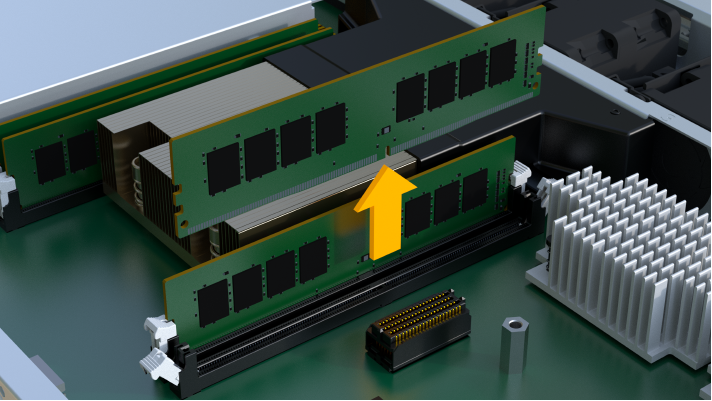

= Ersetzen Sie die DIMMs in EF300 oder EF600
:allow-uri-read: 
:experimental: 
:icons: font
:imagesdir: ../media/

[role="lead"]
Sie können ein DIMM in einem EF300- oder EF600-Array ersetzen.

Zum Austauschen eines DIMM müssen Sie die Cache-Größe des Controllers überprüfen, den Controller offline schalten, den Controller entfernen, die DIMMs entfernen und die neuen DIMMs in den Controller installieren. Anschließend können Sie Ihren Controller wieder online schalten und überprüfen, ob das Speicher-Array ordnungsgemäß funktioniert.

.Bevor Sie beginnen
* Prüfen link:dimms-overview-supertask-concept.html["Anforderungen für den Austausch eines EF300- oder EF600-DIMM"].
* Stellen Sie sicher, dass keine Volumes verwendet werden oder dass auf allen Hosts, die diese Volumes verwenden, ein Multipath-Treiber installiert ist.

.Was Sie und#8217;ll benötigen
* Ein Ersatz-DIMM.
* Ein ESD-Armband, oder Sie haben andere antistatische Vorsichtsmaßnahmen getroffen.
* Ein flacher, statischer freier Arbeitsbereich.
* Etiketten, um jedes Kabel zu identifizieren, das mit dem Controller-Behälter verbunden ist.
* Eine Management Station mit einem Browser, der für den Controller auf den SANtricity System Manager zugreifen kann. (Zeigen Sie zum Öffnen der System Manager-Schnittstelle den Domain-Namen oder die IP-Adresse des Controllers im Browser.)

== Schritt 1: Bestimmen Sie, ob Sie ein DIMM ersetzen müssen

Überprüfen Sie die Cache-Größe Ihres Controllers, bevor Sie das DIMMS ersetzen.

.Schritte
. Rufen Sie das Speicher-Array-Profil für den Controller auf. Wählen Sie im SANtricity System Manager die Option Menü:Support[Support Center]. Wählen Sie auf der Seite Support Resources die Option *Storage Array Profile*.
. Scrollen Sie nach unten oder verwenden Sie das Suchfeld, um die *Daten-Cache-Modul*-Informationen zu finden.
. Wenn eine der folgenden Optionen vorhanden ist, notieren Sie sich die Position des DIMM-Moduls, und fahren Sie mit den übrigen Verfahren in diesem Abschnitt fort, um die DIMMs auf dem Controller zu ersetzen:
+
** Ein ausgefallenes DIMM oder ein DIMM-Reporting *Data Cache Module* als nicht optimal.
** Ein DIMM mit einer nicht übereinstimmenden * Data Cache Module* Kapazität.

== Schritt 2: Controller offline schalten

Platzieren Sie den Controller offline, damit Sie die DIMMs sicher entfernen und austauschen können.

.Schritte
. Sehen Sie sich im SANtricity System Manager die Details im Recovery Guru an, um zu überprüfen, ob ein Problem mit falsch abgestimmter Speicher vorliegt, und um sicherzustellen, dass keine weiteren Punkte zuerst behoben werden müssen.
. Bestimmen Sie im Bereich Details des Recovery Guru, welches DIMM ersetzt werden soll.
. Sichern Sie die Konfigurationsdatenbank des Storage-Arrays mit SANtricity System Manager.
+
Wenn beim Entfernen eines Controllers ein Problem auftritt, können Sie die gespeicherte Datei verwenden, um Ihre Konfiguration wiederherzustellen. Das System speichert den aktuellen Status der RAID-Konfigurationsdatenbank, die alle Daten für Volume-Gruppen und Festplatten-Pools auf dem Controller enthält.

+
** Über System Manager:
+
... Wählen Sie MENU:Support[Support Center > Diagnose].
... Wählen Sie *Konfigurationsdaten Erfassen*.
... Klicken Sie Auf *Collect*.
+
Die Datei wird im Ordner Downloads für Ihren Browser mit dem Namen *configurationData-<arrayName>-<dateTime>.7z* gespeichert.

. Wenn der Controller nicht bereits offline ist, versetzen Sie ihn jetzt mithilfe von SANtricity System Manager in den Offline-Modus.
+
.. Wählen Sie *Hardware*.
.. Wenn die Grafik die Laufwerke anzeigt, wählen Sie *Zurück vom Shelf anzeigen* aus, um die Controller anzuzeigen.
.. Wählen Sie den Controller aus, den Sie in den Offline-Modus versetzen möchten.
.. Wählen Sie im Kontextmenü die Option *Offline platzieren* aus, und bestätigen Sie, dass Sie den Vorgang ausführen möchten.
+

NOTE: Wenn Sie mit dem Controller auf SANtricity System Manager zugreifen, den Sie offline schalten möchten, wird eine Meldung vom SANtricity System Manager nicht verfügbar angezeigt. Wählen Sie *mit einer alternativen Netzwerkverbindung verbinden* aus, um automatisch über den anderen Controller auf SANtricity System Manager zuzugreifen.

. Warten Sie, bis SANtricity System Manager den Status des Controllers auf „Offline“ aktualisiert.
+

NOTE: Beginnen Sie keine anderen Vorgänge, bis der Status aktualisiert wurde.

. Wählen Sie im Recovery Guru * erneut aus und bestätigen Sie, dass das Feld OK zum Entfernen im Bereich Details Ja angezeigt wird, was darauf hinweist, dass es sicher ist, diese Komponente zu entfernen.

== Schritt 3: Controller-Behälter entfernen

Sie entfernen den defekten Controller-Behälter, so dass Sie Ihre DIMMs durch neue ersetzen können.

.Schritte
. Setzen Sie ein ESD-Armband an oder ergreifen Sie andere antistatische Vorsichtsmaßnahmen.
. Beschriften Sie jedes Kabel, das am Controller-Behälter befestigt ist.
. Trennen Sie alle Kabel vom Controller-Behälter.
+

CAUTION: Um eine verminderte Leistung zu vermeiden, dürfen die Kabel nicht verdreht, gefaltet, gequetscht oder treten.

. Vergewissern Sie sich, dass die LED Cache Active auf der Rückseite des Controllers ausgeschaltet ist.
. Drücken Sie die Griffe auf beiden Seiten des Controllers, und ziehen Sie sie nach hinten, bis sie sich aus dem Shelf lösen.
+
image::../media/remove_controller_5.png[Controller 5 ausbauen]

. Schieben Sie den Controller-Behälter mit zwei Händen und den Griffen aus dem Regal. Wenn sich die Vorderseite des Controllers nicht im Gehäuse befindet, ziehen Sie sie mit zwei Händen vollständig heraus.
+

CAUTION: Verwenden Sie immer zwei Hände, um das Gewicht eines Reglerkanisters zu unterstützen.

+
image::../media/remove_controller_6.png[Controller 6 ausbauen]

. Setzen Sie den Steuerungsbehälter auf eine flache, statisch freie Oberfläche.

== Schritt 4: Entfernen Sie die DIMMs

Wenn nicht genügend Arbeitsspeicher vorhanden ist, ersetzen Sie die DIMMs im Controller.

.Schritte
. Entfernen Sie die Abdeckung des Reglerkanisters, indem Sie die einzelne Rändelschraube lösen und den Deckel öffnen.
. Stellen Sie sicher, dass die grüne LED im Controller aus ist.
+
Wenn diese grüne LED leuchtet, wird der Controller weiterhin mit Strom versorgt. Sie müssen warten, bis diese LED erlischt, bevor Sie Komponenten entfernen.

. Suchen Sie die DIMMs auf dem Controller.
. Beachten Sie die Ausrichtung des DIMM-Moduls in der Buchse, damit Sie das ErsatzDIMM in die richtige Ausrichtung einsetzen können.
+

NOTE: Eine Kerbe an der Unterseite des DIMM hilft Ihnen beim Ausrichten des DIMM während der Installation.

. Schieben Sie die beiden DIMM-Auswurflaschen auf beiden Seiten des DIMM langsam auseinander, um das DIMM aus dem Steckplatz zu werfen, und schieben Sie es dann aus dem Steckplatz heraus.
+
image::../media/dimm_2.png[dimm 2]

+

+

CAUTION: Halten Sie das DIMM vorsichtig an den Rändern, um Druck auf die Komponenten auf der DIMM-Leiterplatte zu vermeiden.

+
Die Anzahl und Anordnung der System-DIMMs hängt vom Modell Ihres Systems ab.

== Schritt 5: Neue DIMMs installieren

Installieren Sie ein neues DIMM, um das alte zu ersetzen.

.Schritte
. Halten Sie das DIMM an den Ecken, und richten Sie es an dem Steckplatz aus.
+
Die Kerbe zwischen den Stiften am DIMM sollte mit der Lasche im Sockel aufliegen.

. Setzen Sie das DIMM-Modul in den Steckplatz ein.
+
Das DIMM passt eng in den Steckplatz, sollte aber leicht einpassen. Falls nicht, richten Sie das DIMM-Modul mit dem Steckplatz aus und setzen Sie es wieder ein.

+

NOTE: Prüfen Sie das DIMM visuell, um sicherzustellen, dass es gleichmäßig ausgerichtet und vollständig in den Steckplatz eingesetzt ist.

. Drücken Sie vorsichtig, aber fest auf der Oberseite des DIMM, bis die Verriegelungen über die Kerben an den Enden des DIMM einrasten.
+

NOTE: DIMMs passen eng zusammen. Möglicherweise müssen Sie nacheinander vorsichtig auf eine Seite drücken und mit jeder einzelnen Lasche befestigen.

+
image::../media/dimm_5.png[dimm 5]

== Schritt 6: Controller-Behälter wieder einbauen

Setzen Sie nach dem Installieren der neuen DIMMs den Controller-Behälter wieder in das Controller-Shelf ein.

.Schritte
. Senken Sie die Abdeckung am Controller-Behälter ab, und befestigen Sie die Daumenschraube.
. Schieben Sie den Controller-Behälter vorsichtig ganz in das Reglerregal, während Sie die Controller-Griffe zusammendrücken.
+

NOTE: Der Controller klickt hörbar, wenn er richtig in das Regal eingebaut ist.

+
image::../media/remove_controller_7.png[Controller 7 ausbauen]

. Schließen Sie alle Kabel wieder an.

== Schritt 7: Vollständige DIMMs austauschen

Platzieren Sie den Controller online, sammeln Sie Support-Daten und setzen Sie den Betrieb fort.

.Schritte
. Platzieren Sie den Controller in den Online-Modus
+
.. Wechseln Sie in System Manager zur Seite Hardware.
.. Wählen Sie *Zurück von Controller anzeigen*.
.. Wählen Sie den Controller mit den ersetzten DIMMs aus.
.. Wählen Sie in der Dropdown-Liste * Online platzieren* aus.

. Überprüfen Sie beim Booten des Controllers die Controller-LEDs.
+
Wenn die Kommunikation mit der anderen Steuerung wiederhergestellt wird:

+
** Die gelbe Warn-LED leuchtet weiterhin.
** Je nach Host-Schnittstelle leuchtet, blinkt oder leuchtet die LED für Host-Link möglicherweise nicht.

. Wenn der Controller wieder online ist, bestätigen Sie, dass sein Status optimal lautet, und überprüfen Sie die Warn-LEDs für das Controller-Shelf.
+
Wenn der Status nicht optimal ist oder eine der Warn-LEDs leuchtet, vergewissern Sie sich, dass alle Kabel richtig eingesetzt sind und der Controller-Behälter richtig installiert ist. Gegebenenfalls den Controller-Behälter ausbauen und wieder einbauen.

+

NOTE: Wenden Sie sich an den technischen Support, wenn das Problem nicht gelöst werden kann.

. Klicken Sie auf Menü:Hardware[Support > Upgrade Center], um sicherzustellen, dass die neueste Version des SANtricity-Betriebssystems installiert ist.
+
Installieren Sie bei Bedarf die neueste Version.

. Überprüfen Sie, ob alle Volumes an den bevorzugten Eigentümer zurückgegeben wurden.
+
.. Wählen Sie Menü:Storage[Volumes]. Überprüfen Sie auf der Seite * All Volumes*, ob die Volumes an die bevorzugten Eigentümer verteilt werden. Wählen Sie MENU:Mehr[Eigentumsrechte ändern], um Volumeneigentümer anzuzeigen.
.. Wenn alle Volumes Eigentum des bevorzugten Eigentümers sind, fahren Sie mit Schritt 6 fort.
.. Wenn keines der Volumes zurückgegeben wird, müssen Sie die Volumes manuell zurückgeben. Wechseln Sie zum Menü:Mehr[Umverteilung von Volumes].
.. Wenn kein Recovery Guru zur Verfügung steht oder bei Durchführung der Schritte des Recovery Guru erfolgt, werden die Volumes immer noch nicht an den von ihnen bevorzugten Eigentümer zurückgegeben.

. Support-Daten für Ihr Storage Array mit SANtricity System Manager erfassen
+
.. Wählen Sie MENU:Support[Support Center > Diagnose].
.. Wählen Sie *Support-Daten Erfassen* Aus.
.. Klicken Sie Auf *Collect*.
+
Die Datei wird im Ordner Downloads für Ihren Browser mit dem Namen *Support-Data.7z* gespeichert.

Der DIMM-Austausch ist abgeschlossen. Sie können den normalen Betrieb fortsetzen.
