= In EF300 und EF600 Systemen kann ein IOM12 oder IOM12B Laufwerk-Shelf im laufenden Betrieb hinzugefügt werden.
:allow-uri-read: 
:icons: font
:imagesdir: ../media/

[role="lead"]
Sie können ein neues Festplatten-Shelf hinzufügen, während die Stromversorgung weiterhin auf die anderen Komponenten des Storage-Systems angewendet wird. Sie können Storage-Systemkapazität konfigurieren, neu konfigurieren, hinzufügen oder verschieben, ohne den Benutzerzugriff auf Daten zu unterbrechen.

.Bevor Sie beginnen
* Aufgrund der Komplexität dieses Verfahrens sollten vor Beginn des Verfahrens alle Schritte gelesen werden.
+
Beim Hinzufügen eines Regals zu einem oder mehreren bestehenden Regalen im laufenden Betrieb muss zur Aufrechterhaltung der Systemintegrität während des Vorgangs stets ein aktiver Pfad aufrechterhalten werden. Die Vorgehensweise muss exakt in der angegebenen Reihenfolge befolgt werden.

+
Zum Verkabeln des neuen Shelf werden die Controller-zu-Shelf-Verbindungen auf der A-Seite (Shelf IOM A) neu verkabelt und Shelf-zu-Shelf-Verbindungen hinzugefügt, es wird überprüft, ob der A-Seiten-Pfad aktiv ist, die Controller-zu-Shelf-Verbindungen auf der B-Seite (Shelf IOMB) werden neu verkabelt und Shelf-zu-Shelf-Verbindungen hinzugefügt, und anschließend wird überprüft, ob die Redundanz wiederhergestellt wurde.

+

NOTE: Wenn Sie ein Laufwerksgehäuse installieren, das zuvor in einem Speichersystem installiert war, sind in diesem Verfahren zusätzliche Schritte erforderlich.

* Stellen Sie sicher, dass das Hinzufügen eines Festplatten-Shelfs während des laufenden Vorgangs erfolgt.
* Es muss überprüft werden, dass auf Ihrem Speichersystem eine Version von SANtricity ausgeführt wird, die SAS-Erweiterungsgehäuse unterstützt, und dass die maximale Anzahl der unterstützten SAS-Gehäuse nicht überschritten wird.
+
Informationen zu den unterstützten Versionen von SANtricity und zur maximalen Anzahl von SAS-Erweiterungsgehäusen für Ihr Speichersystem finden Sie im NetApp Hardware Universe: https://hwu.netapp.com/Controller/Index?platformTypeId=2357027["Hardware Universe"^].

+

NOTE: EF50 und EF80 Speichersysteme, auf denen SANtricity 12.10 oder höher ausgeführt wird, unterstützen SAS Erweiterungs-Shelves.

* Ihr Speichersystem muss über freie SAS-Anschlüsse verfügen. Das bedeutet, dass SAS-E/A-Module bereits installiert sein müssen. Falls dies nicht der Fall ist, sind die SAS-E/A-Module gemäß der entsprechenden Vorgehensweise zu installieren; anschließend ist zu dieser Vorgehensweise zurückzukehren, um das Laufwerks-Shelf im laufenden Betrieb hinzuzufügen.
+
** Für EF50 und EF80 Speichersysteme ist das link:../maintenance-ef50-ef80/io-module-upgrade.html["Upgrade der E/A-Module"^]Verfahren zu verwenden.
** Für ältere Speichersysteme ist das Verfahren _SAS expansion cards_ für Ihr Speichersystemmodell im Abschnitt _Maintain systems_ zu verwenden.

.Über diese Aufgabe
* Dieses Verfahren gilt für einen Controller-Einschub E2800, E2800B, EF280, E5700, E5700B, EF570, EF300, EF600, EF300C, EF600C, E4000, EF50 oder EF80.
+

NOTE: Wenn Sie ein älteres Controller-Gehäuse verkabeln, finden Sie weitere Informationen unter  https://mysupport.netapp.com/ecm/ecm_download_file/ECMLP2859057["Hinzufügen von IOM-Laufwerk-Shelfs zu einem vorhandenen E27XX-, E56XX- oder EF560-Controller-Shelf"^].

* Dieses Verfahren gilt für das Hot-Adding von DE212C, DE224C oder DE460C Laufwerks-Shelfs mit IOM12, IOM12B oder IOM12C Modulen.
+

NOTE: IOM12C-Module werden nur ab SANtricity OS 11.90R3 unterstützt. Stellen Sie sicher, dass die Firmware Ihres Controllers aktualisiert wurde, bevor Sie auf ein IOM12C installieren oder aktualisieren.

[[step-1-prepare-to-add-the-drive-shelf]]
== Schritt 1: Bereiten Sie sich vor, das Laufwerk-Shelf hinzuzufügen

Damit Sie ein Festplatten-Shelf vorbereiten können, müssen Sie nach kritischen Ereignissen suchen und den Status der IOMs überprüfen.

.Bevor Sie beginnen
* Die Stromversorgung des Storage-Systems muss die Anforderungen an das neue Festplatten-Shelf erfüllen. Informationen zur Stromversorgung Ihres Festplatten-Shelfs finden Sie im https://hwu.netapp.com/Controller/Index?platformTypeId=2357027["Hardware Universe"^].
* Das Verkabelungsmuster für das vorhandene Storage-System muss mit einem der in diesem Verfahren angegebenen Schemata übereinstimmen.

.Schritte
. Wählen Sie im SANtricity System Manager die Option *Support* > *Support Center* > *Diagnose* aus.
. Wählen Sie *Support-Daten Erfassen* Aus.
+
Das Dialogfeld Support-Daten erfassen wird angezeigt.

. Klicken Sie Auf *Collect*.
+
Die Datei wird im Ordner Downloads für Ihren Browser mit dem Namen Support-Data.7z gespeichert. Die Daten werden nicht automatisch an den technischen Support gesendet.

. Wählen Sie *Support* > *Ereignisprotokoll*.
+
Auf der Seite Ereignisprotokoll werden die Ereignisdaten angezeigt.

. Wählen Sie die Überschrift der Spalte *Priorität* aus, um kritische Ereignisse oben in der Liste zu sortieren.
. Überprüfen Sie die systemkritischen Ereignisse auf Ereignisse, die in den letzten zwei bis drei Wochen aufgetreten sind, und vergewissern Sie sich, dass alle letzten kritischen Ereignisse behoben oder anderweitig behoben wurden.
+

NOTE: Wenn in den letzten zwei bis drei Wochen nicht gelöste kritische Ereignisse aufgetreten sind, beenden Sie das Verfahren und wenden Sie sich an den technischen Support. Setzen Sie das Verfahren nur fort, wenn das Problem behoben ist.

. Wenn EAMs an Ihre Hardware angeschlossen sind, führen Sie die folgenden Schritte aus. Andernfalls fahren Sie mit fort <<step2_install_drive_shelf,Schritt 2: Installieren Sie das Laufwerk-Shelf und schalten Sie die Stromversorgung ein.>>
+
.. Menü auswählen:Hardware[Controllers and components].
.. Wählen Sie das Symbol * IOMs (ESMs)* aus.
+

+
Das Dialogfeld Einstellungen für Shelf-Komponenten wird angezeigt, wobei die Registerkarte *IOMs (ESMs)* ausgewählt ist.

.. Stellen Sie sicher, dass der für jedes IOM/ESM angezeigte Status _optimal_ lautet.
.. Klicken Sie auf *Weitere Einstellungen anzeigen*.
.. Vergewissern Sie sich, dass die folgenden Bedingungen vorliegen:
+
*** Die Anzahl der erkannten ESMs/IOMs entspricht der Anzahl der im System installierten ESMs/IOMs und denen für jedes Laufwerk-Shelf.
*** Beide ESMs/IOMs zeigen, dass Kommunikation in Ordnung ist.
*** Die Datenrate beträgt 12 GB/s für DE212C, DE224C und DE460C Laufwerk-Shelfs oder 6 GB/s für andere Laufwerksfächer.

[[step-2-install-the-drive-shelf-and-apply-power]]
[[step2_install_drive_shelf]]
== Schritt 2: Installieren Sie das Festplatten-Shelf und bringen Sie Strom an

Sie installieren ein neues Festplatten-Shelf oder ein zuvor installiertes Festplatten-Shelf, schalten den Strom ein und überprüfen, ob entsprechende LEDs erforderlich sind.

.Schritte
. Wenn Sie ein Festplatten-Shelf installieren, das zuvor in einem Storage-System installiert wurde, entfernen Sie die Laufwerke. Die Laufwerke müssen nacheinander in diesem Verfahren installiert werden.
+
Wenn der Installationsverlauf des Festplatten-Shelf, das Sie installieren, unbekannt ist, müssen Sie davon ausgehen, dass dieses zuvor in einem Storage-System installiert wurde.

. Installieren Sie das Festplatten-Shelf im Rack, in dem die Komponenten des Storage-Systems enthalten sind.
+

NOTE: In der Installationsanleitung Ihres Modells finden Sie das vollständige Verfahren zur physischen Installation und Verkabelung. Die Installationsanweisungen für Ihr Modell enthalten Hinweise und Warnungen, die Sie zur sicheren Installation eines Festplatten-Shelfs berücksichtigen müssen.

. Schalten Sie das neue Festplatten-Shelf ein, und vergewissern Sie sich, dass am Festplatten-Shelf keine gelbe Warn-LEDs leuchten. Beheben Sie, wenn möglich, alle Fehlerbedingungen, bevor Sie mit diesem Verfahren fortfahren.

[[step-3-cable-the-drive-shelf]]
== Schritt 3: Das Laufwerk-Shelf verkabeln

Zum Verkabeln des Shelfs mit Ihrem Speichersystem wird jeder Controller so verbunden, dass ein A-seitiger Pfad (IOMA) und ein B-seitiger Pfad (IOMB) zum einzelnen Shelf oder Shelf-Stack (je nach Fall) vorhanden sind. Wenn ein Shelf-Stack vorhanden ist, werden die Shelfs anschließend über den A-seitigen Pfad und den B-seitigen Pfad miteinander verbunden (Shelf-zu-Shelf-Verbindungen).

Die Verkabelung der Controller und eines oder mehrerer Shelfs erfolgt immer so, dass zwei Kabelverbindungen für den A-seitigen Pfad (IOMA) und den B-seitigen Pfad (IOMB) vorhanden sind, wie in den Verkabelungsabbildungen gezeigt.

[role="tabbed-block"]
====
.Anschluss des Laufwerk-Shelfs für EF50 oder EF80
--
Dieses Verfahren enthält Anweisungen dazu, wie das erste SAS Erweiterungsgehäuse im laufenden Betrieb zu Ihrem EF50 oder EF80 Speichersystem hinzugefügt wird und wie das erste Gehäuse neu verkabelt wird, um ein zweites Gehäuse im laufenden Betrieb hinzuzufügen; dieses Verfahren kann jedoch auch beim Hinzufügen weiterer Gehäuse angewendet werden.

.Bevor Sie beginnen
Sie haben Ihre Firmware auf die neueste Version aktualisiert. Befolgen Sie zum Aktualisieren der Firmware die Anweisungen im link:../upgrade-santricity/index.html["Aktualisieren des SANtricity Betriebssystems"].

.Über diese Aufgabe
* Wenn ein zusätzliches Shelf zu einem oder mehreren vorhandenen Shelfs im laufenden Betrieb hinzugefügt wird, gilt Folgendes:
+
** Bei diesem Verfahren werden die Verbindungen zwischen Controller und Shelf neu verkabelt, sodass stets ein aktiver Pfad zum Controller Shelf erhalten bleibt.
+
Um während dieses Vorgangs einen aktiven Pfad aufrechtzuerhalten, werden die Controller-zu-Shelf-Verbindungen der A-Seite (Shelf IOMA) neu verkabelt und Shelf-zu-Shelf-Verbindungen hinzugefügt, anschließend wird überprüft, ob der Pfad der A-Seite aktiv ist, danach werden die Controller-zu-Shelf-Verbindungen der B-Seite (Shelf IOMB) neu verkabelt und Shelf-zu-Shelf-Verbindungen hinzugefügt, und schließlich wird überprüft, ob die Redundanz wiederhergestellt wurde.

** Kabel werden immer vom letzten Shelf im Stack zu denselben IOMs und IOM Ports auf dem neuen Shelf verlegt, und anschließend wird das neue Shelf mit dem zuvor letzten Shelf im Stack verbunden (Shelf-zu-Shelf-Verbindungen).

* Diese Anleitung beschreibt das Hot-Adding von bis zu zwei Shelfs im laufenden Betrieb. Wenn jedoch ein zusätzliches Shelf im laufenden Betrieb hinzugefügt wird, ist mit Schritt 2 zu beginnen, und die Schritte sind auf das zusätzliche Shelf anzuwenden.
* Dieses Verfahren zeigt Controller mit einem SAS E/A-Modul in Steckplatz 3. Eine Übersicht aller unterstützten SAS E/A-Modulkonfigurationen ist unter link:https://hwu.netapp.com["NetApp Hardware Universe"^] verfügbar.
* In den Verkabelungsabbildungen sind die Anschlüsse von Controller A blau und die von Controller B rot dargestellt. Die gestrichelten Linien (blau und rot) stellen die vorhandene Verkabelung dar, die für die Durchführung der Verkabelungsschritte umgesetzt wird. Die grauen Anschlüsse und Linien stellen die vorhandene Verkabelung dar, die während der Durchführung der Verkabelungsschritte an Ort und Stelle bleibt.

.Schritte
. Zum Hot-Add eines SAS Shelf als erstes SAS Expansion Shelf sind die folgenden Teilschritte auszuführen, andernfalls ist mit dem nächsten Schritt fortzufahren.
+
.. Controller A Port 3a wird mit Shelf IOMA Port 1 verbunden.
.. Controller A Port 3b wird mit Shelf IOMA Port 2 verbunden.
.. Controller A Port 3c wird mit Shelf IOMB Port 3 verbunden.
.. Controller A Port 3d wird mit Shelf IOMB Port 4 verbunden.
.. Controller B Port 3a wird mit Gehäuse-IOMA-Port 3 verbunden.
.. Controller B Port 3b wird mit Shelf IOMA Port 4 verbunden.
.. Controller B Port 3c wird mit Shelf IOMB Port 1 verbunden.
.. Controller B Port 3d wird mit Shelf IOMB Port 2 verbunden.
+
Wenn Sie die Verkabelung des Shelfs abgeschlossen haben, sollte die Verkabelung wie folgt aussehen:

+
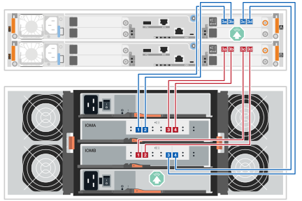

. Zum Hot-Add eines zweiten SAS Erweiterungsgehäuses (Gehäuse 2) werden die Controller-zu-Gehäuse-Verbindungen auf der A-Seite neu verkabelt und die Gehäuse-zu-Gehäuse-Verbindungen auf der A-Seite wie folgt hinzugefügt; andernfalls wird mit dem nächsten Schritt fortgefahren.
+
.. Das Kabel wird von shelf 1 IOMA port 1 getrennt und wieder mit shelf 2 IOMA port 1 verbunden.
.. Das Kabel von Shelf 1 IOMA Port 2 wird getrennt und wieder an Shelf 2 IOMA Port 2 angeschlossen.
.. Shelf 1 IOMA Port 1 wird mit Shelf 2 IOMA Port 4 verbunden.
.. Shelf 1 IOMA Port 2 wird mit Shelf 2 IOMA Port 3 verbunden.
+
Nachdem Sie die Anschlüsse auf der A-Seite neu verkabelt haben, sollte die Verkabelung wie folgt aussehen:

+
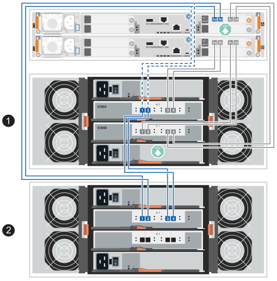

. Klicken Sie im SANtricity System Manager auf menu:Hardware[Controllers and components].
+

NOTE: Wenn ein zweites SAS-Erweiterungsgehäuse hinzugefügt wird, besteht zu diesem Zeitpunkt im Verfahren nur ein aktiver Pfad zum Controller-Gehäuse.

. Blättern Sie nach unten, um alle Laufwerk-Shelfs im neuen Storage-System zu sehen. Wenn das neue Festplatten-Shelf nicht angezeigt wird, lösen Sie das Verbindungsproblem.
. Wählen Sie das Symbol *ESMs/IOMs* für das neue Festplatten-Shelf aus.
+

+
Das Dialogfeld *Shelf-Komponenteneinstellungen* wird angezeigt.

. Wählen Sie im Dialogfeld *Shelf-Komponenteneinstellungen* die Registerkarte *ESMs/IOMs* aus.
. Wählen Sie * Weitere Optionen anzeigen* aus, und überprüfen Sie Folgendes:
+
** Wenn das erste SAS Erweiterungs-Shelf hinzugefügt wird, sind IOM/ESM A und IOM/ESM B aufgeführt. Wenn ein zweites SAS Erweiterungs-Shelf hinzugefügt wird, ist IOM/ESM A aufgeführt.
** Die aktuelle Datenrate beträgt 12 Gbit/s für ein SAS-3 Festplatten-Shelf.
** Kartenkommunikation ist in Ordnung.

. Wenn ein zweites SAS-Erweiterungsgehäuse hinzugefügt wird, sind die Controller-zu-Gehäuse-Verbindungen auf der B-Seite neu zu verkabeln und die Gehäuse-zu-Gehäuse-Verbindungen auf der B-Seite wie folgt hinzuzufügen; andernfalls ist mit Schritt 10 fortzufahren.
+
.. Das Kabel wird von IOMB-Port 1 von Shelf 1 getrennt und wieder mit IOMB-Port 1 von Shelf 2 verbunden.
.. Das Kabel wird von IOMB-Port 2 an Shelf 1 getrennt und wieder an IOMB-Port 2 an Shelf 2 angeschlossen.
.. Shelf 1 IOMB Port 1 wird mit Shelf 2 IOMB Port 3 verbunden.
.. IOMB-Port 2 von Shelf 1 wird mit IOMB-Port 4 von Shelf 2 verbunden.
+
Nachdem die Anschlüsse auf der B-Seite neu verkabelt wurden, sollte die Verkabelung wie folgt aussehen:

+
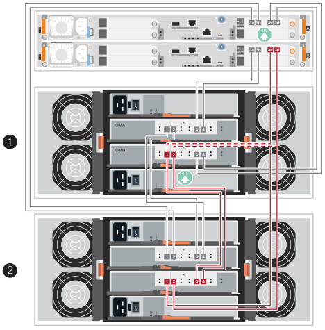

. Wenn ein zweites SAS-Erweiterungsgehäuse hinzugefügt wird, sollte die Verkabelung nach dem Neuverkabeln der beiden Gehäuse wie folgt aussehen:
+

NOTE: Wenn einem Stack aus zwei Shelfs ein drittes Shelf im laufenden Betrieb hinzugefügt wird, sollte die Verkabelung wie in der Abbildung im link:../install-hw-ef50-ef80/install-cable.html#step-3-cable-the-sas-shelf-connections["Option 2: Registerkarte „Drei DE460C Shelfs“"^] Abschnitt „Verkabelung der SAS Shelf Verbindungen“ für neue Systeminstallationen aussehen.

+
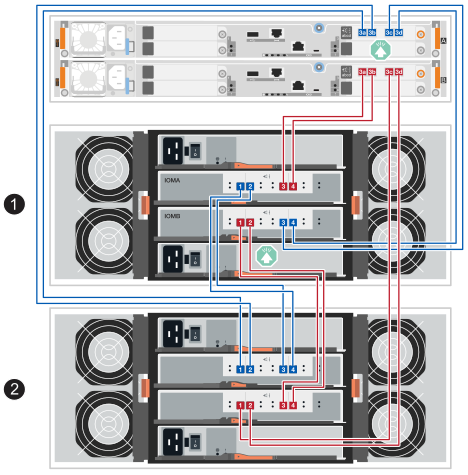

. Wenn er nicht bereits ausgewählt ist, wählen Sie im Dialogfeld *Shelf-Komponenteneinstellungen* die Registerkarte *ESMs/IOMs* aus, und wählen Sie dann *Weitere Optionen anzeigen*. Stellen Sie sicher, dass die Kartenkommunikation *JA* lautet.
+

NOTE: Der Status „optimal“ zeigt an, dass der Verlust eines Redundanzfehlers im Zusammenhang mit dem neuen Festplatten-Shelf behoben wurde und das Storage-System stabilisiert ist.

--
.Schließen Sie das Festplatten-Shelf für die E2800 oder die E5700 an
--
Sie verbinden das Festplatten-Shelf mit Controller A, bestätigen den IOM-Status und verbinden dann das Festplatten-Shelf mit Controller B

.Schritte
. Verbinden Sie das Festplatten-Shelf mit Controller A.
+
Die folgende Abbildung zeigt eine Beispielverbindung zwischen einem zusätzlichen Festplatten-Shelf und Controller A Informationen zum Auffinden der Ports auf Ihrem Modell finden Sie im https://hwu.netapp.com/Controller/Index?platformTypeId=2357027["Hardware Universe"^].

+
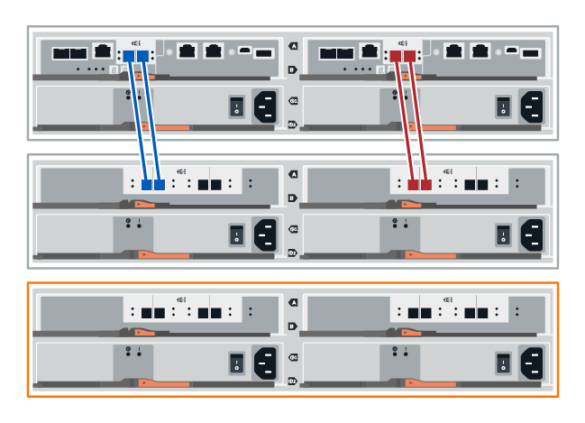

+
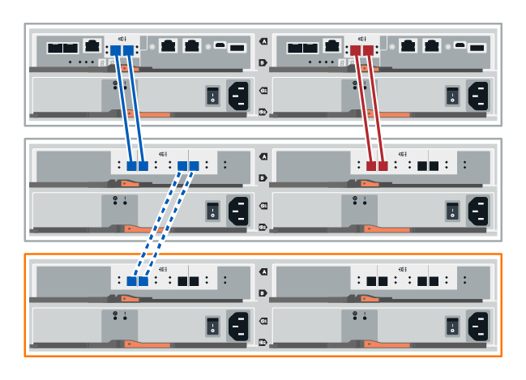

. Klicken Sie im SANtricity System Manager auf *Hardware*.
+

NOTE: An diesem Punkt in der Prozedur verfügen Sie nur über einen aktiven Pfad zum Controller-Shelf.

. Blättern Sie nach unten, um alle Laufwerk-Shelfs im neuen Storage-System zu sehen. Wenn das neue Festplatten-Shelf nicht angezeigt wird, lösen Sie das Verbindungsproblem.
. Wählen Sie das Symbol *ESMs/IOMs* für das neue Festplatten-Shelf aus.
+

+
Das Dialogfeld *Shelf-Komponenteneinstellungen* wird angezeigt.

. Wählen Sie im Dialogfeld *Shelf-Komponenteneinstellungen* die Registerkarte *ESMs/IOMs* aus.
. Wählen Sie * Weitere Optionen anzeigen* aus, und überprüfen Sie Folgendes:
+
** IOM/ESM A wird aufgelistet.
** Die aktuelle Datenrate beträgt 12 Gbit/s für ein SAS-3 Festplatten-Shelf.
** Kartenkommunikation ist in Ordnung.

. Trennen Sie alle Erweiterungskabel von Controller B.
. Verbinden Sie das Festplatten-Shelf mit Controller B.
+
Die folgende Abbildung zeigt eine Beispielverbindung zwischen einem zusätzlichen Laufwerk-Shelf und Controller B Informationen zum Auffinden der Ports auf Ihrem Modell finden Sie im https://hwu.netapp.com/Controller/Index?platformTypeId=2357027["Hardware Universe"^].

+
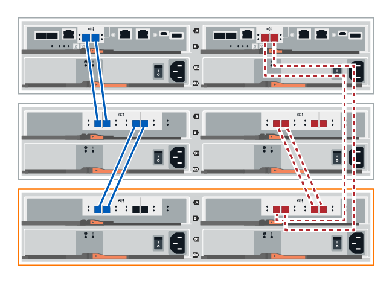

. Wenn er nicht bereits ausgewählt ist, wählen Sie im Dialogfeld *Shelf-Komponenteneinstellungen* die Registerkarte *ESMs/IOMs* aus, und wählen Sie dann *Weitere Optionen anzeigen*. Stellen Sie sicher, dass die Kartenkommunikation *JA* lautet.
+

NOTE: Der Status „optimal“ zeigt an, dass der Verlust eines Redundanzfehlers im Zusammenhang mit dem neuen Festplatten-Shelf behoben wurde und das Storage-System stabilisiert ist.

--
.Schließen Sie das Festplatten-Shelf für EF300 oder EF600 an
--
Sie verbinden das Festplatten-Shelf mit Controller A, bestätigen den IOM-Status und verbinden dann das Festplatten-Shelf mit Controller B

.Bevor Sie beginnen
* Sie haben Ihre Firmware auf die neueste Version aktualisiert. Befolgen Sie zum Aktualisieren der Firmware die Anweisungen im link:../upgrade-santricity/index.html["Aktualisieren des SANtricity Betriebssystems"].

.Schritte
. Trennen Sie beide A-seitlichen Controller-Kabel von den IOM12-Ports eins und zwei vom vorherigen letzten Shelf im Stack, und verbinden Sie sie dann mit den neuen IOM12-Shelf-Ports eins und zwei.
+
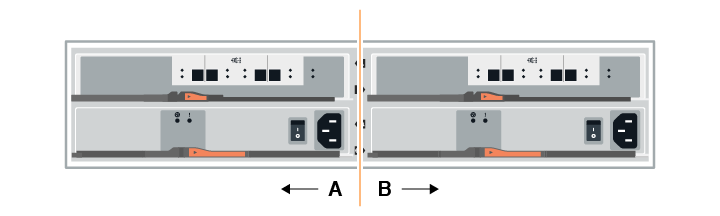

. Die Kabel an Die A-seitigen IOM12-Anschlüsse drei und vier vom neuen Shelf an die bisherigen IOM12-Anschlüsse 1 und 2 anschließen.
+
Die folgende Abbildung zeigt eine Beispielverbindung für Eine Seite zwischen einem zusätzlichen Festplatten-Shelf und dem vorherigen letzten Shelf. Informationen zum Auffinden der Ports auf Ihrem Modell finden Sie im https://hwu.netapp.com/Controller/Index?platformTypeId=2357027["Hardware Universe"^].

+
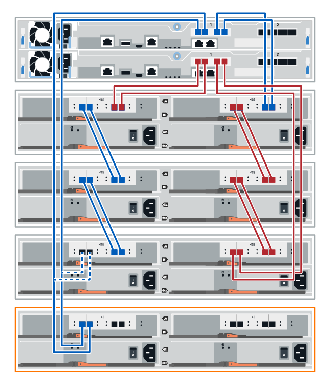

+
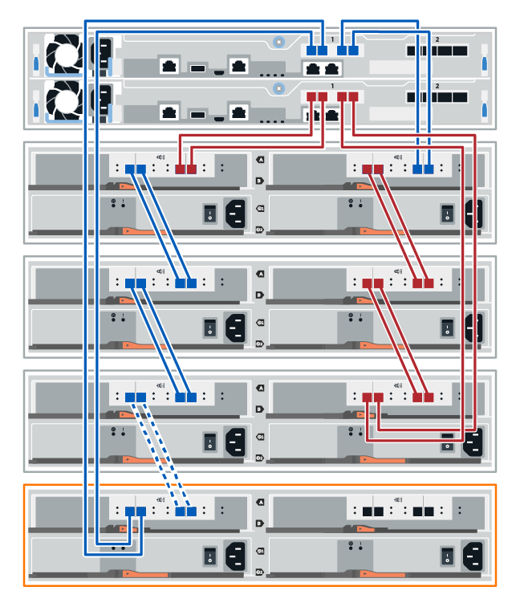

. Klicken Sie im SANtricity System Manager auf menu:Hardware[Controllers and components].
+

NOTE: An diesem Punkt in der Prozedur verfügen Sie nur über einen aktiven Pfad zum Controller-Shelf.

. Blättern Sie nach unten, um alle Laufwerk-Shelfs im neuen Storage-System zu sehen. Wenn das neue Festplatten-Shelf nicht angezeigt wird, lösen Sie das Verbindungsproblem.
. Wählen Sie das Symbol *ESMs/IOMs* für das neue Festplatten-Shelf aus.
+

+
Das Dialogfeld *Shelf-Komponenteneinstellungen* wird angezeigt.

. Wählen Sie im Dialogfeld *Shelf-Komponenteneinstellungen* die Registerkarte *ESMs/IOMs* aus.
. Wählen Sie * Weitere Optionen anzeigen* aus, und überprüfen Sie Folgendes:
+
** IOM/ESM A wird aufgelistet.
** Die aktuelle Datenrate beträgt 12 Gbit/s für ein SAS-3 Festplatten-Shelf.
** Kartenkommunikation ist in Ordnung.

. Trennen Sie die B-seitlichen Controller-Kabel von den IOM12-Ports eins und zwei vom vorherigen letzten Shelf im Stack, und verbinden Sie sie dann mit den neuen IOM12-Anschlüssen eins und zwei.
. Die Kabel an die B-seitigen IOM12-Anschlüsse drei und vier vom neuen Shelf an die letzten IOM12-Anschlüsse 1 und 2 anschließen.
+
Die folgende Abbildung zeigt eine Beispielverbindung für die B-Seite zwischen einem zusätzlichen Festplatten-Shelf und dem vorherigen letzten Shelf. Informationen zum Auffinden der Ports auf Ihrem Modell finden Sie im https://hwu.netapp.com/Controller/Index?platformTypeId=2357027["Hardware Universe"^].

+
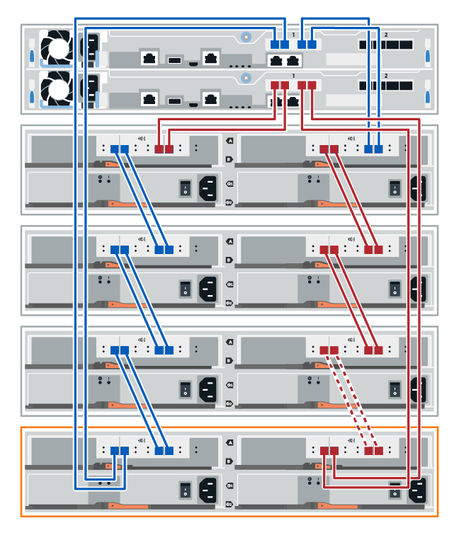

. Wenn er nicht bereits ausgewählt ist, wählen Sie im Dialogfeld *Shelf-Komponenteneinstellungen* die Registerkarte *ESMs/IOMs* aus, und wählen Sie dann *Weitere Optionen anzeigen*. Stellen Sie sicher, dass die Kartenkommunikation *JA* lautet.
+

NOTE: Der Status „optimal“ zeigt an, dass der Verlust eines Redundanzfehlers im Zusammenhang mit dem neuen Festplatten-Shelf behoben wurde und das Storage-System stabilisiert ist.

--
.Schließen Sie das Festplatten-Shelf für E4000 an
--
Sie verbinden das Festplatten-Shelf mit Controller A, bestätigen den IOM-Status und verbinden dann das Festplatten-Shelf mit Controller B

.Schritte
. Verbinden Sie das Festplatten-Shelf mit Controller A.
+
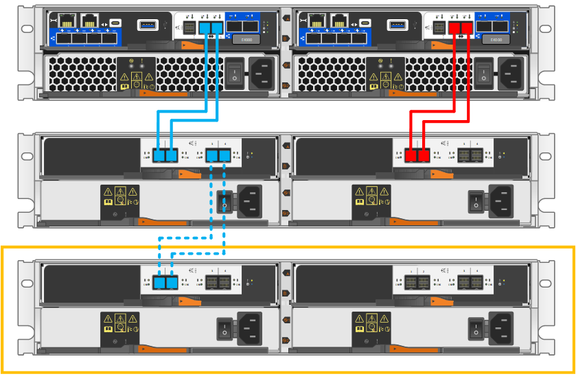

. Klicken Sie im SANtricity System Manager auf menu:Hardware[Controllers and components].
+

NOTE: An diesem Punkt in der Prozedur verfügen Sie nur über einen aktiven Pfad zum Controller-Shelf.

. Blättern Sie nach unten, um alle Laufwerk-Shelfs im neuen Storage-System zu sehen. Wenn das neue Festplatten-Shelf nicht angezeigt wird, lösen Sie das Verbindungsproblem.
. Wählen Sie das Symbol *ESMs/IOMs* für das neue Festplatten-Shelf aus.
+

+
Das Dialogfeld *Shelf-Komponenteneinstellungen* wird angezeigt.

. Wählen Sie im Dialogfeld *Shelf-Komponenteneinstellungen* die Registerkarte *ESMs/IOMs* aus.
. Wählen Sie * Weitere Optionen anzeigen* aus, und überprüfen Sie Folgendes:
+
** IOM/ESM A wird aufgelistet.
** Die aktuelle Datenrate beträgt 12 Gbit/s für ein SAS-3 Festplatten-Shelf.
** Kartenkommunikation ist in Ordnung.

. Trennen Sie alle Erweiterungskabel von Controller B.
. Verbinden Sie das Festplatten-Shelf mit Controller B.
+
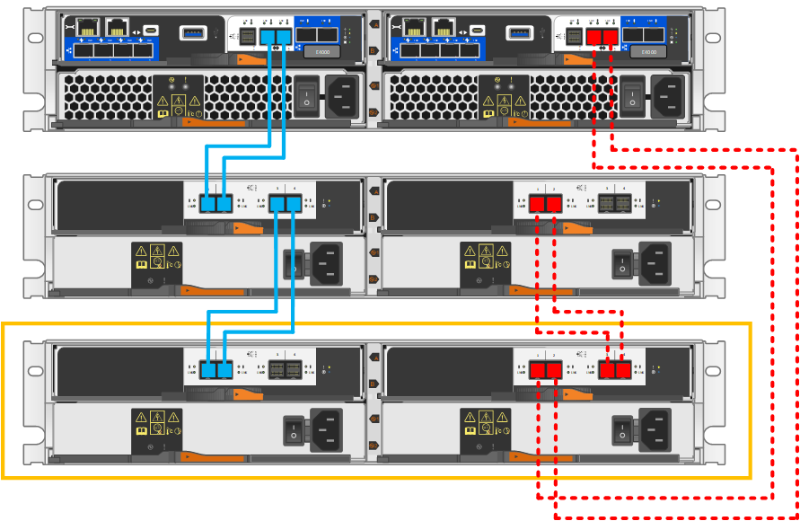

. Wenn er nicht bereits ausgewählt ist, wählen Sie im Dialogfeld *Shelf-Komponenteneinstellungen* die Registerkarte *ESMs/IOMs* aus, und wählen Sie dann *Weitere Optionen anzeigen*. Stellen Sie sicher, dass die Kartenkommunikation *JA* lautet.
+

NOTE: Der Status „optimal“ zeigt an, dass der Verlust eines Redundanzfehlers im Zusammenhang mit dem neuen Festplatten-Shelf behoben wurde und das Storage-System stabilisiert ist.

--
====

[[step-4-assign-drive-shelf-ids]]
== Schritt 4: Laufwerkseinschub-IDs zuweisen

Die Shelfs werden eingeschaltet, und anschließend wird jedem Shelf eine eindeutige Shelf-ID zugewiesen.

.Über diese Aufgabe
* Durch die Vergabe einer eindeutigen Shelf-ID an jedes Shelf wird sichergestellt, dass das Shelf innerhalb Ihres Speichersystems eindeutig identifizierbar ist.
+
Eine gültige Shelf-ID ist 01 bis 99.

+
Interne Shelfs (Storage), die in die Controller integriert sind, erhalten eine feste Shelf-ID von 00.

* Damit die Shelf-ID wirksam wird, muss ein Shelf vollständig aus- und wieder eingeschaltet werden (hierzu wird an jedem Netzteil des SAS Shelf der Netzschalter ausgeschaltet, mindestens 10 Sekunden gewartet und anschließend die Stromversorgung wieder eingeschaltet).

.Schritte
. Zum Zugriff auf die orangefarbene Shelf ID-Taste auf der Frontplatte muss die linke Endkappe entfernt werden.
+
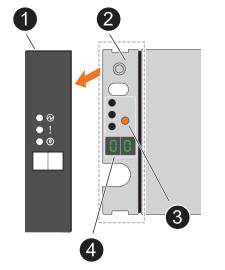

+
[cols="20%,80%"]
|===

 a| 

 a| 
Shelf Endkappe

 a| 

 a| 
Blende des Shelfs

 a| 

 a| 
Shelf ID Taste

 a| 

 a| 
Shelf ID Nummer

|===
. Die erste Ziffer der Shelf-ID wird geändert:
+
.. Die Taste „Shelf ID“ ist so lange gedrückt zu halten, bis die erste Zahl auf dem Digitaldisplay blinkt; anschließend ist die Taste loszulassen.
+
Es kann bis zu 15 Sekunden dauern, bis die Zahl blinkt. Dadurch wird der Programmiermodus für die Shelf ID aktiviert.

+

NOTE: Wenn die ID länger als 15 Sekunden zum Blinken benötigt, drücken und halten Sie die Shelf ID-Taste erneut und achten Sie darauf, sie vollständig durchzudrücken.

.. Durch Drücken und Loslassen der Shelf ID Taste wird die Zahl erhöht, bis die gewünschte Zahl von 0 bis 9 erreicht ist.
+
Die Dauer jedes Tastendrucks und Loslassens kann nur eine Sekunde betragen.

+
Die erste Zahl blinkt weiterhin.

. Die zweite Ziffer der Shelf-ID ist zu ändern:
+
.. Halten Sie die Taste gedrückt, bis die zweite Zahl auf der Digitalanzeige blinkt.
+
Es kann bis zu drei Sekunden dauern, bis die Zahl blinkt.

+
Die erste Zahl auf der Digitalanzeige blinkt nicht mehr.

.. Durch Drücken und Loslassen der Shelf ID Taste wird die Zahl erhöht, bis die gewünschte Zahl von 0 bis 9 erreicht ist.
+
Die zweite Zahl blinkt weiterhin.

. Die gewünschte Nummer wird gespeichert, und der Programmiermodus wird beendet, indem die Shelf ID-Taste gedrückt gehalten wird, bis die zweite Zahl aufhört zu blinken.
+
Es kann bis zu drei Sekunden dauern, bis die Zahl aufhört zu blinken.

+
Beide Zahlen auf dem Digitaldisplay beginnen zu blinken, und die gelbe LED leuchtet nach etwa fünf Sekunden auf. Dies weist darauf hin, dass die ausstehende Shelf ID noch nicht wirksam geworden ist.

. Das Shelf muss für mindestens 10 Sekunden aus- und wieder eingeschaltet werden, damit die Shelf-ID wirksam wird.
+
.. Der Netzschalter an jedem der Netzteile ist auszuschalten.
.. 10 Sekunden warten.
.. Schalten Sie an jedem der Netzteile den Netzschalter ein, um den Aus- und Einschaltzyklus abzuschließen.
+
Wenn ein Netzteil eingeschaltet wird, sollte die zweifarbige LED grün leuchten.

. Die linke Endkappe wieder anbringen.

[[step-5-complete-the-hot-add]]
== Schritt 5: Der Hot Add-Vorgang wird abgeschlossen.

Sie schließen das Hot Add-Laufwerk aus, indem Sie auf Fehler überprüfen und bestätigen, dass das neu hinzugefügte Festplatten-Shelf die neueste Firmware verwendet.

.Schritte
. Klicken Sie im SANtricity System Manager auf *Home*.
. Wenn der Link *Recover from Problems* in der Mitte oben auf der Seite angezeigt wird, klicken Sie auf den Link und beheben Sie alle im Recovery Guru angezeigten Probleme.
. Klicken Sie im SANtricity System Manager auf menu:Hardware[Controllers and components] und scrollen Sie gegebenenfalls nach unten, um das neu hinzugefügte Laufwerksgehäuse anzuzeigen.
. Fügen Sie bei Laufwerken, die zuvor in einem anderen Storage-System installiert waren, dem neu installierten Festplatten-Shelf ein Laufwerk hinzu. Warten Sie, bis jedes Laufwerk erkannt wird, bevor Sie das nächste Laufwerk einsetzen.
+
Wenn ein Laufwerk vom Speichersystem erkannt wird, wird die Darstellung des Laufwerkssteckplatzes auf der Seite *Hardware* als blaues Rechteck angezeigt.

. Wählen Sie die Registerkarte *Support* > *Support Center* > *Support-Ressourcen* aus.
. Klicken Sie auf den Link *Software and Firmware Inventory* und überprüfen Sie, welche Versionen der IOM/ESM-Firmware und der Laufwerk-Firmware auf dem neuen Festplatten-Shelf installiert sind.
+

NOTE: Eventuell müssen Sie auf der Seite nach unten blättern, um den Link zu finden.

. Aktualisieren Sie gegebenenfalls die Laufwerk-Firmware.
+
Die IOM/ESM-Firmware aktualisiert automatisch die neueste Version, es sei denn, Sie haben die Upgrade-Funktion deaktiviert.

.Was kommt als Nächstes?
Das Hot Add-Verfahren ist abgeschlossen. Sie können den normalen Betrieb fortsetzen.
