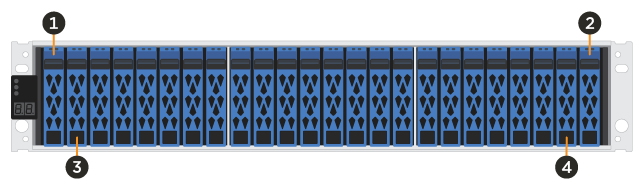

= Anforderungen für den Austausch von EF300- oder EF600-Laufwerken
:allow-uri-read: 
:icons: font
:imagesdir: ../media/

[role="lead"]
Vor dem Austausch eines Laufwerks in einem EF300- oder EF600-Array sollten Sie die Anforderungen und Überlegungen überprüfen.

CAUTION: Beachten Sie, dass die Laufwerke in Ihrem Storage-Array anfällig sind. Eine unsachgemäße Handhabung von Laufwerken verursacht einen Laufwerksausfall.

== Anforderungen für den Austausch von Laufwerken

Befolgen Sie die folgenden Regeln, um Beschädigungen an den Laufwerken in Ihrem Speicher-Array zu vermeiden:

* Verhindern elektrostatischer Entladung (ESD):
+
** Halten Sie das Laufwerk in der ESD-Tasche, bis Sie bereit sind, es zu installieren.
** Öffnen Sie die ESD-Tasche von Hand oder schneiden Sie die Oberseite mit einer Schere ab. Setzen Sie kein Metallwerkzeug oder Messer in den ESD-Beutel.
** Bewahren Sie den ESD-Beutel und alle Verpackungsmaterialien auf, falls Sie später ein Laufwerk zurückschicken müssen.
** Tragen Sie stets ein ESD-Handgelenkband, das an einer nicht lackierten Oberfläche am Gehäuse geerdet ist. Wenn ein Handgelenkband nicht verfügbar ist, berühren Sie eine unlackierte Oberfläche des Speichergehäuses, bevor Sie das Laufwerk handhaben.

* Vorsichtig mit Laufwerken umgehen:
+
** Beim Entfernen, Einbau oder Tragen eines Laufwerks immer zwei Hände verwenden.
** Niemals einen Antrieb in ein Regal zwingen, und mit sanftem, festem Druck den Riegel vollständig einrücken.
** Platzieren Sie Laufwerke auf gepolsterten Flächen und stapeln Sie niemals Laufwerke auf einander.
** Laufwerke nicht gegen andere Oberflächen abstoßen.
** Lösen Sie vor dem Entfernen eines Laufwerks aus einem Shelf den Griff und warten Sie 60 Sekunden, bis sich das Laufwerk heruntergefahren hat.
** Verwenden Sie beim Transport von Laufwerken stets die genehmigte Verpackung.

* Magnetfelder vermeiden. Halten Sie Laufwerke von magnetischen Geräten fern.
+
Magnetfelder können alle Daten auf dem Laufwerk zerstören und irreparable Schäden an der Antriebsschaltung verursachen.

== Gestaffelte Laufwerk in Controller-Shelf mit 24 Laufwerken

Standardmäßige Shelfs für 24 Laufwerke erfordern beeindruckende Laufwerke. Die folgende Abbildung zeigt, wie die Laufwerke in jedem Shelf nummeriert werden (die vordere Blende des Shelfs wurde entfernt).

image::../media/ef600_drives_numbered.png[Laufwerksnummerierung in einem Shelf mit 24 Laufwerken]

Wenn Sie weniger als 24 Laufwerke in einen EF300- oder EF600 Controller einsetzen, müssen Sie die beiden Controller-Hälften wechseln. Beginnend mit ganz links und dann nach rechts, legen Sie die Antriebe nacheinander ein.

Die folgende Abbildung zeigt, wie die Laufwerke zwischen den beiden Hälften staffeln.

