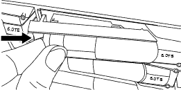

= Ersetzen Sie das Laufwerk EF300
:allow-uri-read: 
:icons: font
:imagesdir: ../media/

[role="lead"]
Sie können ein Laufwerk in einem EF300- oder EF300C-Array ersetzen.

Der EF300 und EF300C unterstützen SAS-Erweiterung mit 24-Laufwerk- und 60-Laufwerk-Shelfs. Das folgende Verfahren hängt davon ab, ob Sie ein Shelf mit 24 Laufwerken oder ein Shelf mit 60 Laufwerken haben:

* <<Ersetzen Sie das Laufwerk in einem EF300 (Shelf mit 24 Laufwerken).>>
* <<Ersetzen Sie das Laufwerk in einem EF300 (Shelf mit 60 Laufwerken).>>

== Ersetzen Sie das Laufwerk in einem EF300 (Shelf mit 24 Laufwerken).

Gehen Sie folgendermaßen vor, um ein Laufwerk in einem Shelf mit 24 Laufwerken zu ersetzen.

.Über diese Aufgabe
Der Recovery Guru in SANtricity System Manager überwacht die Laufwerke im Storage Array und benachrichtigt Sie über einen bevorstehenden Laufwerksausfall oder tatsächlichen Laufwerksausfall. Wenn ein Laufwerk ausfällt, leuchtet die gelbe Warn-LED. Sie können ein ausgefallenes Laufwerk im laufenden Betrieb austauschen, während das Speicher-Array I/O-Vorgänge empfängt

.Bevor Sie beginnen
* Überprüfen Sie die Anforderungen für die Festplattenbehandlung in link:drives-overview-supertask-concept.html["Anforderungen für den Austausch von EF300- oder EF600-Laufwerken"].
* Stellen Sie sicher, dass Sie Folgendes haben:
+
** Ein von NetApp unterstütztes Ersatzlaufwerk für Ihr Controller Shelf oder Festplatten-Shelf.
** Ein ESD-Armband, oder Sie haben andere antistatische Vorsichtsmaßnahmen getroffen.
** Eine flache, statische Arbeitsfläche.
** Eine Management Station mit einem Browser, der für den Controller auf den SANtricity System Manager zugreifen kann. (Zeigen Sie zum Öffnen der System Manager-Schnittstelle den Domain-Namen oder die IP-Adresse des Controllers im Browser.)

=== Schritt 1: Vorbereitung auf den Austausch des Antriebs (24 Laufwerke)

Bereiten Sie sich auf den Austausch eines Laufwerks vor, indem Sie den Recovery Guru in SANtricity System Manager prüfen und alle erforderlichen Schritte ausführen. Dann können Sie die ausgefallene Komponente finden.

.Schritte
. Wenn der Recovery Guru im SANtricity System Manager Sie über einen _bevorstehenden Laufwerksausfall informiert hat_, aber es ist noch nicht ausgefallen, befolgen Sie die Anweisungen im Recovery Guru zum Fehlschlagen des Laufwerks.
. Überprüfen Sie bei Bedarf mit SANtricity System Manager, ob Sie ein geeignetes Ersatzlaufwerk besitzen.
+
.. Wählen Sie *Hardware*.
.. Wählen Sie in der Shelf-Grafik das ausgefallene Laufwerk aus.
.. Klicken Sie auf das Laufwerk, um das Kontextmenü anzuzeigen, und wählen Sie dann *Einstellungen anzeigen*.
.. Vergewissern Sie sich, dass die Kapazität des Ersatzlaufwerks dem des Ersatzlaufwerks entspricht oder höher ist als das ersetzte Laufwerk und dass es die Funktionen besitzt, die Sie erwarten.
+
Versuchen Sie beispielsweise nicht, ein Festplattenlaufwerk (HDD) durch ein Solid-State-Laufwerk (SSD) zu ersetzen. Ebenso sollte das Ersatzlaufwerk auch sicher sein, wenn Sie ein sicheres Laufwerk ersetzen.

. Verwenden Sie bei Bedarf SANtricity System Manager, um das Laufwerk in Ihrem Speicher-Array zu finden: Wählen Sie im Kontextmenü des Laufwerks die Option *Locator einschalten*.
+
Die Warn-LED des Laufwerks (gelb) blinkt, damit Sie feststellen können, welches Laufwerk ersetzt werden soll.

+

NOTE: Wenn Sie ein Laufwerk in einem Shelf ersetzen, das über eine Blende verfügt, müssen Sie die Blende entfernen, um die Laufwerk-LEDs zu sehen.

=== Schritt 2: Entfernen des ausgefallenen Laufwerks (24 Laufwerke)

Entfernen Sie ein ausgefallenes Laufwerk, um es durch ein neues zu ersetzen.

.Schritte
. Packen Sie das Ersatzlaufwerk aus, und stellen Sie es auf eine flache, statische Oberfläche in der Nähe des Regals ein.
+
Alle Verpackungsmaterialien speichern.

. Drücken Sie die Entriegelungstaste am ausgefallenen Laufwerk.
+

+
** Bei Laufwerken in E5724 Controller-Shelfs oder DE224C Festplatten-Shelfs befindet sich die Release-Schaltfläche oben am Laufwerk. Der Nockengriff an den Antriebsfedern öffnet sich teilweise und der Antrieb löst sich von der Mittelplatine aus.

. Öffnen Sie den Nockengriff, und schieben Sie den Antrieb leicht heraus.
. Warten Sie 60 Sekunden.
. Entfernen Sie das Laufwerk mithilfe beider Hände aus dem Regal.
. Setzen Sie das Laufwerk auf eine antistatische, gepolsterte Oberfläche, die von Magnetfeldern entfernt ist.
. Warten Sie 60 Sekunden, bis die Software erkennt, dass das Laufwerk entfernt wurde.
+

NOTE: Wenn Sie versehentlich ein aktives Laufwerk entfernen, warten Sie mindestens 60 Sekunden, und installieren Sie es erneut. Informationen zum Recovery-Verfahren finden Sie in der Storage Management Software.

=== Schritt 3: Neues Laufwerk installieren (24-Laufwerk)

Sie installieren ein neues Laufwerk, um das ausgefallene zu ersetzen. Installieren Sie das Ersatzlaufwerk so schnell wie möglich nach dem Entfernen des ausgefallenen Laufwerks. Andernfalls besteht die Gefahr, dass die Ausrüstung überhitzt.

.Schritte
. Öffnen Sie den Nockengriff.
. Setzen Sie das Ersatzlaufwerk mit zwei Händen in den offenen Schacht ein, und drücken Sie es fest, bis das Laufwerk anhält.
. Schließen Sie den Nockengriff langsam, bis der Antrieb vollständig in der Mittelplatine sitzt und der Griff einrastet.
+
Die grüne LED am Laufwerk leuchtet, wenn das Laufwerk ordnungsgemäß eingesetzt wird.

+

NOTE: Je nach Konfiguration rekonstruiert der Controller möglicherweise automatisch Daten auf dem neuen Laufwerk. Wenn im Shelf Hot-Spare-Laufwerke verwendet werden, muss der Controller möglicherweise eine vollständige Rekonstruktion des Hot Spare durchführen, bevor er die Daten auf das ausgetauschte Laufwerk kopieren kann. Durch diesen Rekonstruktionsprozess wird die Zeit erhöht, die zum Abschluss dieses Vorgangs erforderlich ist.

=== Schritt 4: Vollständiger Austausch von Laufwerken (24 Laufwerke)

Überprüfen Sie, ob das neue Laufwerk ordnungsgemäß funktioniert.

.Schritte
. Überprüfen Sie die ein/aus-LED und die Warn-LED am ausgetauschten Laufwerk.
+
Wenn Sie das erste Laufwerk einsetzen, leuchtet die Warn-LED möglicherweise. Die LED sollte jedoch innerhalb einer Minute ausgeschaltet werden.

+
** Die ein/aus-LED leuchtet oder blinkt, und die Warn-LED leuchtet nicht: Zeigt an, dass das neue Laufwerk ordnungsgemäß funktioniert.
** Die ein/aus-LED leuchtet auf: Zeigt an, dass das Laufwerk möglicherweise nicht ordnungsgemäß installiert ist. Entfernen Sie das Laufwerk, warten Sie 60 Sekunden, und installieren Sie es dann wieder.
** Die Warnungs-LED leuchtet: Zeigt an, dass das neue Laufwerk möglicherweise defekt ist. Tauschen Sie es durch ein anderes neues Laufwerk aus.

. Wenn der Recovery Guru im SANtricity System Manager immer noch ein Problem zeigt, wählen Sie *recheck* aus, um sicherzustellen, dass das Problem behoben wurde.
. Wenn der Recovery Guru angibt, dass die Laufwerksrekonstruktion nicht automatisch gestartet wurde, muss die Rekonstruktion manuell gestartet werden wie folgt:
+

NOTE: Führen Sie diesen Vorgang nur aus, wenn Sie vom technischen Support oder dem Recovery Guru dazu aufgefordert werden.

+
.. Wählen Sie *Hardware*.
.. Klicken Sie auf das Laufwerk, das Sie ersetzt haben.
.. Wählen Sie im Kontextmenü des Laufwerks die Option *rekonstruieren*.
.. Bestätigen Sie, dass Sie diesen Vorgang ausführen möchten.
+
Nach Abschluss der Laufwerkswiederherstellung befindet sich die Volume-Gruppe in einem optimalen Zustand.

. Bringen Sie die Blende bei Bedarf wieder an.
. Senden Sie das fehlerhafte Teil wie in den dem Kit beiliegenden RMA-Anweisungen beschrieben an NetApp zurück.

.Was kommt als Nächstes?
Der Austausch des Laufwerks ist abgeschlossen. Sie können den normalen Betrieb fortsetzen.

== Ersetzen Sie das Laufwerk in einem EF300 (Shelf mit 60 Laufwerken).

Gehen Sie folgendermaßen vor, um ein Laufwerk in einem Shelf mit 60 Laufwerken zu ersetzen.

.Über diese Aufgabe
Der Recovery Guru in SANtricity System Manager überwacht die Laufwerke im Storage Array und benachrichtigt Sie über einen bevorstehenden Laufwerksausfall oder tatsächlichen Laufwerksausfall. Wenn ein Laufwerk ausfällt, leuchtet die gelbe Warn-LED. Sie können ein ausgefallenes Laufwerk im laufenden Betrieb austauschen, während das Speicher-Array I/O-Vorgänge empfängt.

.Bevor Sie beginnen
* Überprüfen Sie die Anforderungen für die Festplattenbehandlung in link:drives-overview-supertask-concept.html["Anforderungen für den Austausch von EF300- oder EF600-Laufwerken"].
* Stellen Sie sicher, dass Sie Folgendes haben:
+
** Ein von NetApp unterstütztes Ersatzlaufwerk für Ihr Controller Shelf oder Festplatten-Shelf.
** Ein ESD-Armband, oder Sie haben andere antistatische Vorsichtsmaßnahmen getroffen.
** Eine Management Station mit einem Browser, der für den Controller auf den SANtricity System Manager zugreifen kann. (Zeigen Sie zum Öffnen der System Manager-Schnittstelle den Domain-Namen oder die IP-Adresse des Controllers im Browser.)

=== Schritt 1: Vorbereitung auf den Austausch des Antriebs (60 Laufwerke)

Bereiten Sie sich auf den Austausch eines Laufwerks vor, indem Sie den Recovery Guru in SANtricity System Manager prüfen und alle erforderlichen Schritte ausführen. Dann können Sie die ausgefallene Komponente finden.

.Schritte
. Wenn der Recovery Guru im SANtricity System Manager Sie über einen _bevorstehenden Laufwerksausfall informiert hat_, aber es ist noch nicht ausgefallen, befolgen Sie die Anweisungen im Recovery Guru zum Fehlschlagen des Laufwerks.
. Überprüfen Sie bei Bedarf mit SANtricity System Manager, ob Sie ein geeignetes Ersatzlaufwerk besitzen.
+
.. Wählen Sie *Hardware*.
.. Wählen Sie in der Shelf-Grafik das ausgefallene Laufwerk aus.
.. Klicken Sie auf das Laufwerk, um das Kontextmenü anzuzeigen, und wählen Sie dann *Einstellungen anzeigen*.
.. Vergewissern Sie sich, dass die Kapazität des Ersatzlaufwerks dem des Ersatzlaufwerks entspricht oder höher ist als das ersetzte Laufwerk und dass es die Funktionen besitzt, die Sie erwarten.
+
Versuchen Sie beispielsweise nicht, ein Festplattenlaufwerk (HDD) durch eine Solid-State-Festplatte (SSD) zu ersetzen. Ebenso sollte das Ersatzlaufwerk auch sicher sein, wenn Sie ein sicheres Laufwerk ersetzen.

. Verwenden Sie bei Bedarf SANtricity System Manager, um das Laufwerk innerhalb des Storage-Arrays zu finden.
+
.. Entfernen Sie das Shelf mit einer Blende, damit Sie die LEDs sehen.
.. Wählen Sie im Kontextmenü des Laufwerks die Option *Positionsanzeige einschalten*.
+
Die Warn-LED (gelb) der Laufwerksschublade blinkt, damit Sie das richtige Laufwerk öffnen können, um zu ermitteln, welches Laufwerk ersetzt werden soll.

+
image::../media/2860_dwg_attn_led_on_drawer_maint-e5700.gif[„Achtung-LED]

+
*(1)* _Warn-LED_

.. Entriegeln Sie die Antriebsschublade, indem Sie an beiden Hebeln ziehen.
.. Ziehen Sie die Antriebsschublade vorsichtig mit den ausgestreckte Hebeln heraus, bis sie einrastet.
.. Suchen Sie oben in der Laufwerksschublade, um die Warn-LED vor jedem Laufwerk zu finden.
+
image::../media/2860_dwg_amber_on_drive_maint-e5700.gif[Achtung-LED an der Laufwerksschublade]

+
*(1)* _Warn-LED leuchtet für das Laufwerk auf der rechten oberen Seite_

+
Die Warn-LEDs der Laufwerksschublade befinden sich auf der linken Seite vor jedem Laufwerk, wobei ein Warnsymbol auf dem Laufwerkgriff direkt hinter der LED leuchtet.

+
image::../media/28_dwg_e2860_de460c_attention_led_drive_maint-e5700.gif[Achtung-LED am Antriebsgriff]

+
*(1)* _Achtung-Symbol_

+
*(2)* _Warn-LED_

=== Schritt 2: Entfernen des ausgefallenen Laufwerks (60 Laufwerke)

Entfernen Sie ein ausgefallenes Laufwerk, um es durch ein neues zu ersetzen.

.Schritte
. Packen Sie das Ersatzlaufwerk aus, und stellen Sie es auf eine flache, statische Oberfläche in der Nähe des Regals ein.
+
Speichern Sie alle Verpackungsmaterialien für das nächste Mal, wenn Sie eine Fahrt zurückschicken müssen.

. Lösen Sie die Hebel der Antriebsschublade von der Mitte der entsprechenden Antriebsschublade, indem Sie beide zur Seite der Schublade ziehen.
. Ziehen Sie die Hebel der erweiterten Laufwerkschublade vorsichtig heraus, um die Laufwerkschublade bis zur vollständigen Erweiterung zu ziehen, ohne sie aus dem Gehäuse zu entfernen.
. Ziehen Sie vorsichtig die orangefarbene Entriegelungsriegel vor dem zu entfernenden Laufwerk nach hinten.
+
Der Nockengriff an den Antriebsfedern öffnet sich teilweise und der Antrieb wird aus der Schublade gelöst.

+
image::../media/trafford_drive_rel_button_maint-e5700.gif[Orangefarbener Entriegelungshebel]

+
*(1)* _Entriegelung Orange_

. Den Nockengriff öffnen und den Antrieb leicht herausheben.
. Warten Sie 60 Sekunden.
. Heben Sie den Antrieb mithilfe des Nockengriffs aus dem Regal.
+
image::../media/92_dwg_de6600_install_or_remove_drive_maint-e5700.gif[Heben Sie den Antrieb mit dem Nockengriff aus dem Regal]

. Setzen Sie das Laufwerk auf eine antistatische, gepolsterte Oberfläche, die von Magnetfeldern entfernt ist.
. Warten Sie 60 Sekunden, bis die Software erkennt, dass das Laufwerk entfernt wurde.
+

NOTE: Wenn Sie versehentlich ein aktives Laufwerk entfernen, warten Sie mindestens 60 Sekunden, und installieren Sie es erneut. Informationen zum Recovery-Verfahren finden Sie in der Storage Management Software.

=== Schritt 3: Neues Laufwerk installieren (60-Laufwerk)

Installieren Sie ein neues Laufwerk, um das ausgefallene zu ersetzen.

CAUTION: *Möglicher Datenverlust* -- Wenn Sie die Laufwerksschublade wieder in das Gehäuse schieben, schlagen Sie die Schublade niemals zu. Schieben Sie die Schublade langsam hinein, um zu vermeiden, dass die Schublade einrastet und das Speicher-Array beschädigt wird.

.Schritte
. Den Nockengriff am neuen Antrieb senkrecht anheben.
. Richten Sie die beiden angehobenen Tasten auf beiden Seiten des Laufwerkträgers an der entsprechenden Lücke im Laufwerkskanal auf der Laufwerksschublade aus.
+
image::../media/28_dwg_e2860_de460c_drive_cru_maint-e5700.gif[Die angehobene Taste am Laufwerkträger muss mit dem Laufwerkkanal in der Laufwerksschublade übereinstimmen]

+
*(1)* _Hochgetaster auf der rechten Seite des Laufwerkträgers_

. Senken Sie den Antrieb gerade nach unten, und drehen Sie dann den Nockengriff nach unten, bis das Laufwerk unter dem orangefarbenen Freigaberiegel einrastet.
. Schieben Sie die Laufwerkschublade vorsichtig wieder in das Gehäuse. Schieben Sie die Schublade langsam hinein, um zu vermeiden, dass die Schublade einrastet und das Speicher-Array beschädigt wird.
. Schließen Sie die Antriebsschublade, indem Sie beide Hebel in die Mitte schieben.
+
Die grüne Aktivitäts-LED für das ausgetauschte Laufwerk an der Vorderseite der Laufwerksschublade leuchtet auf, wenn das Laufwerk ordnungsgemäß eingesetzt wird.

+
Je nach Konfiguration rekonstruiert der Controller möglicherweise automatisch Daten auf dem neuen Laufwerk. Wenn im Shelf Hot-Spare-Laufwerke verwendet werden, muss der Controller möglicherweise eine vollständige Rekonstruktion des Hot Spare durchführen, bevor er die Daten auf das ausgetauschte Laufwerk kopieren kann. Durch diesen Rekonstruktionsprozess wird die Zeit erhöht, die zum Abschluss dieses Vorgangs erforderlich ist.

=== Schritt 4: Vollständiger Austausch von Laufwerken (60 Laufwerke)

Überprüfen Sie, ob das neue Laufwerk ordnungsgemäß funktioniert.

.Schritte
. Überprüfen Sie die ein/aus-LED und die Warn-LED am ausgetauschten Laufwerk. (Wenn Sie das erste Laufwerk einsetzen, leuchtet die Warn-LED möglicherweise auf. Die LED sollte jedoch innerhalb einer Minute ausgeschaltet werden.)
+
** Die ein/aus-LED leuchtet oder blinkt, und die Warn-LED leuchtet nicht: Zeigt an, dass das neue Laufwerk ordnungsgemäß funktioniert.
** Die ein/aus-LED leuchtet auf: Zeigt an, dass das Laufwerk möglicherweise nicht ordnungsgemäß installiert ist. Entfernen Sie das Laufwerk, warten Sie 60 Sekunden, und installieren Sie es dann wieder.
** Die Warnungs-LED leuchtet: Zeigt an, dass das neue Laufwerk möglicherweise defekt ist. Tauschen Sie es durch ein anderes neues Laufwerk aus.

. Wenn der Recovery Guru im SANtricity System Manager immer noch ein Problem zeigt, wählen Sie *recheck* aus, um sicherzustellen, dass das Problem behoben wurde.
. Wenn der Recovery Guru angibt, dass die Laufwerksrekonstruktion nicht automatisch gestartet wurde, muss die Rekonstruktion manuell gestartet werden wie folgt:
+

NOTE: Führen Sie diesen Vorgang nur aus, wenn Sie vom technischen Support oder dem Recovery Guru dazu aufgefordert werden.

+
.. Wählen Sie *Hardware*.
.. Klicken Sie auf das Laufwerk, das Sie ersetzt haben.
.. Wählen Sie im Kontextmenü des Laufwerks die Option *rekonstruieren*.
.. Bestätigen Sie, dass Sie diesen Vorgang ausführen möchten.
+
Nach Abschluss der Laufwerkswiederherstellung befindet sich die Volume-Gruppe in einem optimalen Zustand.

. Bringen Sie die Blende bei Bedarf wieder an.
. Senden Sie das fehlerhafte Teil wie in den dem Kit beiliegenden RMA-Anweisungen beschrieben an NetApp zurück.

.Was kommt als Nächstes?
Der Austausch des Laufwerks ist abgeschlossen. Sie können den normalen Betrieb fortsetzen.
