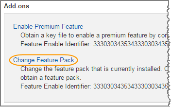

= Ändern des Host-Protokolls für eine EF300 oder EF600
:allow-uri-read: 
:experimental: 
:icons: font
:imagesdir: ../media/

[role="lead"]
Gehen Sie folgendermaßen vor, um das Host-Port-Protokoll in einem EF300- oder EF600-Array zu ändern. Dieses Verfahren gilt nur für Host-Schnittstellenkarten (HICs), die entweder InfiniBand (IB) oder Fibre Channel (FC) verwenden.

== Schritt 1: Holen Sie sich den Feature Pack Key

Um den Feature Pack Key zu erhalten, benötigen Sie die Seriennummer vom Controller-Shelf, einen Feature Activation Code und die Funktion Enable Identifier für das Speicher-Array.

.Schritte
. Suchen Sie die Seriennummer.
+
.. Wählen Sie im SANtricity System Manager Menü:Support[Support Center].
.. Wenn die Registerkarte *Support Resources* ausgewählt ist, scrollen Sie zum Abschnitt *Top Storage Array Properties*.
.. Suchen Sie die *Chassis Serial Number*, und kopieren Sie diesen Wert in eine Textdatei.
+
image::../media/sam1130_ss_e2800_storage_array_profile_sn_smid_copy_maint-ef600.gif[Sam1130 ss e2800 Storage-Array-Profil sn smid Kopie maint ef600]

. Suchen Sie die Untermodell-ID des *Feature Packs*.
+
.. Wählen Sie im SANtricity System Manager die Option *Support* aus.
.. Wählen Sie die Kachel *Support Center* aus.
.. Wählen Sie auf der Registerkarte Support Resources den Link *Storage Array Profile* aus.
.. Geben Sie in das Textfeld * Feature Pack Submodel ID* ein, und klicken Sie auf *Suchen*.
.. Suchen Sie die Submodel-ID für das Feature Pack für die Starting-Konfiguration.
+
image::../media/storage_array_profile2_maint-ef600.gif[Storage Array-Profile2 Wartung ef600]

. Suchen Sie mithilfe der Submodel-ID des Feature Packs die entsprechende Controller-Untermodell-ID für die Starting-Konfiguration, und suchen Sie in der folgenden Tabelle den Aktivierungscode für die gewünschte Endung. Kopieren Sie dann diesen Aktivierungscode in eine Textdatei.
+
|===
2+| Konfiguration wird gestartet 2+| Konfiguration wird beendet .2+| Aktivierungscode Für Die Funktion 

| Untermodell-ID des Controllers | HIC-Ports | Untermodell-ID des Controllers | HIC-Ports 

 a| 
443
 a| 
NVMe/FC, NVMe/RoCE oder iSCSI
 a| 
444
 a| 
NVME/FC oder NVMe/IB
 a| 
DH5-HB4-ZK9QH

 a| 
448
 a| 
FC
 a| 
JHX-UB4-ZGTP1

 a| 
491
 a| 
ISER/IB
 a| 
0H1-675-Z5SII

 a| 
492
 a| 
SRP/IB
 a| 
NHD-V75-ZB6ZX

 a| 
444
 a| 
NVMe/FC oder NVMe/IB
 a| 
443
 a| 
NVMe/FC, NVMe/RoCE oder iSCSI
 a| 
YH3-XB4-ZJRIZ

 a| 
448
 a| 
FC
 a| 
2HU-BB4-ZFCG5

 a| 
491
 a| 
ISER/IB
 a| 
2H3-P75-Z6AQG

 a| 
492
 a| 
SRP/IB
 a| 
5HG-G75-ZDNEZ

 a| 
448
 a| 
FC
 a| 
443
 a| 
NVMe/FC, NVMe/RoCE oder iSCSI
 a| 
7HZ-EB4-ZHAYW

 a| 
444
 a| 
NVMe/FC oder NVMe/IB
 a| 
LHS-RB4-ZDV29

 a| 
491
 a| 
ISER/IB
 a| 
FH6-975-Z7Q7H

 a| 
492
 a| 
SRP/IB
 a| 
0HI-Z75-ZE4L5

 a| 
491
 a| 
ISER/IB
 a| 
443
 a| 
NVMe/FC, NVMe/RoCE oder iSCSI
 a| 
MHQ-M85-ZIJNT

 a| 
444
 a| 
NVMe/FC oder NVMe/IB
 a| 
4HS-685-ZJZ1U

 a| 
448
 a| 
FC
 a| 
YHU-P85-ZLHCX

 a| 
465
 a| 
FC/PTL
 a| 
AHX-985-ZMXMI

 a| 
492
 a| 
SRP/IB
 a| 
ZHZ-S85-ZNF4J

 a| 
492
 a| 
SRP/IB
 a| 
443
 a| 
NVMe/FC, NVMe/RoCE oder iSCSI
 a| 
EH3-C85-Z0V93

 a| 
444
 a| 
NVMe/FC oder NVMe/IB
 a| 
BH5-V85-ZQDQJ

 a| 
448
 a| 
FC
 a| 
1H8-F85-ZRT1V

 a| 
465
 a| 
FC/PTL
 a| 
1HA-Y85-ZSB7S

 a| 
491
 a| 
ISER/IB
 a| 
KHD-I85-ZUSMI

 a| 
465
 a| 
FC/PTL
 a| 
491
 a| 
ISER
 a| 
6H8-S75-Z98FH

 a| 
492
 a| 
SRP
 a| 
NHL-J75-ZFL3W

 a| 
516
 a| 
NVMe/FC, NVMe/RoCE oder iSCSI
 a| 
517
 a| 
NVMe/IB oder NVMe/FC
 a| 
LHF-285-ZV9YZ

 a| 
518
 a| 
FC
 a| 
IHI-L85-ZXQEP

 a| 
519
 a| 
ISER/IB
 a| 
RHK-585-ZY7P5

 a| 
520
 a| 
FC-PTL
 a| 
NHN-095-ZZ0XF

 a| 
521
 a| 
SRP/IB
 a| 
GHP-895-Z25BD

 a| 
517
 a| 
NVMe/IB oder NVMe/FC
 a| 
516
 a| 
NVMe/FC, NVMe/RoCE oder iSCSI
 a| 
7HS-R95-Z3M06

 a| 
518
 a| 
FC
 a| 
UHU-B95-Z43X2

 a| 
519
 a| 
FC-PTL
 a| 
8HX-U95-Z5K6F

 a| 
520
 a| 
ISER/IB
 a| 
UHZ-E95-Z71LH

 a| 
521
 a| 
SRP/IB
 a| 
SH2-X95-Z8IVS

 a| 
518
 a| 
FC
 a| 
516
 a| 
NVMe/FC, NVMe/RoCE oder iSCSI
 a| 
UH5-H95-Z9Z58

 a| 
517
 a| 
NVMe/FC oder NVMe/IB
 a| 
XH7-195-ZBGJC

 a| 
519
 a| 
FC-PTL
 a| 
FHA-K95-ZCXX0

 a| 
520
 a| 
ISER/IB
 a| 
JHC-595-ZDE3X

 a| 
521
 a| 
SRP/IB
 a| 
0HF-095-ZFVFN

 a| 
519
 a| 
FC-PTL
 a| 
516
 a| 
NVMe/FC, NVMe/RoCE oder iSCSI
 a| 
YHH-895-ZGCXS

 a| 
517
 a| 
NVMe/FC oder NVMe/IB
 a| 
2HK-R95-ZHT83

 a| 
518
 a| 
FC
 a| 
1HM-BA5-ZJALA

 a| 
520
 a| 
ISER/IB
 a| 
YHP-UA5-ZKRXA

 a| 
521
 a| 
SRP/IB
 a| 
MHR-EA5-ZL83V

 a| 
520
 a| 
ISER/IB
 a| 
516
 a| 
NVMe/FC, NVMe/RoCE oder iSCSI
 a| 
HHU-XA5-ZNPLT

 a| 
517
 a| 
NVMe/FC oder NVMe/IB
 a| 
YHW-HA5-Z07QK

 a| 
518
 a| 
FC
 a| 
WHZ-1A5-ZPN4U

 a| 
519
 a| 
FC/PTL
 a| 
7H2-KA5-ZR5C3

 a| 
521
 a| 
SRP
 a| 
3H5-4A5-ZSLVX

 a| 
521
 a| 
SRP/IB
 a| 
516
 a| 
NVMe/FC, NVMe/RoCE oder iSCSI
 a| 
1H7-NA5-ZT31W

 a| 
517
 a| 
NVMe/FC oder NVMe/IB
 a| 
XHA-7A5-ZVJGC

 a| 
518
 a| 
FC
 a| 
KHC-QA5-ZW1P3

 a| 
519
 a| 
FC/PTL
 a| 
CHE-AA5-ZXH2F

 a| 
520
 a| 
ISER/IB
 a| 
SHH-TA5-ZZYHS

|===
+

NOTE: Wenn Ihre Controller-Untermodell-ID nicht aufgeführt ist, wenden Sie sich an https://mysupport.netapp.com/site/["NetApp Support"^].

. Suchen Sie in System Manager nach der Feature Enable Identifier.
+
.. Wechseln Sie zum Menü:Einstellungen[System].
.. Scrollen Sie nach unten zu *Add-ons*.
.. Suchen Sie unter *Feature Pack ändern* den *Feature Enable Identifier*.
.. Kopieren Sie diese 32-stellige Zahl in eine Textdatei.
+
image::../media/sam1130_ss_e2800_change_feature_pack_feature_enable_identifier_copy_maint-ef600.gif[Die Funktion des Änderungsfunktionspacks sam1130 ss e2800 aktivieren die Funktion Identifier Copy maint ef600]

. Gehen Sie zu http://partnerspfk.netapp.com["Aktivierung der NetApp Lizenz: Aktivierung der Premium-Funktionen von Storage Array"^]Und geben Sie die Informationen ein, die erforderlich sind, um das Feature Pack zu erhalten.
+
** Seriennummer Des Chassis
** Aktivierungscode Für Die Funktion
** KENNZEICHENKENNUNG aktivieren: Die Website zur Aktivierung der Premium-Funktion enthält einen Link zu „`Aktivierungsanweisungen für Premium-Funktionen`“. Versuchen Sie nicht, diese Anweisungen für dieses Verfahren zu verwenden.

. Wählen Sie aus, ob Sie die Schlüsseldatei für das Feature Pack in einer E-Mail erhalten oder direkt von der Website herunterladen möchten.

== Schritt 2: Stoppen Sie die Host-I/O

Beenden Sie alle I/O-Vorgänge vom Host, bevor Sie das Protokoll der Host-Ports konvertieren.

Sie können erst dann auf Daten im Speicher-Array zugreifen, wenn Sie die Konvertierung erfolgreich abgeschlossen haben.

.Schritte
. Vergewissern Sie sich, dass zwischen dem Storage-Array und allen verbundenen Hosts keine I/O-Vorgänge stattfinden. Sie können beispielsweise die folgenden Schritte durchführen:
+
** Beenden Sie alle Prozesse, die die LUNs umfassen, die den Hosts vom Storage zugeordnet sind.
** Stellen Sie sicher, dass keine Applikationen Daten auf LUNs schreiben, die vom Storage den Hosts zugeordnet sind.
** Heben Sie die Bereitstellung aller Dateisysteme auf, die mit den Volumes im Array verbunden sind, auf.
+

NOTE: Die genauen Schritte zur Stoerung von Host-I/O-Vorgängen hängen vom Host-Betriebssystem und der Konfiguration ab, die den Umfang dieser Anweisungen übersteigen. Wenn Sie nicht sicher sind, wie Sie I/O-Vorgänge für Hosts in Ihrer Umgebung anhalten, sollten Sie das Herunterfahren des Hosts in Betracht ziehen.

+

CAUTION: *Möglicher Datenverlust* -- Wenn Sie diesen Vorgang während der I/O-Vorgänge fortsetzen, können Sie Daten verlieren.

. Warten Sie, bis alle Daten im Cache-Speicher auf die Laufwerke geschrieben werden.
+
Die grüne LED „Cache aktiv“ auf der Rückseite jedes Controllers leuchtet, wenn die Daten im Cache auf die Laufwerke geschrieben werden müssen. Sie müssen warten, bis diese LED ausgeschaltet ist.

. Wählen Sie auf der Startseite des SANtricity System Managers die Option *Vorgänge in Bearbeitung anzeigen*.
. Warten Sie, bis alle Vorgänge abgeschlossen sind, bevor Sie mit dem nächsten Schritt fortfahren.

== Schritt 3: Ändern Sie das Funktionspaket

Ändern Sie das Feature Pack, um das Hostprotokoll Ihrer Host-Ports zu konvertieren.

.Schritte
. Wählen Sie im SANtricity System Manager Menü:Einstellungen[System].
. Wählen Sie unter *Add-ons* die Option *Feature Pack ändern*.
+

. Klicken Sie auf *Durchsuchen* und wählen Sie dann das Feature Pack aus, das Sie anwenden möchten.
. Geben Sie in das Feld *CHANGE* ein.
. Klicken Sie Auf *Ändern*.
+
Die Migration des Feature Packs beginnt. Beide Controller starten automatisch zweimal neu, damit das neue Funktionspaket wirksam wird. Das Speicher-Array kehrt nach Abschluss des Neubootens in einen reaktionsfähigen Zustand zurück.

. Überprüfen Sie, ob die Host-Ports das erwartete Protokoll haben.
+
.. Wählen Sie im SANtricity System Manager die Option *Hardware* aus.
.. Klicken Sie auf *Zurück von Regal anzeigen*.
.. Wählen Sie die Grafik für Controller A oder Controller B aus
.. Wählen Sie im Kontextmenü die Option *Einstellungen anzeigen* aus.
.. Wählen Sie die Registerkarte *Host Interfaces* aus.
.. Klicken Sie auf *Weitere Einstellungen anzeigen*.

.Was kommt als Nächstes?
Gehen Sie zu link:hpp-complete-protocol-conversion-task.html["Vollständige Konvertierung des Host-Protokolls"].
