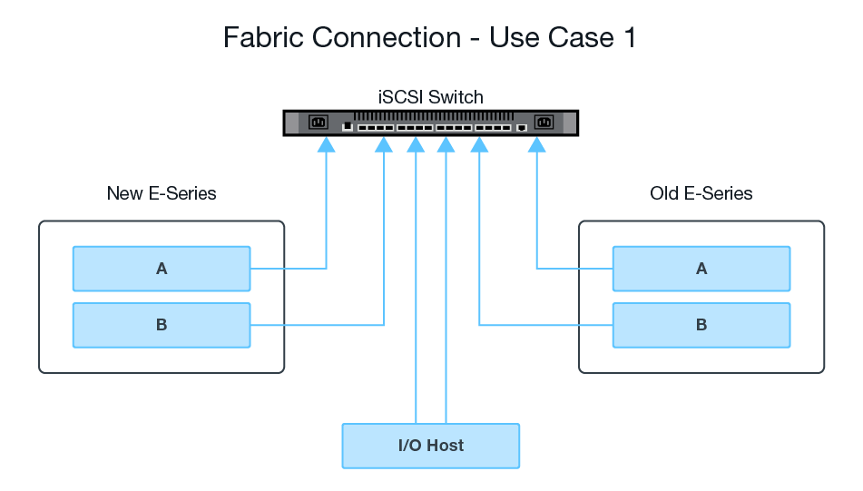

= Hardware für Remote Storage Volumes konfigurieren
:allow-uri-read: 
:icons: font
:imagesdir: ../media/

[role="lead"]
Das E-Series Storage-System muss so konfiguriert sein, dass es über das unterstützte iSCSI-Protokoll mit dem Remote-Storage-System kommunizieren kann.

== Konfiguration von Remote Storage-Gerät und E-Series Array

Bevor Sie mit dem SANtricity System Manager fortfahren, um die Funktion Remote-Speicher-Volumes zu konfigurieren, gehen Sie wie folgt vor:

. Richten Sie manuell eine kabelgebundene Verbindung zwischen dem E-Series System und dem Remote-Storage-System ein, sodass die beiden Systeme für die Kommunikation über iSCSI konfiguriert werden können.
. Konfigurieren Sie die iSCSI-Ports, sodass das E-Series System und das Remote-Storage-System erfolgreich miteinander kommunizieren können.
. Beschaffen der IQN des E-Series Systems
. Machen Sie das E-Series System für das Remote-Storage-System sichtbar. Wenn es sich bei dem Remote-Storage-System um ein E-Series-System handelt, erstellen Sie einen Host mit dem IQN des Ziel-E-Series Systems als Verbindungsinformationen für den Host-Port.
. Wenn das Remote-Speichergerät von einem Host/einer Applikation verwendet wird:
+
** E/A-Vorgänge zum Remote-Speichergerät stoppen.
** Heben Sie die Zuordnung des Remote-Speichergeräts auf/heben Sie die Bereitstellung auf.

. Zuordnen des Remote-Storage-Geräts zu dem für das Storage-System der E-Series definierten Host
. Ermitteln Sie die LUN-Nummer des für die Zuordnung verwendeten Geräts.

NOTE: Empfohlen: Sichern Sie das Remote-Quell-Volume, bevor Sie den Importvorgang starten.

== Verkabeln Sie die Speicher-Arrays

Im Rahmen des Setups müssen Speicher-Arrays und E/A-Host mit der iSCSI-kompatiblen Schnittstelle verbunden werden.

In den folgenden Diagrammen wird veranschaulicht, wie die Systeme so verkabelt werden, dass sie Remote-Speicher-Volume-Vorgänge über eine iSCSI-Verbindung durchführen.

 image:../media/remote_target_volumes_iscsi_use_case_2.png["ISCSI-Speicherverkabelung"]

== Konfigurieren Sie die iSCSI-Ports

Sie müssen die iSCSI-Ports konfigurieren, um die Kommunikation zwischen dem Ziel (lokalem E-Series Storage-Array) und der Quelle (Remote-Storage-Array) sicherzustellen.

Die iSCSI-Ports können je nach Subnetz auf mehrere Arten konfiguriert werden. Im Folgenden finden Sie einige Beispiele zum Konfigurieren der iSCSI-Ports für die Verwendung mit der Funktion Remote-Speicher-Volumes.

|===
| Quelle A | Quelle B | Ziel A | Ziel B 

 a| 
10.10.1.100/22
 a| 
10.10.2.100/22
 a| 
10.10.1.101/22
 a| 
10.10.2.101/22

|===
|===
| Quelle A | Quelle B | Ziel A | Ziel B 

 a| 
10.10.0.100/16
 a| 
10.10.0.100/16
 a| 
10.10.0.101/16
 a| 
10.10.0.101/16

|===