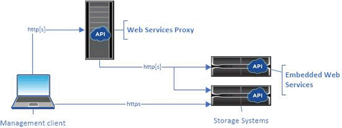

= Web Services und Unified Manager im Überblick
:allow-uri-read: 
:icons: font
:imagesdir: ../media/

[role="lead"]
Lesen Sie vor der Installation und Konfiguration des Web Services Proxy die Übersicht über Webdienste und SANtricity Unified Manager.

== Web-Services

Web Services ist eine API (Application Programming Interface), über die Sie Storage-Systeme der NetApp E-Series und EF-Series konfigurieren, managen und überwachen können. Es werden API-Anfragen gestellt, mit denen Workflows wie Konfiguration, Bereitstellung und Performance-Monitoring für E-Series Storage-Systeme durchgeführt werden können.

Wenn Sie die Web Services API für das Management von Storage-Systemen verwenden, sollten Sie mit folgenden Informationen vertraut sein:

* JavaScript Object Notation (JSON) – Da die Daten in Web Services über JSON verschlüsselt sind, sollten Sie mit JSON-Programmierkonzepten vertraut sein. Weitere Informationen finden Sie unter http://www.json.org["Einführung von JSON"^].
* Representational State Transfer (REST) – Webservices sind eine RESTful API, die Zugriff auf praktisch alle SANtricity-Managementfunktionen bietet. Sie sollten daher mit REST-Konzepten vertraut sein. Weitere Informationen finden Sie unter http://www.ics.uci.edu/~fielding/pubs/dissertation/top.htm["Architekturstile und das Design netzwerkbasierter Softwarearchitekturen"^].
* Programmiersprachen – Java und Python sind die häufigsten Programmiersprachen, die mit der Web Services API verwendet werden, aber jede Programmiersprache, die HTTP-Anfragen machen kann, reicht für API-Interaktion aus.

Web Services sind in zwei Implementierungen erhältlich:

* *Eingebettet* -- Ein RESTful API-Server ist auf jedem Controller eines E2800/EF280 Storage-Systems mit NetApp SANtricity 11.30 oder höher, einer E5700/EF570 mit SANtricity 11.40 oder höher, einem EF300 oder EF600 mit SANtricity 11.60 oder höher und einem E4000 mit SANtricity 11.90 oder höher integriert. Es ist keine Installation erforderlich.
* *Proxy* -- der SANtricity Web Services Proxy ist ein RESTful API-Server, der separat auf einem Windows- oder Linux-Server installiert wird. Diese Host-basierte Applikation ermöglicht das Management Hunderter neuer und alter NetApp E-Series Storage-Systeme. Im Allgemeinen sollten Sie den Proxy für Netzwerke mit mehr als 10 Speichersystemen verwenden. Der Proxy kann zahlreiche Anforderungen effizienter verarbeiten als die eingebettete API.

Der Core der API ist in beiden Implementierungen verfügbar.

Die folgende Tabelle enthält einen Vergleich des Proxy und der eingebetteten Version.

|===
| Überlegungen | Proxy | Eingebettet 

 a| 
Installation
 a| 
Erfordert ein Host-System (Linux oder Windows). Der Proxy kann unter heruntergeladen werden http://mysupport.netapp.com/NOW/cgi-bin/software/?product=E-Series+SANtricity+Web+Services+%28REST+API%29&platform=WebServices["NetApp Support Website"^] Oder auf https://hub.docker.com/r/netapp/eseries-webservices/["DockerHub"^].
 a| 
Es ist keine Installation oder Aktivierung erforderlich.

 a| 
Sicherheit
 a| 
Die minimalen Sicherheitseinstellungen sind standardmäßig aktiviert.

Die Sicherheitseinstellungen sind gering, sodass Entwickler schnell und einfach mit der API beginnen können. Sie können den Proxy auf Wunsch mit demselben Sicherheitsprofil wie die eingebettete Version konfigurieren.
 a| 
Hohe Sicherheitseinstellungen sind standardmäßig aktiviert.

Sicherheitseinstellungen sind hoch, da die API direkt auf den Controllern ausgeführt wird. So ist beispielsweise kein HTTP-Zugriff möglich, und es werden alle SSL- und älteren TLS-Verschlüsselungsprotokolle für HTTPS deaktiviert.

 a| 
Zentralisiertes Management
 a| 
Management aller Storage-Systeme über einen Server
 a| 
Verwaltet nur den Controller, auf dem er eingebettet ist.

|===

== Unified Manager

Das Proxy-Installationspaket umfasst Unified Manager, eine webbasierte Schnittstelle, über die der Konfigurationszugriff auf neuere E-Series und EF-Series Storage-Systeme wie E2800, E5700, EF300 und EF600 Systeme ermöglicht wird.

Von Unified Manager aus können Sie die folgenden Batch-Operationen ausführen:

* Sie können den Status mehrerer Storage-Systeme aus einer zentralen Ansicht anzeigen
* Erkennung mehrerer Storage-Systeme im Netzwerk
* Importieren von Einstellungen von einem Storage-System in mehrere Systeme
* Firmware-Upgrade für mehrere Storage-Systeme

